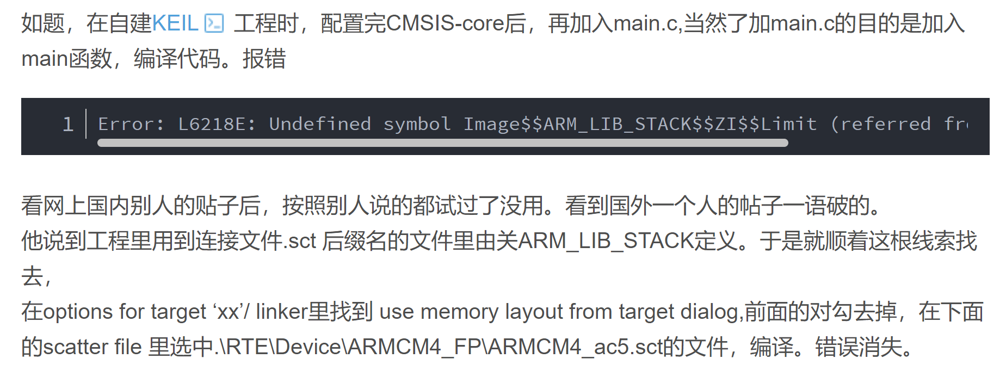
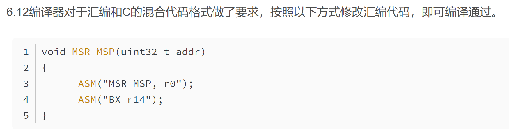

# ERROR LOG

- [x] 2024/10/06 2:18

```
Error: L6218E: Undefined symbol Image$$ARM_LIB_STACK$$ZI$$Limit (referred from startup_armcm4.o).
```



参考链接：https://blog.csdn.net/luofeng66ok/article/details/104869417

---

- [x] 2024/10/08 17：24

```
__asm 汇编和C混合代码报错
```



参考链接：https://blog.csdn.net/u010058695/article/details/114529090

---

