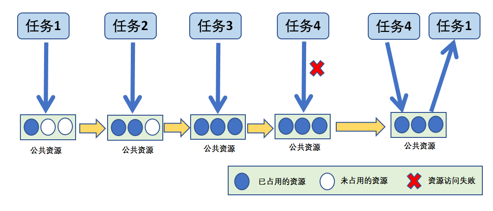
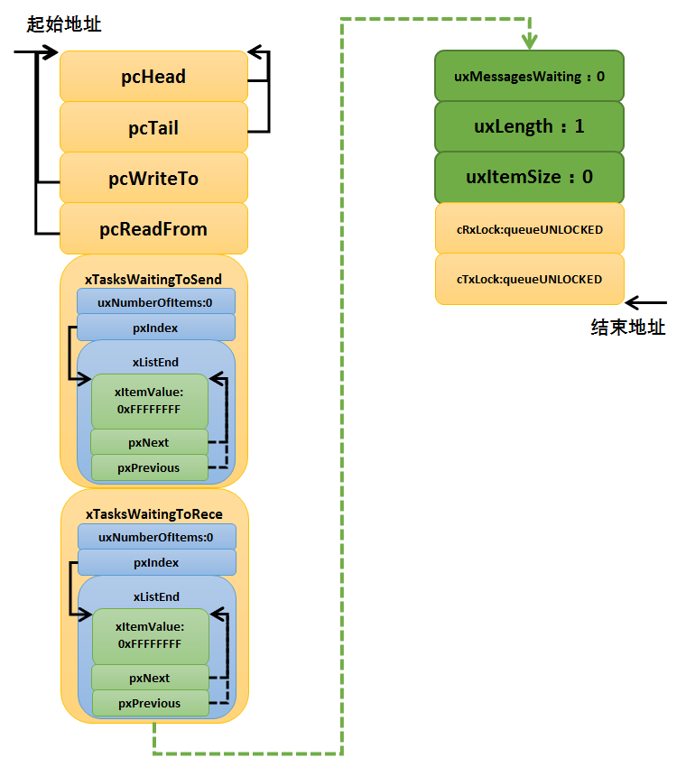
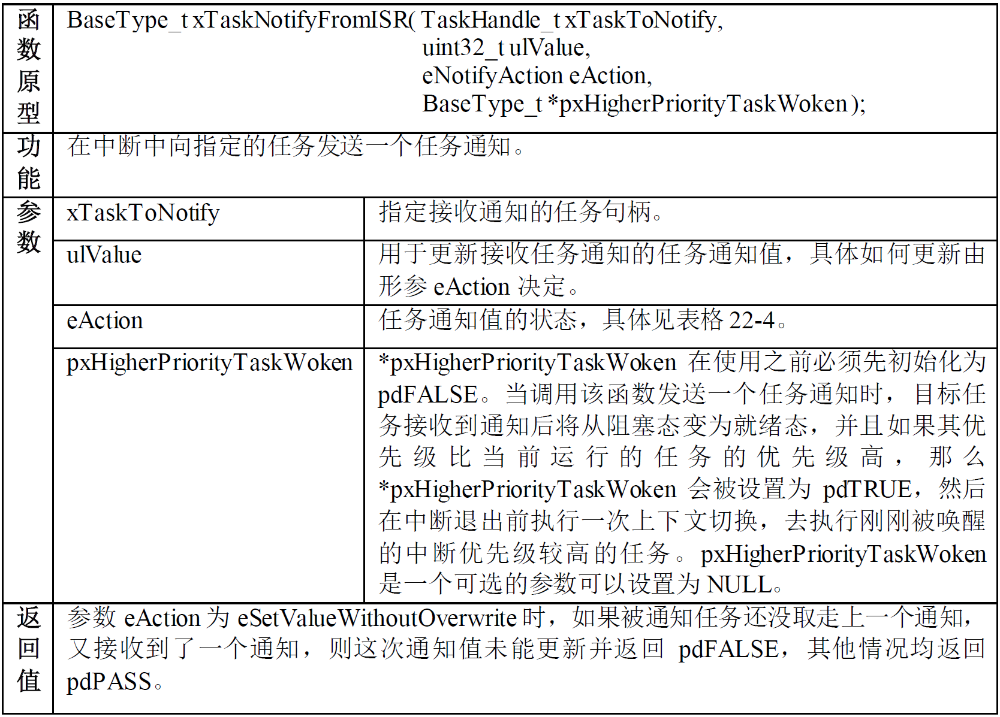
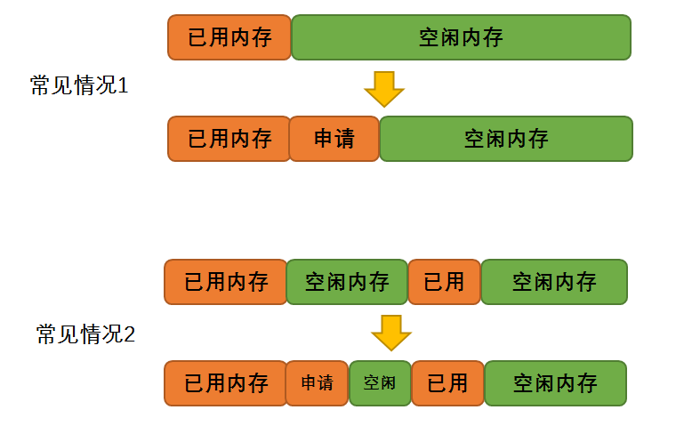

<div align="center">
	<h1> FreeRTOS Learning Notes </h1>
</div>

> 参考：[野火]《FreeRTOS 内核实现与应用开发实战指南》

## 一. 移植 FreeRTOS 到 CubeMX-STM32 工程

### 1. 下载 FreeRTOS 源码

在移植之前，我们首先要获取到 FreeRTOS 的官方的源码包。

- 官网：<http://www.freertos.org/>
- 代码托管网站：<https://sourceforge.net/projects/freertos/files/FreeRTOS/>

我们选择 FreeRTOS 的版本 V9.0.0。

### 2. FreeRTOS 文件夹内容简介

FreeRTOS V9.0.0 解压缩后文件内容如下图所示，其中主要包含 `FreeRTOS` 和 `FreeRTOS-Plus` 这两个文件夹和一些 HTML 文件。


#### 2.1 FreeRTOS 文件夹

FreeRTOS 主要包含 Demo 例程和 Source 内核源码，我们就需要提取该目录下的大部分文件：


- FreeRTOS 文件夹下的 `Source` 文件夹里面包含的是 FreeRTOS 内核的源代码，我们移植 FreeRTOS 的时候就需要这部分源代码。

- FreeRTOS 文件夹下的 `Demo` 文件夹里面包含了 FreeRTOS 官方为各个单片机移植好的工程代码，这部分 Demo 非常有参考价值。我们把 FreeRTOS 到 STM32 的时候，`FreeRTOSConfig.h` 这个头文件就是从这里拷贝过来的。

##### 2.1.1 Source 文件夹

编号 ① 和 ③ 包含的是 FreeRTOS 的通用的头文件和 C 文件，这两部分的文件试用于各种编译器和处理器，是通用的。需要移植的头文件和 C 文件放在编号 ② `portblle` 这个文件夹。


我们打开 `portblle` 这个文件夹，可以看到里面很多与编译器相关的文件夹，在不同的
编译器中使用不同的支持文件。


- `Keil` : 文件夹里面存放的就是我们要使用的编译器 KEIL 所需要移植的文件，打开 KEIL 文件夹的时候，你会看到一句话 `See-also-the-RVDS-directory.txt`，`Keil` 里面的内容跟 `RVDS` 里面的内容一样，所以我们只需要 `RVDS` 文件夹里面的内容即可。

- `MemMang` ：文件夹下存放的是跟内存管理相关的。

打开 RVDS 文件夹，下面包含了各种处理器相关的文件夹：


FreeRTOS 是一个软件，单片机是一个硬件，FreeRTOS 要想运行在一个单片机上面，它们就必须关联在一起，那么怎么关联？还是得通过写代码来关联，这部分关联的文件叫接口文件，通常由汇编和 C 联合编写。

这些接口文件都是跟硬件密切相关的，不同的硬件接口文件是不一样的，但都大同小异。编写这些接口文件的过程我们就叫移植，移植的过程通常由 FreeRTOS 和 MCU 原厂的人来负责，移植好的这些接口文件就放在 RVDS 这个文件夹的目录下。

以 `ARM_CM4F` 这个文件夹为例，看看里面的文件，里面只有 `port.c` 与 `portmacro.h` 两个文件，`port.c` 文件里面的内容是由 FreeRTOS 官方的技术人员为 Cortex-M4 内核的处理器写的接口文件，里面核心的上下文切换代码是由汇编语言编写而成，对技术员的要求比较高，刚开始学习的之后只需拷贝过来用即可。`portmacro.h` 则是 `port.c` 文件对应的头文件，主要是一些数据类型和宏定义。


`MemMang` 文件夹下存放的是跟内存管理相关的，总共有五个 `heap` 文件以及一个 `readme` 说明文件，这五个 `heap` 文件在移植的时候必须使用一个，因为 FreeRTOS 在创建内核对象的时候使用的是动态分配内存，而这些动态内存分配的函数则在这几个文件里面实现，不同的分配算法会导致不同的效率与结果，后面在内存管理中会讲解每个文件的区别，由于现在是初学，所以我们选用 `heap4.c` 即可。


##### 2.1.2 Demo 文件夹

这个目录下内容就是 Deme 例程，我们可以直接打开里面的工程文件，各种开发平台
的完整 Demo，开发者可以方便的以此搭建出自己的项目，甚至直接使用。


##### 2.1.3 License 文件夹

这里面只有一个许可文件 `license.txt`，用 FreeRTOS 做产品的话就需要看看这个文件，但是我们是学习 FreeRTOS，所以暂时不需要理会这个文件。


#### 2.2 FreeRTOS-Plus 文件夹

FreeRTOS-Plus 文件夹里面包含的是第三方的产品，一般我们不需要使用，FreeRTOSPlus 的预配置演示项目组件（组件大多数都要收费），大多数演示项目都是在 Windows 环境中运行的，使用 FreeRTOS windows 模拟器，所以暂时不需要关注这个文件夹。


#### 2.3 HTML 文件

一些直接可以打开的网页文件，里面包含一些关于 FreeRTOS 的介绍，是 FreeRTOS 官方人员所写，所以都是英文的，有兴趣可以打开看看，具体相关内容可以看 HTML 文件名称。

### 3. 往 CubeMX 工程添加 FreeRTOS 源码

#### 3.1 提取 FreeRTOS 最简源码

提取后目录结构如下所示：

```c
└─FreeRTOS-Lite
   ├─include // 来自 FreeRTOS/Source/include/
   |  ├─croutine.h
   |  ├─deprecated_definitions.h
   |  ├─event_groups.h
   |  ├─FreeRTOS.h
   |  ├─list.h
   |  ├─mpu_prototypes.h
   |  ├─mpu_wrappers.h
   |  ├─portable.h
   |  ├─projdefs.h
   |  ├─queue.h
   |  ├─semphr.h
   |  ├─StackMacros.h
   |  ├─stdint.readme
   |  ├─task.h
   |  └─timers.h
   ├─port // 来自 FreeRTOS/Source/portable/
   │  ├─MemMang
   |      ├─heap_1.c
   |      ├─heap_2.c
   |      ├─heap_3.c
   |      ├─heap_4.c
   |      ├─heap_5.c
   │      └─ReadMe
   │  └─RVDS
   │      ├─ARM7_LPC21xx
   │      ├─ARM_CA9
   │      ├─ARM_CM0
   │      ├─ARM_CM3
   │      ├─ARM_CM4F
   │      ├─ARM_CM4_MPU
   │      └─ARM_CM7
   └─src // 来自 FreeRTOS/Source/
      ├─croutine.c
      ├─event_groups.c
      ├─list.c
      ├─queue.c
      ├─readme.txtc
      ├─tasks.c
      └─timers.c
```

#### 3.2 CubeMX 创建工程

这里使用 CubeMX 创建了一个 STM32F407 芯片的工程。


注意这里 SYS 的 Timebase Source 选择任意 TIM 时钟替换 SysTick，其余操作和配置裸机工程一致。


USART 可开可不开，开启后可以通过串口输出信息方便调试。


#### 3.3 拷贝 FreeRTOS 到工程根目录

将创建好的 `FreeRTOs-Lite` 文件夹直接整个复制到目标工程的根目录：


#### 3.4 拷贝 FreeRTOSConfig.h 文件到 FreeRTOS-Lite 文件夹

`FreeRTOSConfig.h` 文件是 FreeRTOS 的工程配置文件，因为 FreeRTOS 是可以裁剪的实时操作内核，应用于不同的处理器平台，用户可以通过修改这个 FreeRTOS 内核的配置头文件来裁剪 FreeRTOS 的功能，我们把它拷贝一份放在 `FreeRTOS-Lite` 这个文件夹下面。

打开 FreeRTOSv9.0.0 源码，在 `FreeRTOSv9.0.0\FreeRTOS\Demo` 文件夹下面找到 `CORTEX_STM32F103_Keil` 这个文件夹， 双击打开， 在其根目录下找到这个 `FreeRTOSConfig.h` 文件，然后拷贝到工程的 `FreeRTOS-Lite` 文件夹下即可。


#### 3.5 添加 FreeRTOS 源码到工程组文件夹

##### 3.5.1 新建 FreeRTOS/src 和 FreeRTOS/port 组

接下来我们在开发环境里面新建 `FreeRTOS/src` 和 `FreeRTOS/port` 两个组文件夹，其中 `FreeRTOS/src` 用于存放 `src` 文件夹的内容，`FreeRTOS/port` 用于存放 `port\MemMang` 文件夹与 `port\RVDS\ARM_CMx` 文件夹的内容 `x`  表示 3、4 或者 7。


然后我们将工程文件中 FreeRTOS 的内容添加到工程中去，按照已经新建的分组添加我们的 FreeRTOS 工程源码。至此我们的 FreeRTOS 添加到工程中就已经完成，完成的效果具体见下图：


##### 3.5.2 指定 FreeRTOS 头文件的路径

将 FreeRTOS 中包含头文件 (.h) 文件的路径添加到工程，如下图所示：


至此，FreeRTOS 的整体工程基本移植完毕，我们需要修改 FreeRTOS 配置文件，按照我们的需求来进行修改。

#### 3.6 修改 FreeRTOSConfig.h

`FreeRTOSConfig.h` 是直接从 `demo` 文件夹下面拷贝过来的，该头文件对裁剪整个 FreeRTOS 所需的功能的宏均做了定义，有些宏定义被使能，有些宏定义被失能。

##### 3.6.1 FreeRTOSConfig.h 文件内容讲解

以下文件适配 **CMSIS Configuration Wizard**：

```c
#ifndef FREERTOS_CONFIG_H
#define FREERTOS_CONFIG_H

/* LABEL 1 */
// 针对不同的编译器调用不同的 stdint.h 头文件
#if defined(__ICCARM__) || defined(__CC_ARM) || defined(__GNUC__)
#include <stdint.h>
extern uint32_t SystemCoreClock;
#endif

/* LABEL 2 */
// 断言
#define vAssertCalled(char, int) printf("Error: %s, %d\r\n", char, int)
#define configASSERT(x) if ((x) == 0) vAssertCalled(__FILE__, __LINE__)

// <<< Use Configuration Wizard in Context Menu >>>

// <h> FreeRTOS 基础配置配置选项
// =====================================================================
/* LABEL 3 */
// <o> RTOS 调度器类型
//     <0=> [0] 协作式调度器(时间片)
//     <1=> [1] 抢占式调度器
// <i> 在多任务管理机制上，操作系统可以分为抢占式和协作式两种。
// <i> 协作式操作系统是任务主动释放 CPU 后，切换到下一个任务。
#define configUSE_PREEMPTION 1
// </e> !RTOS 调度器类型

/* LABEL 4 */
// <e> 时间片调度
// <i> 默认: 1 (Enable)
// <i> 时间片调度是指当一个任务运行一段时间后，操作系统会自动切换到下一个任务。
// <i> 时间片的大小由 configTICK_RATE_HZ 决定。
#define configUSE_TIME_SLICING 1
// </e> !时间片调度

/* LABEL 5 */
// <o> 下一任务执行选择方法
//     <0=> [0] 通用方法
//     <1=> [1] 特殊方法
// <i> 选择下一任务执行的方法, 0 为通用方法, 1 为特殊方法
// <i>
// <i> 某些运行 FreeRTOS 的硬件有两种方法选择下一个要执行的任务
// <i> 通用方法和特定于硬件的方法, (以下简称 " 特殊方法 " )
// <i> 
// <i> 通用方法:
// <i>   1. configUSE_PORT_OPTIMISED_TASK_SELECTION 为 0 或硬件不支持
// <i>      这种特殊方法
// <i>   2. 可以用于所有 FreeRTOS 支持的硬件
// <i>   3. 完全用 C 实现, 效率略低于特殊方法
// <i>   4. 不强制要求限制最大可用优先级数目
// <i> 
// <i> 特殊方法:
// <i>   1. 必须将 configUSE_PORT_OPTIMISED_TASK_SELECTION 设置为 1
// <i>   2. 依赖一个或多个特定架构的汇编指令 (一般是类似计算机前导零[CLZ])
// <i>      指令)
// <i>   3. 比通用方法更高效
// <i>   4. 一般强制限定最大可用优先级数目为 32
// <i> 
// <i> 一般是硬件计算前导指令, 如果所使用的 MCU 没有这些硬件指令的话此宏应
// <i> 设置为 0!
// <i>
// <i> 选择特殊方法可以提高 FreeRTOS 在特定硬件上的运行效率, 但也会增加代码量
// <i> 因此, 请根据具体硬件情况选择合适的方法!
#define configUSE_PORT_OPTIMISED_TASK_SELECTION	1

/* LABEL 6 */
// <e> 低功耗 tickless 模式
// <i> 0 Disable: 保持系统节拍 (tick) 中断一直运行
// <i> 1 Enable: 低功耗 tickless 模式
// <i> 低功耗 tickless 模式可以减少系统的功耗, 但也会降低系统的响应速度
// <i> 建议在系统空闲时使用低功耗 tickless 模式, 避免系统进入低功耗模式
#define configUSE_TICKLESS_IDLE 1
// </e> !低功耗 tickless 模式

/* LABEL 7 */
// <o> CPU 内核时钟频率
// <i> 无需修改, 自动获取
// <i> 默认: SystemCoreClock (自动获取)
// <i> 写入实际的 CPU 内核时钟频率, 即 CPU 指令执行频率, 通常为 Fclk
// <i> Fclk 为供给 CPU 内核的时钟信号, 我们所说的 CPU 主频为 XX MHZ
// <i> 就是指的这个时钟信号, 相应的, 1/Fclk 就是 CPU 时钟周期 Tclk
#define configCPU_CLOCK_HZ (SystemCoreClock)

/* LABEL 8 */
// <o> RTOS 系统节拍中断频率 (Hz)
// <i> 即一秒钟中断的次数, 每次中断 RTOS 都会进任务调度
#define configTICK_RATE_HZ ((TickType_t)1000)

/* LABEL 9 */
// <o> 可使用的最大优先级
#define configMAX_PRIORITIES (32)

/* LABEL 10 */
// <o> 空闲任务使用的堆栈大小
#define configMINIMAL_STACK_SIZE ((unsigned short )128)

/* LABEL 11 */
// <o> 任务名字字符串长度
#define configMAX_TASK_NAME_LEN	(16)

/* LABEL 12 */
// <o> 系统节拍计数器变量数据类型
//     <0=> [0] 32-bit int
//     <1=> [1] 16-bit int
// <i> TickType_t 变量用于表示系统节拍计数器的计数值
#define configUSE_16_BIT_TICKS 0

/* LABEL 13 */
// <e> 空闲任务放弃 CPU 使用权给其他同优先级的用户任务
#define configIDLE_SHOULD_YIELD	1
// </e> !空闲任务放弃 CPU 使用权给其他同优先级的用户任务

/* LABEL 14 */
// <e> 启用队列
#define configUSE_QUEUE_SETS 1
// </e> !启用队列

/* LABEL 15 */
// <e> 使能任务通知功能
#define configUSE_TASK_NOTIFICATIONS 1
// </e> !使能任务通知功能

// <e> 使能互斥信号量
#define configUSE_MUTEXES 1
// </e> !使能互斥信号量

// <e> 使能递归互斥信号量
#define configUSE_RECURSIVE_MUTEXES	1
// </e> !使能递归互斥信号量

// <e> 使能计数信号量
#define configUSE_COUNTING_SEMAPHORES 1
// </e> !使能计数信号量

/* LABEL 16 */
// <o> 可注册的信号量和消息队列个数
#define configQUEUE_REGISTRY_SIZE 10

// <e> 设置任务标签功能
#define configUSE_APPLICAITON_TASK_TAG 0
// </e> !设置任务标签功能
// </h> !FreeRTOS 基础配置配置选项


// <h> FreeRTOS 与内存申请有关配置选项
// =====================================================================
/* LABEL 17 */
// <e> 动态内存申请
#define configSUPPORT_DYNAMIC_ALLOCATION 1
// </e> !动态内存申请

// <e> 静态内存分配
#define configSUPPORT_STATIC_ALLOCATION	 1
// </e> !静态内存分配

/* LABEL 18 */
// <o> 系统总的堆大小
// <i> 单位: KB (1024 bytes)
// <i> 默认: 36KB (36 * 1024)
#define configTOTAL_HEAP_SIZE ( (size_t)( 36 * 1024 ) )
// </h> !FreeRTOS 与内存申请有关配置选项

// <h> FreeRTOS 与钩子函数有关的配置选项
// =====================================================================
/* LABEL 19 */
// <e> 使能空闲钩子
// <i> 0 Disable: 忽略空闲钩子
// <i> 1 Enable: 使用空闲钩子
// <i> 空闲钩子是一个函数, 该函数由用户来实现
// <i> FreeRTOS 规定了函数的名字和参数: void vApplicationIdleHook(void)
// <i> 这个函数在每个空闲任务周器都会被调用
// <i> 对于已经删除的 RTOS 任务, 空闲任务可以释放分配给他们的堆栈内存
// <i> 因此必须保证空闲任务可以被 CPU 执行
// <i> 使用空闲钩子函数设置 CPU 进入省电模式是很常见的
// <i> 不可以调用会引起空闲任务阻塞的 API 函数
#define configUSE_IDLE_HOOK	1
// </e> !使能空闲钩子

/* LABEL 20 */
// <e> 使能时间片钩子
// <i> 0 Disable: 忽略时间片钩子
// <i> 1 Enable: 使用时间片钩子
// <i> 时间片钩子是一个函数, 该函数由用户来实现
// <i> FreeRTOS 规定了函数的名字和参数: void vApplicationTickHook(void)
// <i> 时间片中断可以周期性的调用
// <i> 函数必须非常短小, 不能大量使用堆栈
// <i> 不能调用以 "FromISR" 或 "FROM_ISR" 结尾的 API 函数
#define configUSE_TICK_HOOK	0
// </e> !使能时间片钩子

// <e> 使能内存申请失败钩子
#define configUSE_MALLOC_FAILED_HOOK	0
// </e> !使能内存申请失败钩子

/* LABEL 21 */
// <o> 栈溢出检测方式
//     <0=> [0] 不启用
//     <1=> [1] 栈顶指针检测
//     <2=> [2] 栈底指针检测
// <i> 若使用此功能: 用户必须提供一个栈溢出钩子函数
#define configCHECK_FOR_STACK_OVERFLOW 0
// </h> !FreeRTOS 与钩子函数有关的配置选项

// <h> FreeRTOS 与运行时间和任务状态收集有关的配置选项
// =====================================================================
// <e> 运行时间统计功能
#define configGENERATE_RUN_TIME_STATS 0
// </e> !运行时间统计功能

/* 启用可视化跟踪调试 */

// <e> 可视化跟踪调试
#define configUSE_TRACE_FACILITY 0
// </e> !可视化跟踪调试

// <e> 统计格式化函数
// <i> 与运行时间统计功能同时使能时启用任务跟踪功能
// <i> 启用后会编译下面 3 个函数:
// <i> - prvWriteNametoBuffer()
// <i> - vTaskList()
// <i> - vTaskGetRunTimeStats()
#define configUSE_STATS_FORMATTING_FUNCTIONS 1
// </e> !统计格式化函数
// </h> !FreeRTOS 与运行时间和任务状态收集有关的配置选项

// <h> FreeRTOS 与协程有关的配置选项
// =====================================================================
/* LABEL 22 */
// <e> 使能协程功能
// <i> 启用后必须添加文件 croutine.c 
#define configUSE_CO_ROUTINES 0
// </e> !使能协程功能

/* LABEL 23 */ 
// <o> 最大协程优先级数目
#define configMAX_CO_ROUTINE_PRIORITIES ( 2 )
// </h> !FreeRTOS 与协程有关的配置选项

// <h> FreeRTOS 与软件定时器有关的配置选项
// =====================================================================
// <e> 使能软件定时器
#define configUSE_TIMERS 1
// </e> !使能软件定时器

/* LABEL 24 */
// <o> 软件定时器优先级
// <i> 此处配置的数值是最大优先级减去的数值
// <i> 默认: 1 (configMAX_PRIORITIES - 1)
#define configTIMER_TASK_PRIORITY	( configMAX_PRIORITIES - 1 )

/* LABEL 25 */
// <o> 软件定时器队列长度
#define configTIMER_QUEUE_LENGTH	10

// <o> 软件定时器任务栈大小
// <i> 默认: 2 (2 * configMINIMAL_STACK_SIZE(空闲任务使用的堆栈大小))
#define configTIMER_TASK_STACK_DEPTH	( configMINIMAL_STACK_SIZE * 2 )
// </h> !FreeRTOS 与软件定时器有关的配置选项

// <h> FreeRTOS 可选函数配置选项
// =====================================================================
/* LABEL 26 */
// <e> INCLUDE_xTaskGetSchedulerState
#define INCLUDE_xTaskGetSchedulerState  1
// </e> !INCLUDE_xTaskGetSchedulerState

/* LABEL 27 */
// <e> INCLUDE_vTaskPrioritySet
#define INCLUDE_vTaskPrioritySet		1
// </e> !INCLUDE_vTaskPrioritySet

/* LABEL 28 */
// <e> INCLUDE_uxTaskPriorityGet
#define INCLUDE_uxTaskPriorityGet		1
// </e> !INCLUDE_uxTaskPriorityGet

/* LABEL 29 */
// <e> INCLUDE_vTaskDelete
#define INCLUDE_vTaskDelete				1
// </e> !INCLUDE_vTaskDelete


// <e> INCLUDE_vTaskCleanUpResources
#define INCLUDE_vTaskCleanUpResources	0
// </e> !INCLUDE_vTaskCleanUpResources


// <e> INCLUDE_vTaskSuspend
#define INCLUDE_vTaskSuspend			1
// </e> !INCLUDE_vTaskSuspend


// <e> INCLUDE_vTaskDelayUntil
#define INCLUDE_vTaskDelayUntil			1
// </e> !INCLUDE_vTaskDelayUntil


// <e> INCLUDE_vTaskDelay
#define INCLUDE_vTaskDelay				1
// </e> !INCLUDE_vTaskDelay


// <e> INCLUDE_eTaskGetState
#define INCLUDE_eTaskGetState			1
// </e> !INCLUDE_eTaskGetState

// <e> INCLUDE_xTimerPendFunctionCall
#define INCLUDE_xTimerPendFunctionCall	1
// </e> !INCLUDE_xTimerPendFunctionCall
// </h> !FreeRTOS 可选函数配置选项

// <h> FreeRTOS 与中断有关的配置选项
// =====================================================================
/* LABEL 30 */
#ifdef __NVIC_PRIO_BITS
#if (__NVIC_PRIO_BITS == 4)
#define configPRIO_BITS 4
#elif (__NVIC_PRIO_BITS == 3)
#define configPRIO_BITS 5
#else
/* LABEL 31 */
// <o> 中断优先级位数
#define configPRIO_BITS 4
#endif // (__NVIC_PRIO_BITS == 4)
#endif // __NVIC_PRIO_BITS

/* LABEL 32 */
// <o> 中断最低优先级
#define configLIBRARY_LOWEST_INTERRUPT_PRIORITY	15

/* LABEL 33 */
// <o> 系统可管理的最高中断优先级
#define configLIBRARY_MAX_SYSCALL_INTERRUPT_PRIORITY 5
// </h> !FreeRTOS 与中断有关的配置选项

/* LABEL 34 */
#define configKERNEL_INTERRUPT_PRIORITY \
    (configLIBRARY_LOWEST_INTERRUPT_PRIORITY << configPRIO_BITS)
/* LABEL 35 */
#define configMAX_SYSCALL_INTERRUPT_PRIORITY \
    (configLIBRARY_MAX_SYSCALL_INTERRUPT_PRIORITY << configPRIO_BITS)

// <h> FreeRTOS 与中断服务函数有关的配置选项
// =====================================================================
/* LABEL 36 */
#if (configUSE_TRACE_FACILITY == 1)
#include "trcRecorder.h"
// <e> 启用被 Trace 源码调用的可选函数
#define INCLUDE_xTaskGetCurrentTaskHandle 1
// </e> !启用被 Trace 源码调用的可选函数
#endif
// </h> !FreeRTOS 与中断服务函数有关的配置选项

// <<< end of configuration section >>>
#endif /* FREERTOS_CONFIG_H */
```

- LABEL 1 ：针对不同的编译器调用不同的 `stdint.h` 文件，在 MDK 中，我们默认的是 `__CC_ARM`。

- LABEL 2 ：**断言** 简介：在使用 C 语言编写工程代码时，我们总会对某种假设条件进行检查，断言就是用于在代码中捕捉这些假设，可以将断言看作是异常处理的一种高级形式。断言表示为一些布尔表达式，程序员相信在程序中的某个特定表达式值为真。可以在任何时候启用和禁用断言验证，因此可以在测试时启用断言，而在发布时禁用断言。同样，程序投入运行后，最终用户在遇到问题时可以重新启用断言。它可以快速发现并定位软件问题，同时对系统错误进行自动报警。断言可以对在系统中隐藏很深，用其它手段极难发现的问题可以用断言来进行定位，从而缩短软件问题定位时间，提高系统的可测性。实际应用时，可根据具体情况灵活地设计断言。这里只是使用宏定义实现了断言的功能，断言作用很大，特别是在调试的时候，而 FreeRTOS 中使用了很多断言接口 `configASSERT`，所以我们需要实现断言，把错误信息打印出来从而在调试中快速定位，打印信息的内容是 xxx 文件 xxx 行 `( __FILE__, __LINE__)`。

- LABEL 3 ：置 1：FreeRTOS 使用抢占式调度器；置 0：FreeRTOS 使用协作式调度器（时间片）。

  - **抢占式调度**：在这种调度方式中，系统总是选择优先级最高的任务进行调度，并且 一旦高优先级的任务准备就绪之后，它就会马上被调度而不等待低优先级的任务主动放弃 CPU，高优先级的任务抢占了低优先级任务的 CPU 使用权，这就是抢占，在实际操作系统中，这样子的方式往往是最适用的。
  - **协作式调度**：是由任务主动放弃 CPU，然后才进行任务调度。

    在多任务管理机制上，操作系统可以分为抢占式和协作式两种。 协作式操作系
    统是任务主动释放 CPU 后，切换到下一个任务。任务切换的时机完全取决于正在运行的任务。

- LABEL 4 ：使能时间片调度(默认式使能的)。当优先级相同的时候，就会采用时间片调度，这意味着 RTOS 调度器总是运行处于最高优先级的就绪任务，在每个 FreeRTOS 系统节拍中断时在相同优先级的多个任务间进行任务切换。如果宏 `configUSE_TIME_SLICING` 设置为 0，FreeRTOS 调度器仍然总是运行处于最高优先级的就绪任务，但是当 RTOS 系统节拍中断发生时，相同优先级的多个任务之间不再进行任务切换，而是在执行完高优先级的任务之后才进行任务切换。一般来说，FreeRTOS 默认支持 32 个优先级，很少情况会把 32 个优先级全用完，所以，官方建议采用抢占式调度。

- LABEL 5 ：FreeRTOS 支持两种方法选择下一个要执行的任务：一个是软件方法扫描就绪链表， 这种方法我们通常称为通用方法，`configUSE_PORT_OPTIMISED_TASK_SELECTION` 为 0 或者硬件不支持特殊方法，才使用通用方法获取下一个即将运行的任务，通用方法可以用于所有 FreeRTOS 支持的硬件平台，因为这种方法是完全用 C 语言实现，所以效率略低于特殊方法，但不强制要求限制最大可用优先级数目； 另一个是硬件方式查找下一个要运行的任务， 必须将 `configUSE_PORT_OPTIMISED_TASK_SELECTION` 设置为 1，因为是必须依赖一个或多个特定架构的汇编指令（一般是类似计算前导零 [CLZ] 指令，在 M3、M4、M7 内核中都有，这个指令是用来计算一个变量从最高位开始的连续零的个数），所以效率略高于通用方法，但受限于硬件平台，一般强制限定最大可用优先级数目为 32，这也是 FreeRTOS 官方为什么推荐使用 32 位优先级的原因。

- LABEL 6 ：低功耗 tickless 模式。

  - 置 1：使能低功耗 tickless 模式；
  - 置 0：保持系统节拍（tick）中断一直运行

    如果不是用于低功耗场景，我们一般置 0 即可。

- LABEL 7 ：配置 CPU 内核时钟频率，也就是 CPU 指令执行频率，通常称为 Fclk ， Fclk 为供给 CPU 内核的时钟信号，我们所说的 cpu 主频为 XX MHz，就是指的这个时钟信号，相应的，1/Fclk 即为 CPU 时钟周期。
- LABEL 8 ：FreeRTOS 系统节拍中断的频率。表示操作系统每 1 秒钟产生多少个 tick，tick 即是操作系统节拍的时钟周期，时钟节拍就是系统以固定的频率产生中断（时基中断），并在中断中处理与时间相关的事件，推动所有任务向前运行。时钟节拍需要依赖于硬件定时器，在 STM32 裸机程序中经常使用的 SysTick 时钟是 MCU 的内核定时器， 通常都使用该定时器产生操作系统的时钟节拍。在 FreeRTOS 中，系统延时和阻塞时间都是以 tick 为单位，配置、`configTICK_RATE_HZ` 的值可以改变中断的频率，从而间接改变了 FreeRTOS 的时钟周期（T = 1/f）。我们设置为 1000，那么 FreeRTOS 的时钟周期为 1ms，过高的系统节拍中断频率也意味着 FreeRTOS 内核占用更多的 CPU 时间，因此会降低效率，一般配置为 100~1000 即可。
- LABEL 9 ：可使用的最大优先级，默认为 32 即可，官方推荐的也是 32。每一个任务都必须被分配一个优先级，优先级值从 0~ （configMAX_PRIORITIES - 1）之间。**低优先级数值表示低优先级任务**。空闲任务的优先级为 0（tskIDLE_PRIORITY），因此它是最低优先级任务。FreeRTOS 调度器将确保处于就绪态的高优先级任务比同样处于就绪状态的低优先级任务优先获取处理器时间。换句话说，**FreeRTOS 运行的永远是处于就绪态的高优先级任务。处于就绪状态的相同优先级任务使用时间片调度机制共享处理器时间。**

- LABEL 10 ：空闲任务默认使用的堆栈大小，默认为 128 字即可（在 M3、M4、
    M7 中为 128*4 字节），堆栈大小不是以字节为单位而是以字为单位的，比如在 32 位架构下，栈大小为 100 表示栈内存占用 400 字节的空间。

- LABEL 11 ： 任务名字字符串长度，这个宏用来定义该字符串的最大长度。这里定义的长度包括字符串结束符 `\0`。

- LABEL 12 ：系统节拍计数器变量数据类型，1 表示为 16 位无符号整形，0 表示为 32 位无符号整形，STM32 是 32 位机器，所以默认使用为 0 即可，这个值位数的大小决定了能计算多少个 tick，比如假设系统以 1ms 产生一个 tick 中断的频率计时，那么 32 位无符号整形的值则可以计算 4294967295 个 tick，也就是系统从 0 运行到 4294967.295 秒的时候才溢出，转换为小时的话，则能运行 1193 个小时左右才溢出，当然，溢出就会重置时间，这点完全不用担心；而假如使用 16 位无符号整形的值，只能计算 65535 个 tick，在 65.535 秒之后就会溢出，然后重置。

- LABEL 13 ：控制任务在空闲优先级中的行为，空闲任务放弃 CPU 使用权给其他同优先级的用户任务。仅在满足下列条件后，才会起作用：

    1. 启用抢占式调度；

    2. 用户任务优先级与空闲任务优先级相等。

    一般不建议使用这个功能，能避免尽量避免。

    1. 设置用户任务优先级比空闲任务优先级高

    2. 这个宏定义配置为 0。

- LABEL 14 ：启用消息队列，消息队列是 FreeRTOS 的 IPC 通信的一种，用于
    传递消息。

- LABEL 15 ：开启任务通知功能，默认开启。每个 FreeRTOS 任务具有一个 32 位的通知值，FreeRTOS 任务通知是直接向任务发送一个事件，并且接收任务的通知值是可以选择的，任务通过接收到的任务通知值来解除任务的阻塞状态（假如因等待该任务通知而进入阻塞状态）。相对于队列、二进制信号量、计数信号量或事件组等 IPC 通信，使用任务通知显然更灵活。官方说明：相比于使用信号量解除任务阻塞，使用任务通知可以快 45%（使用 GCC 编译器，-o2 优化级别），并且使用更少的 RAM。

    > FreeRTOS 官方说明：Unblocking an RTOS task with a direct notification is 45% fasterand uses less RAM than unblocking a task with a binary semaphore.

- LABEL 16 ：设置可以注册的信号量和消息队列个数，用户可以根据自己需要
    修改即可，RAM 小的芯片尽量裁剪得小一些。、
- LABEL 17 ：支持动态分配申请，一般在系统中采用的内存分配都是动态内存
    分配。FreeRTOS 同时也支持静态分配内存，但是常用的就是动态分配了。
- LABEL 18 ：FreeRTOS 内核总计可用的有效的 RAM 大小，不能超过芯片的 RAM 大小，一般来说用户可用的内存大小会小于 `configTOTAL_HEAP_SIZE` 定义的大小，因为系统本身就需要内存。每当创建任务、队列、互斥量、软件定时器或信号量时，FreeRTOS 内核会为这些内核对象分配 RAM ， 这里的 RAM 都属于 `configTOTAL_HEAP_SIZE` 指定的内存区。

- LABEL 19 ：配置空闲钩子函数，钩子函数是类似一种回调函数，在任务执行到某个点的时候，跳转到对应的钩子函数执行，这个宏定义表示是否启用空闲任务钩子函数， 这个函数由用户来实现， 但是 FreeRTOS 规定了函数的名字和参数： `void vApplicationIdleHook(void)`，我们自定义的钩子函数不允许出现阻塞的情况。
- LABEL 20 ：配置时间片钩子函数，与空闲任务钩子函数一样。这个宏定义表示是否启用时间片钩子函数，这个函数由用户来实现，但是 FreeRTOS 规定了函数的名字和参数：`void vApplicationTickHook(void)`，我们自定义的钩子函数不允许出现阻塞的情况。同时需要知道的是 `xTaskIncrementTick` 函数在 `xPortSysTickHandler` 中断函数中被调用的。因此，`vApplicationTickHook()` 函数执行的时间必须很短才行，同时不能调用任何不是以 `FromISR` 或 `FROM_ISR` 结尾的 API 函数。

- LABEL 21 ：这个宏定义大于 0 时启用堆栈溢出检测功能，如果使用此功能，用户必须提供一个栈溢出钩子函数，如果使用的话，此值可以为 1 或者 2，因为有两种栈溢出检测方法。使用该功能，可以分析是否有内存越界的情况。
- LABEL 22 ：启用协程，启用协程以后必须添加文件 `croutine.c`，默认不使用，因为 FreeRTOS 不对协程做支持了。
- LABEL 23 ：协程的有效优先级数目，当 `configUSE_CO_ROUTINES` 这个宏定义有效的时候才有效，默认即可。
- LABEL 24 ：配置软件定时器任务优先级为最高优先级（`configMAX_PRIORITIES-1`) 。
- LABEL 25 ：软件定时器队列长度，也就是允许配置多少个软件定时器的数量，其实 FreeRTOS 中理论上能配置无数个软件定时器，因为软件定时器是不基于硬件的。
- LABEL 26 ：必须将 `INCLUDE_XTaskGetSchedulerState` 这个宏定义设置为 1 才能使用 `xTaskGetSchedulerState()` 这个 API 函数接口。

- LABEL 27：`INCLUDE_VTaskPrioritySet` 这个宏定义必须设置为 1 才能使 `vTaskPrioritySet()` 这个 API 函数接口。
- LABEL 28 ：`INCLUDE_uxTaskPriorityGet` 这个宏定义必须设置为 1 才能使 `uxTaskPriorityGet()` 这个 API 函数接口。
- LABEL 29 ：`INCLUDE_vTaskDelete` 这个宏定义必须设置为 1 才能使 `vTaskDelete()` 这个 API 函数接口。其他都是可选的宏定义，根据需要自定义即可。
- LABEL 30 ：定义 `__NVIC_PRIO_BITS` 表示配置 FreeRTOS 使用多少位作为中断优先级，在 STM32 中使用 4 位作为中断的优先级。
- LABEL 31 ：如果没有定义，那么默认就是 4 位。

- LABEL 32 ：配置中断最低优先级是 15 （ 一般配置为 15 ） 。`configLIBRARY_LOWEST_INTERRUPT_PRIORITY` 是用于配置 `SysTick` 与 `PendSV` 的。

    注意了：这里是中断优先级，**中断优先级的数值越小，优先级越高**。而 FreeRTOS 的任务优先级是，**任务优先级数值越小，任务优先级越低**。

- LABEL 33 ：配置系统可管理的最高中断优先级为 5 ，`configLIBRARY_MAX_SYSCALL_INTERRUPT_PRIORITY` 是用于配置 `basepri` 寄存器的，当 `basepri` 设置为某个值的时候，会让系统不响应比该优先级低的中断，而优先级比之更高的中断则不受影响。就是说当这个宏定义配置为 5 的时候，中断优先级数值在 0、1、2、3、4 的这些中断是不受 FreeRTOS 管理的，不可被屏蔽，也不能调用 FreeRTOS 中的 API 函数接口，而中断优先级在 5 到 15 的这些中断是受到系统管理，可以被屏蔽的。

- LABEL 34 ：对需要配置的 `SysTick` 与 `PendSV` 进行偏移（因为是高 4 位才有效），在 `port.c` 中会用到 `configKERNEL_INTERRUPT_PRIORITY` 这个宏定义来配置 `SCB_SHPR3`（ 系统处理优先级寄存器，地址为：0xE000 ED20），具体见下图。

    

- LABEL 35 ：`configLIBRARY_MAX_SYSCALL_INTERRUPT_PRIORITY` 是用于配置 `basepri` 寄存器的，让 FreeRTOS 屏蔽优先级数值大于这个宏定义的中断（数值越大，优先级越低），而 `basepri` 的有效位为高 4 位，所以需要进行偏移，因为 STM32 只使用了优先级寄存器中的 4 位，所以要以最高有效位对齐，具体见下图。

    还需要注意的是：中断优先级 0（具有最高的逻辑优先级）不能被 `basepri` 寄存器屏蔽，因此，`configMAX_SYSCALL_INTERRUPT_PRIORITY`  绝不可以设置成 0。

    

    **为什么要屏蔽中断?**

    先了解一下什么是临界段！**临界段用一句话概括就是一段在执行的时候不能被中断的代码段。** 在 FreeRTOS 里面，这个临界段最常出现的就是对全局变量的操作，全局变量就好像是一个枪把子，谁都可以对他开枪，但是我开枪的时候，你就不能开枪，否则就不知道是谁命中了靶子。

    **那么什么情况下临界段会被打断？一个是系统调度，还有一个就是外部中断。** 在 FreeRTOS 中，系统调度，最终也是产生 `PendSV` 中断，在 `PendSV Handler` 里面实现任务的切换，所以还是可以归结为中断。既然这样，FreeRTOS 对临界段的保护就很有必要了，在必要的时候将中断屏蔽掉，但是又必须保证某些特别紧急的中断的处理，比如像无人机的碰撞检测。

    `PRIMASK` 和 `FAULTMAST` 是 Cortex-M 内核里面三个中断屏蔽寄存器中的两个，还有一个是 `BASEPRI`，有关这三个寄存器的详细用法见下面表格 ：

    |   名字    | 功能描述                                                     |
    | :-------: | ------------------------------------------------------------ |
    |  PRIMASK  | 这是个只有单一比特的寄存器。 在它被置 1 后，就关掉所有可屏蔽的异常，只剩下 NMI 和硬 FAULT 可以响应。它的缺省值是 0，表示没有关中断。 |
    | FAULTMASK | 这是个只有 1 个位的寄存器。当它置 1 时，只有 NMI 才能响应，所有其它的异常，甚至是硬 FAULT，也通通闭嘴。它的缺省值也是 0，表示没有关异常。 |
    |  BASEPRI  | 这个寄存器最多有 9 位（ 由表达优先级的位数决定）。它定义了被屏蔽优先级的阈值。当它被设成某个值后，所有优先级号大于等于此值的中断都被关（优先级号越大，优先级越低）。但若被设成 0，则不关闭任何中断， 0 也是缺省值。 |

- LABEL 36 ：`configUSE_TRACE_FACILITY` 这个宏定义是用于 FreeRTOS 可视化调试软件 `Tracealyzer` 需要的东西， 我们现在暂时不需要， 将 `configUSE_TRACE_FACILITY` 定义为 0 即可。

##### 3.6.2 FreeRTOSConfig.h 文件修改

`FreeRTOSConfig.h` 头文件的内容修改的不多，具体是：

- 修改与对应 MCU 的头文件，如果是使用 STM32F4 的 MCU，则包含 F4 的头文件  `#include "stm32f40x.h"`
- 包含串口的头文件 `“bsp_usart.h”`，因为在 `FreeRTOSConfig.h` 中实现了断言操作，需要打印一些信息。

其他根据需求修改即可。

> **NOTE** 
>
> 虽然 FreeRTOS 中默认是打开很多宏定义的，但是用户还是要根据需要选择打开与关闭，因为这样子的系统会更适合用户需要，更严谨与更加节省系统源。

```c
// <o> MCU 型号选择
//     <0=> STM32 F1
//     <1=> STM32 F4
//     <2=> STM32 H7
// <i> 选择所使用的 MCU 型号
#define configMCU_TYPE 1

#if configMCU_TYPE == 0
#include "stm32f1xx_hal.h"
#elif configMCU_TYPE == 1
#include "stm32f4xx_hal.h"
#elif configMCU_TYPE == 2
#include "stm32h7xx_hal.h"
#endif

// <e> 开启断言
#define configUSE_ASSERT_INFO 0
// </e> !开启断言

#if configUSE_ASSERT_INFO == 1
#include "bsp_usart.h"
#define vAssertCalled(char, int) printf("Error: %s, %d\r\n", char, int)
#define configASSERT(x) if ((x) == 0) vAssertCalled(__FILE__, __LINE__)
#endif
```

##### 3.7 修改 stm32f40x_it.c

`SysTick` 中断服务函数是一个非常重要的函数，FreeRTOS 所有跟时间相关的事情都在里面处理，`SysTick` 就是 FreeRTOS 的一个心跳时钟，驱动着 FreeRTOS 的运行，就像人的心跳一样，假如没有心跳，我们就相当于“死了”，同样的，FreeRTOS 没有了心跳，那么它就会卡死在某个地方，不能进行任务调度，不能运行任何的东西，因此我们需要实现一个 FreeRTOS 的心跳时钟，FreeRTOS 帮我们实现 `SysTick` 的启动的配置：在 `port.c` 文件中已经实现 `vPortSetupTimerInterrupt()` 函数，并且 FreeRTOS 通用的 `SysTick` 中断服务函数也实现了：在 `port.c` 文件中已经实现 `xPortSysTickHandler()` 函数，所以移植的时候只需要我们在 `stm32f40x_it.c` 文件中 **实现对应（STM32）平台上的 `SysTick_Handler()` 函数**（最简单的办法就是直接在 `SysTick_Handler` 中引用 `xPortSysTickHandler` 函数）即可。

FreeRTOS 为开发者考虑得特别多，`PendSV_Handler()` 与 `SVC_Handler()` 这两个很重要的函数都帮我们实现了，在 `port.c` 文件中已经实 `xPortPendSVHandler()` 与 `vPortSVCHandler()` 函数， 防止我们自己实现不了， 那么在 `stm32f40x_it.c`  中就需要我们 **在 `PendSV_Handler()` 与 `SVC_Handler()` 这两个函数中引用 `xPortPendSVHandler()` 与 `vPortSVCHandler()`** 。

```c
/* USER CODE BEGIN Header */
/**
  ******************************************************************************
  * @file    stm32f4xx_it.c
  * @brief   Interrupt Service Routines.
  ******************************************************************************
  * @attention
  *
  * Copyright (c) 2024 STMicroelectronics.
  * All rights reserved.
  *
  * This software is licensed under terms that can be found in the LICENSE file
  * in the root directory of this software component.
  * If no LICENSE file comes with this software, it is provided AS-IS.
  *
  ******************************************************************************
  */
/* USER CODE END Header */

/* Includes ------------------------------------------------------------------*/
#include "main.h"
#include "stm32f4xx_it.h"
/* Private includes ----------------------------------------------------------*/
/* USER CODE BEGIN Includes */
/* USER CODE END Includes */

/* Private typedef -----------------------------------------------------------*/
/* USER CODE BEGIN TD */

/* USER CODE END TD */

/* Private define ------------------------------------------------------------*/
/* USER CODE BEGIN PD */

/* USER CODE END PD */

/* Private macro -------------------------------------------------------------*/
/* USER CODE BEGIN PM */

/* USER CODE END PM */

/* Private variables ---------------------------------------------------------*/
/* USER CODE BEGIN PV */

/* USER CODE END PV */

/* Private function prototypes -----------------------------------------------*/
/* USER CODE BEGIN PFP */

/* USER CODE END PFP */

/* Private user code ---------------------------------------------------------*/
/* USER CODE BEGIN 0 */

/* USER CODE END 0 */

/* External variables --------------------------------------------------------*/
extern TIM_HandleTypeDef htim7;

/* USER CODE BEGIN EV */
extern void xPortPendSVHandler(void);
extern void xPortSysTickHandler(void);
extern void vPortSVCHandler(void);
/* USER CODE END EV */

/******************************************************************************/
/*           Cortex-M4 Processor Interruption and Exception Handlers          */
/******************************************************************************/
/**
  * @brief This function handles Non maskable interrupt.
  */
void NMI_Handler(void)
{
  /* USER CODE BEGIN NonMaskableInt_IRQn 0 */

  /* USER CODE END NonMaskableInt_IRQn 0 */
  /* USER CODE BEGIN NonMaskableInt_IRQn 1 */
  while (1)
  {
  }
  /* USER CODE END NonMaskableInt_IRQn 1 */
}

/**
  * @brief This function handles Hard fault interrupt.
  */
void HardFault_Handler(void)
{
  /* USER CODE BEGIN HardFault_IRQn 0 */

  /* USER CODE END HardFault_IRQn 0 */
  while (1)
  {
    /* USER CODE BEGIN W1_HardFault_IRQn 0 */
    /* USER CODE END W1_HardFault_IRQn 0 */
  }
}

/**
  * @brief This function handles Memory management fault.
  */
void MemManage_Handler(void)
{
  /* USER CODE BEGIN MemoryManagement_IRQn 0 */

  /* USER CODE END MemoryManagement_IRQn 0 */
  while (1)
  {
    /* USER CODE BEGIN W1_MemoryManagement_IRQn 0 */
    /* USER CODE END W1_MemoryManagement_IRQn 0 */
  }
}

/**
  * @brief This function handles Pre-fetch fault, memory access fault.
  */
void BusFault_Handler(void)
{
  /* USER CODE BEGIN BusFault_IRQn 0 */

  /* USER CODE END BusFault_IRQn 0 */
  while (1)
  {
    /* USER CODE BEGIN W1_BusFault_IRQn 0 */
    /* USER CODE END W1_BusFault_IRQn 0 */
  }
}

/**
  * @brief This function handles Undefined instruction or illegal state.
  */
void UsageFault_Handler(void)
{
  /* USER CODE BEGIN UsageFault_IRQn 0 */

  /* USER CODE END UsageFault_IRQn 0 */
  while (1)
  {
    /* USER CODE BEGIN W1_UsageFault_IRQn 0 */
    /* USER CODE END W1_UsageFault_IRQn 0 */
  }
}

/**
  * @brief This function handles System service call via SWI instruction.
  */
void SVC_Handler(void)
{
  /* USER CODE BEGIN SVCall_IRQn 0 */
	vPortSVCHandler();
  /* USER CODE END SVCall_IRQn 0 */
  /* USER CODE BEGIN SVCall_IRQn 1 */

  /* USER CODE END SVCall_IRQn 1 */
}

/**
  * @brief This function handles Debug monitor.
  */
void DebugMon_Handler(void)
{
  /* USER CODE BEGIN DebugMonitor_IRQn 0 */
	
  /* USER CODE END DebugMonitor_IRQn 0 */
  /* USER CODE BEGIN DebugMonitor_IRQn 1 */

  /* USER CODE END DebugMonitor_IRQn 1 */
}

/**
  * @brief This function handles Pendable request for system service.
  */
void PendSV_Handler(void)
{
  /* USER CODE BEGIN PendSV_IRQn 0 */
    xPortPendSVHandler();
  /* USER CODE END PendSV_IRQn 0 */
  /* USER CODE BEGIN PendSV_IRQn 1 */

  /* USER CODE END PendSV_IRQn 1 */
}


/**
  * @brief This function handles System tick timer.
  */
void SysTick_Handler(void)
{
  /* USER CODE BEGIN SysTick_IRQn 0 */
#if (INCLUDE_xTaskGetSchedulerState == 1 )
	if (xTaskGetSchedulerState() != taskSCHEDULER_NOT_STARTED) {
#endif /* INCLUDE_xTaskGetSchedulerState */
		xPortSysTickHandler();
#if (INCLUDE_xTaskGetSchedulerState == 1 )
		}
#endif /* INCLUDE_xTaskGetSchedulerState */
  /* USER CODE END SysTick_IRQn 0 */

  /* USER CODE BEGIN SysTick_IRQn 1 */

  /* USER CODE END SysTick_IRQn 1 */
}

/******************************************************************************/
/* STM32F4xx Peripheral Interrupt Handlers                                    */
/* Add here the Interrupt Handlers for the used peripherals.                  */
/* For the available peripheral interrupt handler names,                      */
/* please refer to the startup file (startup_stm32f4xx.s).                    */
/******************************************************************************/

/**
  * @brief This function handles TIM7 global interrupt.
  */
void TIM7_IRQHandler(void)
{
  /* USER CODE BEGIN TIM7_IRQn 0 */

  /* USER CODE END TIM7_IRQn 0 */
  HAL_TIM_IRQHandler(&htim7);
  /* USER CODE BEGIN TIM7_IRQn 1 */

  /* USER CODE END TIM7_IRQn 1 */
}c

/* USER CODE BEGIN 1 */
/* USER CODE END 1 */

```

至此，我们的 FreeRTOS 基本移植完成。

##### 3.8 修改 main.c

在 `main.c` 文件中引入头文件 `FreeRTOS.h` 和 `task.h` ： 

```c
/* USER CODE BEGIN Header */
/**
  ******************************************************************************
  * @file           : main.c
  * @brief          : Main program body
  ******************************************************************************
  * @attention
  *
  * Copyright (c) 2024 STMicroelectronics.
  * All rights reserved.
  *
  * This software is licensed under terms that can be found in the LICENSE file
  * in the root directory of this software component.
  * If no LICENSE file comes with this software, it is provided AS-IS.
  *
  ******************************************************************************
  */
/* USER CODE END Header */
/* Includes ------------------------------------------------------------------*/
#include "main.h"
#include "gpio.h"

/* Private includes ----------------------------------------------------------*/
/* USER CODE BEGIN Includes */
#include "FreeRTOS.h"
#include "task.h"
/* USER CODE END Includes */

/* Private typedef -----------------------------------------------------------*/
/* USER CODE BEGIN PTD */

/* USER CODE END PTD */

/* Private define ------------------------------------------------------------*/
/* USER CODE BEGIN PD */

/* USER CODE END PD */

/* Private macro -------------------------------------------------------------*/
/* USER CODE BEGIN PM */

/* USER CODE END PM */

/* Private variables ---------------------------------------------------------*/

/* USER CODE BEGIN PV */

/* USER CODE END PV */

/* Private function prototypes -----------------------------------------------*/
void SystemClock_Config(void);
/* USER CODE BEGIN PFP */

/* USER CODE END PFP */

/* Private user code ---------------------------------------------------------*/
/* USER CODE BEGIN 0 */

/* USER CODE END 0 */

/**
  * @brief  The application entry point.
  * @retval int
  */
int main(void)
{
  /* USER CODE BEGIN 1 */

  /* USER CODE END 1 */

  /* MCU Configuration--------------------------------------------------------*/

  /* Reset of all peripherals, Initializes the Flash interface and the Systick. */
  HAL_Init();

  /* USER CODE BEGIN Init */

  /* USER CODE END Init */

  /* Configure the system clock */
  SystemClock_Config();

  /* USER CODE BEGIN SysInit */

  /* USER CODE END SysInit */

  /* Initialize all configured peripherals */
  MX_GPIO_Init();
  /* USER CODE BEGIN 2 */

  /* USER CODE END 2 */

  /* Infinite loop */
  /* USER CODE BEGIN WHILE */
  while (1)
  {
    /* USER CODE END WHILE */

    /* USER CODE BEGIN 3 */
  }
  /* USER CODE END 3 */
}

/**
  * @brief System Clock Configuration
  * @retval None
  */
void SystemClock_Config(void)
{
  RCC_OscInitTypeDef RCC_OscInitStruct = {0};
  RCC_ClkInitTypeDef RCC_ClkInitStruct = {0};

  /** Configure the main internal regulator output voltage
  */
  __HAL_RCC_PWR_CLK_ENABLE();
  __HAL_PWR_VOLTAGESCALING_CONFIG(PWR_REGULATOR_VOLTAGE_SCALE1);

  /** Initializes the RCC Oscillators according to the specified parameters
  * in the RCC_OscInitTypeDef structure.
  */
  RCC_OscInitStruct.OscillatorType = RCC_OSCILLATORTYPE_HSI;
  RCC_OscInitStruct.HSIState = RCC_HSI_ON;
  RCC_OscInitStruct.HSICalibrationValue = RCC_HSICALIBRATION_DEFAULT;
  RCC_OscInitStruct.PLL.PLLState = RCC_PLL_ON;
  RCC_OscInitStruct.PLL.PLLSource = RCC_PLLSOURCE_HSI;
  RCC_OscInitStruct.PLL.PLLM = 8;
  RCC_OscInitStruct.PLL.PLLN = 168;
  RCC_OscInitStruct.PLL.PLLP = RCC_PLLP_DIV2;
  RCC_OscInitStruct.PLL.PLLQ = 4;
  if (HAL_RCC_OscConfig(&RCC_OscInitStruct) != HAL_OK)
  {
    Error_Handler();
  }

  /** Initializes the CPU, AHB and APB buses clocks
  */
  RCC_ClkInitStruct.ClockType = RCC_CLOCKTYPE_HCLK|RCC_CLOCKTYPE_SYSCLK
                              |RCC_CLOCKTYPE_PCLK1|RCC_CLOCKTYPE_PCLK2;
  RCC_ClkInitStruct.SYSCLKSource = RCC_SYSCLKSOURCE_PLLCLK;
  RCC_ClkInitStruct.AHBCLKDivider = RCC_SYSCLK_DIV1;
  RCC_ClkInitStruct.APB1CLKDivider = RCC_HCLK_DIV4;
  RCC_ClkInitStruct.APB2CLKDivider = RCC_HCLK_DIV2;

  if (HAL_RCC_ClockConfig(&RCC_ClkInitStruct, FLASH_LATENCY_5) != HAL_OK)
  {
    Error_Handler();
  }
}

/* USER CODE BEGIN 4 */

/* USER CODE END 4 */

/**
  * @brief  Period elapsed callback in non blocking mode
  * @note   This function is called  when TIM7 interrupt took place, inside
  * HAL_TIM_IRQHandler(). It makes a direct call to HAL_IncTick() to increment
  * a global variable "uwTick" used as application time base.
  * @param  htim : TIM handle
  * @retval None
  */
void HAL_TIM_PeriodElapsedCallback(TIM_HandleTypeDef *htim)
{
  /* USER CODE BEGIN Callback 0 */

  /* USER CODE END Callback 0 */
  if (htim->Instance == TIM7) {
    HAL_IncTick();
  }
  /* USER CODE BEGIN Callback 1 */

  /* USER CODE END Callback 1 */
}

/**
  * @brief  This function is executed in case of error occurrence.
  * @retval None
  */
void Error_Handler(void)
{
  /* USER CODE BEGIN Error_Handler_Debug */
  /* User can add his own implementation to report the HAL error return state */
  __disable_irq();
  while (1)
  {
  }
  /* USER CODE END Error_Handler_Debug */
}

#ifdef  USE_FULL_ASSERT
/**
  * @brief  Reports the name of the source file and the source line number
  *         where the assert_param error has occurred.
  * @param  file: pointer to the source file name
  * @param  line: assert_param error line source number
  * @retval None
  */
void assert_failed(uint8_t *file, uint32_t line)
{
  /* USER CODE BEGIN 6 */
  /* User can add his own implementation to report the file name and line number,
     ex: printf("Wrong parameters value: file %s on line %d\r\n", file, line) */
  /* USER CODE END 6 */
}
#endif /* USE_FULL_ASSERT */
```

##### 3.9 编译

> :triangular_flag_on_post: 注意：所用的编译器版本为 AC5，若用 AC6 编译器则存在汇编与 C 混合编写语法上的更改，直接编译会报错，需要针对 `port.c` 及 `portmacro.h` 中涉及 `__asm` , `__dsb`, `__isb` 的代码进行语法修改。

将程序编译好，验证无误即可。


## 二. 创建任务

> 后续的工程中的相关 BSP 直接使用了 *[libstm](https://github.com/SprInec/libstm)* 库的代码。
>
> 该文档编写时所用的开发板为：*大越创新 DevEBox-STM32F407VET6 开发板*

### 1. 硬件初始化

由 CubeMX 生成的工程代码中，`main.c` 的 `main` 函数中已经包含了相关配置的硬件初始化，我们在此基础上添加 BSP 相关的初始化代码即可，这里以 LED 闪烁实验进行测试：

```c
/* USER CODE BEGIN Header */
/**
  ******************************************************************************
  * @file           : main.c
  * @brief          : Main program body
  ******************************************************************************
  * @attention
  *
  * Copyright (c) 2024 STMicroelectronics.
  * All rights reserved.
  *
  * This software is licensed under terms that can be found in the LICENSE file
  * in the root directory of this software component.
  * If no LICENSE file comes with this software, it is provided AS-IS.
  *
  ******************************************************************************
  */
/* USER CODE END Header */
/* Includes ------------------------------------------------------------------*/
#include "main.h"
#include "usart.h"
#include "gpio.h"

/* Private includes ----------------------------------------------------------*/
/* USER CODE BEGIN Includes */
#include "bsp_config.h"  // libstm 库的配置头文件
/* USER CODE END Includes */

/* Private typedef -----------------------------------------------------------*/
/* USER CODE BEGIN PTD */

/* USER CODE END PTD */

/* Private define ------------------------------------------------------------*/
/* USER CODE BEGIN PD */

/* USER CODE END PD */

/* Private macro -------------------------------------------------------------*/
/* USER CODE BEGIN PM */

/* USER CODE END PM */

/* Private variables ---------------------------------------------------------*/

/* USER CODE BEGIN PV */

/* USER CODE END PV */

/* Private function prototypes -----------------------------------------------*/
void SystemClock_Config(void);
/* USER CODE BEGIN PFP */

/* USER CODE END PFP */

/* Private user code ---------------------------------------------------------*/
/* USER CODE BEGIN 0 */

/* USER CODE END 0 */

/**
  * @brief  The application entry point.
  * @retval int
  */
int main(void)
{
  /* USER CODE BEGIN 1 */

  /* USER CODE END 1 */

  /* MCU Configuration--------------------------------------------------------*/

  /* Reset of all peripherals, Initializes the Flash interface and the Systick. */
  HAL_Init();

  /* USER CODE BEGIN Init */

  /* USER CODE END Init */

  /* Configure the system clock */
  SystemClock_Config();

  /* USER CODE BEGIN SysInit */

  /* USER CODE END SysInit */

  /* Initialize all configured peripherals */
  MX_GPIO_Init();
  MX_USART1_UART_Init();
  /* USER CODE BEGIN 2 */
  BSP_LED_Init();  // libstm 库中 LED 的初始化代码
  /* USER CODE END 2 */

  /* Infinite loop */
  /* USER CODE BEGIN WHILE */
  while (1)
  {
    /* USER CODE END WHILE */

    /* USER CODE BEGIN 3 */
  }
  /* USER CODE END 3 */
}

/**
  * @brief System Clock Configuration
  * @retval None
  */
void SystemClock_Config(void)
{
  RCC_OscInitTypeDef RCC_OscInitStruct = {0};
  RCC_ClkInitTypeDef RCC_ClkInitStruct = {0};

  /** Configure the main internal regulator output voltage
  */
  __HAL_RCC_PWR_CLK_ENABLE();
  __HAL_PWR_VOLTAGESCALING_CONFIG(PWR_REGULATOR_VOLTAGE_SCALE1);

  /** Initializes the RCC Oscillators according to the specified parameters
  * in the RCC_OscInitTypeDef structure.
  */
  RCC_OscInitStruct.OscillatorType = RCC_OSCILLATORTYPE_HSE;
  RCC_OscInitStruct.HSEState = RCC_HSE_ON;
  RCC_OscInitStruct.PLL.PLLState = RCC_PLL_ON;
  RCC_OscInitStruct.PLL.PLLSource = RCC_PLLSOURCE_HSE;
  RCC_OscInitStruct.PLL.PLLM = 4;
  RCC_OscInitStruct.PLL.PLLN = 72;
  RCC_OscInitStruct.PLL.PLLP = RCC_PLLP_DIV2;
  RCC_OscInitStruct.PLL.PLLQ = 4;
  if (HAL_RCC_OscConfig(&RCC_OscInitStruct) != HAL_OK)
  {
    Error_Handler();
  }

  /** Initializes the CPU, AHB and APB buses clocks
  */
  RCC_ClkInitStruct.ClockType = RCC_CLOCKTYPE_HCLK|RCC_CLOCKTYPE_SYSCLK
                              |RCC_CLOCKTYPE_PCLK1|RCC_CLOCKTYPE_PCLK2;
  RCC_ClkInitStruct.SYSCLKSource = RCC_SYSCLKSOURCE_PLLCLK;
  RCC_ClkInitStruct.AHBCLKDivider = RCC_SYSCLK_DIV1;
  RCC_ClkInitStruct.APB1CLKDivider = RCC_HCLK_DIV2;
  RCC_ClkInitStruct.APB2CLKDivider = RCC_HCLK_DIV2;

  if (HAL_RCC_ClockConfig(&RCC_ClkInitStruct, FLASH_LATENCY_2) != HAL_OK)
  {
    Error_Handler();
  }
}

/* USER CODE BEGIN 4 */

/* USER CODE END 4 */

/**
  * @brief  Period elapsed callback in non blocking mode
  * @note   This function is called  when TIM2 interrupt took place, inside
  * HAL_TIM_IRQHandler(). It makes a direct call to HAL_IncTick() to increment
  * a global variable "uwTick" used as application time base.
  * @param  htim : TIM handle
  * @retval None
  */
void HAL_TIM_PeriodElapsedCallback(TIM_HandleTypeDef *htim)
{
  /* USER CODE BEGIN Callback 0 */

  /* USER CODE END Callback 0 */
  if (htim->Instance == TIM2) {
    HAL_IncTick();
  }
  /* USER CODE BEGIN Callback 1 */

  /* USER CODE END Callback 1 */
}

/**
  * @brief  This function is executed in case of error occurrence.
  * @retval None
  */
void Error_Handler(void)
{
  /* USER CODE BEGIN Error_Handler_Debug */
  /* User can add his own implementation to report the HAL error return state */
  __disable_irq();
  while (1)
  {
  }
  /* USER CODE END Error_Handler_Debug */
}

#ifdef  USE_FULL_ASSERT
/**
  * @brief  Reports the name of the source file and the source line number
  *         where the assert_param error has occurred.
  * @param  file: pointer to the source file name
  * @param  line: assert_param error line source number
  * @retval None
  */
void assert_failed(uint8_t *file, uint32_t line)
{
  /* USER CODE BEGIN 6 */
  /* User can add his own implementation to report the file name and line number,
     ex: printf("Wrong parameters value: file %s on line %d\r\n", file, line) */
  /* USER CODE END 6 */
}
#endif /* USE_FULL_ASSERT */

```

主要是添加了 libstm 库的配置头文件 `bsp_config.h` 以及 libstm 库中 LED 的初始化函数 `BSP_LED_Init()`。

> libstm 库的 `bsp_config.h` 头文件同样兼容了 CMSIS Configuration Wizard，支持可视化配置，在 `bsp_config.h` 的 RTOS 选项中选择 FreeRTOS 即可自动包含 FreeRTOS 的相关头文件。 

执行到 `BSP_LED_Init()` 函数的时候，操作系统完全都还没有涉及到，即 `BSP_LED_Init()` 函数所做的工作跟我们以前编写的裸机工程里面的硬件初始化工作是一致的。可以简单理解为在创建任务并开启调度器之前，都处于裸机编程的范畴，在此阶段我们可以使用裸机开发的相关经验，对硬件初始化及一些相关的配置进行串口输出或者 LED，LCD 等方式的调试。

### 2. 创建单任务 - SRAM 静态内存

 这里，我们创建一个单任务，任务使用的栈和任务控制块都使用静态内存，即预先定义好的全局变量，这些预先定义好的全局变量都存在内部的 SRAM 中。

#### 2.1 定义任务函数

任务实际上就是一个无限循环且不带返回值的 C 函数。目前，我们创建一个这样的任务，让开发板上面的 LED 灯以 100ms 的频率闪烁：

```c
void LED_Task(void *parameter)
{
    while(1)
    {
        __BSP_LED2_Toggle();
        vTaskDelay(pdMS_TO_TICKS(100));
        __BSP_LED2_Toggle();
        vTaskDelay(pdMS_TO_TICKS(100));
    }
}
```

- 任务必须是一个死循环，否则任务将通过 LR 返回，如果 LR 指向了非法的内存就会产生 `HardFault_Handler`，而 FreeRTOS 指向一个死循环，那么任务返回之后就在死循环中执行，这样子的任务是不安全的，所以避免这种情况，**任务一般都是死循环并且无返回值的**。只执行一次的任务在执行完毕要记得及时删除。
- 任务里面的延时函数必须使用 FreeRTOS 里面提供的延时函数如 `vTaskDelay()`，并不能使用我们裸机编程中的 `HAL_Delay()`。
  - FreeRTOS 里面的延时是阻塞延时，即调用 `vTaskDelay()` 函数的时候，当前任务会被挂起，调度器会切换到其它就绪的任务，从而实现多任务。
  - 如果使用裸机编程中的那种延时，那么整个任务就成为了一个死循环，如果恰好该任务的优先级是最高的，那么系统永远都是在这个任务中运行，比它优先级更低的任务无法运行，根本无法实现多任务。

#### 2.2 空闲任务与定时器任务堆栈函数实现

当我们使用了静态创建任务的时候，`configSUPPORT_STATIC_ALLOCATION` 这个宏定义必须为 1 （在 FreeRTOSConfig.h 文件中），若使用 Configuration Wizard 则需将 `FreeRTOs 与内存申请有关配置选项` 中的 `静态内存分配` 勾选然后 Save All 保存，若在 Keil 中则需要 Ctrl + S 保存文件：

> 下图所示的配置界面是 VSCode 中的插件 EIDE 所适配的 Configuration Wizard 可视化配置界面，该文档编写时的测试工程也是使用 VSCode + EIDE 进行的。 


除了使能 `configSUPPORT_STATIC_ALLOCATION` 之外，我们还需要实现两个函数：`vApplicationGetIdleTaskMemory()` 与 `vApplicationGetTimerTaskMemory()`，这两个函数是用户设定的空闲（Idle）任务与定时器（Timer）任务的堆栈大小，必须由用户自己分配，而不能是动态分配。

```c
static StackType_t Idle_Task_Stack[configMINIMAL_STACK_SIZE];
static StackType_t Timer_Task_Stack[configMINIMAL_STACK_SIZE];

static StaticTask_t Idle_Task_TCB;
static StaticTask_t Timer_Task_TCB;

void vApplicationGetIdleTaskMemory(StaticTask_t **ppxIdleTaskTCBBuffer,
                                   StackType_t **ppxIdleTaskStackBuffer,
                                   uint32_t *pulIdleTaskStackSize) 
{
    *ppxIdleTaskTCBBuffer = &Idle_Task_TCB;
    *ppxIdleTaskStackBuffer = Idle_Task_Stack;
    *pulIdleTaskStackSize = configMINIMAL_STACK_SIZE;
}

void vApplicationGetTimerTaskMemory(StaticTask_t **ppxTimerTaskTCBBuffer,
                                    StackType_t **ppxTimerTaskStackBuffer,
                                    uint32_t *pulTimerTaskStackSize)
{
    *ppxTimerTaskTCBBuffer = &Timer_Task_TCB;
    *ppxTimerTaskStackBuffer = Timer_Task_Stack;
    *pulTimerTaskStackSize = configTIMER_TASK_STACK_DEPTH; 
}
```

#### 2.3 定义任务栈

目前我们只创建了一个任务，当任务进入延时的时候，因为没有另外就绪的用户任务，那么系统就会进入空闲任务，空闲任务是 FreeRTOS 系统自己启动的一个任务，优先级最低。**当整个系统都没有就绪任务的时候，系统必须保证有一个任务在运行，空闲任务就是为这个设计的。** 当用户任务延时到期，又会从空闲任务切换回用户任务。

在 FreeRTOS 系统中，每一个任务都是独立的，他们的运行环境都单独的保存在他们的栈空间当中。那么在定义好任务函数之后，我们还要为任务定义一个栈，目前我们使用的是静态内存，所以任务栈是一个独立的全局变量。

任务的栈占用的是 MCU 内部的 RAM，当任务越多的时候，需要使用的栈空间就越大，即需要使用的
RAM 空间就越多。一个 MCU 能够支持多少任务，就得看你的 RAM 空间有多少。

```c
static StackType_t AppTaskCreate_Stack[128];
static StackType_t LED_Task_Stack[128];
```

在大多数系统中需要做栈空间地址对齐，在 FreeRTOS 中是以 8 字节大小对齐，并且会检查堆栈是否已经对齐，其中 `portBYTE_ALIGNMENT` 是在 `portmacro.h` 里面定义的一个宏，其值为 8，就是配置为按 8 字节对齐，当然用户可以选择按 1、2、4、8、16、32 等字节对齐，目前默认为 8。

```c
// portmacro.h
#define portBYTE_ALIGNMENT 8

#if portBYTE_ALIGNMENT == 8
#define portBYTE_ALIGNMENT_MASK ( 0x0007 )
#endif

pxTopOfStack = pxNewTCB->pxStack + ( ulStackDepth - ( uint32_t ) 1 );
pxTopOfStack = ( StackType_t * ) ( ( ( portPOINTER_SIZE_TYPE ) pxTopOfStack ) &
               ( ~( ( portPOINTER_SIZE_TYPE ) portBYTE_ALIGNMENT_MASK ) ) );

/* 检查计算出的堆栈顶部的对齐方式是否正确。 */
configASSERT( ( ( ( portPOINTER_SIZE_TYPE ) pxTopOfStack &
            ( portPOINTER_SIZE_TYPE ) portBYTE_ALIGNMENT_MASK ) == 0UL ) );
```

#### 2.4 定义任务控制块

定义好任务函数和任务栈之后，我们还需要为任务定义一个任务控制块，通常我们称这个任务控制块为任务的身份证。在 C 代码上，任务控制块就是一个结构体，里面有非常多的成员，这些成员共同描述了任务的全部信息。

```c
static StaticTask_t AppTaskCreate_TCB;
static StaticTask_t LED_Task_TCB;
```

#### 2.5 静态创建任务

**一个任务的三要素是任务主体函数，任务栈，任务控制块**，那么怎么样把这三个要素联合在一起？FreeRTOS 里面有一个叫静态任务创建函数 `xTaskCreateStatic()`，它就是干这个活的。它将任务主体函数，任务栈（静态的）和任务控制块（静态的）这三者联系在一起，让任务可以随时被系统启动。

```c
AppTaskCreate_Handle = xTaskCreateStatic((TaskFunction_t)AppTaskCreate,
                                         (const char *)"AppTaskCreate", 
                                         (uint32_t)128,             
                                         (void *)NULL,         
                                         (UBaseType_t)1,     
                                         (StackType_t *)AppTaskCreate_Stack,
                                         (StaticTask_t *)&AppTaskCreate_TCB);
  
  if (NULL != AppTaskCreate_Handle)
  		vTaskStartScheduler();
```

自上而下解释 `xTaskCreateStatic` 函数的参数：

- 任务入口函数，即任务函数的名称，需要我们自己定义并且实现。
- 任务名字，字符串形式，最大长度由 `FreeRTOSConfig.h` 中定义的 `configMAX_TASK_NAME_LEN` 宏指定，多余部分会被自动截掉，这里任务名字最好要与任务函数入口名字一致，方便进行调试。
- 任务堆栈大小，单位为字，在 32 位的处理器下（STM32），一个字等于 4 个字节，那么任务大小就为 128 * 4 字节。
- 任务入口函数形参，不用的时候配置为 0 或者 NULL 即可。
- 任务的优先级。优先级范围根据 `FreeRTOSConfig.h` 中的宏 `configMAX_PRIORITIES` 决定，如果使能 `configUSE_PORT_OPTIMISED_TASK_SELECTION` 这个宏定义，则最多支持 32 个优先级；如果不用特殊方法查找下一个运行的任务，那么则不强制要求限制最大可用优先级数目。在 FreeRTOS 中，**数值越大优先级越高，0 代表最低优先级。**
- 任务栈起始地址，只有在使用静态内存的时候才需要提供，在使用动态内存的时候会根据提供的任务栈大小自动创建。
- 任务控制块指针，在使用静态内存的时候，需要给任务初始化函数 `xTaskCreateStatic()` 传递预先定义好的任务控制块的指针。在使用动态内存的时候，任务创建函数 `xTaskCreate()` 会返回一个指针指向任务控制块，该任务控制块是 `xTaskCreate()` 函数里面动态分配的一块内存。

#### 2.6 启动任务

当任务创建好后，是处于任务就绪（Ready），在就绪态的任务可以参与操作系统的调度。但是此时任务仅仅是创建了，还未开启任务调度器，也没创建空闲任务与定时器任务（如果使能了 `configUSE_TIMERS` 这个宏定义），那这两个任务就是在启动任务调度器中实现，每个操作系统，任务调度器只启动一次，之后就不会再次执行了，FreeRTOS 中启动任务调度器的函数是 `vTaskStartScheduler()`，并且启动任务调度器的时候就不会返回，从此任务管理都由 FreeRTOS 管理，此时才是真正进入实时操作系统中的第一步。

```c
vTaskStartScheduler();
```

#### 2.7 main.c 内容全貌

```c
/* USER CODE BEGIN Header */
/**
  ******************************************************************************
  * @file           : main.c
  * @brief          : Main program body
  ******************************************************************************
  * @attention
  *
  * Copyright (c) 2024 STMicroelectronics.
  * All rights reserved.
  *
  * This software is licensed under terms that can be found in the LICENSE file
  * in the root directory of this software component.
  * If no LICENSE file comes with this software, it is provided AS-IS.
  *
  ******************************************************************************
  */
/* USER CODE END Header */
/* Includes ------------------------------------------------------------------*/
#include "main.h"
#include "usart.h"
#include "gpio.h"

/* Private includes ----------------------------------------------------------*/
/* USER CODE BEGIN Includes */
#include "bsp_config.h"
/* USER CODE END Includes */

/* Private typedef -----------------------------------------------------------*/
/* USER CODE BEGIN PTD */

/* USER CODE END PTD */

/* Private define ------------------------------------------------------------*/
/* USER CODE BEGIN PD */

/* USER CODE END PD */

/* Private macro -------------------------------------------------------------*/
/* USER CODE BEGIN PM */

/* USER CODE END PM */

/* Private variables ---------------------------------------------------------*/

/* USER CODE BEGIN PV */
static TaskHandle_t AppTaskCreate_Handle;
static TaskHandle_t LED_Task_Handle;

static StackType_t AppTaskCreate_Stack[128];
static StackType_t LED_Task_Stack[128];

static StaticTask_t AppTaskCreate_TCB;
static StaticTask_t LED_Task_TCB;

static StackType_t Idle_Task_Stack[configMINIMAL_STACK_SIZE];
static StackType_t Timer_Task_Stack[configMINIMAL_STACK_SIZE];

static StaticTask_t Idle_Task_TCB;
static StaticTask_t Timer_Task_TCB;
/* USER CODE END PV */

/* Private function prototypes -----------------------------------------------*/
void SystemClock_Config(void);
/* USER CODE BEGIN PFP */

/* USER CODE END PFP */

/* Private user code ---------------------------------------------------------*/
/* USER CODE BEGIN 0 */
void LED_Task(void *parameter)
{
    while(1)
    {
        __BSP_LED2_Toggle();
        vTaskDelay(pdMS_TO_TICKS(100));
        __BSP_LED2_Toggle();
        vTaskDelay(pdMS_TO_TICKS(100));
    }
}

void AppTaskCreate(void *parameter)
{
    taskENTER_CRITICAL();
    printf("AppTaskCreate running\r\n");
    LED_Task_Handle = xTaskCreateStatic((TaskFunction_t)LED_Task,
                                        (const char *)"LED_Task",
                                        (uint32_t)128,
                                        (void *)NULL,
                                        (UBaseType_t)4,
                                        (StackType_t *)LED_Task_Stack,
                                        (StaticTask_t *)&LED_Task_TCB);
    if (NULL != LED_Task_Handle)
        printf("LED_Task created successfully\r\n");
    else
        printf("LED_Task creation failed\r\n");

    vTaskDelete(AppTaskCreate_Handle);
    taskEXIT_CRITICAL();
}

void vApplicationGetIdleTaskMemory(StaticTask_t **ppxIdleTaskTCBBuffer,
                                   StackType_t **ppxIdleTaskStackBuffer,
                                   uint32_t *pulIdleTaskStackSize) 
{
    *ppxIdleTaskTCBBuffer = &Idle_Task_TCB;
    *ppxIdleTaskStackBuffer = Idle_Task_Stack;
    *pulIdleTaskStackSize = configMINIMAL_STACK_SIZE;
}

void vApplicationGetTimerTaskMemory(StaticTask_t **ppxTimerTaskTCBBuffer,
                                    StackType_t **ppxTimerTaskStackBuffer,
                                    uint32_t *pulTimerTaskStackSize)
{
    *ppxTimerTaskTCBBuffer = &Timer_Task_TCB;
    *ppxTimerTaskStackBuffer = Timer_Task_Stack;
    *pulTimerTaskStackSize = configTIMER_TASK_STACK_DEPTH; 
}
/* USER CODE END 0 */

/**
  * @brief  The application entry point.
  * @retval int
  */
int main(void)
{
  /* USER CODE BEGIN 1 */

  /* USER CODE END 1 */

  /* MCU Configuration--------------------------------------------------------*/

  /* Reset of all peripherals, Initializes the Flash interface and the Systick. */
  HAL_Init();

  /* USER CODE BEGIN Init */

  /* USER CODE END Init */

  /* Configure the system clock */
  SystemClock_Config();

  /* USER CODE BEGIN SysInit */

  /* USER CODE END SysInit */

  /* Initialize all configured peripherals */
  MX_GPIO_Init();
  MX_USART1_UART_Init();
  /* USER CODE BEGIN 2 */
  BSP_LED_Init();
  printf("FreeRTOS Demo Application.\r\n");

  AppTaskCreate_Handle = xTaskCreateStatic((TaskFunction_t)AppTaskCreate,
                                           (const char *)"AppTaskCreate", 
                                           (uint32_t)128,             
                                           (void *)NULL,         
                                           (UBaseType_t)1,     
                                           (StackType_t *)AppTaskCreate_Stack,
                                           (StaticTask_t *)&AppTaskCreate_TCB);
  
  if (NULL != AppTaskCreate_Handle){
      printf("Scheduler started successfully\r\n");
      vTaskStartScheduler(); // 启动调度器
  }
  else {
      printf("AppTaskCreate creation failed\r\n");
  }

  /* USER CODE END 2 */

  /* Infinite loop */
  /* USER CODE BEGIN WHILE */
  while (1)
  {
    /* USER CODE END WHILE */

    /* USER CODE BEGIN 3 */
  }
  /* USER CODE END 3 */
}

/**
  * @brief System Clock Configuration
  * @retval None
  */
void SystemClock_Config(void)
{
  RCC_OscInitTypeDef RCC_OscInitStruct = {0};
  RCC_ClkInitTypeDef RCC_ClkInitStruct = {0};

  /** Configure the main internal regulator output voltage
  */
  __HAL_RCC_PWR_CLK_ENABLE();
  __HAL_PWR_VOLTAGESCALING_CONFIG(PWR_REGULATOR_VOLTAGE_SCALE1);

  /** Initializes the RCC Oscillators according to the specified parameters
  * in the RCC_OscInitTypeDef structure.
  */
  RCC_OscInitStruct.OscillatorType = RCC_OSCILLATORTYPE_HSE;
  RCC_OscInitStruct.HSEState = RCC_HSE_ON;
  RCC_OscInitStruct.PLL.PLLState = RCC_PLL_ON;
  RCC_OscInitStruct.PLL.PLLSource = RCC_PLLSOURCE_HSE;
  RCC_OscInitStruct.PLL.PLLM = 4;
  RCC_OscInitStruct.PLL.PLLN = 72;
  RCC_OscInitStruct.PLL.PLLP = RCC_PLLP_DIV2;
  RCC_OscInitStruct.PLL.PLLQ = 4;
  if (HAL_RCC_OscConfig(&RCC_OscInitStruct) != HAL_OK)
  {
    Error_Handler();
  }

  /** Initializes the CPU, AHB and APB buses clocks
  */
  RCC_ClkInitStruct.ClockType = RCC_CLOCKTYPE_HCLK|RCC_CLOCKTYPE_SYSCLK
                              |RCC_CLOCKTYPE_PCLK1|RCC_CLOCKTYPE_PCLK2;
  RCC_ClkInitStruct.SYSCLKSource = RCC_SYSCLKSOURCE_PLLCLK;
  RCC_ClkInitStruct.AHBCLKDivider = RCC_SYSCLK_DIV1;
  RCC_ClkInitStruct.APB1CLKDivider = RCC_HCLK_DIV2;
  RCC_ClkInitStruct.APB2CLKDivider = RCC_HCLK_DIV2;

  if (HAL_RCC_ClockConfig(&RCC_ClkInitStruct, FLASH_LATENCY_2) != HAL_OK)
  {
    Error_Handler();
  }
}

/* USER CODE BEGIN 4 */

/* USER CODE END 4 */

/**
  * @brief  Period elapsed callback in non blocking mode
  * @note   This function is called  when TIM2 interrupt took place, inside
  * HAL_TIM_IRQHandler(). It makes a direct call to HAL_IncTick() to increment
  * a global variable "uwTick" used as application time base.
  * @param  htim : TIM handle
  * @retval None
  */
void HAL_TIM_PeriodElapsedCallback(TIM_HandleTypeDef *htim)
{
  /* USER CODE BEGIN Callback 0 */

  /* USER CODE END Callback 0 */
  if (htim->Instance == TIM2) {
    HAL_IncTick();
  }
  /* USER CODE BEGIN Callback 1 */

  /* USER CODE END Callback 1 */
}

/**
  * @brief  This function is executed in case of error occurrence.
  * @retval None
  */
void Error_Handler(void)
{
  /* USER CODE BEGIN Error_Handler_Debug */
  /* User can add his own implementation to report the HAL error return state */
  __disable_irq();
  while (1)
  {
  }
  /* USER CODE END Error_Handler_Debug */
}

#ifdef  USE_FULL_ASSERT
/**
  * @brief  Reports the name of the source file and the source line number
  *         where the assert_param error has occurred.
  * @param  file: pointer to the source file name
  * @param  line: assert_param error line source number
  * @retval None
  */
void assert_failed(uint8_t *file, uint32_t line)
{
  /* USER CODE BEGIN 6 */
  /* User can add his own implementation to report the file name and line number,
     ex: printf("Wrong parameters value: file %s on line %d\r\n", file, line) */
  /* USER CODE END 6 */
}
#endif /* USE_FULL_ASSERT */
```

> 遇到问题：[单独一个静态任务运行卡死](#单独一个静态任务运行卡死)

#### 2.8 下载验证

程序编译好后下载到开发板验证程序，若 LED 灯闪烁，说明创建的单任务正常运行。在当前这个例程，任务的栈，任务的控制块用的都是静态内存，必须由用户预先定义，这种方法我们在使用 FreeRTOS 的时候用的比较少，通常的方法是在任务创建的时候动态的分配任务栈和任务控制块的内存空间。

### 3. 创建单任务 - SRAM 动态内存

这里，我们创建一个单任务，任务使用的栈和任务控制块是在创建任务的时候 FreeRTOS 动态分配的，并不是预先定义好的全局变量。

#### 3.1 动态内存空间的堆从哪里来

在 *创建单任务—SRAM 静态内存* 的例程中，任务控制块和任务栈的内存空间都是从内部的 SRAM 里面分配的，具体分配到哪个地址由编译器决定。现在我们开始使用动态内存，即堆，其实堆也是内存，也属于 SRAM。FreeRTOS 做法是在 SRAM 里面定义一个大数组，也就是堆内存，供 FreeRTOS 的动态内存分配函数使用，在第一次使用的时候，系统会将定义的堆内存进行初始化，这些代码在 FreeRTOS 提供的内存管理方案中实现（ `heap_1.c`、`heap_2.c`、`heap_4.c` 等 )。

```c
//系统所有总的堆大小
#define configTOTAL_HEAP_SIZE ((size_t)(36*1024))
static uint8_t ucHeap[ configTOTAL_HEAP_SIZE ];
/* 如果这是第一次调用 malloc 那么堆将需要初始化，以设置空闲块列表。*/
if ( pxEnd == NULL )
{
	prvHeapInit();
} 
else {
	mtCOVERAGE_TEST_MARKER();
}
```

- 堆内存的大小为 `configTOTAL_HEAP_SIZE` ， 在 `FreeRTOSConfig.h` 中由我们自己定义，`configSUPPORT_DYNAMIC_ALLOCATION` 这个宏定义在使用 FreeRTOS 操作系统的时候必须开启。
- 从内部 SRAMM 里面定义一个静态数组 `ucHeap`，大小由 `configTOTAL_HEAP_SIZE` 这个宏决定，目前定义为 36KB。定义的堆大小不能超过内部 SRAM 的总大小。
- 如果这是第一次调用 `malloc` 那么需要将堆进行初始化，以设置空闲块列表，方便以后分配内存，初始化完成之后会取得堆的结束地址，在 MemMang 中的 5 个内存分配 `heap_x.c` 文件中实现。

#### 3.2 定义任务函数

使用动态内存的时候，任务的主体函数与使用静态内存时是一样的。

```c
static void LED_Task(void* argument)
{
    while(1)
    {
        __BSP_LED1_Ficker(500);
    }
}
```

**任务必须是一个死循环**，否则任务将通过 LR 返回，如果 LR 指向了非法的内存就会产生 HardFault_Handler，而 FreeRTOS 指向一个任务退出函数 `prvTaskExitError()`，里面是一个死循环，那么任务返回之后就在死循环中执行，这样子的任务是不安全的，所以避免这种情况，任务一般都是死循环并且无返回值的。我们的 `AppTaskCreate` 任务，执行一次之后就进行删除，则不影响系统运行，所以，**只执行一次的任务在执行完毕要记得及时删除。**

任务里面的延时函数必须使用 FreeRTOS 里面提供的延时函数。

#### 3.3 定义任务栈

使用动态内存的时候，任务栈在任务创建的时候创建，不用跟使用静态内存那样要预先定义好一个全局的静态的栈空间，动态内存就是按需分配内存，随用随取。

#### 3.4 定义任务控制块指针

使用动态内存时候，不用跟使用静态内存那样要预先定义好一个全局的静态的任务控制块空间。任务控制块是在任务创建的时候分配内存空间创建，任务创建函数会返回一个指针，用于指向任务控制块，所以要预先为任务栈定义一个任务控制块指针，也是我们常说的任务句柄。

任务句柄是一个指针，用于指向一个任务，当任务创建好之后，它就具有了一个任务句柄，以后我们要想操作这个任务都需要通过这个任务句柄，如果是自身的任务操作自己，那么这个句柄可以为 NULL。

```c
static TaskHandle_t APPCreate_Handle = NULL;
static TaskHandle_t LED_Task_Handle = NULL;
```

#### 3.5 动态创建任务

 使用静态内存时，使用 `xTaskCreateStatic()` 来创建一个任务，而使用动态内存的时，则使用 `xTaskCreate()` 函数来创建一个任务，两者的函数名不一样，具体的形参也有区别。

```c
xReturn = xTaskCreate(AppTaskCreate,
                      "AppTaskCreate",
                      512,
                      NULL,
                      1,
                      &APPCreate_Handle);
```

#### 3.6 启动任务

```c
if (pdPASS == xReturn)
{
	printf("AppTaskCreate created successfully.\r\n")
    vTaskStartScheduler();
}
```

#### 3.7 main.c 内容全貌

```c
/* USER CODE BEGIN Header */
/**
  ******************************************************************************
  * @file           : main.c
  * @brief          : Main program body
  ******************************************************************************
  * @attention
  *
  * Copyright (c) 2024 STMicroelectronics.
  * All rights reserved.
  *
  * This software is licensed under terms that can be found in the LICENSE file
  * in the root directory of this software component.
  * If no LICENSE file comes with this software, it is provided AS-IS.
  *
  ******************************************************************************
  */
/* USER CODE END Header */
/* Includes ------------------------------------------------------------------*/
#include "main.h"
#include "usart.h"
#include "gpio.h"

/* Private includes ----------------------------------------------------------*/
/* USER CODE BEGIN Includes */
#include "bsp_config.h"
/* USER CODE END Includes */

/* Private typedef -----------------------------------------------------------*/
/* USER CODE BEGIN PTD */

/* USER CODE END PTD */

/* Private define ------------------------------------------------------------*/
/* USER CODE BEGIN PD */

/* USER CODE END PD */

/* Private macro -------------------------------------------------------------*/
/* USER CODE BEGIN PM */

/* USER CODE END PM */

/* Private variables ---------------------------------------------------------*/

/* USER CODE BEGIN PV */
static TaskHandle_t APPCreate_Handle = NULL;
static TaskHandle_t LED_Task_Handle = NULL;
/* USER CODE END PV */

/* Private function prototypes -----------------------------------------------*/
void SystemClock_Config(void);
/* USER CODE BEGIN PFP */

/* USER CODE END PFP */

/* Private user code ---------------------------------------------------------*/
/* USER CODE BEGIN 0 */
static void LED_Task(void* argument)
{
    while(1)
    {
        __BSP_LED1_Ficker(500);
    }
}
static void AppTaskCreate(void)
{
    BaseType_t xReturn = pdPASS;

    taskENTER_CRITICAL();

    xReturn = xTaskCreate(LED_Task,
                          "LED_Task",
                          512,      
                          NULL,
                          2,
                          &LED_Task_Handle);

    if (pdPASS == xReturn)
        printf("LED_Task created successfully.\r\n");

    vTaskDelete(APPCreate_Handle);

    taskEXIT_CRITICAL();
}
/* USER CODE END 0 */

/**
  * @brief  The application entry point.
  * @retval int
  */
int main(void)
{
  /* USER CODE BEGIN 1 */

  /* USER CODE END 1 */

  /* MCU Configuration--------------------------------------------------------*/

  /* Reset of all peripherals, Initializes the Flash interface and the Systick. */
  HAL_Init();

  /* USER CODE BEGIN Init */

  /* USER CODE END Init */

  /* Configure the system clock */
  SystemClock_Config();

  /* USER CODE BEGIN SysInit */

  /* USER CODE END SysInit */

  /* Initialize all configured peripherals */
  MX_GPIO_Init();
  MX_USART1_UART_Init();
  /* USER CODE BEGIN 2 */

  BaseType_t xReturn = pdPASS;

  BSP_LED_Init();
  printf("FreeRTOS Demo Application.\r\n");

  xReturn = xTaskCreate(AppTaskCreate,
                        "AppTaskCreate",
                        512,
                        NULL,
                        1,
                        &APPCreate_Handle);
  if (pdPASS == xReturn)
  {
      printf("AppTaskCreate created successfully.\r\n");
      vTaskStartScheduler();
  }
  else
      return -1;
  /* USER CODE END 2 */

  /* Infinite loop */
  /* USER CODE BEGIN WHILE */
  while (1)
  {
    /* USER CODE END WHILE */

    /* USER CODE BEGIN 3 */
  }
  /* USER CODE END 3 */
}

/**
  * @brief System Clock Configuration
  * @retval None
  */
void SystemClock_Config(void)
{
  RCC_OscInitTypeDef RCC_OscInitStruct = {0};
  RCC_ClkInitTypeDef RCC_ClkInitStruct = {0};

  /** Configure the main internal regulator output voltage
  */
  __HAL_RCC_PWR_CLK_ENABLE();
  __HAL_PWR_VOLTAGESCALING_CONFIG(PWR_REGULATOR_VOLTAGE_SCALE1);

  /** Initializes the RCC Oscillators according to the specified parameters
  * in the RCC_OscInitTypeDef structure.
  */
  RCC_OscInitStruct.OscillatorType = RCC_OSCILLATORTYPE_HSE;
  RCC_OscInitStruct.HSEState = RCC_HSE_ON;
  RCC_OscInitStruct.PLL.PLLState = RCC_PLL_ON;
  RCC_OscInitStruct.PLL.PLLSource = RCC_PLLSOURCE_HSE;
  RCC_OscInitStruct.PLL.PLLM = 4;
  RCC_OscInitStruct.PLL.PLLN = 72;
  RCC_OscInitStruct.PLL.PLLP = RCC_PLLP_DIV2;
  RCC_OscInitStruct.PLL.PLLQ = 4;
  if (HAL_RCC_OscConfig(&RCC_OscInitStruct) != HAL_OK)
  {
    Error_Handler();
  }

  /** Initializes the CPU, AHB and APB buses clocks
  */
  RCC_ClkInitStruct.ClockType = RCC_CLOCKTYPE_HCLK|RCC_CLOCKTYPE_SYSCLK
                              |RCC_CLOCKTYPE_PCLK1|RCC_CLOCKTYPE_PCLK2;
  RCC_ClkInitStruct.SYSCLKSource = RCC_SYSCLKSOURCE_PLLCLK;
  RCC_ClkInitStruct.AHBCLKDivider = RCC_SYSCLK_DIV1;
  RCC_ClkInitStruct.APB1CLKDivider = RCC_HCLK_DIV2;
  RCC_ClkInitStruct.APB2CLKDivider = RCC_HCLK_DIV2;

  if (HAL_RCC_ClockConfig(&RCC_ClkInitStruct, FLASH_LATENCY_2) != HAL_OK)
  {
    Error_Handler();
  }
}

/* USER CODE BEGIN 4 */

/* USER CODE END 4 */

/**
  * @brief  Period elapsed callback in non blocking mode
  * @note   This function is called  when TIM2 interrupt took place, inside
  * HAL_TIM_IRQHandler(). It makes a direct call to HAL_IncTick() to increment
  * a global variable "uwTick" used as application time base.
  * @param  htim : TIM handle
  * @retval None
  */
void HAL_TIM_PeriodElapsedCallback(TIM_HandleTypeDef *htim)
{
  /* USER CODE BEGIN Callback 0 */

  /* USER CODE END Callback 0 */
  if (htim->Instance == TIM2) {
    HAL_IncTick();
  }
  /* USER CODE BEGIN Callback 1 */

  /* USER CODE END Callback 1 */
}

/**
  * @brief  This function is executed in case of error occurrence.
  * @retval None
  */
void Error_Handler(void)
{
  /* USER CODE BEGIN Error_Handler_Debug */
  /* User can add his own implementation to report the HAL error return state */
  __disable_irq();
  while (1)
  {
  }
  /* USER CODE END Error_Handler_Debug */
}

#ifdef  USE_FULL_ASSERT
/**
  * @brief  Reports the name of the source file and the source line number
  *         where the assert_param error has occurred.
  * @param  file: pointer to the source file name
  * @param  line: assert_param error line source number
  * @retval None
  */
void assert_failed(uint8_t *file, uint32_t line)
{
  /* USER CODE BEGIN 6 */
  /* User can add his own implementation to report the file name and line number,
     ex: printf("Wrong parameters value: file %s on line %d\r\n", file, line) */
  /* USER CODE END 6 */
}
#endif /* USE_FULL_ASSERT */
```

#### 3.8 下载验证

程序编译好后下载到开发板验证程序，若 LED 灯闪烁，说明创建的单任务正常运行。

### 4. 创建多任务 - SRAM 动态内存

创建多任务只需要按照创建单任务的套路依葫芦画瓢即可，接下来我们创建两个任务，任务 1 让一个 LED 灯闪烁，任务 2 让另外一个 LED 闪烁，两个 LED 闪烁的频率不一样，两个任务的优先级不一样。

#### 4.1 main.c 内容全貌

```c
/* USER CODE BEGIN Header */
/**
  ******************************************************************************
  * @file           : main.c
  * @brief          : Main program body
  ******************************************************************************
  * @attention
  *
  * Copyright (c) 2024 STMicroelectronics.
  * All rights reserved.
  *
  * This software is licensed under terms that can be found in the LICENSE file
  * in the root directory of this software component.
  * If no LICENSE file comes with this software, it is provided AS-IS.
  *
  ******************************************************************************
  */
/* USER CODE END Header */
/* Includes ------------------------------------------------------------------*/
#include "main.h"
#include "usart.h"
#include "gpio.h"

/* Private includes ----------------------------------------------------------*/
/* USER CODE BEGIN Includes */
#include "bsp_config.h"
/* USER CODE END Includes */

/* Private typedef -----------------------------------------------------------*/
/* USER CODE BEGIN PTD */

/* USER CODE END PTD */

/* Private define ------------------------------------------------------------*/
/* USER CODE BEGIN PD */

/* USER CODE END PD */

/* Private macro -------------------------------------------------------------*/
/* USER CODE BEGIN PM */

/* USER CODE END PM */

/* Private variables ---------------------------------------------------------*/

/* USER CODE BEGIN PV */
static TaskHandle_t APPCreate_Handle = NULL;
static TaskHandle_t LED1_Task_Handle = NULL;
static TaskHandle_t LED2_Task_Handle = NULL;
/* USER CODE END PV */

/* Private function prototypes -----------------------------------------------*/
void SystemClock_Config(void);
/* USER CODE BEGIN PFP */

/* USER CODE END PFP */

/* Private user code ---------------------------------------------------------*/
/* USER CODE BEGIN 0 */
static void LED1_Task(void* argument)
{
    while(1)
    {
        __BSP_LED1_Ficker(500);
    }
}

static void LED2_Task(void *argument)
{
    while (1)
    {
        __BSP_LED2_Ficker(200);
    }
}

static void AppTaskCreate(void)
{
    BaseType_t xReturn1 = pdPASS;
    BaseType_t xReturn2 = pdPASS;

    taskENTER_CRITICAL();

    xReturn1 = xTaskCreate(LED1_Task,
                          "LED1_Task",
                          512,      
                          NULL,
                          2,
                          &LED1_Task_Handle);

    xReturn2 = xTaskCreate(LED2_Task,
                          "LED2_Task",
                          512,
                          NULL,
                          3,
                          &LED2_Task_Handle);

    if (pdPASS == xReturn1 && pdPASS == xReturn2)
        printf("LED_Task created successfully.\r\n");

    vTaskDelete(APPCreate_Handle);

    taskEXIT_CRITICAL();
}
/* USER CODE END 0 */

/**
  * @brief  The application entry point.
  * @retval int
  */
int main(void)
{
  /* USER CODE BEGIN 1 */

  /* USER CODE END 1 */

  /* MCU Configuration--------------------------------------------------------*/

  /* Reset of all peripherals, Initializes the Flash interface and the Systick. */
  HAL_Init();

  /* USER CODE BEGIN Init */

  /* USER CODE END Init */

  /* Configure the system clock */
  SystemClock_Config();

  /* USER CODE BEGIN SysInit */

  /* USER CODE END SysInit */

  /* Initialize all configured peripherals */
  MX_GPIO_Init();
  MX_USART1_UART_Init();
  /* USER CODE BEGIN 2 */

  BaseType_t xReturn = pdPASS;

  BSP_LED_Init();
  printf("FreeRTOS Demo Application.\r\n");

  xReturn = xTaskCreate(AppTaskCreate,
                        "AppTaskCreate",
                        512,
                        NULL,
                        1,
                        &APPCreate_Handle);
  if (pdPASS == xReturn)
  {
      printf("AppTaskCreate created successfully.\r\n");
      vTaskStartScheduler();
  }
  else
      return -1;
  /* USER CODE END 2 */

  /* Infinite loop */
  /* USER CODE BEGIN WHILE */
  while (1)
  {
    /* USER CODE END WHILE */

    /* USER CODE BEGIN 3 */
  }
  /* USER CODE END 3 */
}

/**
  * @brief System Clock Configuration
  * @retval None
  */
void SystemClock_Config(void)
{
  RCC_OscInitTypeDef RCC_OscInitStruct = {0};
  RCC_ClkInitTypeDef RCC_ClkInitStruct = {0};

  /** Configure the main internal regulator output voltage
  */
  __HAL_RCC_PWR_CLK_ENABLE();
  __HAL_PWR_VOLTAGESCALING_CONFIG(PWR_REGULATOR_VOLTAGE_SCALE1);

  /** Initializes the RCC Oscillators according to the specified parameters
  * in the RCC_OscInitTypeDef structure.
  */
  RCC_OscInitStruct.OscillatorType = RCC_OSCILLATORTYPE_HSE;
  RCC_OscInitStruct.HSEState = RCC_HSE_ON;
  RCC_OscInitStruct.PLL.PLLState = RCC_PLL_ON;
  RCC_OscInitStruct.PLL.PLLSource = RCC_PLLSOURCE_HSE;
  RCC_OscInitStruct.PLL.PLLM = 4;
  RCC_OscInitStruct.PLL.PLLN = 72;
  RCC_OscInitStruct.PLL.PLLP = RCC_PLLP_DIV2;
  RCC_OscInitStruct.PLL.PLLQ = 4;
  if (HAL_RCC_OscConfig(&RCC_OscInitStruct) != HAL_OK)
  {
    Error_Handler();
  }

  /** Initializes the CPU, AHB and APB buses clocks
  */
  RCC_ClkInitStruct.ClockType = RCC_CLOCKTYPE_HCLK|RCC_CLOCKTYPE_SYSCLK
                              |RCC_CLOCKTYPE_PCLK1|RCC_CLOCKTYPE_PCLK2;
  RCC_ClkInitStruct.SYSCLKSource = RCC_SYSCLKSOURCE_PLLCLK;
  RCC_ClkInitStruct.AHBCLKDivider = RCC_SYSCLK_DIV1;
  RCC_ClkInitStruct.APB1CLKDivider = RCC_HCLK_DIV2;
  RCC_ClkInitStruct.APB2CLKDivider = RCC_HCLK_DIV2;

  if (HAL_RCC_ClockConfig(&RCC_ClkInitStruct, FLASH_LATENCY_2) != HAL_OK)
  {
    Error_Handler();
  }
}

/* USER CODE BEGIN 4 */

/* USER CODE END 4 */

/**
  * @brief  Period elapsed callback in non blocking mode
  * @note   This function is called  when TIM2 interrupt took place, inside
  * HAL_TIM_IRQHandler(). It makes a direct call to HAL_IncTick() to increment
  * a global variable "uwTick" used as application time base.
  * @param  htim : TIM handle
  * @retval None
  */
void HAL_TIM_PeriodElapsedCallback(TIM_HandleTypeDef *htim)
{
  /* USER CODE BEGIN Callback 0 */

  /* USER CODE END Callback 0 */
  if (htim->Instance == TIM2) {
    HAL_IncTick();
  }
  /* USER CODE BEGIN Callback 1 */

  /* USER CODE END Callback 1 */
}

/**
  * @brief  This function is executed in case of error occurrence.
  * @retval None
  */
void Error_Handler(void)
{
  /* USER CODE BEGIN Error_Handler_Debug */
  /* User can add his own implementation to report the HAL error return state */
  __disable_irq();
  while (1)
  {
  }
  /* USER CODE END Error_Handler_Debug */
}

#ifdef  USE_FULL_ASSERT
/**
  * @brief  Reports the name of the source file and the source line number
  *         where the assert_param error has occurred.
  * @param  file: pointer to the source file name
  * @param  line: assert_param error line source number
  * @retval None
  */
void assert_failed(uint8_t *file, uint32_t line)
{
  /* USER CODE BEGIN 6 */
  /* User can add his own implementation to report the file name and line number,
     ex: printf("Wrong parameters value: file %s on line %d\r\n", file, line) */
  /* USER CODE END 6 */
}
#endif /* USE_FULL_ASSERT */
```

目前多任务我们只创建了两个，如果要创建 3 个、4 个甚至更多都是同样的套路，容易忽略的地方是任务栈的大小，每个任务的优先级。大的任务，栈空间要设置大一点，重要的任务优先级要设置的高一点。

#### 4.2 下载验证

程序编译好后下载到开发板验证程序，若两个 LED 灯闪烁，说明创建的单任务正常运行。


## 三. FreeRTOS 的启动流程

在目前的 RTOS 中，主要有两种比较流行的启动方式，第三种方式是 RT-Thread 中所采用的那种。

### 1. 万事俱备，只欠东风

第一种野火称之为万事俱备，只欠东风法。这种方法是在 `main` 函数中将硬件初始化，RTOS 系统初始化，所有任务的创建这些都弄好，这个称之为万事都已经准备好。最后只欠一道东风，即启动 RTOS 的调度器，开始多任务的调度，伪代码实现如下：

```c
int main (void)
{
	/* 硬件初始化 */
	HardWare_Init(); 

	/* RTOS 系统初始化 */
	RTOS_Init();

	/* 创建任务1，但任务1 不会执行，因为调度器还没有开启 */ 
	RTOS_TaskCreate(Task1);
	/* 创建任务2，但任务2 不会执行，因为调度器还没有开启 */
	RTOS_TaskCreate(Task2);

	/* ......继续创建各种任务 */

	/* 启动RTOS，开始调度 */
	RTOS_Start();
}

void Task1( void *arg )
{
	while (1)
	{
	/* 任务实体，必须有阻塞的情况出现 */
	}
}

void Task1( void *arg )
{
	while (1)
	{ 
    	/* 任务实体，必须有阻塞的情况出现 */
	}
}
```

1. 硬件初始化。硬件初始化这一步还属于裸机的范畴，我们可以把需要使用到的硬件都初始化好而且测试好，确保无误。

2. RTOS 系统初始化。比如 RTOS 里面的全局变量的初始化，空闲任务的创建等。不同的 RTOS，它们的初始化有细微的差别。

3. 创建各种任务。这里把所有要用到的任务都创建好，但还不会进入调度，因为这个时候 RTOS 的调度器还没有开启。

4. 启动 RTOS 调度器，开始任务调度。这个时候调度器就从刚刚创建好的任务中选择一个优先级最高的任务开始运行。

5. 任务实体通常是一个不带返回值的无限循环的 C 函数，函数体必须有阻塞的情况出现，不然任务（如果优先权恰好是最高）会一直在 while 循环里面执行，导致其它任务没有执行的机会。

### 2. 小心翼翼，十分谨慎

第二种野火称之为小心翼翼，十分谨慎法。这种方法是在 `main` 函数中将硬件和 RTOS 系统先初始化好，然后创建一个启动任务后就启动调度器，然后在启动任务里面创建各种应用任务，当所有任务都创建成功后，启动任务把自己删除，伪代码实现如下：

```c
int main (void)
{
	/* 硬件初始化 */
	HardWare_Init(); (1)

	/* RTOS 系统初始化 */
	RTOS_Init(); (2)
    
	/* 创建一个任务 */
	RTOS_TaskCreate(AppTaskCreate); (3)

	/* 启动RTOS，开始调度 */
	RTOS_Start(); (4)
}

/* 起始任务，在里面创建任务 */
void AppTaskCreate( void *arg ) (5)
{
	/* 创建任务1，然后执行 */
	RTOS_TaskCreate(Task1); (6)
    
	/* 当任务1 阻塞时，继续创建任务2，然后执行 */
	RTOS_TaskCreate(Task2);

	/* ......继续创建各种任务 */

	/* 当任务创建完成，删除起始任务 */
	RTOS_TaskDelete(AppTaskCreate); (7)
}

void Task1( void *arg ) (8)
{
	while (1)
	{
		/* 任务实体，必须有阻塞的情况出现 */
	}
}
void Task2( void *arg ) (9)
{
	while (1)
	{
		/* 任务实体，必须有阻塞的情况出现 */
	}
}
```

### 3. RT-Thread 启动方法

> 参考：[RT-Thread 文档中心 / RT-Thread 标准版 / 内核 / RT-Thread 启动流程](https://www.rt-thread.org/document/site/#/rt-thread-version/rt-thread-standard/programming-manual/basic/basic?id=rt-thread-%e5%90%af%e5%8a%a8%e6%b5%81%e7%a8%8b)

不同于 FreeRTOS，`rtthread_startup()` 函数是 RT-Thread 规定的统一启动入口。一般执行顺序是：系统先从启动文件开始运行，然后进入 RT-Thread 的启动函数 `rtthread_startup()` ，最后进入用户入口函数 `main()`。

为了在进入 `main()` 之前完成 RT-Thread 系统功能初始化，RT-Thread 使用了 MDK 的扩展功能 `$Sub$$` 和 `$Super$$`。可以给 main 添加 `$Sub$$` 的前缀符号作为一个新功能函数 `$Sub$$main`，这个 `$Sub$$main` 可以先调用一些要补充在 main 之前的功能函数（这里添加 RT-Thread 系统启动，进行系统一系列初始化），再调用 `$Super$$main` 转到 `main()`  函数执行，这样可以让用户不用去管 `main()` 之前的系统初始化操作。

关于 `$Sub$$` 和 `$Super$$` 扩展功能的使用，详见 [ARM® Compiler v5.06 for µVision®armlink User Guide](http://infocenter.arm.com/help/index.jsp?topic=/com.arm.doc.dui0377g/pge1362065967698.html)。

```c
/* $Sub$$main 函数 */
int $Sub$$main(void)
{
  rtthread_startup();
  return 0;
}
```

在这里 `$Sub$$main` 函数调用了 `rtthread_startup()` 函数，其中 `rtthread_startup()` 函数的代码如下所示：

```c
int rtthread_startup(void)
{
    rt_hw_interrupt_disable();

    /* 板级初始化：需在该函数内部进行系统堆的初始化 */
    rt_hw_board_init();

    /* 打印 RT-Thread 版本信息 */
    rt_show_version();

    /* 定时器初始化 */
    rt_system_timer_init();

    /* 调度器初始化 */
    rt_system_scheduler_init();

#ifdef RT_USING_SIGNALS
    /* 信号初始化 */
    rt_system_signal_init();
#endif

    /* 由此创建一个用户 main 线程 */
    rt_application_init();

    /* 定时器线程初始化 */
    rt_system_timer_thread_init();

    /* 空闲线程初始化 */
    rt_thread_idle_init();

    /* 启动调度器 */
    rt_system_scheduler_start();

    /* 不会执行至此 */
    return 0;
}
```

### 4. 孰优孰劣

有关 1，2 这两种方法孰优孰劣暂时没发现，根据开发者的喜好决定。LiteOS 和 ucos 第一种和第二种都可以使用，由用户选择，FreeRTOS 则默认使用第二种。接下来详细讲解 FreeRTOS 的启动流程。

### 5. RT-Thread 启动流程

在系统上电的时候第一个执行的是启动文件里面由汇编编写的复位函数 `Reset_Handler`，复位函数的最后会调用 C 库函数 `__main`。`__main` 函数的主要工作是初始化系统的堆和栈，最后调用 C 中的 `main` 函数，从而去到 C 的世界。

```
Reset_Handler PROC
	EXPORT Reset_Handler [WEAK]
	IMPORT __main
	IMPORT SystemInit
	LDR R0, =SystemInit
	BLX R0
	LDR R0, =__main
	BX R0
	ENDP
```

#### 5.1 创建任务 xTaskCreate() 函数

在 `main()` 函数中，直接可以对 FreeRTOS 进行创建任务操作，因为 FreeRTOS 会自动帮我们做初始化的事情，比如初始化堆内存。FreeRTOS 的简单方便是在别的实时操作系统上都没有的，像 RT-Tharead，需要做很多事情；华为 LiteOS 也需要用户进行初始化内核。

这种简单的特点使得 FreeRTOS 在初学的时候变得很简单，我们自己在 `main()` 函数中直接初始化我们的板级外设——`BSP_Init()`，然后进行任务的创建即可——`xTaskCreate()`，在任务创建中，FreeRTOS 会帮我们进行一系列的系统初始化，在创建任务的时候，会帮我们初始化堆内存。

`xTaskCreate` 函数内部进行堆内存初始化：

```c
BaseType_t xTaskCreate( TaskFunction_t pxTaskCode,
						const char * const pcName,
						const uint16_t usStackDepth,
						void * const pvParameters,
						UBaseType_t uxPriority,
						TaskHandle_t * const pxCreatedTask )
{
	if ( pxStack != NULL ) {
		/* 分配任务控制块内存 */
		pxNewTCB = ( TCB_t * ) pvPortMalloc( sizeof( TCB_t ) );

		if ( pxNewTCB != NULL ) {
			/* 将堆栈位置存储在TCB 中。*/
			pxNewTCB->pxStack = pxStack;
		}
	}
    /*
	省略代码
	......
	*/
}

/* 分配内存函数 */
void *pvPortMalloc( size_t xWantedSize )
{
	BlockLink_t *pxBlock, *pxPreviousBlock, *pxNewBlockLink;
	void *pvReturn = NULL;
    
	vTaskSuspendAll();
	{
        /*如果这是对malloc 的第一次调用，那么堆将需要初始化来设置空闲块列表。*/
        if ( pxEnd == NULL ) {
            prvHeapInit();
        } 
        else {
            mtCOVERAGE_TEST_MARKER();
        }
        /*
        省略代码
        ......
        */
	}
}
```

在未初始化内存的时候一旦调用了 `xTaskCreate()` 函数，FreeRTOS 就会帮我们自动进行内存的初始化，内存的初始化具体见下面代码。注意，此函数是 FreeRTOS 内部调用的，目前我们暂时不用管这个函数的实现。

```c
static void prvHeapInit( void )
{
	BlockLink_t *pxFirstFreeBlock;
	uint8_t *pucAlignedHeap;
	size_t uxAddress;
	size_t xTotalHeapSize = configTOTAL_HEAP_SIZE;

	uxAddress = ( size_t ) ucHeap;
	/* 确保堆在正确对齐的边界上启动。*/
	if ( ( uxAddress & portBYTE_ALIGNMENT_MASK ) != 0 ) {
		uxAddress += ( portBYTE_ALIGNMENT - 1 );
		uxAddress &= ~( ( size_t ) portBYTE_ALIGNMENT_MASK );
		xTotalHeapSize -= uxAddress - ( size_t ) ucHeap;
	}

	pucAlignedHeap = ( uint8_t * ) uxAddress;

	/* xStart 用于保存指向空闲块列表中第一个项目的指针。void 用于防止编译器警告*/
	xStart.pxNextFreeBlock = ( void * ) pucAlignedHeap;
	xStart.xBlockSize = ( size_t ) 0;

	/* pxEnd 用于标记空闲块列表的末尾，并插入堆空间的末尾。*/
	uxAddress = ( ( size_t ) pucAlignedHeap ) + xTotalHeapSize;
	uxAddress -= xHeapStructSize;
	uxAddress &= ~( ( size_t ) portBYTE_ALIGNMENT_MASK );
	pxEnd = ( void * ) uxAddress;
	pxEnd->xBlockSize = 0;
	pxEnd->pxNextFreeBlock = NULL;

	/* 首先，有一个空闲块，其大小可以占用整个堆空间，减去pxEnd 占用的空间。*/
	pxFirstFreeBlock = ( void * ) pucAlignedHeap;
	pxFirstFreeBlock->xBlockSize = uxAddress - ( size_t ) pxFirstFreeBlock;
	pxFirstFreeBlock->pxNextFreeBlock = pxEnd;

	/* 只存在一个块 - 它覆盖整个可用堆空间。因为是刚初始化的堆内存*/
	xMinimumEverFreeBytesRemaining = pxFirstFreeBlock->xBlockSize;
	xFreeBytesRemaining = pxFirstFreeBlock->xBlockSize;


	xBlockAllocatedBit = ( ( size_t ) 1 ) << ( ( sizeof( size_t ) * \
	heapBITS_PER_BYTE ) - 1 );
}
/*-----------------------------------------------------------*/
```

#### 5.2 vTaskStartScheduler() 函数

在创建完任务的时候，我们需要开启调度器，因为创建仅仅是把任务添加到系统中，还没真正调度，并且空闲任务也没实现，定时器任务也没实现，这些都是在开启调度函数 `vTaskStartScheduler()` 中实现的。

**为什么要空闲任务？**

因为 FreeRTOS 一旦启动，就必须要保证系统中每时每刻都有一个任务处于运行态（Runing），并且空闲任务不可以被挂起与删除，空闲任务的优先级是最低的，以便系统中其他任务能随时抢占空闲任务的 CPU 使用权。这些都是系统必要的东西，也无需用户自己实现，FreeRTOS 全部帮我们搞定了。处理完这些必要的东西之后，系统才真正开始启动。

```c
void vTaskStartScheduler( void )
{
	BaseType_t xReturn;

	/*添加空闲任务*/
#if( configSUPPORT_STATIC_ALLOCATION == 1 )
	{
		StaticTask_t *pxIdleTaskTCBBuffer = NULL;
		StackType_t *pxIdleTaskStackBuffer = NULL;
		uint32_t ulIdleTaskStackSize;

		/*  空闲任务是使用用户提供的 RAM 创建的 - 获取
			然后 RAM 的地址创建空闲任务。这是静态创建任务，我们不用管*/
		vApplicationGetIdleTaskMemory( &pxIdleTaskTCBBuffer,
									   &pxIdleTaskStackBuffer,
									   &ulIdleTaskStackSize );
        
 		xIdleTaskHandle = xTaskCreateStatic(prvIdleTask,
											"IDLE",
											ulIdleTaskStackSize,
											( void * ) NULL,
											( tskIDLE_PRIORITY | portPRIVILEGE_BIT ),
											pxIdleTaskStackBuffer,
											pxIdleTaskTCBBuffer );

		if ( xIdleTaskHandle != NULL ) {
			xReturn = pdPASS;
		} 
        else {
			xReturn = pdFAIL;
		}
	}
#else /* 这里才是动态创建 idle 任务 */
	{
		/* 使用动态分配的RAM 创建空闲任务。 */
		xReturn = xTaskCreate( prvIdleTask, (1)
							   "IDLE", configMINIMAL_STACK_SIZE,
							   ( void * ) NULL,
							   ( tskIDLE_PRIORITY | portPRIVILEGE_BIT ),
							   &xIdleTaskHandle );
	}
#endif
    
#if ( configUSE_TIMERS == 1 )
	{
		/* 如果使能了 configUSE_TIMERS 宏定义表明使用定时器，需要创建定时器任务*/
		if ( xReturn == pdPASS ) {
			xReturn = xTimerCreateTimerTask(); (2)
		} 
        else {
			mtCOVERAGE_TEST_MARKER();
		}
	}
#endif /* configUSE_TIMERS */

	if ( xReturn == pdPASS ) {
	/* 此处关闭中断，以确保不会发生中断 在调用xPortStartScheduler（）之前或期间。 堆栈的
       创建的任务包含打开中断的状态因此，当第一个任务时，中断将自动重新启用开始运行。 */
		portDISABLE_INTERRUPTS();

#if ( configUSE_NEWLIB_REENTRANT == 1 )
		{
			/* 不需要理会，这个宏定义没打开 */
			_impure_ptr = &( pxCurrentTCB->xNewLib_reent );
		}
#endif /* configUSE_NEWLIB_REENTRANT */

		xNextTaskUnblockTime = portMAX_DELAY;
		xSchedulerRunning = pdTRUE; (3)
		xTickCount = ( TickType_t ) 0U;

		/* 如果定义了configGENERATE_RUN_TIME_STATS，则以下内容必须定义宏以配置用
	   	   于生成的计时器/计数器运行时计数器时基。目前没启用该宏定义 */
		portCONFIGURE_TIMER_FOR_RUN_TIME_STATS();

		/* 调用xPortStartScheduler 函数配置相关硬件如滴答定时器、FPU、pendsv 等 */
		if ( xPortStartScheduler() != pdFALSE ) { (4)
		/* 如果xPortStartScheduler 函数启动成功，则不会运行到这里 */
		} 
   	 else {
			/* 不会运行到这里，除非调用 xTaskEndScheduler() 函数 */
		}
	} 
    else {
		/* 只有在内核无法启动时才会到达此行，因为没有足够的堆内存来创建空闲任务或计时器任务。
	       此处使用了断言，会输出错误信息，方便错误定位 */
		configASSERT( xReturn != errCOULD_NOT_ALLOCATE_REQUIRED_MEMORY );
	}

	/* 如果INCLUDE_xTaskGetIdleTaskHandle 设置为0，则防止编译器警告，
   	   这意味着在其他任何地方都不使用xIdleTaskHandle。暂时不用理会 */
	( void ) xIdleTaskHandle;
}
```

- (1)：动态创建空闲任务（IDLE），因为现在我们不使用静态创建，这个 `configSUPPORT_STATIC_ALLOCATION` 宏定义为 0，只能是动态创建空闲任务，并且空闲任务的优先级与堆栈大小都在 `FreeRTOSConfig.h` 中由用户定义，空闲任务的任务句柄存放在静态变量 `xIdleTaskHandle` 中，用户可以调用 API 函数 `xTaskGetIdleTaskHandle()` 获得空闲任务句柄。

- (2)：如果在 `FreeRTOSConfig.h` 中使能了 `configUSE_TIMERS` 这个宏定义，那么需要创建一个定时器任务，这个定时器任务也是调用 `xTaskCreate()` 函数完成创建，过程十分简单，这也是系统的初始化内容，在调度器启动的过程中发现必要初始化的东西，FreeRTOS 就会帮我们完成，真的对开发者太友好了 `xTimerCreateTimerTask()` 函数具体见下面代码：

    ```c
    BaseType_t xTimerCreateTimerTask( void )
    {
    	BaseType_t xReturn = pdFAIL;
    
    	/* 检查使用了哪些活动计时器的列表，以及用于与计时器服务通信的队列，已经初始化。*/
    	prvCheckForValidListAndQueue();
    
    	if ( xTimerQueue != NULL ) {
    #if( configSUPPORT_STATIC_ALLOCATION == 1 )
    	{
    		/* 这是静态创建的，无需理会 */
    		StaticTask_t *pxTimerTaskTCBBuffer = NULL;
    		StackType_t *pxTimerTaskStackBuffer = NULL;
    		uint32_t ulTimerTaskStackSize;
    
    		vApplicationGetTimerTaskMemory(&pxTimerTaskTCBBuffer,
    									   &pxTimerTaskStackBuffer,
    									   &ulTimerTaskStackSize );
    		xTimerTaskHandle = xTaskCreateStatic(prvTimerTask,
    											 "Tmr Svc",
    											 ulTimerTaskStackSize,
    											 NULL,
    					( ( UBaseType_t ) configTIMER_TASK_PRIORITY ) | portPRIVILEGE_BIT,
                                                 pxTimerTaskStackBuffer,
                                                 pxTimerTaskTCBBuffer );
    
    		if ( xTimerTaskHandle != NULL )
    		{
    			xReturn = pdPASS;
    		}
    	}
    #else
    	{ 	/* 这是才是动态创建定时器任务 */
    		xReturn = xTaskCreate(prvTimerTask,
    							  "Tmr Svc",
    							  configTIMER_TASK_STACK_DEPTH,
    							  NULL,
    		           ( ( UBaseType_t ) configTIMER_TASK_PRIORITY ) | portPRIVILEGE_BIT,
    							  &xTimerTaskHandle );
    	}
    #endif /* configSUPPORT_STATIC_ALLOCATION */
    	} else {
    		mtCOVERAGE_TEST_MARKER();
    	}
    
    	configASSERT( xReturn );
        
        return xReturn;
    }
    ```

- (3)：`xSchedulerRunning` 等于 `pdTRUE`，表示调度器开始运行了，而 `xTickCount` 初始化需要初始化为 0，这个 `xTickCount` 变量用于记录系统的时间，在节拍定时器（SysTick）中断服务函数中进行自加。

- (4)：调用函数 `xPortStartScheduler()` 来启动系统节拍定时器（一般都是使用 SysTick）并启动第一个任务。因为设置系统节拍定时器涉及到硬件特性，因此函数 `xPortStartScheduler()` 由移植层提供（在 `port.c` 文件实现），不同的硬件架构，这个函数的代码也不相同，在 ARM_CM3 中，使用 SysTick 作为系统节拍定时器。有兴趣可以看看 `xPortStartScheduler()` 的源码内容，下面简单介绍一下相关知识：

    在 Cortex-M4 架构中，FreeRTOS 为了任务启动和任务切换使用了三个异常：SVC、PendSV 和 SysTick：

  - **SVC** （系统服务调用，亦简称系统调用）用于任务的创建和管理，通常在任务开始运行时调用。有些操作系统不允许应用程序直接访问硬件，而是通过提供一些系统服务函数，用户程序使用 SVC 发出对系统服务函数的呼叫请求，以这种方法调用它们来间接访问硬件，它就会产生一个 SVC 异常。
  - **PendSV** （可挂起系统调用）用于进行上下文切换，确保任务在切换时的状态被正确保存和恢复，完成任务切换，它是可以像普通的中断一样被挂起的，它的最大特性是如果当前有优先级比它高的中断在运行，PendSV 会延迟执行，直到高优先级中断执行完毕，这样子产生的 PendSV 中断就不会打断其他中断的运行。
  - **SysTick**  用于产生定时中断，以便调度器可以根据系统节拍来管理任务的时间片。产生系统节拍时钟，提供一个时间片，如果多个任务共享同一个优先级，则每次 SysTick 中断，下一个任务将获得一个时间片。

    关于详细的 SVC、PendSV 异常描述，推荐《Cortex-M4 权威指南》一书的 “异常” 部分。

    这里将 PendSV 和 SysTick 异常优先级设置为最低，这样任务切换不会打断某个中断服务程序，中断服务程序也不会被延迟，这样简化了设计，有利于系统稳定。

    **SysTick 的优先级配置为最低，那延迟的话系统时间会不会有偏差？**

    答案是不会的，因为 SysTick 只是当次响应中断被延迟了，而 SysTick 是硬件定时器，它一直在计时，这一次的溢出产生中断与下一次的溢出产生中断的时间间隔是一样的，至于系统是否响应还是延迟响应，这个与 SysTick 无关，它照样在计时。

#### 5.3 main 函数

当我们拿到一个移植好 FreeRTOS 的例程的时候，不出意外，首先看到的是 `main` 函数，当认真一看 `main` 函数里面只是创建并启动一些任务和硬件初始化。而系统初始化这些工作不需要我们实现，因为 FreeRTOS 在我们使用创建与开启调度的时候就已经偷偷帮我们做完了，如果只是使用 FreeRTOS 的话，无需关注 FreeRTOS API 函数里面的实现过程，但是我们还是建议需要深入了解 FreeRTOS 然后再去使用，避免出现问题。

```c
int main(void)
{
	BaseType_t xReturn = pdPASS;/* 定义一个创建信息返回值，默认为pdPASS */

	/* 开发板硬件初始化 */
	BSP_Init(); (1)
	printf("BSP Init Successfully!\r\n");
    
	/* 创建AppTaskCreate 任务 */ (2)
	xReturn = xTaskCreate((TaskFunction_t )AppTaskCreate,/* 任务入口函数 */
						  (const char* )"AppTaskCreate",/* 任务名字 */
						  (uint16_t )512, /* 任务栈大小 */
						  (void* )NULL,/* 任务入口函数参数 */
						  (UBaseType_t )1, /* 任务的优先级 */
						  (TaskHandle_t*)&AppTaskCreate_Handle);/*任务控制块指针*/
	/* 启动任务调度 */
	if (pdPASS == xReturn)
		vTaskStartScheduler(); /* 启动任务，开启调度 */ (3)
	else
		return -1; (4)	
    
	while (1); /* 正常不会执行到这里 */
}
```

1. 开发板硬件初始化，FreeRTOS 系统初始化是经在创建任务与开启调度器的时候完成的。
2. 在 `AppTaskCreate` 中创建各种应用任务

```c
static void AppTaskCreate(void)
{
	BaseType_t xReturn = pdPASS;/* 定义一个创建信息返回值，默认为pdPASS */

	taskENTER_CRITICAL(); //进入临界区

	/* 创建LED_Task 任务 */
	xReturn = xTaskCreate((TaskFunction_t )LED1_Task, /* 任务入口函数 */
						  (const char* )"LED1_Task",/* 任务名字 */
						  (uint16_t )512, /* 任务栈大小 */
						  (void* )NULL, /* 任务入口函数参数 */
						  (UBaseType_t )2, /* 任务的优先级 */
						  (TaskHandle_t* )&LED1_Task_Handle);/* 任务控制块指针 */
	if (pdPASS == xReturn)
		printf("创建LED1_Task 任务成功!\r\n");

	/* 创建LED_Task 任务 */
	xReturn = xTaskCreate((TaskFunction_t )LED2_Task, /* 任务入口函数 */
						  (const char* )"LED2_Task",/* 任务名字 */
                          (uint16_t )512, /* 任务栈大小 */
						  (void* )NULL, /* 任务入口函数参数 */
						  (UBaseType_t )3, /* 任务的优先级 */
						  (TaskHandle_t* )&LED2_Task_Handle);/* 任务控制块指针 */
	if (pdPASS == xReturn)
		printf("创建LED2_Task 任务成功!\r\n");

	vTaskDelete(AppTaskCreate_Handle); //删除AppTaskCreate 任务
	
	taskEXIT_CRITICAL(); //退出临界区
}
```

- **当创建的应用任务的优先级比 `AppTaskCreate` 任务的优先级高、低或者相等时候，程序是如何执行的？**

    假如像我们代码一样在临界区创建任务，任务只能在退出临界区的时候才执行最高优先级任务。假如没使用临界区的话，就会分三种情况：

    1. 应用任务的优先级比初始任务的优先级高，那创建完后立马去执行刚刚创建的应用任务，当应用任务被阻塞时，继续回到初始任务被打断的地方继续往下执行，直到所有应用任务创建完成，最后初始任务把自己删除，完成自己的使命。

    2. 应用任务的优先级与初始任务的优先级一样，那创建完后根据任务的时间片来执行，直到所有应用任务创建完成，最后初始任务把自己删除，完成自己的使命。

    3. 应用任务的优先级比初始任务的优先级低，那创建完后任务不会被执行，如果还有应用任务紧接着创建应用任务，如果应用任务的优先级出现了比初始任务高或者相等的情况，参考 1 和 2 的处理方式，直到所有应用任务创建完成，最后初始任务把自己删除，完成自己的使命。

- 在启动任务调度器的时候，假如启动成功的话，任务就不会有返回了，假如启动没成功，则通过 LR 寄存器指定的地址退出，在创建 `AppTaskCreate` 任务的时候，任务栈对应 LR 寄存器指向是任务退出函数 `prvTaskExitError()`，该函数里面是一个死循环，这代表着假如创建任务没成功的话，就会进入死循环，该任务也不会运行。


## 四. 任务管理

### 1. 任务的基本概念

从系统的角度看，任务是竞争系统资源的最小运行单元。FreeRTOS 是一个支持多任务的操作系统。在 FreeRTOS 中，任务可以使用或等待 CPU、使用内存空间等系统资源，并独立于其它任务运行， 任何数量的任务可以共享同一个优先级， 如果宏 `configUSE_TIME_SLICING` 定义为 1，处于就绪态的多个相同优先级任务将会以时间片切换的方式共享处理器。

简而言之： FreeRTOS 的任务可认为是一系列独立任务的集合。每个任务在自己的环境中运行。在任何时刻，只有一个任务得到运行，FreeRTOS 调度器决定运行哪个任务。调度器会不断的启动、停止每一个任务，宏观看上去所有的任务都在同时在执行。作为任务，不需要对调度器的活动有所了解，在任务切入切出时保存上下文环境（寄存器值、堆栈内容）是调度器主要的职责。为了实现这点，每个 FreeRTOS 任务都需要有自己的栈空间。当任务切出时，它的执行环境会被保存在该任务的栈空间中，这样当任务再次运行时，就能从堆栈中正确的恢复上次的运行环境，任务越多，需要的堆栈空间就越大，而 **一个系统能运行多少个任务，取决于系统的可用的 SRAM。**

FreeRTOS 可以给用户提供多个任务单独享有独立的堆栈空间，系统可以决定任务的状态，决定任务是否可以运行，同时还能运用内核的 IPC 通信资源，实现了任务之间的通信，帮助用户管理业务程序流程。这样用户可以将更多的精力投入到业务功能的实现中。

FreeRTOS 中的任务是抢占式调度机制，高优先级的任务可打断低优先级任务，低优先级任务必须在高优先级任务阻塞或结束后才能得到调度。同时 FreeRTOS 也支持时间片轮转调度方式，只不过时间片的调度是不允许抢占任务的 CPU 使用权。

任务通常会运行在一个死循环中，也不会退出，如果一个任务不再需要，可以调用 FreeRTOS 中的任务删除 API 函数接口显式地将其删除。

### 2. 任务调度器的基本概念

FreeRTOS 中提供的任务调度器是基于优先级的全抢占式调度：在系统中除了中断处理函数、调度器上锁部分的代码和禁止中断的代码是不可抢占的之外，系统的其他部分都是可以抢占的。系统理论上可以支持无数个优先级(0 ～ N，**优先级数值越小的任务优先级越低，0 为最低优先级，分配给空闲任务使用，一般不建议用户来使用这个优先级。** 假如使能了 `configUSE_PORT_OPTIMISED_TASK_SELECTION`  这个宏（在 `FreeRTOSConfig.h` 文件定义），一般强制限定最大可用优先级数目为 32。在一些资源比较紧张的系统中，可以根据实际情况选择只支持 8 个或 32 个优先级的系统配置。在系统中，当有比当前任务优先级更高的任务就绪时，当前任务将立刻被换出，高优先级任务抢占处理器运行。

一个操作系统如果只是具备了高优先级任务能够 “ 立即 ” 获得处理器并得到执行的特点，那么它仍然不算是实时操作系统。因为这个查找最高优先级任务的过程决定了调度时间是否具有确定性，例如一个包含 n 个就绪任务的系统中，如果仅仅从头找到尾，那么这个时间将直接和 n 相关，而下一个就绪任务抉择时间的长短将会极大的影响系统的实时性。

FreeRTOS 内核中采用两种方法寻找最高优先级的任务：

- 第一种是通用的方法，在就绪链表中查找从高优先级往低查找 `uxTopPriority`，因为在创建任务的时候已经将优先级进行排序，查找到的第一个 `uxTopPriority` 就是我们需要的任务，然后通过 `uxTopPriority` 获取对应的任务控制块。
- 第二种方法则是特殊方法，利用计算前导零指令 CLZ，直接在 `uxTopReadyPriority` 这个 32 位的变量中直接得出 `uxTopPriority`，这样子就知道哪一个优先级任务能够运行，这种调度算法比普通方法更快捷，但受限于平台（在 STM32 中我们就使用这种方法）。

FreeRTOS 内核中也允许创建相同优先级的任务。**相同优先级的任务采用时间片轮转方式进行调度（也就是通常说的分时调度器），时间片轮转调度仅在当前系统中无更高优先级就绪任务存在的情况下才有效。** 为了保证系统的实时性，系统尽最大可能地保证高优先级的任务得以运行。**任务调度的原则是一旦任务状态发生了改变，并且当前运行的任务优先级小于优先级队列组中任务最高优先级时，立刻进行任务切换（除非当前系统处于中断处理程序中或禁止任务切换的状态）。**

### 3. 任务状态迁移

FreeRTOS 系统中的每一个任务都有多种运行状态：


- 创建任务 → 就绪态（Ready）：任务创建完成后进入就绪态，表明任务已准备就绪，随时可以运行，只等待调度器进行调度。
- 就绪态 → 运行态（Running）：发生任务切换时，就绪列表中最高优先级的任务被执行，从而进入运行态。
- 运行态 → 就绪态：有更高优先级任务创建或者恢复后，会发生任务调度，此刻就绪列表中最高优先级任务变为运行态，那么原先运行的任务由运行态变为就绪态，依然在就绪列表中，等待最高优先级的任务运行完毕继续运行原来的任务（此处可以看做是 CPU 使用权被更高优先级的任务抢占了）。
- 运行态 → 阻塞态（Blocked）：正在运行的任务发生阻塞（挂起、延时、读信号量等待）时，该任务会从就绪列表中删除，任务状态由运行态变成阻塞态，然后发生任务切换，运行就绪列表中当前最高优先级任务。
- 阻塞态 → 就绪态：阻塞的任务被恢复后（任务恢复、延时时间超时、读信号量超时或读到信号量等），此时被恢复的任务会被加入就绪列表，从而由阻塞态变成就绪态；如果此时被恢复任务的优先级高于正在运行任务的优先级，则会发生任务切换，将该任务将再次转换任务状态，由就绪态变成运行态。
- 就绪态、阻塞态、运行态 → 挂起态（Suspended）：任务可以通过调用 `vTaskSuspend()` API 函数都可以将处于任何状态的任务挂起，被挂起的任务得不到 CPU 的使用权，也不会参与调度，除非它从挂起态中解除。
- 挂起态 → 就绪态：把一个挂起状态的任务恢复的唯一途径就是调用 `vTaskResume()` 或 `vTaskResumeFromISR()` API 函数，如果此时被恢复任务的优先级高于正在运行任务的优先级，则会发生任务切换，将该任务将再次转换任务状态，由就绪态变成运行态。

### 4. 任务状态的概念

FreeRTOS 系统中的每一任务都有多种运行状态。系统初始化完成后，创建的任务就可以在系统中竞争一定的资源，由内核进行调度。

任务状态通常分为以下四种：

- 就绪（Ready）：该任务在就绪列表中，就绪的任务已经具备执行的能力，只等待调度器进行调度，新创建的任务会初始化为就绪态。
- 运行（Running）：该状态表明任务正在执行，此时它占用处理器，FreeRTOS 调度器选择运行的永远是处于最高优先级的就绪态任务，当任务被运行的一刻，它的任务状态就变成了运行态。
- 阻塞（Blocked）：如果任务当前正在等待某个时序或外部中断，我们就说这个任务处于阻塞状态，该任务不在就绪列表中。包含任务被挂起、任务被延时、任务正在等待信号量、读写队列或者等待读写事件等。
- 挂起态(Suspended)：处于挂起态的任务对调度器而言是不可见的，**让一个任务进入挂起状态的唯一办法就是调用 `vTaskSuspend()` 函数**；而把一个挂起状的任务恢复的唯一途径就是调用 `vTaskResume()` 或 `vTaskResumeFromISR()` 函数，我们可以这么理解挂起态与阻塞态的区别，当任务有较长的时间不允许运行
    的时候，我们可以挂起任务，这样子调度器就不会管这个任务的任何信息，直到我们调用恢复任务的 API 函数；而任务处于阻塞态的时候，系统还需要判断阻塞态的任务是否超时，是否可以解除阻塞。

### 5. 常见任务函数

下面补充一些 FreeRTOS 提供给我们对任务操作的一些常用函数。

#### 5.1 任务挂起函数

##### 5.1.1 vTaskSuspend()

挂起指定任务。被挂起的任务绝不会得到 CPU 的使用权，不管该任务具有什么优先级。

任务可以通过调用 `vTaskSuspend()` 函数都可以将处于任何状态的任务挂起，被挂起的任务得不到 CPU 的使用权，也不会参与调度，它相对于调度器而言是不可见的，除非它从挂起态中解除。任务挂起是我们经常使用的一个函数，代码如下：

```c
#if ( INCLUDE_vTaskSuspend == 1 )

	void vTaskSuspend( TaskHandle_t xTaskToSuspend )
	{
		TCB_t *pxTCB;

		taskENTER_CRITICAL();
		{
			/* If null is passed in here then it is the running task that is
			being suspended. */
			pxTCB = prvGetTCBFromHandle( xTaskToSuspend );

			traceTASK_SUSPEND( pxTCB );

			/* Remove task from the ready/delayed list and place in the
			suspended list. */
			if( uxListRemove( &( pxTCB->xStateListItem ) ) == ( UBaseType_t ) 0 )
			{
				taskRESET_READY_PRIORITY( pxTCB->uxPriority );
			}
			else
			{
				mtCOVERAGE_TEST_MARKER();
			}

			/* Is the task waiting on an event also? */
			if( listLIST_ITEM_CONTAINER( &( pxTCB->xEventListItem ) ) != NULL )
			{
				( void ) uxListRemove( &( pxTCB->xEventListItem ) );
			}
			else
			{
				mtCOVERAGE_TEST_MARKER();
			}

			vListInsertEnd( &xSuspendedTaskList, &( pxTCB->xStateListItem ) );
		}
		taskEXIT_CRITICAL();

		if( xSchedulerRunning != pdFALSE )
		{
			/* Reset the next expected unblock time in case it referred to the
			task that is now in the Suspended state. */
			taskENTER_CRITICAL();
			{
				prvResetNextTaskUnblockTime();
			}
			taskEXIT_CRITICAL();
		}
		else
		{
			mtCOVERAGE_TEST_MARKER();
		}

		if( pxTCB == pxCurrentTCB )
		{
			if( xSchedulerRunning != pdFALSE )
			{
				/* The current task has just been suspended. */
				configASSERT( uxSchedulerSuspended == 0 );
				portYIELD_WITHIN_API();
			}
			else
			{
				/* The scheduler is not running, but the task that was pointed
				to by pxCurrentTCB has just been suspended and pxCurrentTCB
				must be adjusted to point to a different task. */
				if( listCURRENT_LIST_LENGTH( &xSuspendedTaskList ) ==
                                              uxCurrentNumberOfTasks )
				{
					/* No other tasks are ready, so set pxCurrentTCB back to
					NULL so when the next task is created pxCurrentTCB will
					be set to point to it no matter what its relative priority
					is. */
					pxCurrentTCB = NULL;
				}
				else
				{
					vTaskSwitchContext();
				}
			}
		}
		else
		{
			mtCOVERAGE_TEST_MARKER();
		}
	}

#endif /* INCLUDE_vTaskSuspend */
```

- 如果想要使用任务挂起函数 `vTaskSuspend()` 则必须将宏定义 `INCLUDE_vTaskSuspend`  配置为 1。
- `xTaskToSuspend` 是挂起指定任务的任务句柄，任务必须为已创建的任务，可以通过传递 NULL 来挂起任务自己。
- 利用任务句柄 `xTaskToSuspend` 来获取任务控制块，通过调用 `prvGetTCBFromHandle()` API 函数得到对应的任务控制块。
- 从就绪/阻塞列表中删除即将要挂起的任务。然后更新 "最高优先级变量 `uxReadyPriorities`"，目的是维护这个变量，这个变量的如下功能：
    1. 在使用通用方法找到最高优先级任务时，它用来记录最高优先级任务的优先级。
    2. 在使用硬件方法找到最高优先级任务时，它的每一位（共 32bit）的状态代表这个优先级上边，有没有就绪的任务，具体见 *《FreeRTOS 内核实现与应用开发实战指南》- 10.2* 小节查找最高优先级就绪任务的讲解。
- 如果任务在等待事件，也将任务从等待事件列表中移除。
- 将任务状态添加到挂起列表中。在 FreeRTOS 中有专门的列表用于记录任务的状态，记录任务挂起态的列表就是 `xSuspendedTaskList`，所有被挂起的任务都会放到这个列表中。
- 重置下一个任务的解除阻塞时间。重新计算一下还要多长时间执行下一个任务，如果下个任务的解锁，刚好是被挂起的那个任务，那么就是不正确的了，因为挂起的任务对调度器而言是不可见的，所以调度器是无法对挂起态的任务进行调度，所以要重新从延时列表中获取下一个要解除阻塞的任务。
- 如果挂起的是当前运行中的任务，并且调度器已经是运行的，则需要立即切换任务。不然系统的任务就错乱了，这是不允许的。
- 调度器未运行 ( `xSchedulerRunning == pdFALSE` )，但 `pxCurrentTCB` 指向的任务刚刚被挂起，所以必须重置 `pxCurrentTCB` 以指向其他可以运行的任务。

- 首先调用函数 `listCURRENT_LIST_LENGTH()` 判断一下系统中所有的任务是不是都被挂起了，也就是查看列表 `xSuspendedTaskList` 的长度是不是等于 `uxCurrentNumberOfTasks`，事实上并不会发生这种情况，因为空闲任务是不允许被挂起和阻塞的，必须保证系统中无论如何都有一个任务可以运行。
- 如果没有其他任务准备就绪，因此将 `pxCurrentTCB` 设置为 NULL，在创建下一个任务时 `pxCurrentTCB` 将重新被设置。但是实际上并不会执行到这里，因为系统中的空闲任务永远是可以运行的。
- 有其他可运行的任务，则切换到其他任务。

> **NOTE**
>
> 任务可以调用 `vTaskSuspend()` 这个函数来挂起任务自身，但是在挂起自身的时候会进行一次任务上下文切换，需要挂起自身就将 `xTaskToSuspend` 设置为 NULL 传递进来即可。无论任务是什么状态都可以被挂起，只要调用了 `vTaskSuspend()` 这个函数就会挂起成功，不论是挂起其他任务还是挂起任务自身。

任务的挂起与恢复函数在很多时候都是很有用的，比如我们想暂停某个任务运行一段时间，但是我们又需要在其恢复的时候继续工作，那么删除任务是不可能的，因为删除了任务的话，任务的所有的信息都是不可能恢复的了，删除是完完全全删除了，里面的资源都被系统释放掉，但是挂起任务就不会这样子，调用挂起任务函数，仅仅是将任务进入挂起态，其内部的资源都会保留下来，同时也不会参与系统中任务的调度，当调用恢复函数的时候，整个任务立即从挂起态进入就绪态，并且参与任务的调度，如果该任务的优先级是当前就绪态优先级最高的任务，那么立即会按照挂起前的任务状态继续执行该任务，从而达到我们需要的效果，注意，是继续执行，也就是说，挂起任务之前是什么状态，都会被系统保留下来，在恢复的瞬间，继续执行。这个任务函数的使用方法是很简单的，只需把任务句柄传递进来即可，`vTaskSuspend()` 会根据任务句柄的信息将对应的任务挂起，具体见下面代码。

```c
static TaskHandle_t LED_Task_Handle = NULL;/* LED 任务句柄 */

static void KEY_Task(void* parameter)
{
	while (1) {
		if ( Key_Scan(KEY1_GPIO_PORT,KEY1_GPIO_PIN) == KEY_ON ) {
			/* K1 被按下 */
			printf("挂起LED 任务！\n");
			vTaskSuspend(LED_Task_Handle);/* 挂起LED 任务 */
		}
		vTaskDelay(20);/* 延时20 个tick */
	}
}
```

##### 5.1.2 vTaskSuspendAll()

这个函数就是比较有意思的，将所有的任务都挂起，其实源码很简单，也很有意思，不管三七二十一将调度器锁定，并且这个函数是可以进行嵌套的，说白了挂起所有任务就是挂起任务调度器。调度器被挂起后则不能进行上下文切换，但是中断还是使能的。 当调度器被挂起的时候，如果有中断需要进行上下文切换， 那么这个任务将会被挂起，在调度器恢复之后才执行切换任务。调度器恢复可以调用 `xTaskResumeAll()`  函数，调用了多少次的 `vTaskSuspendAll()` 就要调用多少次 `xTaskResumeAll()` 进行恢复。

```c
void vTaskSuspendAll( void )
{
	++uxSchedulerSuspended;
}
```

`uxSchedulerSuspended` 用于记录调度器是否被挂起，该变量默认初始值为 `pdFALSE`，表明调度器是没被挂起的，每调用一次 `vTaskSuspendAll()` 函数就将变量加一，用于记录调用了多少次 `vTaskSuspendAll()` 函数。

#### 5.2 任务恢复函数

##### 5.2.1 vTaskResume()

既然有任务的挂起，那么当然一样有恢复，不然任务怎么恢复呢，任务恢复就是让挂起的任务重新进入就绪状态，恢复的任务会保留挂起前的状态信息，在恢复的时候根据挂起时的状态继续运行。如果被恢复任务在所有就绪态任务中，处于最高优先级列表的第一位，那么系统将进行任务上下文的切换。

```c
#if ( INCLUDE_vTaskSuspend == 1 )

	void vTaskResume( TaskHandle_t xTaskToResume )
	{
	TCB_t * const pxTCB = ( TCB_t * ) xTaskToResume;

		/* It does not make sense to resume the calling task. */
		configASSERT( xTaskToResume );1

		/* The parameter cannot be NULL as it is impossible to resume the
		currently executing task. */
		if( ( pxTCB != NULL ) && ( pxTCB != pxCurrentTCB ) )
		{
			taskENTER_CRITICAL();
			{
				if( prvTaskIsTaskSuspended( pxTCB ) != pdFALSE )
				{
					traceTASK_RESUME( pxTCB );

					/* As we are in a critical section we can access the ready
					lists even if the scheduler is suspended. */
					( void ) uxListRemove(  &( pxTCB->xStateListItem ) );
					prvAddTaskToReadyList( pxTCB );

					/* We may have just resumed a higher priority task. */
					if( pxTCB->uxPriority >= pxCurrentTCB->uxPriority )
					{
						/* This yield may not cause the task just resumed to run,
						but will leave the lists in the correct state for the
						next yield. */
						taskYIELD_IF_USING_PREEMPTION();
					}
					else
					{
						mtCOVERAGE_TEST_MARKER();
					}
				}
				else
				{
					mtCOVERAGE_TEST_MARKER();
				}
			}
			taskEXIT_CRITICAL();
		}
		else
		{
			mtCOVERAGE_TEST_MARKER();
		}
	}

#endif /* INCLUDE_vTaskSuspend */
```

- 如果想要使用任务恢复函数 `vTaskResume()` 则必须将宏定义 `INCLUDE_vTaskSuspend` 配置为 1，因为任务挂起只能通过调用 `vTaskSuspend()` 函数进行挂起， 没挂起的任务就无需恢复， 当需要调用 `vTaskSuspend()` 函数就必须使能 `INCLUDE_vTaskSuspend` 这个宏定义，所以想要使用 FreeRTOS 的任务挂起与恢复函数就必须将这个宏定义配置为 1。
- `xTaskToResume` 是恢复指定任务的任务句柄。
- 根据 `xTaskToResume` 任务句柄获取对应的任务控制块。
- 检查要恢复的任务是存在，如果不存在，调用恢复任务函数没有任何意义。
- `pxTCB` 任务控制块指针不能为 NULL，肯定要已经挂起的任务才需要恢复，同时要恢复的任务不能是当前正在运行的任务，因为当前正在运行（运行态）的任务不需要恢复，只能恢复处于挂起态的任务。
- 进入临界区，防止被打断。
- 判断要恢复的任务是否真的被挂起了，如果被挂起才需要恢复，没被挂起那当然也不需要恢复。
- 将要恢复的任务从挂起列表中删除。在 FreeRTOS 中有专门的列表用于记录任务的状态，记录任务挂起态的列表就是 `xSuspendedTaskList`，现在恢复任务就将要恢复的任务从列表中删除。
- 将要恢复的任务添加到就绪列表中去，任务从挂起态恢复为就绪态。FreeRTOS 也是有专门的列表记录处于就绪态的任务， 这个列表就是 `pxReadyTasksLists`。
- 如果恢复的任务优先级比当前正在运行的任务优先级更高，则需要进行任务的切换，调用 `taskYIELD_IF_USING_PREEMPTION()` 进行一次任务切换。
- 退出临界区。

`vTaskResume()` 函数用于恢复挂起的任务。无论任务在挂起时候调用过多少次这个 `vTaskSuspend()` 函数，也只需调用一次 `vTaskResume ()` 函数即可将任务恢复运行，当然，无论调用多少次的 `vTaskResume()` 函数，也只在任务是挂起态的时候才进行恢复。

```c
static TaskHandle_t LED_Task_Handle = NULL;/* LED 任务句柄 */

static void KEY_Task(void* parameter)
{
	while (1) {
		if ( Key_Scan(KEY2_GPIO_PORT,KEY2_GPIO_PIN) == KEY_ON ) {
		/* K2 被按下 */
		printf("恢复LED 任务！\n");
		vTaskResume(LED_Task_Handle);/* 恢复LED 任务！ */
		}
		vTaskDelay(20);/* 延时20 个tick */
	}
}
```

##### 5.2.2 xTaskResumeFromISR()

`xTaskResumeFromISR()` 与 `vTaskResume()` 一样都是用于恢复被挂起的任务，不一样的是 **`xTaskResumeFromISR()` 专门用在中断服务程序中**。无论通过调用一次或多次 `vTaskSuspend()` 函数而被挂起的任务，也只需调用一次 `xTaskResumeFromISR()` 函数即可解挂。要想使用该函数必须在 `FreeRTOSConfig.h` 中把 `INCLUDE_vTaskSuspend` 和 `INCLUDE_vTaskResumeFromISR` 都定义为 1 才有效。任务还没有处于挂起态的时候，调用 `xTaskResumeFromISR()` 函数是没有任何意义的。

```c
#if ( ( INCLUDE_xTaskResumeFromISR == 1 ) && ( INCLUDE_vTaskSuspend == 1 ) )

	BaseType_t xTaskResumeFromISR( TaskHandle_t xTaskToResume )
	{
	BaseType_t xYieldRequired = pdFALSE;
	TCB_t * const pxTCB = ( TCB_t * ) xTaskToResume;
	UBaseType_t uxSavedInterruptStatus;

		configASSERT( xTaskToResume );

		/* RTOS ports that support interrupt nesting have the concept of a
		maximum	system call (or maximum API call) interrupt priority.
		Interrupts that are	above the maximum system call priority are keep
		permanently enabled, even when the RTOS kernel is in a critical section,
		but cannot make any calls to FreeRTOS API functions.  If configASSERT()
		is defined in FreeRTOSConfig.h then
		portASSERT_IF_INTERRUPT_PRIORITY_INVALID() will result in an assertion
		failure if a FreeRTOS API function is called from an interrupt that has
		been assigned a priority above the configured maximum system call
		priority.  Only FreeRTOS functions that end in FromISR can be called
		from interrupts	that have been assigned a priority at or (logically)
		below the maximum system call interrupt priority.  FreeRTOS maintains a
		separate interrupt safe API to ensure interrupt entry is as fast and as
		simple as possible.  More information (albeit Cortex-M specific) is
		provided on the following link:
		http://www.freertos.org/RTOS-Cortex-M3-M4.html */
		portASSERT_IF_INTERRUPT_PRIORITY_INVALID();

		uxSavedInterruptStatus = portSET_INTERRUPT_MASK_FROM_ISR();
		{
			if( prvTaskIsTaskSuspended( pxTCB ) != pdFALSE )
			{
				traceTASK_RESUME_FROM_ISR( pxTCB );

				/* Check the ready lists can be accessed. */
				if( uxSchedulerSuspended == ( UBaseType_t ) pdFALSE )
				{
					/* Ready lists can be accessed so move the task from the
					suspended list to the ready list directly. */
					if( pxTCB->uxPriority >= pxCurrentTCB->uxPriority )
					{
						xYieldRequired = pdTRUE;
					}
					else
					{
						mtCOVERAGE_TEST_MARKER();
					}

					( void ) uxListRemove( &( pxTCB->xStateListItem ) );
					prvAddTaskToReadyList( pxTCB );
				}
				else
				{
					/* The delayed or ready lists cannot be accessed so the task
					is held in the pending ready list until the scheduler is
					unsuspended. */
					vListInsertEnd( &( xPendingReadyList ), &( pxTCB->xEventListItem ) );
				}
			}
			else
			{
				mtCOVERAGE_TEST_MARKER();
			}
		}
		portCLEAR_INTERRUPT_MASK_FROM_ISR( uxSavedInterruptStatus );

		return xYieldRequired;
	}

#endif /* ( ( INCLUDE_xTaskResumeFromISR == 1 ) && ( INCLUDE_vTaskSuspend == 1 ) ) */
```

- `xTaskToResume` 是恢复指定任务的任务句柄。
- 定义一个是否需要进行任务切换的变量 `xYieldRequired`，默认为 `pdFALSE`，当任务恢复成功并且需要任务切换的话则重置为 `pdTRUE`，以表示需要进行任务切换。
- 根据 `xTaskToResume` 任务句柄获取对应的任务控制块。
- 定义一个变量 `uxSavedInterruptStatus` 用于保存关闭中断的状态。
- 检查要恢复的任务是存在，如果不存在，调用恢复任务函数没有任何意义。
- 调用 `portSET_INTERRUPT_MASK_FROM_ISR()` 函数设置 `basepri` 寄存器用于屏蔽系统可管理的中断，防止被处理被其他中断打断，当 `basepri` 设置为 `configMAX_SYSCALL_INTERRUPT_PRIORITY` 的时候（该宏在 `FreeRTOSConfig.h` 中定义，现在配置为 5），会让系统不响应比该优先级低的中断，而优先级比之更高的中断则不受影响。就是说当这个宏定义配置为 5 的时候，中断优先级数值在 0、1、2、3、4 的这些中断是不受 FreeRTOS 管理的，不可被屏蔽，而中断优先级在 5 到 15 的中断是受到系统管理，可用被屏蔽的。
- 判断要恢复的任务是否真的被挂起了，如果被挂起才需要恢复，没被挂起那当然也不需要恢复。
- 检查可以访问的就绪列表，检查调度器是否被挂起，如果没有被挂起，则继续执行下面两条的程序内容。
- 如果刚刚恢复的任务优先级比当前任务优先级更高需要进行一次任务的切换，重置 `xYieldRequired = pdTRUE` 表示需要进行任务切换。
- 可以访问就绪列表，因此可以将任务从挂起列表中删除，然后添加到就绪列表中。
- 因为 `uxSchedulerSuspended` 调度器被挂起，无法访问就绪列表，因此任务将被添加到待处理的就绪列表中，直到调度器被恢复再进行任务的处理。
- 调用 `portCLEAR_INTERRUPT_MASK_FROM_ISR()` 函数清除 `basepri` 的设置，恢复屏蔽的中断。
- 返回 `xYieldRequired` 结果，在外部选择是否进行任务切换。使用 `xTaskResumeFromISR()` 的时候有几个需要注意的地方：
    1. 当函数的返回值为 `pdTRUE` 时：恢复运行的任务的优先级等于或高于正在运行的任务， 表明在中断服务函数退出后必须进行一次上下文切换， 使用 `portYIELD_FROM_ISR()` 进行上下文切换。当函数的返回值为 `pdFALSE` 时：恢复运行的任务的优先级低于当前正在运行的任务，表明在中断服务函数退出后不需要进行上下文切换。
    2. `xTaskResumeFromISR()` **通常被认为是一个危险的函数，因为它的调用并非是固定的，中断可能随时来来临。** 所以，**`xTaskResumeFromISR()` 不能用于任务和中断间的同步**，如果中断恰巧在任务被挂起之前到达，这就会导致一次中断丢失（任务还没有挂起，调用 `xTaskResumeFromISR()` 函数是没有意义的，只能等下一次中断）。这种情况下，**可以使用信号量或者任务通知来同步就可以避免这种情况。**

```c
void vAnExampleISR( void )
{
	BaseType_t xYieldRequired;
    
	/* 恢复被挂起的任务 */
	xYieldRequired = xTaskResumeFromISR( xHandle );

	if ( xYieldRequired == pdTRUE ) {
		/* 执行上下文切换， ISR 返回的时候将运行另外一个任务 */
		portYIELD_FROM_ISR();
	}
}
```

##### 5.2.3 xTaskResumeAll()

当调用了 `vTaskSuspendAll()` 函数将调度器挂起，想要恢复调度器的时候我们就需要调用 `xTaskResumeAll()` 函数：

```c
BaseType_t xTaskResumeAll( void )
{
TCB_t *pxTCB = NULL;
BaseType_t xAlreadyYielded = pdFALSE;

	/* If uxSchedulerSuspended is zero then this function does not match a
	previous call to vTaskSuspendAll(). */
	configASSERT( uxSchedulerSuspended );

	/* It is possible that an ISR caused a task to be removed from an event
	list while the scheduler was suspended.  If this was the case then the
	removed task will have been added to the xPendingReadyList.  Once the
	scheduler has been resumed it is safe to move all the pending ready
	tasks from this list into their appropriate ready list. */
	taskENTER_CRITICAL();
	{
		--uxSchedulerSuspended;

		if( uxSchedulerSuspended == ( UBaseType_t ) pdFALSE )
		{
			if( uxCurrentNumberOfTasks > ( UBaseType_t ) 0U )
			{
				/* Move any readied tasks from the pending list into the
				appropriate ready list. */
				while( listLIST_IS_EMPTY( &xPendingReadyList ) == pdFALSE )
				{
					pxTCB = ( TCB_t * ) listGET_OWNER_OF_HEAD_ENTRY( ( &xPendingReadyList ) );
					( void ) uxListRemove( &( pxTCB->xEventListItem ) );
					( void ) uxListRemove( &( pxTCB->xStateListItem ) );
					prvAddTaskToReadyList( pxTCB );

					/* If the moved task has a priority higher than the current
					task then a yield must be performed. */
					if( pxTCB->uxPriority >= pxCurrentTCB->uxPriority )
					{
						xYieldPending = pdTRUE;
					}
					else
					{
						mtCOVERAGE_TEST_MARKER();
					}
				}

				if( pxTCB != NULL )
				{
					/* A task was unblocked while the scheduler was suspended,
					which may have prevented the next unblock time from being
					re-calculated, in which case re-calculate it now.  Mainly
					important for low power tickless implementations, where
					this can prevent an unnecessary exit from low power
					state. */
					prvResetNextTaskUnblockTime();
				}

				/* If any ticks occurred while the scheduler was suspended then
				they should be processed now.  This ensures the tick count does
				not	slip, and that any delayed tasks are resumed at the correct
				time. */
				{
					UBaseType_t uxPendedCounts = uxPendedTicks; /* Non-volatile copy. */

					if( uxPendedCounts > ( UBaseType_t ) 0U )
					{
						do
						{
							if( xTaskIncrementTick() != pdFALSE )
							{
								xYieldPending = pdTRUE;
							}
							else
							{
								mtCOVERAGE_TEST_MARKER();
							}
							--uxPendedCounts;
						} while( uxPendedCounts > ( UBaseType_t ) 0U );

						uxPendedTicks = 0;
					}
					else
					{
						mtCOVERAGE_TEST_MARKER();
					}
				}

				if( xYieldPending != pdFALSE )
				{
					#if( configUSE_PREEMPTION != 0 )
					{
						xAlreadyYielded = pdTRUE;
					}
					#endif
					taskYIELD_IF_USING_PREEMPTION();
				}
				else
				{
					mtCOVERAGE_TEST_MARKER();
				}
			}
		}
		else
		{
			mtCOVERAGE_TEST_MARKER();
		}
	}
	taskEXIT_CRITICAL();

	return xAlreadyYielded;
}
```

- 断言，如果 `uxSchedulerSuspended` 为 0，则此函数与先前对 `vTaskSuspendAll()` 的调用次数不匹配，也就是说明没有调用过 `vTaskSuspendAll()` 函数，不需要调用 `xTaskResumeAll()` 恢复调度器。

- 进入临界区。
- 每调用一次 `vTaskSuspendAll()` 函数就会将 `uxSchedulerSuspended` 变量加一，那么调用对应的 `xTaskResumeAll()` 肯定就是将变量减一。
- 如果调度器恢复正常工作，也就是调度器没有被挂起，就可以将所有待处理的就绪任务从待处理就绪列表 `xPendingReadyList` 移动到适当的就绪列表中。
- 当待处理就绪列表 `xPendingReadyList` 中是非空的时候，就需要将待处理就绪列表中的任务移除，添加到就绪列表中去。
- 如果移动的任务的优先级高于当前任务，需要进行一次任务的切换，重置 `xYieldPending = pdTRUE` 表示需要进行任务切换。
- 在调度器被挂起时，任务被解除阻塞，这可能阻止了重新计算下一个解除阻塞时间，在这种情况下，需要重置下一个任务的解除阻塞时间。调用 `prvResetNextTaskUnblockTime()` 函数将从延时列表中获取下一个要解除阻塞的任务。
- 如果在调度器挂起这段时间产生滴答定时器的计时，并且在这段时间有任务解除阻塞，由于调度器的挂起导致没法切换任务，当恢复调度器的时候应立即处理这些任务。这样既确保了滴答定时器的计数不会滑动，也保证了所有在延时的任务都会在正确的时间恢复。
- 调用 `xTaskIncrementTick()` 函数查找是否有待进行切换的任务，如果有则应该进行任务切换。
- 如果需要任务切换， 则调用 `taskYIELD_IF_USING_PREEMPTION()` 函数发起一次任务切换。

- 退出临界区。

`xTaskResumeAll` 函数的使用方法很简单， 但是要注意， 调用了多少次 vTaskSuspendAll()函数就必须同样调用多少次 `xTaskResumeAll()` 函数。

```c
void vDemoFunction( void )
{
    vTaskSuspendAll();
    /* 处理xxx 代码 */
	vTaskSuspendAll();	
    /* 处理xxx 代码 */
	vTaskSuspendAll();
	/* 处理xxx 代码 */

	xTaskResumeAll();
	xTaskResumeAll();
	xTaskResumeAll();
}
```

#### 5.3 任务删除函数 vTaskDelete()

`vTaskDelete()` 用于删除一个任务。当一个任务删除另外一个任务时，形参为要删除任务创建时返回的任务句柄，如果是删除自身， 则形参为 NULL。 要想使用该函数必须在 `FreeRTOSConfig.h` 中把 `INCLUDE_vTaskDelete` 定义为 1，删除的任务将从所有就绪，阻塞，挂起和事件列表中删除。

```c
#if ( INCLUDE_vTaskDelete == 1 )

	void vTaskDelete( TaskHandle_t xTaskToDelete )
	{
	TCB_t *pxTCB;

		taskENTER_CRITICAL();
		{
			/* If null is passed in here then it is the calling task that is
			being deleted. */
			pxTCB = prvGetTCBFromHandle( xTaskToDelete );

			/* Remove task from the ready list. */
			if( uxListRemove( &( pxTCB->xStateListItem ) ) == ( UBaseType_t ) 0 )
			{
				taskRESET_READY_PRIORITY( pxTCB->uxPriority );
			}
			else
			{
				mtCOVERAGE_TEST_MARKER();
			}

			/* Is the task waiting on an event also? */
			if( listLIST_ITEM_CONTAINER( &( pxTCB->xEventListItem ) ) != NULL )
			{
				( void ) uxListRemove( &( pxTCB->xEventListItem ) );
			}
			else
			{
				mtCOVERAGE_TEST_MARKER();
			}

			/* Increment the uxTaskNumber also so kernel aware debuggers can
			detect that the task lists need re-generating.  This is done before
			portPRE_TASK_DELETE_HOOK() as in the Windows port that macro will
			not return. */
			uxTaskNumber++;

			if( pxTCB == pxCurrentTCB )
			{
				/* A task is deleting itself.  This cannot complete within the
				task itself, as a context switch to another task is required.
				Place the task in the termination list.  The idle task will
				check the termination list and free up any memory allocated by
				the scheduler for the TCB and stack of the deleted task. */
				vListInsertEnd( &xTasksWaitingTermination, &( pxTCB->xStateListItem ) );

				/* Increment the ucTasksDeleted variable so the idle task knows
				there is a task that has been deleted and that it should therefore
				check the xTasksWaitingTermination list. */
				++uxDeletedTasksWaitingCleanUp;

				/* The pre-delete hook is primarily for the Windows simulator,
				in which Windows specific clean up operations are performed,
				after which it is not possible to yield away from this task -
				hence xYieldPending is used to latch that a context switch is
				required. */
				portPRE_TASK_DELETE_HOOK( pxTCB, &xYieldPending );
			}
			else
			{
				--uxCurrentNumberOfTasks;
				prvDeleteTCB( pxTCB );

				/* Reset the next expected unblock time in case it referred to
				the task that has just been deleted. */
				prvResetNextTaskUnblockTime();
			}

			traceTASK_DELETE( pxTCB );
		}
		taskEXIT_CRITICAL();

		/* Force a reschedule if it is the currently running task that has just
		been deleted. */
		if( xSchedulerRunning != pdFALSE )
		{
			if( pxTCB == pxCurrentTCB )
			{
				configASSERT( uxSchedulerSuspended == 0 );
				portYIELD_WITHIN_API();
			}
			else
			{
				mtCOVERAGE_TEST_MARKER();
			}
		}
	}

#endif /* INCLUDE_vTaskDelete */
```

- 如果想要使用任务删除函数 `vTaskDelete()` 则必须在 `FreeRTOSConfig.h` 中将宏定义 `INCLUDE_vTaskDelete` 配置为 1，`xTaskToDelete` 是删除指定任务的任务句柄。

- 利用任务句柄 `xTaskToDelete` 来获取任务控制块，通过调用 `prvGetTCBFromHandle()` 函数得到对应的任务控制块。如果如果 `xTaskToDelete` 为 NULL 则会删除任务自身。
- 将任务从就绪列表中删除，如果删除后就绪列表的长度为 0，当前没有就绪的任务，应该调用 `taskRESET_READY_PRIORITY()` 函数清除任务的最高就绪优先级变量 `uxTopReadyPriority` 中的位。

- 如果当前任务在等待事件，那么将任务从事件列表中移除。

- 如果此时删除的任务是任务自身的话，那么删除任务函数不能在任务本身内完成，因为需要上下文切换到另一个任务。所以需要将任务放在结束列表中（`xTasksWaitingTermination`），空闲任务会检查结束列表并在空闲任务中释放删除任务的控制块和已删除任务的堆栈内存。

- 增加 `uxDeletedTasksWaitingCleanUp` 变量的值，该变量用于记录有多少个任务需要释放内存，以便空闲任务知道有多少个已删除的任务需要进行内存释放，空闲任务会检查结束列表 `xTasksWaitingTermination` 并且释放对应删除任务的内存空间，空闲任务调用 `prvCheckTasksWaitingTermination()` 函数进行这些相应操作， 该函数是 FreeRTOS 内部调用的函数，在 `prvIdleTask` 中调用，该函数用户无需理会，将其源码附下用于学习：

    ```c
    static void prvCheckTasksWaitingTermination( void )
    {
    
    	/** THIS FUNCTION IS CALLED FROM THE RTOS IDLE TASK **/
    
    	#if ( INCLUDE_vTaskDelete == 1 )
    	{
    		BaseType_t xListIsEmpty;
    
    		/* ucTasksDeleted is used to prevent vTaskSuspendAll() being called
    		too often in the idle task. */
    		while( uxDeletedTasksWaitingCleanUp > ( UBaseType_t ) 0U )
    		{
    			vTaskSuspendAll();
    			{
    				xListIsEmpty = listLIST_IS_EMPTY( &xTasksWaitingTermination );
    			}
    			( void ) xTaskResumeAll();
    
    			if( xListIsEmpty == pdFALSE )
    			{
    				TCB_t *pxTCB;
    
    				taskENTER_CRITICAL();
    				{
    					pxTCB = ( TCB_t * ) listGET_OWNER_OF_HEAD_ENTRY( ( &xTasksWaitingTermination ) );
    					( void ) uxListRemove( &( pxTCB->xStateListItem ) );
    					--uxCurrentNumberOfTasks;
    					--uxDeletedTasksWaitingCleanUp;
    				}
    				taskEXIT_CRITICAL();
    
    				prvDeleteTCB( pxTCB );
    			}
    			else
    			{
    				mtCOVERAGE_TEST_MARKER();
    			}
    		}
    	}
    	#endif /* INCLUDE_vTaskDelete */
    }
    ```

  - `uxDeletedTasksWaitingCleanUp` 这个变量的值用于记录需要进行内存释放的任务个数，只有在需要进行释放的时候才进入循环查找释放的任务，防止在空闲任务中过于频繁地调用 `vTaskSuspendAll()`。
  - 挂起任务调度器。
  - 检查结束列表 `xTasksWaitingTermination` 中的任务个数是否为空。
  - 如果结束列表是非空的话就根据 `xTasksWaitingTermination` 中的任务获取对应的任务控制块。
  - 将任务从状态列表中删除。
  - 当前任务个数减一，并且 `uxDeletedTasksWaitingCleanUp` 的值也减一，直到为 0 退出循环。
  - 调用 `prvDeleteTCB()` 函数释放任务控制块与堆栈空间。这个函数的作用是在任务删除自身的时候才起作用，删除其他任务的时候是直接在删除函数中将其他任务的内存释放掉，不需要在空闲任务中释放。
  - 删除的任务并非自身， 则将当前任务个数减一，`uxCurrentNumberOfTasks` 是全局变量，用于记录当前的任务总数量。
  - 调用 `prvDeleteTCB()` 函数释放任务控制块与堆栈空间。此处与在空闲任务中用法一致。
  - 重置下一个任务的解除阻塞时间。重新计算一下还要多长时间执行下一个任务，如果下个任务的解锁，刚好是被删除的任务，那么这就是不正确的，因为删除的任务对调度器而言是不可见的，所以调度器是无法对删除的任务进行调度，所以要重新从延时列表中获取下一个要解除阻塞的任务。调用 `prvResetNextTaskUnblockTime()` 函数从延时列表的头部来获取下一个要解除任务的 TCB，延时列表按延时时间排序。
  - 退出临界区。
  - 如删除的是当前的任务，则需要发起一次任务切换。

**删除任务时，只会自动释放内核本身分配给任务的内存。应用程序（而不是内核）分配给任务的内存或任何其他资源必须是删除任务时由应用程序显式释放。** 怎么理解这句话？就好像在某个任务中我申请了一大块内存，但是没释放就把任务删除，这块内存在任务删除之后不会自动释放的，所以我们 **应该在删除任务之前就把任务中的这些资源释放掉，然后再进行删除，否则很容易造成内存泄漏。**

```c
TaskHandle_t DeleteHandle;

if (xTaskCreate(DeleteTask,
				"DeleteTask",
				STACK_SIZE,
				NULL,
				PRIORITY,
                &DeleteHandle) != pdPASS )
{
	/* 创建任务失败，因为没有足够的堆内存可分配。 */
}

void DeleteTask( void )
{
	/* 用户代码 xxxxx */
	/* ............ */

	/* 删除任务本身 */
	vTaskDelete( NULL );
}

/* 在其他任务删除DeleteTask 任务 */
vTaskDelete( DeleteHandle );
```

#### 5.4 任务延时函数

##### 5.4.1 vTaskDelay()

`vTaskDelay()` 在我们任务中用得非常之多，每个任务都必须是死循环，并且是必须要有阻塞的情况，否则低优先级的任务就无法被运行了。要想使用 FreeRTOS 中的 `vTaskDelay()` 函数必须在 `FreeRTOSConfig.h` 中把 `INCLUDE_vTaskDelay` 定义为 1 来使能。

```c
void vTaskDelay( const TickType_t xTicksToDelay )
```

`vTaskDelay()` 用于阻塞延时，调用该函数后，任务将进入阻塞状态，进入阻塞态的任务将让出 CPU 资源。延时的时长由形参 `xTicksToDelay` 决定，**单位为系统节拍周期**， 比如系统的时钟节拍周期为 1ms，那么调用 `vTaskDelay(1)` 的延时时间则为 1ms。

`vTaskDelay()` 延时是 **相对性的延时**，它指定的延时时间是从调用 `vTaskDelay()` 结束后开始计算的，经过指定的时间后延时结束。比如 `vTaskDelay(100)`， 从调用 `vTaskDelay()` 结束后，任务进入阻塞状态，经过 100 个系统时钟节拍周期后，任务解除阻塞。因此，`vTaskDelay()` 并不适用与周期性执行任务的场合。此外，其它任务和中断活动， 也会影响到 `vTaskDelay()` 的调用（比如调用前高优先级任务抢占了当前任务），进而影响到任务的
下一次执行的时间。

```c
#if ( INCLUDE_vTaskDelay == 1 )

	void vTaskDelay( const TickType_t xTicksToDelay )
	{
	BaseType_t xAlreadyYielded = pdFALSE;

		/* A delay time of zero just forces a reschedule. */
		if( xTicksToDelay > ( TickType_t ) 0U )
		{
			configASSERT( uxSchedulerSuspended == 0 );
			vTaskSuspendAll();
			{
				traceTASK_DELAY();

				/* A task that is removed from the event list while the
				scheduler is suspended will not get placed in the ready
				list or removed from the blocked list until the scheduler
				is resumed.

				This task cannot be in an event list as it is the currently
				executing task. */
				prvAddCurrentTaskToDelayedList( xTicksToDelay, pdFALSE );
			}
			xAlreadyYielded = xTaskResumeAll();
		}
		else
		{
			mtCOVERAGE_TEST_MARKER();
		}

		/* Force a reschedule if xTaskResumeAll has not already done so, we may
		have put ourselves to sleep. */
		if( xAlreadyYielded == pdFALSE )
		{
			portYIELD_WITHIN_API();
		}
		else
		{
			mtCOVERAGE_TEST_MARKER();
		}
	}

#endif /* INCLUDE_vTaskDelay */
```

- 延时时间 `xTicksToDelay` 要大于 0 个 tick，否则会进行强制切换任务。

- 挂起任务调度器。将任务添加到延时列表中，`prvAddCurrentTaskToDelayedList()`。
- 恢复任务调度器。
- 强制切换任务，调用 `portYIELD_WITHIN_API()` 函数将 `PendSV` 的 bit28  置 1。

```c
static void prvAddCurrentTaskToDelayedList( TickType_t xTicksToWait, (1)
											const BaseType_t xCanBlockIndefinitely ) (2)
{
	TickType_t xTimeToWake;
	const TickType_t xConstTickCount = xTickCount; (3)

	/* 在将任务添加到阻止列表之前，从就绪列表中删除任务，
	   因为两个列表都使用相同的列表项。 */
	if ( uxListRemove( &( pxCurrentTCB->xStateListItem ) ) == ( UBaseType_t ) 0 ) { (4)
		portRESET_READY_PRIORITY( pxCurrentTCB->uxPriority,
		uxTopReadyPriority );
	} else {
		mtCOVERAGE_TEST_MARKER();
	}

#if ( INCLUDE_vTaskSuspend == 1 )
	{
		if ( ( xTicksToWait == portMAX_DELAY ) &&
		( xCanBlockIndefinitely != pdFALSE ) ) { (5)
		/* 支持挂起，则将当前任务挂起，
		   直接将任务添加到挂起列表，而不是延时列表！*/
			vListInsertEnd( &xSuspendedTaskList,
			&( pxCurrentTCB->xStateListItem ) ); (6)
		} else {
			/* 计算唤醒任务的时间 */
			xTimeToWake = xConstTickCount + xTicksToWait;
            /* 列表项将按唤醒时间顺序插入 */
			listSET_LIST_ITEM_VALUE(
				&( pxCurrentTCB->xStateListItem ), xTimeToWake );

			if ( xTimeToWake < xConstTickCount ) { (8)
				/* 唤醒时间如果溢出了，则会添加到延时溢出列表中 */
				vListInsert( pxOverflowDelayedTaskList,
					&( pxCurrentTCB->xStateListItem ) );
			} else {
				/* 没有溢出，添加到延时列表中 */
				vListInsert( pxDelayedTaskList,
					&( pxCurrentTCB->xStateListItem ) ); (9)

				/* 如果进入阻塞状态的任务被放置在被阻止任务列表的头部，
				   也就是下一个要唤醒的任务就是当前任务，那么就需要更新
				   xNextTaskUnblockTime 的值 */
				if ( xTimeToWake < xNextTaskUnblockTime ) { (10)
						xNextTaskUnblockTime = xTimeToWake;
				} else {
					mtCOVERAGE_TEST_MARKER();
				}
			}
		}
	}
}
```

- `xTicksToWait` 表示要延时多长时间，单位为系统节拍周期。

- `xCanBlockIndefinitely` 表示是否可以永久阻塞，如果 `pdFALSE` 表示不允许永久阻塞，也就是不允许挂起当然任务，而如果是 `pdTRUE`，则可以永久阻塞。

- 获取当前调用延时函数的时间点。

- 在将任务添加到阻止列表之前，从就绪列表中删除任务，因为两个列表都使用相同的列表项。调用 `uxListRemove()` 函数将任务从就绪列表中删除。

- 支持挂起， 则将当前任务挂起， 此操作必须将 `INCLUDE_vTaskSuspend` 宏定义使能，并且 `xCanBlockIndefinitely` 为 `pdTRUE`。

- 调用 `vListInsertEnd()` 函数直接将任务添加到挂起列表 `xSuspendedTaskList`，而不是延时列表。

- 计算唤醒任务的时间。

- 唤醒时间如果溢出了，则会将任务添加到延时溢出列表中，任务的延时由两个列表来维护，一个是用于延时溢出情况，另一个用于非溢出情况。

    ```c
    PRIVILEGED_DATA static List_t * volatile pxDelayedTaskList;
    PRIVILEGED_DATA static List_t * volatile pxOverflowDelayedTaskList;
    ```

- 如果唤醒任务的时间没有溢出，就会将任务添加到延时列表中，而不是延时溢出列表。
- 如果下一个要唤醒的任务就是当前延时的任务，那么就需要重置下一个任务的解除阻塞时间 `xNextTaskUnblockTime` 为唤醒当前延时任务的时间。

任务的延时在实际中运用特别多，因为需要暂停一个任务，让任务放弃 CPU，延时结束后再继续运行该任务，如果任务中没有阻塞的话，比该任务优先级低的任务则无法得到 CPU 的使用权，就无法运行。

```c
void vTaskA( void * pvParameters )
{
	while (1) {
		// ...
		// 这里为任务主体代码
		// ...

		/* 调用相对延时函数,阻塞1000 个tick */
		vTaskDelay( 1000 );
	}
}
```

##### 5.4.2 vTaskDelayUntil()

在 FreeRTOS 中，除了相对延时函数，还有 **绝对延时** 函数 `vTaskDelayUntil()`，这个绝对延时常用于较精确的周期运行任务，比如我有一个任务，希望它以固定频率定期执行，而不受外部的影响，任务从上一次运行开始到下一次运行开始的时间间隔是绝对的，而不是相对的。

```c
#if ( INCLUDE_vTaskDelayUntil == 1 )

void vTaskDelayUntil( TickType_t * const pxPreviousWakeTime,
					  const TickType_t xTimeIncrement );
```

要想使用该函数必须在 `FreeRTOSConfig.h` 中把 `INCLUDE_vTaskDelayUntil` 定义为 1 来使能。

`vTaskDelayUntil()` 与 `vTaskDelay ()` 一样都是用来实现任务的周期性延时。但 `vTaskDelay ()` 的延时是相对的，是不确定的，它的延时是等 `vTaskDelay ()` 调用完毕后开始计算的。并且 `vTaskDelay ()` 延时的时间到了之后，如果有高优先级的任务或者中断正在执行，被延时阻塞的任务并不会马上解除阻塞，所有每次执行任务的周期并不完全确定。而 `vTaskDelayUntil()` 延时是绝对的，适用于周期性执行的任务。当( `*pxPreviousWakeTime + xTimeIncrement` )时间到达后，`vTaskDelayUntil()` 函数立刻返回，如果任务是最高优先级的，那么任务会立马解除阻塞，所以说 `vTaskDelayUntil()` 函数的延时是绝对性的。

```c
#if ( INCLUDE_vTaskDelayUntil == 1 )

	void vTaskDelayUntil( TickType_t * const pxPreviousWakeTime, const TickType_t xTimeIncrement )
	{
	TickType_t xTimeToWake;
	BaseType_t xAlreadyYielded, xShouldDelay = pdFALSE;

		configASSERT( pxPreviousWakeTime );
		configASSERT( ( xTimeIncrement > 0U ) );
		configASSERT( uxSchedulerSuspended == 0 );

		vTaskSuspendAll();
		{
			/* Minor optimisation.  The tick count cannot change in this
			block. */
			const TickType_t xConstTickCount = xTickCount;

			/* Generate the tick time at which the task wants to wake. */
			xTimeToWake = *pxPreviousWakeTime + xTimeIncrement;

			if( xConstTickCount < *pxPreviousWakeTime )
			{
				/* The tick count has overflowed since this function was
				lasted called.  In this case the only time we should ever
				actually delay is if the wake time has also	overflowed,
				and the wake time is greater than the tick time.  When this
				is the case it is as if neither time had overflowed. */
				if( ( xTimeToWake < *pxPreviousWakeTime ) && ( xTimeToWake > xConstTickCount ) )
				{
					xShouldDelay = pdTRUE;
				}
				else
				{
					mtCOVERAGE_TEST_MARKER();
				}
			}
			else
			{
				/* The tick time has not overflowed.  In this case we will
				delay if either the wake time has overflowed, and/or the
				tick time is less than the wake time. */
				if( ( xTimeToWake < *pxPreviousWakeTime ) || ( xTimeToWake > xConstTickCount ) )
				{
					xShouldDelay = pdTRUE;
				}
				else
				{
					mtCOVERAGE_TEST_MARKER();
				}
			}

			/* Update the wake time ready for the next call. */
			*pxPreviousWakeTime = xTimeToWake;

			if( xShouldDelay != pdFALSE )
			{
				traceTASK_DELAY_UNTIL( xTimeToWake );

				/* prvAddCurrentTaskToDelayedList() needs the block time, not
				the time to wake, so subtract the current tick count. */
				prvAddCurrentTaskToDelayedList( xTimeToWake - xConstTickCount, pdFALSE );
			}
			else
			{
				mtCOVERAGE_TEST_MARKER();
			}
		}
		xAlreadyYielded = xTaskResumeAll();

		/* Force a reschedule if xTaskResumeAll has not already done so, we may
		have put ourselves to sleep. */
		if( xAlreadyYielded == pdFALSE )
		{
			portYIELD_WITHIN_API();
		}
		else
		{
			mtCOVERAGE_TEST_MARKER();
		}
	}

#endif /* INCLUDE_vTaskDelayUntil */
```

- 指针，指向一个变量，该变量保存任务最后一次解除阻塞的的时刻。第一次使用时，该变量必须初始化为当前时间，之后这个变量会在 `vTaskDelayUntil()` 函数内自动更新。

- 周期循环时间。当时间等于 ( `*pxPreviousWakeTime + xTimeIncrement` )时，任务解除阻塞。如果不改变参数 `xTimeIncrement` 的值，调用该函数的任务会按照固定频率执行。

- 获取开始进行延时的时间点。

- 计算延时到达的时间，也就是唤醒任务的时间，由于变量 `xTickCount` 与 `xTimeToWake` 可能会溢出，所以程序必须检测各种溢出情况，并且要保证延时周期不得小于任务主体代码执行时间，才能保证绝对延时的正确性，具体见下面的几种溢出情况。

- `pxPreviousWakeTime` 中保存的是上次唤醒时间，唤醒后需要一定时间执行任务主体代码，如果上次唤醒时间大于当前时间，说明节拍计数器溢出了。

- 如果本次任务的唤醒时间小于上次唤醒时间，但是大于开始进入延时的时间，进入延时的时间与任务唤醒时间都已经溢出了，这样子就可以看做没有溢出，其实也就是保了证周期性延时时间大于任务主体代码的执行时间，具体见下图：

    注意记住下面单词表示的含义：

    xTimeIncrement：任务周期时间。

    pxPreviousWakeTime：上一次唤醒任务的时间点。

    xTimeToWake：本次要唤醒任务的时间点。

    xConstTickCount：进入延时的时间点。

    

- 只是唤醒时间 `xTimeToWake` 溢出的情况，或者是 `xTickCount` 与 `xTimeToWake` 都没溢出的情况，都是符合要求的，因为都保证了周期性延时时间大于任务主体代码的执行时间。

    

    

    从上面三幅图可以看出无论是溢出还是没有溢出，都要求在下次唤醒任务之前，当前任务主体代码必须被执行完。也就是说任务执行的时间必须小于任务周期时间 `xTimeIncrement`，总不能存在任务周期为 10ms 的任务，其主体代码执行时间为 20ms，这样子根本执行不完任务主体代码。计算的唤醒时间合法后，就将当前任务加入延时列表，同样延时列表也有两个。每次产生系统节拍中断，都会检查这两个延时列表，查看延时的任务是否到期，如果时间到，则将任务从延时列表中删除，重新加入就绪列表，任务从阻塞态变成就绪态，如果此时的任务优先级是最高的，则会触发一次上下文切换。

- 更新上一次唤醒任务的时间 `pxPreviousWakeTime`。
- `prvAddCurrentTaskToDelayedList()` 函数需要的是阻塞时间而不是唤醒时间，因此减去当前的进入延时的时间 `xConstTickCount`。
- 强制执行一次上下文切换。

下面看看 `vTaskDelayUntil()` 的使用方法，注意了，`vTaskDelayUntil()` 的使用方法与 `vTaskDelay()` 不一样：

```c
void vTaskA( void * pvParameters )
{
	/* 用于保存上次时间。调用后系统自动更新 */
	static portTickType PreviousWakeTime;
	/* 设置延时时间，将时间转为节拍数 */
	const portTickType TimeIncrement = pdMS_TO_TICKS(1000);

	/* 获取当前系统时间 */
	PreviousWakeTime = xTaskGetTickCount();

	while (1)
    {
		/* 调用绝对延时函数,任务时间间隔为1000 个tick */
		vTaskDelayUntil( &PreviousWakeTime，TimeIncrement );

		// ...
		// 这里为任务主体代码
		// ...

	}
}
```

> 注意：在使用的时候要将延时时间转化为系统节拍，在任务主体之前要调用延时函数。

任务会先调用 `vTaskDelayUntil()` 使任务进入阻塞态，等到时间到了就从阻塞中解除，然后执行主体代码，任务主体代码执行完毕。会继续调用 `vTaskDelayUntil()` 使任务进入阻塞态，然后就是循环这样子执行。即使任务在执行过程中发生中断，那么也不会影响这个任务的运行周期，仅仅是缩短了阻塞的时间而已，到了要唤醒的时间依旧会将任务唤醒。

### 6. 任务的设计要点

作为一个嵌入式开发人员，要对自己设计的嵌入式系统要了如指掌，任务的优先级信息，任务与中断的处理，任务的运行时间、逻辑、状态等都要知道，才能设计出好的系统，所以，在设计的时候需要根据需求制定框架。在设计之初就应该考虑下面几点因素：任务运行的上下文环境、任务的执行时间合理设计。

FreeRTOS 中程序运行的上下文包括：

- 中断服务函数。

- 普通任务。

- 空闲任务。

1. 中断服务函数

    中断服务函数是一种需要特别注意的上下文环境，它运行在非任务的执行环境下（一般为芯片的一种特殊运行模式（也被称作特权模式）），在这个上下文环境中 **不能使用挂起当前任务的操作，不允许调用任何会阻塞运行的 API 函数接口。** 另外需要注意的是，**中断服务程序最好保持精简短小，快进快出，一般在中断服务函数中只做标记事件的发生，然后通知任务，让对应任务去执行相关处理**，因为中断服务函数的优先级高于任何优先级的任务，如果中断处理时间过长，将会导致整个系统的任务无法正常运行。所以 **在设计的时候必须考虑中断的频率、中断的处理时间** 等重要因素，以便配合对应中断处理任务的工作。

2. 任务

    任务看似没有什么限制程序执行的因素，似乎所有的操作都可以执行。但是做为一个优先级明确的实时系统，如果一个任务中的程序出现了 **死循环操作（此处的死循环是指没有阻塞机制的任务循环体）**，那么比这个任务优先级低的任务都将无法执行，当然也包括了空闲任务，因为死循环的时候，任务不会主动让出 CPU，低优先级的任务是不可能得到 CPU 的使用权的，而高优先级的任务就可以抢占 CPU。这个情况在实时操作系统中是必须注意的一点，所以 **在任务中不允许出现死循环**。如果一个任务只有就绪态而无阻塞态，势必会影响到其他低优先级任务的执行，所以 **在进行任务设计时，就应该保证任务在不活跃的时候，任务可以进入阻塞态以交出 CPU 使用权**，这就需要我们自己明确知道什么情况下让任务进入阻塞态，保证低优先级任务可以正常运行。在实际设计中，一般会将紧急的处理事件的任务优先级设置得高一些。

3. 空闲任务

    空闲任务（idle 任务）是 FreeRTOS 系统中没有其他工作进行时自动进入的系统任务。因为处理器总是需要代码来执行——所以至少要有一个任务处于运行态。FreeRTOS 为了保证这一点，当调用 `vTaskStartScheduler()` 时，调度器会自动创建一个空闲任务，空闲任务是一个非常短小的循环。**用户可以通过空闲任务钩子方式，在空闲任务上钩入自己的功能函数。通常这个空闲任务钩子能够完成一些额外的特殊功能，例如系统运行状态的指示，系统省电模式等。** 除了空闲任务钩子，FreeRTOS 系统还把空闲任务用于一些其他的功能，比如当系统删除一个任务或一个动态任务运行结束时，在执行删除任务的时候，并不会释放任务的内存空间，只会将任务添加到结束列表中，真正的系统资源回收工作在空闲任务完成，**空闲任务是唯一一个不允许出现阻塞情况的任务，因为 FreeRTOS 需要保证系统永远都有一个可运行的任务。**

    对于空闲任务钩子上挂接的空闲钩子函数，它应该满足以下的条件：

    - 永远不会挂起空闲任务；
    - 不应该陷入死循环，需要留出部分时间用于系统处理系统资源回收。

4. 任务的执行时间

    任务的执行时间一般是指两个方面，一是任务从开始到结束的时间，二是任务的周期。

    在系统设计的时候这两个时间候我们都需要考虑，例如，对于事件 A 对应的服务任务 Ta，系统要求的实时响应指标是 10ms，而 Ta 的最大运行时间是 1ms，那么 10ms 就是任务 Ta 的周期了，1ms 则是任务的运行时间，简单来说任务 Ta 在 10ms 内完成对事件 A 的响应即可。此时，系统中还存在着以 50ms 为周期的另一任务 Tb，它每次运行的最大时间长度是 100us。在这种情况下，即使把任务 Tb 的优先级抬到比 Ta 更高的位置，对系统的实时性指标也没什么影响，因为即使在 Ta 的运行过程中，Tb 抢占了 Ta 的资源，等到 Tb 执行完毕，消耗的时间也只不过是 100us，还是在事件 A 规定的响应时间内(10ms)，Ta 能够安全完成对事件 A 的响应。但是假如系统中还存在任务 Tc，其运行时间为 20ms，假如将 Tc 的优先级设置比 Ta 更高，那么在 Ta 运行的时候，突然间被 Tc 打断，等到 Tc 执行完毕，那 Ta 已经错过对事件 A（10ms）的响应了，这是不允许的。所以 **在设计的时候，必须考虑任务的时间，一般来说处理时间更短的任务优先级应设置更高一些。**

### 7. 任务管理实验

```c
/* USER CODE BEGIN Header */
/**
  ******************************************************************************
  * @file           : main.c
  * @brief          : Main program body
  ******************************************************************************
  * @attention
  *
  * Copyright (c) 2024 STMicroelectronics.
  * All rights reserved.
  *
  * This software is licensed under terms that can be found in the LICENSE file
  * in the root directory of this software component.
  * If no LICENSE file comes with this software, it is provided AS-IS.
  *
  ******************************************************************************
  */
/* USER CODE END Header */
/* Includes ------------------------------------------------------------------*/
#include "main.h"
#include "usart.h"
#include "gpio.h"

/* Private includes ----------------------------------------------------------*/
/* USER CODE BEGIN Includes */
#include "bsp_config.h"
/* USER CODE END Includes */

/* Private typedef -----------------------------------------------------------*/
/* USER CODE BEGIN PTD */

/* USER CODE END PTD */

/* Private define ------------------------------------------------------------*/
/* USER CODE BEGIN PD */

/* USER CODE END PD */

/* Private macro -------------------------------------------------------------*/
/* USER CODE BEGIN PM */

/* USER CODE END PM */

/* Private variables ---------------------------------------------------------*/

/* USER CODE BEGIN PV */
static TaskHandle_t APPCreate_Handle = NULL;
static TaskHandle_t LED1_Task_Handle = NULL;
static TaskHandle_t LED2_Task_Handle = NULL;
static TaskHandle_t Key0_Task_Handle = NULL;
static TaskHandle_t Key1_Task_Handle = NULL;
/* USER CODE END PV */

/* Private function prototypes -----------------------------------------------*/
void SystemClock_Config(void);
/* USER CODE BEGIN PFP */

/* USER CODE END PFP */

/* Private user code ---------------------------------------------------------*/
/* USER CODE BEGIN 0 */
static void LED1_Task(void* argument)
{
    while(1)
    {
        __BSP_LED1_Ficker(500);
    }
}

static void LED2_Task(void *argument)
{
    while (1)
    {
        __BSP_LED2_Ficker(200);
    }
}

static void Key0_Task(void *argument)
{
    while (1)
    {
        if (BSP_KEY_Read(0) ==  GPIO_PIN_RESET)
        {
            printf("LED1 Task Suspend.\r\n");
            vTaskSuspend(LED1_Task_Handle);
        }
        vTaskDelay(100);
    }
}

static void Key1_Task(void *argument)
{
    while (1)
    {
        if (BSP_KEY_Read(1) == GPIO_PIN_RESET)
        {
            printf("LED1 Task Resume.\r\n");
            vTaskResume(LED1_Task_Handle);
        }
        vTaskDelay(100);
    }
}

static void AppTaskCreate(void)
{
    BaseType_t xReturn1 = pdPASS;
    BaseType_t xReturn2 = pdPASS;
    BaseType_t xReturn3 = pdPASS;
    BaseType_t xReturn4 = pdPASS;

    taskENTER_CRITICAL();

    xReturn1 = xTaskCreate(LED1_Task,
                          "LED1_Task",
                          256,      
                          NULL,
                          2,
                          &LED1_Task_Handle);

    xReturn2 = xTaskCreate(LED2_Task,
                          "LED2_Task",
                          256,
                          NULL,
                          3,
                          &LED2_Task_Handle);

    xReturn3 = xTaskCreate(Key0_Task,
                          "Key0_Task",
                          256,
                          NULL,
                          5,
                          &Key0_Task_Handle);

    xReturn4 = xTaskCreate(Key1_Task,
                          "Key1_Task",
                          256,
                          NULL,
                          5,
                          &Key1_Task_Handle);

    if (pdPASS == xReturn1 && pdPASS == xReturn2 &&
        pdPASS == xReturn3 && pdPASS == xReturn4)
        printf("LED_Task created successfully.\r\n");

    vTaskDelete(NULL);

    taskEXIT_CRITICAL();
}
/* USER CODE END 0 */

/**
  * @brief  The application entry point.
  * @retval int
  */
int main(void)
{
  /* USER CODE BEGIN 1 */

  /* USER CODE END 1 */

  /* MCU Configuration--------------------------------------------------------*/

  /* Reset of all peripherals, Initializes the Flash interface and the Systick. */
  HAL_Init();

  /* USER CODE BEGIN Init */

  /* USER CODE END Init */

  /* Configure the system clock */
  SystemClock_Config();

  /* USER CODE BEGIN SysInit */

  /* USER CODE END SysInit */

  /* Initialize all configured peripherals */
  MX_GPIO_Init();
  MX_USART1_UART_Init();
  /* USER CODE BEGIN 2 */

  BaseType_t xReturn = pdPASS;

  BSP_LED_Init();
  BSP_KEY_Init();

  printf("FreeRTOS Demo Application.\r\n");

  xReturn = xTaskCreate(AppTaskCreate,
                        "AppTaskCreate",
                        512,
                        NULL,
                        1,
                        &APPCreate_Handle);
  if (pdPASS == xReturn)
  {
      printf("AppTaskCreate created successfully.\r\n");
      vTaskStartScheduler();
  }
  else
      return -1;
  /* USER CODE END 2 */

  /* Infinite loop */
  /* USER CODE BEGIN WHILE */
  while (1)
  {
    
    /* USER CODE END WHILE */

    /* USER CODE BEGIN 3 */
  }
  /* USER CODE END 3 */
}

/**
  * @brief System Clock Configuration
  * @retval None
  */
void SystemClock_Config(void)
{
  RCC_OscInitTypeDef RCC_OscInitStruct = {0};
  RCC_ClkInitTypeDef RCC_ClkInitStruct = {0};

  /** Configure the main internal regulator output voltage
  */
  __HAL_RCC_PWR_CLK_ENABLE();
  __HAL_PWR_VOLTAGESCALING_CONFIG(PWR_REGULATOR_VOLTAGE_SCALE1);

  /** Initializes the RCC Oscillators according to the specified parameters
  * in the RCC_OscInitTypeDef structure.
  */
  RCC_OscInitStruct.OscillatorType = RCC_OSCILLATORTYPE_HSE;
  RCC_OscInitStruct.HSEState = RCC_HSE_ON;
  RCC_OscInitStruct.PLL.PLLState = RCC_PLL_ON;
  RCC_OscInitStruct.PLL.PLLSource = RCC_PLLSOURCE_HSE;
  RCC_OscInitStruct.PLL.PLLM = 4;
  RCC_OscInitStruct.PLL.PLLN = 72;
  RCC_OscInitStruct.PLL.PLLP = RCC_PLLP_DIV2;
  RCC_OscInitStruct.PLL.PLLQ = 4;
  if (HAL_RCC_OscConfig(&RCC_OscInitStruct) != HAL_OK)
  {
    Error_Handler();
  }

  /** Initializes the CPU, AHB and APB buses clocks
  */
  RCC_ClkInitStruct.ClockType = RCC_CLOCKTYPE_HCLK|RCC_CLOCKTYPE_SYSCLK
                              |RCC_CLOCKTYPE_PCLK1|RCC_CLOCKTYPE_PCLK2;
  RCC_ClkInitStruct.SYSCLKSource = RCC_SYSCLKSOURCE_PLLCLK;
  RCC_ClkInitStruct.AHBCLKDivider = RCC_SYSCLK_DIV1;
  RCC_ClkInitStruct.APB1CLKDivider = RCC_HCLK_DIV2;
  RCC_ClkInitStruct.APB2CLKDivider = RCC_HCLK_DIV2;

  if (HAL_RCC_ClockConfig(&RCC_ClkInitStruct, FLASH_LATENCY_2) != HAL_OK)
  {
    Error_Handler();
  }
}

/* USER CODE BEGIN 4 */

/* USER CODE END 4 */

/**
  * @brief  Period elapsed callback in non blocking mode
  * @note   This function is called  when TIM2 interrupt took place, inside
  * HAL_TIM_IRQHandler(). It makes a direct call to HAL_IncTick() to increment
  * a global variable "uwTick" used as application time base.
  * @param  htim : TIM handle
  * @retval None
  */
void HAL_TIM_PeriodElapsedCallback(TIM_HandleTypeDef *htim)
{
  /* USER CODE BEGIN Callback 0 */

  /* USER CODE END Callback 0 */
  if (htim->Instance == TIM2) {
    HAL_IncTick();
  }
  /* USER CODE BEGIN Callback 1 */

  /* USER CODE END Callback 1 */
}

/**
  * @brief  This function is executed in case of error occurrence.
  * @retval None
  */
void Error_Handler(void)
{
  /* USER CODE BEGIN Error_Handler_Debug */
  /* User can add his own implementation to report the HAL error return state */
  __disable_irq();
  while (1)
  {
  }
  /* USER CODE END Error_Handler_Debug */
}

#ifdef  USE_FULL_ASSERT
/**
  * @brief  Reports the name of the source file and the source line number
  *         where the assert_param error has occurred.
  * @param  file: pointer to the source file name
  * @param  line: assert_param error line source number
  * @retval None
  */
void assert_failed(uint8_t *file, uint32_t line)
{
  /* USER CODE BEGIN 6 */
  /* User can add his own implementation to report the file name and line number,
     ex: printf("Wrong parameters value: file %s on line %d\r\n", file, line) */
  /* USER CODE END 6 */
}
#endif /* USE_FULL_ASSERT */

```


## 五. 消息队列

### 5.1 消息队列的基本概念

队列又称消息队列，是一种常用于任务间通信的数据结构，队列可以在任务与任务间、中断和任务间传递信息，实现了任务接收来自其他任务或中断的不固定长度的消息，任务能够从队列里面读取消息，当队列中的消息是空时，读取消息的任务将被阻塞，用户还可以指定阻塞的任务时间 `xTicksToWait`，在这段时间中，如果队列为空，该任务将保持阻塞状态以等待队列数据有效。当队列中有新消息时，被阻塞的任务会被唤醒并处理新消息；当等待的时间超过了指定的阻塞时间，即使队列中尚无有效数据，任务也会自动从阻塞态转为就绪态。消息队列是一种异步的通信方式。

通过消息队列服务，任务或中断服务例程可以将一条或多条消息放入消息队列中。同样，一个或多个任务可以从消息队列中获得消息。当有多个消息发送到消息队列时，通常是将先进入消息队列的消息先传给任务，也就是说，任务先得到的是最先进入消息队列的消息，即先进先出原则（FIFO），但是也支持后进先出原则（LIFO）。

FreeRTOS 中使用队列数据结构实现任务异步通信工作，具有如下特性：

- 消息支持先进先出方式排队，支持异步读写工作方式。
- 读写队列均支持超时机制。
- 消息支持后进先出方式排队，往队首发送消息（LIFO）。
- 可以允许不同长度（不超过队列节点最大值）的任意类型消息。
- 一个任务能够从任意一个消息队列接收和发送消息。
- 多个任务能够从同一个消息队列接收和发送消息。
- 当队列使用结束后，可以通过删除队列函数进行删除。

### 5.2 消息队列的运作机制

创建消息队列时 FreeRTOS 会先给消息队列分配一块内存空间，这块内存的大小等于消息队列控制块大小加上（单个消息空间大小与消息队列长度的乘积），接着再初始化消息队列，此时消息队列为空。FreeRTOS 的消息队列控制块由多个元素组成，当消息队列被创建时，系统会为控制块分配对应的内存空间，用于保存消息队列的一些信息如消息的存储位置，头指针 `pcHead`、尾指针 `pcTail`、消息大小 `uxItemSize` 以及队列长度 `uxLength` 等。同时每个消息队列都与消息空间在同一段连续的内存空间中，在创建成功的时候，这些内存就被占用了，只有删除了消息队列的时候，这段内存才会被释放掉，创建成功的时候就已经分配好每个消息空间与消息队列的容量，无法更改，每个消息空间可以存放不大于消息大小 `uxItemSize` 的任意类型的数据，所有消息队列中的消息空间总数即是消息队列的长度，这个长度可在消息队列创建时指定。

任务或者中断服务程序都可以给消息队列发送消息，当发送消息时，如果队列未满或者允许覆盖入队，FreeRTOS 会将消息拷贝到消息队列队尾，否则，会根据用户指定的阻塞超时时间进行阻塞，在这段时间中，如果队列一直不允许入队，该任务将保持阻塞状态以等待队列允许入队。当其它任务从其等待的队列中读取入了数据（队列未满），该任务将自动由阻塞态转移为就绪态。当等待的时间超过了指定的阻塞时间，即使队列中还不允许入队，任务也会自动从阻塞态转移为就绪态，此时发送消息的任务或者中断程序会收到一个错误码 `errQUEUE_FULL`。

发送紧急消息的过程与发送消息几乎一样，唯一的不同是，当发送紧急消息时，发送的位置是消息队列队头而非队尾，这样，接收者就能够优先接收到紧急消息，从而及时进行消息处理。

当某个任务试图读一个队列时，其可以指定一个阻塞超时时间。在这段时间中，如果队列为空，该任务将保持阻塞状态以等待队列数据有效。当其它任务或中断服务程序往其等待的队列中写入了数据，该任务将自动由阻塞态转移为就绪态。当等待的时间超过了指定的阻塞时间，即使队列中尚无有效数据，任务也会自动从阻塞态转移为就绪态。

当消息队列不再被使用时，应该删除它以释放系统资源，一旦操作完成，消息队列将被永久性的删除。

消息队列的运作过程具体见下图：


### 5.3 消息队列的阻塞机制

很简单，因为 FreeRTOS 已经为我们做好了，我们直接使用就好了，每个对消息队列读写的函数，都有这种机制，我称之为阻塞机制。假设有一个任务 A 对某个队列进行读操作的时候（也就是我们所说的出队），发现它没有消息，那么此时任务 A 有 3 个选择：

- 第一个选择，任务 A 扭头就走，既然队列没有消息，那我也不等了，干其它事情去，这样子任务 A 不会进入阻塞态；
- 第二个选择，任务 A 还是在这里等等吧，可能过一会队列就有消息，此时任务 A 会进入阻塞状态，在等待着消息的道来，而任务 A 的等待时间就由我们自己定义，比如设置 1000 个系统时钟节拍 tick 的等待，在这 1000 个 tick 到来之前任务 A 都是处于阻塞态，当阻塞的这段时间任务 A 等到了队列的消息，那么任务 A 就会从阻塞态变成就绪态，如果此时任务 A 比当前运行的任务优先级还高，那么，任务 A 就会得到消息并且运行；假如 1000 个 tick 都过去了，队列还没消息，那任务 A 就不等了，从阻塞态中唤醒，返回一个没等到消息的错误代码，然后继续执行任务 A 的其他代码；
- 第三个选择，任务 A 死等，不等到消息就不走了，这样子任务 A 就会进入阻塞态，直到完成读取队列的消息。

而在发送消息操作的时候，为了保护数据，当且仅当队列允许入队的时候，发送者才能成功发送消息；队列中无可用消息空间时，说明消息队列已满，此时，系统会根据用户指定的阻塞超时时间将任务阻塞，在指定的超时时间内如果还不能完成入队操作，发送消息的任务或者中断服务程序会收到一个错误码 errQUEUE_FULL，然后解除阻塞状态；当然，只有在任务中发送消息才允许进行阻塞状态，而在中断中发送消息不允许带有阻塞机制的，需要调用在中断中发送消息的 API 函数接口，因为发送消息的上下文环境是在中断中，不允许有阻塞的情况。

假如有多个任务阻塞在一个消息队列中，那么这些阻塞的任务将按照任务优先级进行排序，优先级高的任务将优先获得队列的访问权。

### 5.4 消息队列的应用场景

消息队列可以应用于发送不定长消息的场合，包括任务与任务间的消息交换，队列是 FreeRTOS 主要的任务间通讯方式，可以在任务与任务间、中断和任务间传送信息，发送到队列的消息是通过拷贝方式实现的，这意味着队列存储的数据是原数据，而不是原数据的引用。

### 5.5 消息队列控制块

FreeRTOS 的消息队列控制块由多个元素组成，当消息队列被创建时，系统会为控制块分配对应的内存空间，用于保存消息队列的一些信息如消息的存储位置，头指针 `pcHead`、尾指针 `pcTail`、消息大小 `uxItemSize` 以及队列长度 `uxLength`，以及当前队列消息个数 `uxMessagesWaiting` 等。

```c
typedef struct QueueDefinition {
	int8_t *pcHead; (1)
	int8_t *pcTail; (2)
	int8_t *pcWriteTo; (3)
        
	union {
		int8_t *pcReadFrom; (4)
		UBaseType_t uxRecursiveCallCount; (5)
	} u;

	List_t xTasksWaitingToSend; (6)
	List_t xTasksWaitingToReceive; (7)

	volatile UBaseType_t uxMessagesWaiting; (8)
	UBaseType_t uxLength; (9)
	UBaseType_t uxItemSize; (10)

    volatile int8_t cRxLock; (11)
	volatile int8_t cTxLock; (12)

#if( ( configSUPPORT_STATIC_ALLOCATION == 1 )&&( configSUPPORT_DYNAMIC_ALLOCATION == 1 ) )
	uint8_t ucStaticallyAllocated;
#endif

#if ( configUSE_QUEUE_SETS == 1 )
	struct QueueDefinition *pxQueueSetContainer;
#endif

#if ( configUSE_TRACE_FACILITY == 1 )
	UBaseType_t uxQueueNumber;
	uint8_t ucQueueType;
#endif

} xQUEUE;

typedef xQUEUE Queue_t;
```

1. `pcHead` 指向队列消息存储区起始位置，即第一个消息空间。

2. `pcTail` 指向队列消息存储区结束位置地址。

3. `pcWriteTo` 指向队列消息存储区下一个可用消息空间。

4. `pcReadFrom` 与 `uxRecursiveCallCount` 是一对互斥变量，使用联合体用来确保两个互斥的结构体成员不会同时出现。当结构体用于队列时，`pcReadFrom` 指向出队消息空间的最后一个，见文知义，就是读取消息时候是从 `pcReadFrom` 指向的空间读取消息内容。

5. 当结构体用于互斥量时，`uxRecursiveCallCount` 用于计数，记录递归互斥量被“调用”的次数。

6. `xTasksWaitingToSend` 是一个发送消息阻塞列表，用于保存阻塞在此队列的任务，任务按照优先级进行排序，由于队列已满，想要发送消息的任务无法发送消息。

7. `xTasksWaitingToReceive` 是一个获取消息阻塞列表，用于保存阻塞在此队列的任务，任务按照优先级进行排序，由于队列是空的，想要获取消息的任务无法获取到消息。

8. `uxMessagesWaiting` 用于记录当前消息队列的消息个数，如果消息队列被用于信号量的时候，这个值就表示有效信号量个数。

9. `uxLength` 表示队列的长度，也就是能存放多少消息。

10. `uxItemSize` 表示单个消息的大小。

11. 队列上锁后，储存从队列收到的列表项数目，也就是出队的数量，如果队列没有上锁，设置为 `queueUNLOCKED`。

12. 队列上锁后，储存发送到队列的列表项数目，也就是入队的数量，如果队列没有上锁，设置为 `queueUNLOCKED`。

    这两个成员变量为 `queueUNLOCKED` 时，表示队列未上锁；当这两个成员变量为 `queueLOCKED_UNMODIFIED` 时，表示队列上锁

### 5.6 消息队列常用函数讲解

使用队列模块的典型流程如下：

- 创建消息队列。
- 写队列操作。
- 读队列操作。
- 删除队列。

#### 5.6.1 消息队列创建函数 xQueueCreate()

`xQueueCreate()` 用于创建一个新的队列并返回可用于访问这个队列的队列句柄。队列句柄其实就是一个指向队列数据结构类型的指针。

队列就是一个数据结构，用于任务间的数据的传递。每创建一个新的队列都需要为其分配 RAM，一部分用于存储队列的状态，剩下的作为队列消息的存储区域。使用 `xQueueCreate()` 创建队列时，使用的是动态内存分配，所以要想使用该函数必须在 `FreeRTOSConfig.h` 中把 `configSUPPORT_DYNAMIC_ALLOCATION` 定义为 1 来使能，这是个用于使能动态内存分配的宏，通常情况下，在 FreeRTOS 中，凡是创建任务，队列，信号量和互斥量等内核对象都需要使用动态内存分配，所以这个宏默认在 `FreeRTOS.h` 头文件中已经使能（即定义为 1）。如果想使用静态内存，则可以使用 `xQueueCreateStatic()` 函数来创建一个队列。使用静态创建消息队列函数创建队列时需要的形参更多，需要的内存由编译的时候预先分配好，一般很少使用这种方法。`xQueueCreate()` 函数原型具体见下面代码，使用说明见下面表格：

```c
#if( configSUPPORT_DYNAMIC_ALLOCATION == 1 )
#define xQueueCreate( uxQueueLength, uxItemSize ) \
	xQueueGenericCreate( ( uxQueueLength ), ( uxItemSize ), ( queueQUEUE_TYPE_BASE ) )
#endif
```


从函数原型中，我们可以看到，创建队列真正使用的函数是 `xQueueGenericCreate()`，消息队列创建函数，顾名思义，就是创建一个队列，与任务一样，都是需要先创建才能使用的东西，FreeRTOS 肯定不知道我们需要什么样的队列，比如队列的长度，消息的大小这些信息都是需要我们自己定义的，FreeRTOS 提供给我们这个创建函数，爱怎么搞都是我们自己来实现，下面是 `xQueueGenericCreate()` 函数源码：

```c
#if( configSUPPORT_DYNAMIC_ALLOCATION == 1 )

	QueueHandle_t xQueueGenericCreate( const UBaseType_t uxQueueLength,
									   const UBaseType_t uxItemSize,
									   const uint8_t ucQueueType )
	{
		Queue_t *pxNewQueue;	
        size_t xQueueSizeInBytes;
		uint8_t *pucQueueStorage;

        configASSERT( uxQueueLength > ( UBaseType_t ) 0 );

        if ( uxItemSize == ( UBaseType_t ) 0 ) {
        	/* 消息空间大小为0*/
        	xQueueSizeInBytes = ( size_t ) 0; (1)
        } else {
            /* 分配足够消息存储空间，空间的大小为队列长度*单个消息大小 */
            xQueueSizeInBytes = ( size_t ) ( uxQueueLength * uxItemSize ); (2)
        }
        /* 向系统申请内存，内存大小为消息队列控制块大小+消息存储空间大小 */
        pxNewQueue=(Queue_t*)pvPortMalloc(sizeof(Queue_t)+xQueueSizeInBytes); (3)

        if ( pxNewQueue != NULL ) {
        	/* 计算出消息存储空间的起始地址 */
       	 	pucQueueStorage = ( ( uint8_t * ) pxNewQueue ) + sizeof( Queue_t ); (4)

    #if( configSUPPORT_STATIC_ALLOCATION == 1 )
        	{
            pxNewQueue->ucStaticallyAllocated = pdFALSE;
        	}
    #endif

            prvInitialiseNewQueue( uxQueueLength, (5)
            uxItemSize,
            pucQueueStorage,
            ucQueueType,
            pxNewQueue );
        }

        return pxNewQueue;
    }

#endif
```

1. 如果 `uxItemSize` 为 0，也就是单个消息空间大小为 0，这样子就不需要申请内存了，那么 `xQueueSizeInBytes` 也设置为 0 即可，设置为 0 是可以的，用作信号量的时候这个就可以设置为 0。

2. `uxItemSize` 并不是为 0，那么需要分配足够存储消息的空间，内存的大小为队列长度*单个消息大小。

3. FreeRTOS 调用 `pvPortMalloc()` 函数向系统申请内存空间，内存大小为消息队列控制块大小加上消息存储空间大小，因为这段内存空间是需要保证连续的，具体见下图。

    

4. 计算出消息存储内存空间的起始地址，因为(3)步骤中申请的内存是包含了消息队列控制块的内存空间，但是我们存储消息的内存空间在消息队列控制块后面。

5. 调用 `prvInitialiseNewQueue()` 函数将消息队列进行初始化。其实 `xQueueGenericCreate()` 主要是用于分配消息队列内存的，消息队列初始化函数源码具体见如下代码。

    ```c
    static void prvInitialiseNewQueue( const UBaseType_t uxQueueLength, (1)
                                       const UBaseType_t uxItemSize, (2)
                                       uint8_t *pucQueueStorage, (3)
                                       const uint8_t ucQueueType, (4)
                                       Queue_t *pxNewQueue ) (5)
    {
    	( void ) ucQueueType;
    
    	if ( uxItemSize == ( UBaseType_t ) 0 ) {
    	/* 没有为消息存储分配内存,但是pcHead 指针不能设置为NULL,
    	   因为队列用作互斥量时,pcHead 要设置成NULL。
           这里只是将pcHead 指向一个已知的区域 */
    		pxNewQueue->pcHead = ( int8_t * ) pxNewQueue; (6)
    	} else {
    		/* 设置pcHead 指向存储消息的起始地址 */
    		pxNewQueue->pcHead = ( int8_t * ) pucQueueStorage; (7)
    	}
    
    	/* 初始化消息队列控制块的其他成员 */
    	pxNewQueue->uxLength = uxQueueLength; (8)
    	pxNewQueue->uxItemSize = uxItemSize;
    	/* 重置消息队列 */
    	( void ) xQueueGenericReset( pxNewQueue, pdTRUE ); (9)
    
    #if ( configUSE_TRACE_FACILITY == 1 )
    	{
    		pxNewQueue->ucQueueType = ucQueueType;
    	}
    #endif
    
    #if( configUSE_QUEUE_SETS == 1 )
    {
    	pxNewQueue->pxQueueSetContainer = NULL;
    }
    #endif
    
    	traceQUEUE_CREATE( pxNewQueue );
    }
    ```

    1. 消息队列长度。
    2. 单个消息大小。
    3. 存储消息起始地址。
    4. 消息队列类型：
        - queueQUEUE_TYPE_BASE：表示队列 。
        - queueQUEUE_TYPE_SET：表示队列集合 。
        - queueQUEUE_TYPE_MUTEX：表示互斥量。
        - queueQUEUE_TYPE_COUNTING_SEMAPHORE：表示计数信号量 。
        - queueQUEUE_TYPE_BINARY_SEMAPHORE：表示二进制信号量 。
        - queueQUEUE_TYPE_RECURSIVE_MUTEX ：表示递归互斥量。
    5. 消息队列控制块。
    6. 如果没有为消息队列分配存储消息的内存空间，而且 `pcHead` 指针不能设置为 NULL，因为队列用作互斥量时，`pcHead` 要设置成 NULL，这里只能将 `pcHead` 指向一个已知的区域，指向消息队列控制块 `pxNewQueue`。
    7. 如果分配了存储消息的内存空间，则设置 `pcHead` 指向存储消息的起始地址 `pucQueueStorage`。
    8. 初始化消息队列控制块的其他成员，消息队列的长度与消息的大小。
    9. 重置消息队列，在消息队列初始化的时候，需要重置一下相关参数

创建完成的消息队列示意图：


**在创建消息队列的时候，是需要用户自己定义消息队列的句柄的，但是注意了，定义了队列的句柄并不等于创建了队列，创建队列必须是调用消息队列创建函数进行创建**（可以是静态也可以是动态创建），否则，以后根据队列句柄使用消息队列的其它函数的时候会发生错误，创建完成会返回消息队列的句柄，用户通过句柄就可使用消息队列进行发送与读取消息队列的操作，如果返回的是 NULL 则表示创建失败，消息队列创建函数 `xQueueCreate()` 使用实例具体如下：

```c
QueueHandle_t Test_Queue =NULL;

#define QUEUE_LEN 4 /* 队列的长度，最大可包含多少个消息 */
#define QUEUE_SIZE 4 /* 队列中每个消息大小（字节） */

BaseType_t xReturn = pdPASS;/* 定义一个创建信息返回值，默认为pdPASS */

taskENTER_CRITICAL(); //进入临界区

/* 创建Test_Queue */
Test_Queue = xQueueCreate((UBaseType_t ) QUEUE_LEN,/* 消息队列的长度 */
						  (UBaseType_t ) QUEUE_SIZE);/* 消息的大小 */
if (NULL != Test_Queue)
	printf("创建Test_Queue 消息队列成功!\r\n");

taskEXIT_CRITICAL(); //退出临界区
```

#### 5.6.2 消息队列静态创建函数 xQueueCreateStatic()

`xQueueCreateStatic()` 用于创建一个新的队列并返回可用于访问这个队列的队列句柄。队列句柄其实就是一个指向队列数据结构类型的指针。

队列就是一个数据结构，用于任务间的数据的传递。每创建一个新的队列都需要为其分配 RAM ， 一部分用于存储队列的状态， 剩下的作为队列的存储区。使用 `xQueueCreateStatic()` 创建队列时，使用的是静态内存分配，所以要想使用该函数必须在 `FreeRTOSConfig.h` 中把 `configSUPPORT_STATIC_ALLOCATION` 定义为 1 来使能。这是个用于使能静态内存分配的宏，需要的内存在程序编译的时候分配好，由用户自己定义，其实创建过程与 `xQueueCreate()` 都是差不多的。


使用示例：

```c
/* 创建一个可以最多可以存储10 个64 位变量的队列 */
#define QUEUE_LENGTH 10
#define ITEM_SIZE sizeof( uint64_t )

/* 该变量用于存储队列的数据结构 */
static StaticQueue_t xStaticQueue;

/* 该数组作为队列的存储区域，大小至少有uxQueueLength * uxItemSize 个字节 */
uint8_t ucQueueStorageArea[ QUEUE_LENGTH * ITEM_SIZE ];

void vATask( void *pvParameters )
{
	QueueHandle_t xQueue;

	/* 创建一个队列 */
	xQueue = xQueueCreateStatic( QUEUE_LENGTH, /* 队列深度 */
								 ITEM_SIZE, /* 队列数据单元的单位 */
								 ucQueueStorageArea,/* 队列的存储区域 */
								 &xStaticQueue ); /* 队列的数据结构 */
	/* 剩下的其他代码 */
}
```

#### 5.6.3 消息队列删除函数 vQueueDelete()

队列删除函数是根据消息队列句柄直接删除的，删除之后这个消息队列的所有信息都会被系统回收清空，而且不能再次使用这个消息队列了，但是需要注意的是，如果某个消息队列没有被创建，那也是无法被删除的，动脑子想想都知道，没创建的东西就不存在，怎么可能被删除。`xQueue`  是 `vQueueDelete()` 函数的形参，是消息队列句柄，表示的是要删除哪个想队列。

```c
void vQueueDelete( QueueHandle_t xQueue )
{
	Queue_t * const pxQueue = ( Queue_t * ) xQueue;

	/* 断言 */
	configASSERT( pxQueue ); (1)
	traceQUEUE_DELETE( pxQueue );

#if ( configQUEUE_REGISTRY_SIZE > 0 )
{
	/* 将消息队列从注册表中删除，我们目前没有添加到注册表中，暂时不用理会 */
	vQueueUnregisterQueue( pxQueue ); (2)
}
#endif

#if( ( configSUPPORT_DYNAMIC_ALLOCATION == 1 )&& ( configSUPPORT_STATIC_ALLOCATION == 0 ) ) {
	/* 因为用的消息队列是动态分配内存的，所以需要调用 vPortFree 来释放消息队列的内存 */
	vPortFree( pxQueue ); (3)
}
}
```

1. 对传入的消息队列句柄进行检查，如果消息队列是有效的才允许进行删除操作。
2. 将消息队列从注册表中删除，我们目前没有添加到注册表中，暂时不用理会。
3. 因为用的消息队列是动态分配内存的，所以需要调用 `vPortFree()` 函数来释放消息队列的内存。

消息队列删除函数 `vQueueDelete()` 的使用也是很简单的，只需传入要删除的消息队列的句柄即可，调用函数时，系统将删除这个消息队列。需要注意的是调用删除消息队列函数前，系统应存在 `xQueueCreate()` 或 `xQueueCreateStatic()` 函数创建的消息队列。此外 `vQueueDelete()` 也可用于删除信号量。如果删除消息队列时，有任务正在等待消息，则不应该进行删除操作（官方说的是不允许进行删除操作，但是源码并没有禁止删除的操作，使用的时候注意一下就行了）。

使用示例：

```c
#define QUEUE_LENGTH 5
#define QUEUE_ITEM_SIZE 4

int main( void )
{
	QueueHandle_t xQueue;
	/* 创建消息队列 */
	xQueue = xQueueCreate( QUEUE_LENGTH, QUEUE_ITEM_SIZE );

	if ( xQueue == NULL ) {
		/* 消息队列创建失败 */
	} else {
		/* 删除已创建的消息队列 */
		vQueueDelete( xQueue );
	}
}
```

#### 5.6.4 向消息队列发送消息函数

任务或者中断服务程序都可以给消息队列发送消息，当发送消息时，如果队列未满或者允许覆盖入队，FreeRTOS 会将消息拷贝到消息队列队尾，否则，会根据用户指定的阻塞超时时间进行阻塞，在这段时间中，如果队列一直不允许入队，该任务将保持阻塞状态以等待队列允许入队。当其它任务从其等待的队列中读取入了数据（队列未满），该任务将自动由阻塞态转为就绪态。当任务等待的时间超过了指定的阻塞时间，即使队列中还不允许入队，任务也会自动从阻塞态转移为就绪态，此时发送消息的任务或者中断程序会收到一个错误码 `errQUEUE_FULL`。

发送紧急消息的过程与发送消息几乎一样，唯一的不同是，当发送紧急消息时，发送的位置是消息队列队头而非队尾，这样，接收者就能够优先接收到紧急消息，从而及时进行消息处理。

其实消息队列发送函数有好几个，都是使用宏定义进行展开的，有些只能在任务调用，有些只能在中断中调用，具体见下面讲解。

##### 5.6.4.1 xQueueSend() 与 xQueueSendToBack()

```c
#define xQueueSend( xQueue, pvItemToQueue, xTicksToWait ) \
					xQueueGenericSend( ( xQueue ), ( pvItemToQueue ), \
									   ( xTicksToWait ), queueSEND_TO_BACK )
```

```c
#define xQueueSendToBack( xQueue, pvItemToQueue, xTicksToWait ) \
						  xQueueGenericSend( ( xQueue ), ( pvItemToQueue ), \
											 ( xTicksToWait ), queueSEND_TO_BACK )
```

`xQueueSend()` 是一个宏，宏展开是调用函数 `xQueueGenericSend()`，这个函数在后面会详细讲解其实现过程。该宏是为了向后兼容没有包含 `xQueueSendToFront()` 和 `xQueueSendToBack()` 这两个宏的 FreeRTOS 版本。`xQueueSend()` 等同于 `xQueueSendToBack()`。

`xQueueSend()` 用于向队列尾部发送一个队列消息。消息以拷贝的形式入队，而不是以引用的形式。**该函数绝对不能在中断服务程序里面被调用，中断中必须使用带有中断保护功能的 `xQueueSendFromISR()` 来代替**。`xQueueSend()` 函数的具体说明见下面表格 ，应用实例具体见下面代码。


```c
static void Send_Task(void* parameter)
{
	BaseType_t xReturn = pdPASS;/* 定义一个创建信息返回值，默认为pdPASS */
	uint32_t send_data1 = 1;
	uint32_t send_data2 = 2;
	while (1) {
		if ( Key_Scan(KEY1_GPIO_PORT,KEY1_GPIO_PIN) == KEY_ON ) {
			/* K1 被按下 */
			printf("发送消息send_data1！\n");
 			xReturn = xQueueSend( Test_Queue, /* 消息队列的句柄 */
								  &send_data1,/* 发送的消息内容 */
 								  0 ); /* 等待时间 0 */
			if (pdPASS == xReturn)
 				printf("消息send_data1 发送成功!\n\n");
 		}
 		if ( Key_Scan(KEY2_GPIO_PORT,KEY2_GPIO_PIN) == KEY_ON ) {
			/* K2 被按下 */
 			printf("发送消息send_data2！\n");
			xReturn = xQueueSend( Test_Queue, /* 消息队列的句柄 */
                                  &send_data2,/* 发送的消息内容 */
								  0 ); /* 等待时间 0 */
			if (pdPASS == xReturn)
				printf("消息send_data2 发送成功!\n\n");
		}
 		vTaskDelay(20);/* 延时20 个tick */
 	}
}
```

##### 5.6.4.2 xQueueSendFromISR() 与 xQueueSendToBackFromISR()

```c
#define xQueueSendToFrontFromISR(xQueue,pvItemToQueue,pxHigherPriorityTaskWoken) \
		xQueueGenericSendFromISR( ( xQueue ), ( pvItemToQueue ),\
								  ( pxHigherPriorityTaskWoken ), queueSEND_TO_FRONT )
```

`xQueueSendToBackFromISR` 等同于 `xQueueSendFromISR ()`。

```c
#define xQueueSendToBackFromISR(xQueue,pvItemToQueue,pxHigherPriorityTaskWoken) \
		xQueueGenericSendFromISR( ( xQueue ), ( pvItemToQueue ), \
							      ( pxHigherPriorityTaskWoken ), queueSEND_TO_BACK )
```

`xQueueSendFromISR()` 是一个宏，宏展开是调用函数 `xQueueGenericSendFromISR()`。该宏是 `xQueueSend()` 的中断保护版本，用于在中断服务程序中向队列尾部发送一个队列消息，等价于 `xQueueSendToBackFromISR()`。`xQueueSendFromISR()` 函数具体说明见下面表格，使用实例具体见下面代码。


```c
void vBufferISR( void )
{
	char cIn;
	BaseType_t xHigherPriorityTaskWoken;

	/* 在ISR 开始的时候，我们并没有唤醒任务 */
    xHigherPriorityTaskWoken = pdFALSE;

	/* 直到缓冲区为空 */
	do {
		/* 从缓冲区获取一个字节的数据 */
		cIn = portINPUT_BYTE( RX_REGISTER_ADDRESS );

		/* 发送这个数据 */
		xQueueSendFromISR( xRxQueue, &cIn, &xHigherPriorityTaskWoken );

	} while ( portINPUT_BYTE( BUFFER_COUNT ) );

	/* 这时候buffer 已经为空，如果需要则进行上下文切换 */
	if ( xHigherPriorityTaskWoken ) {
		/* 上下文切换，这是一个宏，不同的处理器，具体的方法不一样 */
		taskYIELD_FROM_ISR ();
	}
}
```

##### 5.6.4.3 xQueueSendToFront()

```c
#define xQueueSendToFront( xQueue, pvItemToQueue, xTicksToWait ) \
		xQueueGenericSend( ( xQueue ), ( pvItemToQueue ), \
						   ( xTicksToWait ), queueSEND_TO_FRONT )
```

`xQueueSendToFron()` 是一个宏， 宏展开也是调用函数 `xQueueGenericSend()` 。`xQueueSendToFront()` 用于向队列队首发送一个消息。消息以拷贝的形式入队，而不是以引用的形式。**该函数绝不能在中断服务程序里面被调用，而是必须使用带有中断保护功能的 `xQueueSendToFrontFromISR ()` 来代替**。`xQueueSendToFron()` 函数的具体说明见下面表格，使用方式与 `xQueueSend()` 函数一致。


##### 5.6.4.4 xQueueSendToFrontFromISR()

```c
#define xQueueSendToFrontFromISR( xQueue,pvItemToQueue,pxHigherPriorityTaskWoken ) \
		xQueueGenericSendFromISR( ( xQueue ), ( pvItemToQueue ),
							      ( pxHigherPriorityTaskWoken ), queueSEND_TO_FRONT )
```

`xQueueSendToFrontFromISR()` 是一个宏， 宏展开是调用函数 `xQueueGenericSendFromISR()`。该宏是 `xQueueSendToFront()` 的中断保护版本，用于在中断服务程序中向消息队列队首发送一个消息。`xQueueSendToFromISR()` 函数具体说明见下面表格，使用方式与 `xQueueSendFromISR()` 函数一致。


##### 5.6.4.5 通用消息队列发送函数 xQueueGenericSend() (任务)

上面看到的那些在任务中发送消息的函数都是 `xQueueGenericSend()` 展开的宏定义，真正起作用的就是 `xQueueGenericSend()` 函数，根据指定的参数不一样，发送消息的结果就不一样，下面一起看看任务级的通用消息队列发送函数的实现过程：

```

```

##### 5.6.4.6 消息队列发送函数 xQueueGenericSendFromISR()（中断）

既然有任务中发送消息的函数，当然也需要有在中断中发送消息函数，其实这个函数跟 `xQueueGenericSend()` 函数很像， 只不过是执行的上下文环境是不一样的，`xQueueGenericSendFromISR()` 函数只能用于中断中执行，是不带阻塞机制的。

```

```

#### 5.6.5 从消息队列读取消息函数

当任务试图读队列中的消息时，可以指定一个阻塞超时时间，当且仅当消息队列中有消息的时候，任务才能读取到消息。在这段时间中，如果队列为空，该任务将保持阻塞状态以等待队列数据有效。当其它任务或中断服务程序往其等待的队列中写入了数据，该任务将自动由阻塞态转为就绪态。当任务等待的时间超过了指定的阻塞时间，即使队列中尚无有效数据，任务也会自动从阻塞态转移为就绪态。

##### 5.6.5.1 xQueueReceive() 与 xQueuePeek()

```c
#define xQueueReceive( xQueue, pvBuffer, xTicksToWait ) \
		xQueueGenericReceive( ( xQueue ), ( pvBuffer ), \
							  ( xTicksToWait ), pdFALSE )
```

`xQueueReceive()` 是一个宏， 宏展开是调用函数 `xQueueGenericReceive()` 。`xQueueReceive()` 用于从一个队列中接收消息并把消息从队列中删除。接收的消息是以拷贝的形式进行的，所以我们必须提供一个足够大空间的缓冲区。具体能够拷贝多少数据到缓冲区，这个在队列创建的时候已经设定。该函数绝不能在中断服务程序里面被调用，而是必须使用带有中断保护功能的 `xQueueReceiveFromISR ()` 来代替。


使用示例：

```c
static void Receive_Task(void* parameter)
{
	BaseType_t xReturn = pdTRUE;/* 定义一个创建信息返回值，默认为pdPASS */
	uint32_t r_queue; /* 定义一个接收消息的变量 */
	while (1) {
		xReturn = xQueueReceive( Test_Queue, /* 消息队列的句柄 */
								 &r_queue, /* 发送的消息内容 */
								 portMAX_DELAY); /* 等待时间 一直等 */
	if (pdTRUE== xReturn)
		printf("本次接收到的数据是：%d\n\n",r_queue);
	else
		printf("数据接收出错,错误代码: 0x%lx\n",xReturn);
	}
}
```

看到这里，有人就问了如果我接收了消息不想删除怎么办呢？其实，你能想到的东西，FreeRTOS 看到也想到了，如果不想删除消息的话，就调用 `xQueuePeek()` 函数。其实这个函数与 `xQueueReceive()` 函数的实现方式一样，连使用方法都一样，只不过 `xQueuePeek()` 函数接收消息完毕不会删除消息队列中的消息而已。

```c
#define xQueuePeek( xQueue, pvBuffer, xTicksToWait ) \
		xQueueGenericReceive( ( xQueue ), ( pvBuffer ), \
							  ( xTicksToWait ), pdTRUE )
```

##### 5.6.5.2 xQueueReceiveFromISR() 与 xQueuePeekFromISR()

`xQueueReceiveFromISR()` 是 `xQueueReceive ()` 的中断版本，用于在中断服务程序中接收一个队列消息并把消息从队列中删除；`xQueuePeekFromISR()` 是 `xQueuePeek()` 的中断版本，用于在中断中从一个队列中接收消息，但并不会把消息从队列中移除。

说白了这两个函数只能用于中断，是不带有阻塞机制的，并且是在中断中可以安全调用。


使用示例：

```c
QueueHandle_t xQueue;

/* 创建一个队列，并往队列里面发送一些数据 */
void vAFunction( void *pvParameters )
{
	char cValueToPost;
	const TickType_t xTicksToWait = ( TickType_t )0xff;

	/* 创建一个可以容纳10 个字符的队列 */
	xQueue = xQueueCreate( 10, sizeof( char ) );
	if ( xQueue == 0 ) {
		/* 队列创建失败 */
	}

	/* ... 任务其他代码 */
	
	/* 往队列里面发送两个字符如果队列满了则等待xTicksToWait 个系统节拍周期*/
	cValueToPost = 'a';
	xQueueSend( xQueue, ( void * ) &cValueToPost, xTicksToWait );
    cValueToPost = 'b';
	xQueueSend( xQueue, ( void * ) &cValueToPost, xTicksToWait );
    
	/* 继续往队列里面发送字符当队列满的时候该任务将被阻塞*/
	cValueToPost = 'c';
	xQueueSend( xQueue, ( void * ) &cValueToPost, xTicksToWait );
}

/* 中断服务程序：输出所有从队列中接收到的字符 */
void vISR_Routine( void )
{
	BaseType_t xTaskWokenByReceive = pdFALSE;
	char cRxedChar;

	while ( xQueueReceiveFromISR( xQueue,
                                 ( void * ) &cRxedChar,
                                 &xTaskWokenByReceive) ) {

		/* 接收到一个字符，然后输出这个字符 */
		vOutputCharacter( cRxedChar );
	
		/* 如果从队列移除一个字符串后唤醒了向此队列投递字符的任务，
	   	   那么参数xTaskWokenByReceive 将会设置成pdTRUE，这个循环无论重复多少次，
       	   仅会有一个任务被唤醒 */
	}

	if ( xTaskWokenByReceive != pdFALSE ) {
	/* 我们应该进行一次上下文切换，当ISR 返回的时候则执行另外一个任务 */
    	/* 这是一个上下文切换的宏，不同的处理器，具体处理的方式不一样 */
		taskYIELD ();
	}
}
```

##### 5.6.5.3 从队列读取消息函数 xQueueGenericReceive()

由于在中断中接收消息的函数用的并不多，我们只讲解在任务中读取消息的函数——`xQueueGenericReceive()`

```

```

### 5.7 消息队列使用注意事项

在使用 FreeRTOS 提供的消息队列函数的时候，需要了解以下几点：

1. 使用 `xQueueSend()`、`xQueueSendFromISR()`、`xQueueReceive()` 等这些函数之前应先创建需消息队列，并根据队列句柄进行操作。
2. 队列读取采用的是先进先出（FIFO）模式，会先读取先存储在队列中的数据。当然也 FreeRTOS 也支持后进先出（LIFO）模式，那么读取的时候就会读取到后进队列的数据。
3. 在获取队列中的消息时候，我们必须要定义一个存储读取数据的地方，并且该数据区域大小不小于消息大小，否则，很可能引发地址非法的错误。
4. 无论是发送或者是接收消息都是以拷贝的方式进行，如果消息过于庞大，可以将消息的地址作为消息进行发送、接收。
5. 队列是具有自己独立权限的内核对象，并不属于任何任务。所有任务都可以向同一队列写入和读出。一个队列由多任务或中断写入是经常的事，但由多个任务读出倒是用的比较少。

### 5.7 消息队列实验

消息队列实验是在 FreeRTOS 中创建了两个任务，一个是发送消息任务，一个是获取消息任务，两个任务独立运行，发送消息任务是通过检测按键的按下情况来发送消息，假如发送消息不成功，就把返回的错误情代码在串口打印出来，另一个任务是获取消息任务，在消息队列没有消息之前一直等待消息，一旦获取到消息就把消息打印在串口调试助手里。

```c
/* USER CODE BEGIN Header */
/**
  ******************************************************************************
  * @file           : main.c
  * @brief          : Main program body
  ******************************************************************************
  * @attention
  *
  * Copyright (c) 2024 STMicroelectronics.
  * All rights reserved.
  *
  * This software is licensed under terms that can be found in the LICENSE file
  * in the root directory of this software component.
  * If no LICENSE file comes with this software, it is provided AS-IS.
  *
  ******************************************************************************
  */
/* USER CODE END Header */
/* Includes ------------------------------------------------------------------*/
#include "main.h"
#include "usart.h"
#include "gpio.h"

/* Private includes ----------------------------------------------------------*/
/* USER CODE BEGIN Includes */
#include "bsp_config.h"
/* USER CODE END Includes */

/* Private typedef -----------------------------------------------------------*/
/* USER CODE BEGIN PTD */

/* USER CODE END PTD */

/* Private define ------------------------------------------------------------*/
/* USER CODE BEGIN PD */
#define QUEUE_LEN  4
#define QUEUE_SIZE 4
/* USER CODE END PD */

/* Private macro -------------------------------------------------------------*/
/* USER CODE BEGIN PM */

/* USER CODE END PM */

/* Private variables ---------------------------------------------------------*/

/* USER CODE BEGIN PV */
static TaskHandle_t APPCreate_Handle = NULL;
static TaskHandle_t LED1_Task_Handle = NULL;
static TaskHandle_t Key0_Task_Handle = NULL;

QueueHandle_t Test_Queue = NULL;
/* USER CODE END PV */

/* Private function prototypes -----------------------------------------------*/
void SystemClock_Config(void);
/* USER CODE BEGIN PFP */

/* USER CODE END PFP */

/* Private user code ---------------------------------------------------------*/
/* USER CODE BEGIN 0 */
static void LED1_Task(void* argument)
{
	BaseType_t xReturn = pdTRUE;
	uint32_t r_queue;

	while(1)
    {
		xReturn = xQueueReceive(Test_Queue, &r_queue, portMAX_DELAY);
		if (pdTRUE == xReturn) {
			printf("LED1 Task received data: %d.\r\n", r_queue);
			__BSP_LED1_Ficker(100);
		}
		else {
			printf("LED1 Task receive data failed. %d\r\n", xReturn);
		}
		vTaskDelay(20);
    }
}

static void Key0_Task(void *argument)
{
	BaseType_t xReturn = pdTRUE;
	uint32_t send_data1 = 1;
	uint32_t send_data2 = 2;

	while (1)
    {
        if (BSP_KEY_Read(0) ==  GPIO_PIN_RESET)
        {
            printf("Send data: %d.\r\n", send_data1);
			xReturn = xQueueSend(Test_Queue, &send_data1, portMAX_DELAY);
        }
		else if (BSP_KEY_Read(1) ==  GPIO_PIN_RESET)
        {
            printf("Send data: %d.\r\n", send_data2);
			xReturn = xQueueSend(Test_Queue, &send_data2, portMAX_DELAY);
        }
        vTaskDelay(1000);
    }
}

static void AppTaskCreate(void)
{
    BaseType_t xReturn = pdPASS;

    taskENTER_CRITICAL();

	Test_Queue = xQueueCreate((UBaseType_t)QUEUE_LEN,
							  (UBaseType_t)QUEUE_SIZE);

	if (NULL != Test_Queue)
		printf("Test Queue created successfully.\r\n");

	xReturn = xTaskCreate(LED1_Task,
                          "LED1_Task",
                          256,      
                          NULL,
                          4,
                          &LED1_Task_Handle);

    if (pdPASS == xReturn)
		printf("LED1 Task created successfully.\r\n");

	xReturn = xTaskCreate(Key0_Task,
                          "Key0_Task",
                          256,
                          NULL,
                          3,
                          &Key0_Task_Handle);
	
	if (pdPASS == xReturn)
		printf("Key0 Task created successfully.\r\n\n");

    vTaskDelete(NULL);

    taskEXIT_CRITICAL();
}
/* USER CODE END 0 */

/**
  * @brief  The application entry point.
  * @retval int
  */
int main(void)
{
  /* USER CODE BEGIN 1 */

  /* USER CODE END 1 */

  /* MCU Configuration--------------------------------------------------------*/

  /* Reset of all peripherals, Initializes the Flash interface and the Systick. */
  HAL_Init();

  /* USER CODE BEGIN Init */

  /* USER CODE END Init */

  /* Configure the system clock */
  SystemClock_Config();

  /* USER CODE BEGIN SysInit */

  /* USER CODE END SysInit */

  /* Initialize all configured peripherals */
  MX_GPIO_Init();
  MX_USART1_UART_Init();
  /* USER CODE BEGIN 2 */

  BaseType_t xReturn = pdPASS;

  BSP_LED_Init();
  BSP_KEY_Init();

  printf("FreeRTOS Demo Application.\r\n");

  xReturn = xTaskCreate(AppTaskCreate,
                        "AppTaskCreate",
                        512,
                        NULL,
                        1,
                        &APPCreate_Handle);
  if (pdPASS == xReturn)
  {
      printf("AppTaskCreate created successfully.\r\n");
      vTaskStartScheduler();
  }
  else
      return -1;
  /* USER CODE END 2 */

  /* Infinite loop */
  /* USER CODE BEGIN WHILE */
  while (1)
  {
    
    /* USER CODE END WHILE */

    /* USER CODE BEGIN 3 */
  }
  /* USER CODE END 3 */
}

/**
  * @brief System Clock Configuration
  * @retval None
  */
void SystemClock_Config(void)
{
  RCC_OscInitTypeDef RCC_OscInitStruct = {0};
  RCC_ClkInitTypeDef RCC_ClkInitStruct = {0};

  /** Configure the main internal regulator output voltage
  */
  __HAL_RCC_PWR_CLK_ENABLE();
  __HAL_PWR_VOLTAGESCALING_CONFIG(PWR_REGULATOR_VOLTAGE_SCALE1);

  /** Initializes the RCC Oscillators according to the specified parameters
  * in the RCC_OscInitTypeDef structure.
  */
  RCC_OscInitStruct.OscillatorType = RCC_OSCILLATORTYPE_HSE;
  RCC_OscInitStruct.HSEState = RCC_HSE_ON;
  RCC_OscInitStruct.PLL.PLLState = RCC_PLL_ON;
  RCC_OscInitStruct.PLL.PLLSource = RCC_PLLSOURCE_HSE;
  RCC_OscInitStruct.PLL.PLLM = 4;
  RCC_OscInitStruct.PLL.PLLN = 72;
  RCC_OscInitStruct.PLL.PLLP = RCC_PLLP_DIV2;
  RCC_OscInitStruct.PLL.PLLQ = 4;
  if (HAL_RCC_OscConfig(&RCC_OscInitStruct) != HAL_OK)
  {
    Error_Handler();
  }

  /** Initializes the CPU, AHB and APB buses clocks
  */
  RCC_ClkInitStruct.ClockType = RCC_CLOCKTYPE_HCLK|RCC_CLOCKTYPE_SYSCLK
                              |RCC_CLOCKTYPE_PCLK1|RCC_CLOCKTYPE_PCLK2;
  RCC_ClkInitStruct.SYSCLKSource = RCC_SYSCLKSOURCE_PLLCLK;
  RCC_ClkInitStruct.AHBCLKDivider = RCC_SYSCLK_DIV1;
  RCC_ClkInitStruct.APB1CLKDivider = RCC_HCLK_DIV2;
  RCC_ClkInitStruct.APB2CLKDivider = RCC_HCLK_DIV2;

  if (HAL_RCC_ClockConfig(&RCC_ClkInitStruct, FLASH_LATENCY_2) != HAL_OK)
  {
    Error_Handler();
  }
}

/* USER CODE BEGIN 4 */

/* USER CODE END 4 */

/**
  * @brief  Period elapsed callback in non blocking mode
  * @note   This function is called  when TIM2 interrupt took place, inside
  * HAL_TIM_IRQHandler(). It makes a direct call to HAL_IncTick() to increment
  * a global variable "uwTick" used as application time base.
  * @param  htim : TIM handle
  * @retval None
  */
void HAL_TIM_PeriodElapsedCallback(TIM_HandleTypeDef *htim)
{
  /* USER CODE BEGIN Callback 0 */

  /* USER CODE END Callback 0 */
  if (htim->Instance == TIM2) {
    HAL_IncTick();
  }
  /* USER CODE BEGIN Callback 1 */

  /* USER CODE END Callback 1 */
}

/**
  * @brief  This function is executed in case of error occurrence.
  * @retval None
  */
void Error_Handler(void)
{
  /* USER CODE BEGIN Error_Handler_Debug */
  /* User can add his own implementation to report the HAL error return state */
  __disable_irq();
  while (1)
  {
  }
  /* USER CODE END Error_Handler_Debug */
}

#ifdef  USE_FULL_ASSERT
/**
  * @brief  Reports the name of the source file and the source line number
  *         where the assert_param error has occurred.
  * @param  file: pointer to the source file name
  * @param  line: assert_param error line source number
  * @retval None
  */
void assert_failed(uint8_t *file, uint32_t line)
{
  /* USER CODE BEGIN 6 */
  /* User can add his own implementation to report the file name and line number,
     ex: printf("Wrong parameters value: file %s on line %d\r\n", file, line) */
  /* USER CODE END 6 */
}
#endif /* USE_FULL_ASSERT */
```


## 六. 信号量

回想一下，是否在裸机编程中这样使用过一个变量：用于标记某个事件是否发生，或者标志一下某个东西是否正在被使用，如果是被占用了的或者没发生，我们就不对它进行操作。

### 6.1 信号量基本概念

信号量（Semaphore）是一种实现任务间通信的机制，可以实现任务之间同步或临界资源的互斥访问，常用于协助一组相互竞争的任务来访问临界资源。在多任务系统中，各任务之间需要同步或互斥实现临界资源的保护，信号量功能可以为用户提供这方面的支持。

抽象的来讲，信号量是一个非负整数，所有获取它的任务都会将该整数减一（获取它当然是为了使用资源），当该整数值为零时，所有试图获取它的任务都将处于阻塞状态。通常一个信号量的计数值用于对应有效的资源数，表示剩下的可被占用的互斥资源数。其值的含义分两种情况：

- 0：表示没有积累下来的释放信号量操作，且有可能有在此信号量上阻塞的任务。、
- 正值，表示有一个或多个释放信号量操作。

#### 6.1.1 二值信号量

二值信号量既可以用于临界资源访问也可以用于同步功能。

二值信号量和互斥信号量（以下使用互斥量表示互斥信号量）非常相似，但是有一些细微差别：**互斥量有优先级继承机制**，二值信号量则没有这个机制。这使得 **二值信号量更偏向应用于同步功能**（任务与任务间的同步或任务和中断间同步），而 **互斥量更偏向应用于临界资源的访问**。

用作同步时，信号量在创建后应被置为空，任务 1 获取信号量而进入阻塞，任务 2 在某种条件发生后，释放信号量，于是任务 1 获得信号量得以进入就绪态，如果任务 1 的优先级是最高的，那么就会立即切换任务，从而达到了两个任务间的同步。同样的，在中断服务函数中释放信号量，任务 1 也会得到信号量，从而达到任务与中断间的同步。

还记得我们经常说的中断要快进快出吗，在裸机开发中我们经常是在中断中做一个标记，然后在退出的时候进行轮询处理，这个就是类似我们使用信号量进行同步的，当标记发生了，我们再做其他事情。在 FreeRTOS 中我们用信号量用于同步，任务与任务的同步，中断与任务的同步，可以大大提高效率。

可以将二值信号量看作只有一个消息的队列，因此这个队列只能为空或满（因此称为二值），我们 **在运用的时候只需要知道队列中是否有消息即可，而无需关注消息是什么。**

#### 6.1.2 计数信号量

二进制信号量可以被认为是长度为 1 的队列，而计数信号量则可以被认为长度大于 1 的队列，信号量使用者依然不必关心存储在队列中的消息，只需关心队列是否有消息即可。

顾名思义，计数信号量肯定是用于计数的，在实际的使用中，我们常将计数信号量用于事件计数与资源管理。每当某个事件发生时，任务或者中断将释放一个信号量（信号量计数值加 1），当处理被事件时（一般在任务中处理），处理任务会取走该信号量（信号量计数值减 1），信号量的计数值则表示还有多少个事件没被处理。此外，系统还有很多资源，我们也可以使用计数信号量进行资源管理，信号量的计数值表示系统中可用的资源数目，任务必须先获取到信号量才能获取资源访问权，当信号量的计数值为零时表示系统没有可用的资源，但是要注意，在使用完资源的时候必须归还信号量，否则当计数值为 0 的时候任务就无法访问该资源了。

计数型信号量允许多个任务对其进行操作，但限制了任务的数量。比如有一个停车场，里面只有 100 个车位，那么能停的车只有 100 辆，也相当于我们的信号量有 100 个，假如一开始停车场的车位还有 100 个，那么每进去一辆车就要消耗一个停车位，车位的数量就要减一，对应的，我们的信号量在使用之后也需要减一，当停车场停满了 100 辆车的时候，此时的停车位为 0，再来的车就不能停进去了，否则将造成事故，也相当于我们的信号量为 0，后面的任务对这个停车场资源的访问也无法进行，当有车从停车场离开的时候，车位又空余出来了，那么，后面的车就能停进去了，我们信号量的操作也是一样的，当我们释放了这个资源，后面的任务才能对这个资源进行访问。

#### 6.1.3 互斥信号量

互斥信号量其实是特殊的二值信号量，由于其特有的优先级继承机制从而使它更适用于简单互锁，也就是保护临界资源（什么是优先级继承在后续相信讲解）。

用作互斥时，信号量创建后可用信号量个数应该是满的，任务在需要使用临界资源时，（临界资源是指任何时刻只能被一个任务访问的资源），先获取互斥信号量，使其变空，这样其他任务需要使用临界资源时就会因为无法获取信号量而进入阻塞，从而保证了临界资源的安全。

在操作系统中，我们使用信号量的很多时候是为了给临界资源建立一个标志，信号量表示了该临界资源被占用情况。这样，当一个任务在访问临界资源的时候，就会先对这个资源信息进行查询，从而在了解资源被占用的情况之后，再做处理，从而使得临界资源得到有效的保护。

#### 6.1.4 递归信号量

递归信号量，见文知义，递归嘛，就是可以重复获取调用的，本来按照信号量的特性，每获取一次可用信号量个数就会减少一个，但是递归则不然，对于已经获取递归互斥量的任务可以重复获取该递归互斥量，该任务拥有递归信号量的所有权。任务成功获取几次递归互斥量，就要返还几次，在此之前递归互斥量都处于无效状态，其他任务无法获取，只有持有递归信号量的任务才能获取与释放。

### 6.2 二值信号量应用场景

在嵌入式操作系统中二值信号量是任务间、任务与中断间同步的重要手段，信号量使用最多的一般都是二值信号量与互斥信号量（互斥信号量在下一章讲解）。为什么叫二值信号量呢？因为信号量资源被获取了，信号量值就是 0，信号量资源被释放，信号量值就是 1，把这种只有 0 和 1 两种情况的信号量称之为二值信号量。

在多任务系统中，我们经常会使用这个二值信号量，比如，某个任务需要等待一个标记，那么任务可以在轮询中查询这个标记有没有被置位，但是这样子做，就会很消耗 CPU 资源并且妨碍其它任务执行，更好的做法是任务的大部分时间处于阻塞状态（允许其它任务执行），直到某些事件发生该任务才被唤醒去执行。可以使用二进制信号量实现这种同步，当任务取信号量时，因为此时尚未发生特定事件，信号量为空，任务会进入阻塞状态；当事件的条件满足后，任务/中断便会释放信号量，告知任务这个事件发生了，任务取得信号量便被唤醒去执行对应的操作，任务执行完毕并不需要归还信号量，这样子的 CPU 的效率可以大大提高，而且实时响应也是最快的。

再比如某个任务使用信号量在等中断的标记的发生，在这之前任务已经进入了阻塞态，在等待着中断的发生，当在中断发生之后，释放一个信号量，也就是我们常说的标记，当它退出中断之后，操作系统会进行任务的调度，如果这个任务能够运行，系统就会把等待这个任务运行起来，这样子就大大提高了我们的效率。

二值信号量在任务与任务中同步的应用场景：假设我们有一个温湿度的传感器，假设是 1s 采集一次数据，那么我们让他在液晶屏中显示数据出来，这个周期也是要 1s 一次的，如果液晶屏刷新的周期是 100ms 更新一次，那么此时的温湿度的数据还没更新，液晶屏根本无需刷新，只需要在 1s 后温湿度数据更新的时候刷新即可，否则 CPU 就是白白做了多次的无效数据更新，CPU 的资源就被刷新数据这个任务占用了大半，造成 CPU 资源浪费，如果液晶屏刷新的周期是 10s 更新一次，那么温湿度的数据都变化了 10 次，液晶屏才来更新数据，那拿这个产品有啥用，根本就是不准确的，所以，还是需要同步协调工作，在温湿度采集完毕之后，进行液晶屏数据的刷新，这样子，才是最准确的，并且不会浪费 CPU 的资源。

同理，二值信号量在任务与中断同步的应用场景：我们在串口接收中，我们不知道啥时候有数据发送过来，有一个任务是做接收这些数据处理，总不能在任务中每时每刻都在任务查询有没有数据到来，那样会浪费 CPU 资源，所以在这种情况下使用二值信号量是很好的办法，当没有数据到来的时候，任务就进入阻塞态，不参与任务的调度，等到数据到来了，释放一个二值信号量，任务就立即从阻塞态中解除，进入就绪态，然后运行的时候处理数据，这样子系统的资源就会很好的被利用起来。

### 6.3 二值信号量运作机制

创建信号量时，系统会为创建的信号量对象分配内存，并把可用信号量初始化为用户自定义的个数， 二值信号量的最大可用信号量个数为 1。

二值信号量获取，任何任务都可以从创建的二值信号量资源中获取一个二值信号量，获取成功则返回正确，否则任务会根据用户指定的阻塞超时时间来等待其它任务/中断释放信号量。在等待这段时间，系统将任务变成阻塞态，任务将被挂到该信号量的阻塞等待列表中。

在二值信号量无效的时候，假如此时有任务获取该信号量的话，那么任务将进入阻塞状态，具体见下图：


假如某个时间中断/任务释放了信号量，其过程具体见下图，那么，由于获取无效信号量而进入阻塞态的任务将获得信号量并且恢复为就绪态，其过程具体见下图：

> [!note]
>
> 当信号量被释放时，FreeRTOS 会检查是否有等待该信号量的任务。
>
> 如果有高优先级任务正在运行，而当前等待信号量的任务优先级较低，那么高优先级任务会继续执行，直到它执行完毕或被挂起，才会检测到信号量的释放并恢复该任务。换句话说，信号量的释放并不会直接让任务立刻进入就绪态，而是要等到当前正在运行的任务（如果它的优先级较高）执行完毕。


### 6.4 计数信号量运作机制

计数信号量可以用于资源管理，允许多个任务获取信号量访问共享资源，但会限制任务的最大数目。访问的任务数达到可支持的最大数目时，会阻塞其他试图获取该信号量的任务，直到有任务释放了信号量。这就是计数型信号量的运作机制，虽然计数信号量允许多个任务访问同一个资源，但是也有限定，比如某个资源限定只能有 3 个任务访问，那么第 4 个任务访问的时候，会因为获取不到信号量而进入阻塞，等到有任务（比如任务 1）释放掉该资源的时候，第 4 个任务才能获取到信号量从而进行资源的访问，其运作的机制具体见下图：



### 6.5 信号量控制块

信号量 API 函数实际上都是宏，它使用现有的队列机制，这些宏定义在 `semphr.h` 文件中，如果使用信号量或者互斥量，需要包含 `semphr.h` 头文件。所以 FreeRTOS 的信号量控制块结构体与消息队列结构体是一模一样的，只不过结构体中某些成员变量代表的含义不一样而已，我们会具体讲解一下哪里与消息队列不一样。先来看看信号量控制块，具体见下面代码：

```c
typedef struct QueueDefinition {
	int8_t *pcHead;
	int8_t *pcTail;
	int8_t *pcWriteTo;

	union {
		int8_t *pcReadFrom;
		UBaseType_t uxRecursiveCallCount;
	} u;

	List_t xTasksWaitingToSend;
	List_t xTasksWaitingToReceive;

	volatile UBaseType_t uxMessagesWaiting; (1)
	UBaseType_t uxLength; (2)
 	UBaseType_t uxItemSize; (3)

 	volatile int8_t cRxLock;
	volatile int8_t cTxLock;

#if( ( configSUPPORT_STATIC_ALLOCATION == 1 )&&( configSUPPORT_DYNAMIC_ALLOCATION == 1 ) )
 	uint8_t ucStaticallyAllocated;
#endif

#if ( configUSE_QUEUE_SETS == 1 )
 	struct QueueDefinition *pxQueueSetContainer;
#endif

#if ( configUSE_TRACE_FACILITY == 1 )
 	UBaseType_t uxQueueNumber;
 	uint8_t ucQueueType;
#endif

} xQUEUE;

typedef xQUEUE Queue_t;
```

1. 如果控制块结构体是用于消息队列：`uxMessagesWaiting` 用来记录当前消息队列的消息个数；如果控制块结构体被用于信号量的时候，这个值就表示有效信号量个数，有以下两种情况：
    - 如果信号量是二值信号量、互斥信号量，这个值是 1 则表示有可用信号量，如果是 0 则表示没有可用信号量。
    - 如果是计数信号量，这个值表示可用的信号量个数，在创建计数信号量的时候会被初始化一个可用信号量个数 `uxInitialCount`，最大不允许超过创建信号量的初始值 `uxMaxCount`。
2. 如果控制块结构体是用于消息队列：`uxLength` 表示队列的长度，也就是能存放多少消息；如果控制块结构体被用于信号量的时候，`uxLength` 表示最大的信号量可用个数，会有以下两种情况：
    - 如果信号量是二值信号量、互斥信号量，`uxLength` 最大为 1，因为信号量要么是有效的，要么是无效的。
    - 如果是计数信号量，这个值表示最大的信号量个数，在创建计数信号量的时候将由用户指定这个值 `uxMaxCount`。
3. 如果控制块结构体是用于消息队列：`uxItemSize` 表示单个消息的大小；如果控制块结构体被用于信号量的时候，则无需存储空间，为 0 即可。

### 6.6 常用信号量函数接口讲解

#### 6.6.1 创建信号量函数

##### 1. 创建二值信号量 xSemaphoreCreateBinary()

`xSemaphoreCreateBinary()` 用于创建一个二值信号量，并返回一个句柄。其实二值信号量和互斥量都共同使用一个类型 `SemaphoreHandle_t` 的句柄（.h 文件 79 行），该句柄的原型是一个 `void` 型的指针。使用该函数创建的二值信号量是空的， 在使用函数 `xSemaphoreTake()` 获取之前必须先调用函数 `xSemaphoreGive()` 释放后才可以获取。如果是使用老式的函数 `vSemaphoreCreateBinary()` 创建的二值信号量，则为 1，在使用之前不用先释放。要想使用该函数必须在 `FreeRTOSConfig.h` 中把宏 `configSUPPORT_DYNAMIC_ALLOCATION` 定义为 1，即开启动态内存分配。其实该宏在 `FreeRTOS.h` 中默认定义为 1，即所有 FreeRTOS 的对象在创建的时候都默认使用动态内存分配方案。

`xSemaphoreCreateBinary()` 函数原型：

```c
#if( configSUPPORT_DYNAMIC_ALLOCATION == 1 )

#define xSemaphoreCreateBinary()         \
		xQueueGenericCreate(            \
		( UBaseType_t ) 1,              \
		semSEMAPHORE_QUEUE_ITEM_LENGTH, \
		queueQUEUE_TYPE_BINARY_SEMAPHORE )
#endif
```

从这个函数原型我们就可以知道二值信号量的创建实际使用的函数就是 `xQueueGenericCreate()` 函数，是不是很熟悉，这就是消息队列的创建使用的函数，但是参数不一样，根据 `xQueueGenericCreate()` 函数原型来讲解一下参数的作用。

`xQueueGenericCreate()` 函数原型：

```c
QueueHandle_t xQueueGenericCreate(const UBaseType_t uxQueueLength,
                                  const UBaseType_t uxItemSize,
                                  const uint8_t ucQueueType )
```

- 第 5 行，`uxQueueLength` 为 1 表示创建的队列长度为 1，其实用作信号量就表示信号量的最大可用个数，从前面的知识点我们就知道，二值信号量的非空即满，长度为 1 不正是这样子的表示吗。

- 第 6 行，`semSEMAPHORE_QUEUE_ITEM_LENGTH` 其实是一个宏定义，其值为 0，见文知义，它表示创建的消息空间（队列项）大小为 0，因为这个所谓的 “消息队列” 其实并不是用于存储消息的，而是被用作二值信号量，因为我们根本无需关注消息内容是什么，只要知道有没有信号量就行了。

- 第 7 行，`ucQueueType` 表示的是创建消息队列的类型，在 `queue.h` 中有定义，具体见下面代码 ， 现在创建的是二值信号量， 其类型就是 *queueQUEUE_TYPE_BINARY_SEMAPHORE*。

    `ucQueueType` 可选类型：

    ```c
    #define queueQUEUE_TYPE_BASE ( ( uint8_t ) 0U )
    #define queueQUEUE_TYPE_SET ( ( uint8_t ) 0U )
    #define queueQUEUE_TYPE_MUTEX ( ( uint8_t ) 1U )
    #define queueQUEUE_TYPE_COUNTING_SEMAPHORE ( ( uint8_t ) 2U )
    #define queueQUEUE_TYPE_BINARY_SEMAPHORE ( ( uint8_t ) 3U )
    #define queueQUEUE_TYPE_RECURSIVE_MUTEX ( ( uint8_t ) 4U )
    ```

可能很多人会问了，<u> 创建一个没有消息存储空间的队列，信号量用什么表示？</u> 其实二值信号量的释放和获取都是通过操作队列结控制块构体成员 `uxMessageWaiting` 来实现的，它表示信号量中当前可用的信号量个数。在信号量创建之后，变量 `uxMessageWaiting` 的值为 0，这说明当前信号量处于无效状态，此时的信号量是无法被获取的，在获取信号之前，应先释放一个信号量。后面讲到信号量释放和获取时还会详细介绍。

二值信号量的创建过程具体见 [5.6.1 消息队列创建函数 xQueueCreate()](#5.6.1 消息队列创建函数 xQueueCreate())，因为都是使用一样的函数创建，创建信号量后的示意图具体见下图。



##### 2. 创建计数信号量 xSemaphoreCreateCounting()

`xSemaphoreCreateCounting()` 用于创建一个计数信号量。要想使用该函数必须在 `FreeRTOSConfig.h` 中把宏 configSUPPORT_DYNAMIC_ALLOCATION 定义为 1，即开启动态内存分配。其实该宏在 `FreeRTOS.h` 中默认定义为 1，即所有 FreeRTOS 的对象在创建的时候都默认使用动态内存分配方案。

其实计数信号量跟二值信号量的创建过程都差不多， 其实也是间接调用 `xQueueGenericCreate()` 函数进行创建，`xSemaphoreCreateCounting()` 函数说明具体见下面表格，其函数原型与源码具体见下面代码。


创建计数信号量 `xQueueCreateCountingSemaphore()` 源码：

```c
#if( configSUPPORT_DYNAMIC_ALLOCATION == 1 )

#define xSemaphoreCreateCounting( uxMaxCount, uxInitialCount ) \
	    xQueueCreateCountingSemaphore((uxMaxCount),(uxInitialCount))

#endif

//下面是函数源码
#if( ( configUSE_COUNTING_SEMAPHORES == 1 ) && ( configSUPPORT_DYNAMIC_ALLOCATION == 1 ) )

QueueHandle_t xQueueCreateCountingSemaphore(const UBaseType_t uxMaxCount,
                                            const UBaseType_t uxInitialCount )
{
    QueueHandle_t xHandle;
    
    configASSERT( uxMaxCount != 0 );
    configASSERT( uxInitialCount <= uxMaxCount );
    
    xHandle = xQueueGenericCreate(uxMaxCount,
                                  queueSEMAPHORE_QUEUE_ITEM_LENGTH,
                                  queueQUEUE_TYPE_COUNTING_SEMAPHORE );
    if ( xHandle != NULL ) {
        ( ( Queue_t * ) xHandle )->uxMessagesWaiting = uxInitialCount;
        traceCREATE_COUNTING_SEMAPHORE();
    }
    else {
        traceCREATE_COUNTING_SEMAPHORE_FAILED();
    }
    
    return xHandle;
}
#endif
```

从代码 11~12 行及 19~23 行可以看出，创建计数信号量仍然调用通用队列创建函数 `xQueueGenericCreate()` 来创建一个计数信号量，信号量最大个数由参数 `uxMaxCount` 指定，每个消息空间的大小由宏 queueSEMAPHORE_QUEUE_ITEM_LENGTH 指定，这个宏被定义为 0，也就是说创建的计数信号量只有消息队列控制块结构体存储空间而没有消息存储空间， 这一点与二值信号量一致， 创建的信号量类型是计数信号量 queueQUEUE_TYPE_COUNTING_SEMAPHORE。如果创建成功，还会将消息队列控制块中的 `uxMessagesWaiting` 成员变量赋值为用户指定的初始可用信号量个数 `uxInitialCount`， 如果这个值大于 0，则表示此时有 `uxInitialCount` 个计数信号量是可用的，这点与二值信号量的创建不一样，二值信号量在创建成功的时候是无效的（ FreeRTOS 新版源码，旧版源码在创建成功默认是有效的）。

如果我们创建一个最大计数值为 5，并且默认有效的可用信号量个数为 5 的计数信号量，那么计数信号量创建成功的示意图具体见下图。


创建二值信号量与计数信号量的使用实例具体见下面代码：

二值信号量创建函数 `xSemaphoreCreateBinary()` 使用实例：

```c
SemaphoreHandle_t xSemaphore = NULL;

void vATask( void * pvParameters )
{
    /* 尝试创建一个信号量 */
    xSemaphore = xSemaphoreCreateBinary();
    
    if ( xSemaphore == NULL ) {
        /* 内存不足，创建失败 */
    } else {
        /* 信号量现在可以使用，句柄存在变量 xSemaphore 中
           这个时候还不能调用函数 xSemaphoreTake()来获取信号量
           因为使用 xSemaphoreCreateBinary()函数创建的信号量是空的
           在第一次获取之前必须先调用函数 xSemaphoreGive()先提交 */
    }
}
```

计数信号量创建函数 `xSemaphoreCreateCounting()` 使用实例：

```c
void vATask( void * pvParameters )
{
    SemaphoreHandle_t xSemaphore;
    /* 创建一个计数信号量， 用于事件计数 */
    xSemaphore = xSemaphoreCreateCounting( 5, 5 );
    
    if ( xSemaphore != NULL ) {
        /* 计数信号量创建成功 */
    }
}
```

当然，创建信号量也有静态创建，其实都是差不多的，但是我们一般常使用动态创建，静态创建的我们暂时不讲解。

#### 6.6.2 信号量删除函数 vSemaphoreDelete()

`vSemaphoreDelete()` 用于删除一个信号量，包括二值信号量，计数信号量，互斥量和递归互斥量。如果有任务阻塞在该信号量上，那么不要删除该信号量。


删除信号量过程其实就是删除消息队列过程，因为信号量其实就是消息队列，只不过是无法存储消息的队列而已。

`vSemaphoreDelete()` 函数原型：

```c
#define vSemaphoreDelete( xSemaphore ) \
        vQueueDelete( ( QueueHandle_t ) ( xSemaphore ) )
```

#### 6.6.3 信号量释放函数

与消息队列的操作一样，信号量的释放可以在任务、中断中使用，所以需要有不一样的 API 函数在不一样的上下文环境中调用。

在前面的讲解中，我们知道，当信号量有效的时候，任务才能获取信号量，那么，<u> 是什么函数使得信号量变得有效？</u> 其实有两个方式：一个是在创建的时候进行初始化，将它可用的信号量个数设置一个初始值；在二值信号量中，该初始值的范围是 0~1（旧版本的 FreeRTOS 中创建二值信号量默认是有效的，而新版本则默认是无效），假如初始值为 1 个可用的信号量的话，被申请一次就变得无效了，那就需要我们释放信号量，FreeRTOS 提供了信号量释放函数，每调用一次该函数就释放一个信号量。但是有个问题，<u> 能不能一直释放？</u> 很显然，这是 ==不能== 的，无论是你的信号量是二值信号量还是计数信号量，都要注意可用信号量的范围，当用作 ==二值信号量== 的时候，==必须确保其可用值在 0~1 范围内==；而用作 ==计数信号量== 的话，其范围是由用户在创建时指定 `uxMaxCount`，其 ==最大可用信号量不允许超出== `uxMaxCount`，这代表我们不能一直调用信号量释放函数来释放信号量，其实一直调用也是无法释放成功的，在写代码的时候，我们要注意代码的严谨性罢了。

##### 1. xSemaphoreGive()（任务）

`xSemaphoreGive()` 是一个用于释放信号量的宏，真正的实现过程是调用消息队列通用发送函数，`xSemaphoreGive()` 函数原型具体见下面代码。释放的信号量对象必须是已经被创建的，可以用于二值信号量、计数信号量、互斥量的释放，但不能释放由函数 `xSemaphoreCreateRecursiveMutex()` 创建的递归互斥量。此外 <u>该函数不能在中断中使用</u>。

`xSemaphoreGive()` 函数原型：

```c
#define xSemaphoreGive( xSemaphore ) \
	    xQueueGenericSend( ( QueueHandle_t ) ( xSemaphore ), \
	    			      NULL, \
	    			      semGIVE_BLOCK_TIME, \
	    			      queueSEND_TO_BACK )
```

从该宏定义可以看出 <u>释放信号量实际上是一次入队操作</u>，并且是不允许入队阻塞，因为阻塞时间为 *semGIVE_BLOCK_TIME*，该宏的值为 0。

通过消息队列入队过程分析，我们可以将释放一个信号量的过程简化：如果信号量未满，控制块结构体成员 `uxMessageWaiting` 就会加 1，然后判断是否有阻塞的任务，如果有的话就会恢复阻塞的任务，然后返回成功信息（`pdPASS`）；如果信号量已满，则返回错误代码（`err_QUEUE_FULL`）具体的源码分析过程参考 [5.6 消息队列常用函数讲解](#5.6 消息队列常用函数讲解) 。

`xSemaphoreGive()` 函数使用实例见下面代码：

```c
static void Send_Task(void* parameter)
{
    BaseType_t xReturn = pdPASS;/* 定义一个创建信息返回值，默认为 pdPASS */
    while (1) {
        /* K1 被按下 */
        if ( Key_Scan(KEY1_GPIO_PORT,KEY1_GPIO_PIN) == KEY_ON ) {
            xReturn = xSemaphoreGive( BinarySem_Handle );//给出二值信号量
            if ( xReturn == pdTRUE )
                printf("BinarySem_Handle 二值信号量释放成功!\r\n");
            else
                printf("BinarySem_Handle 二值信号量释放失败!\r\n");
        }
        /* K2 被按下 */
        if ( Key_Scan(KEY2_GPIO_PORT,KEY2_GPIO_PIN) == KEY_ON ) {
            xReturn = xSemaphoreGive( BinarySem_Handle );//给出二值信号量
            if ( xReturn == pdTRUE )
                printf("BinarySem_Handle 二值信号量释放成功!\r\n");
            else
                printf("BinarySem_Handle 二值信号量释放失败!\r\n");
        }
        vTaskDelay(20);
    }
}
```

##### 2. xSemaphoreGiveFromISR()（中断）

用于释放一个信号量，带中断保护。被释放的信号量可以是二进制信号量和计数信号量。和普通版本的释放信号量 API 函数有些许不同，<u> 它不能释放互斥量，这是因为互斥量不可以在中断中使用 </u>，互斥量的优先级继承机制只能在任务中起作用，而在中断中毫无意义。带中断保护的信号量释放其实也是一个宏，真正调用的函数是 `xQueueGiveFromISR()`，宏定义如下。

`xSemaphoreGiveFromISR()` 源码：

```c
#define xSemaphoreGiveFromISR( xSemaphore,                   \
							pxHigherPriorityTaskWoken )   \
		xQueueGiveFromISR(( QueueHandle_t )                 \
						 ( xSemaphore ),                   \
						 ( pxHigherPriorityTaskWoken ) )
```

如果可用信号量未满，控制块结构体成员 `uxMessageWaiting` 就会加 1，然后判断是否有阻塞的任务，如果有的话就会恢复阻塞的任务，然后返回成功信息（`pdPASS`），如果恢复的任务优先级比当前任务优先级高，那么在退出中断要进行任务切换一次；如果信号量满，则返回错误代码（`err_QUEUE_FULL`），表示信号量满，`xQueueGiveFromISR()` 源码的实现过程在消息队列章节已经讲解，具体见 [5.6.4.6](#5.6.4.6 消息队列发送函数 xQueueGenericSendFromISR()（中断）) 小节。

一个或者多个任务有可能阻塞在同一个信号量上，调用函数 `xSemaphoreGiveFromISR()` 可能会唤醒阻塞在该信号量上的任务，如果被唤醒的任务的优先级大于当前任务的优先级，那么形参 `pxHigherPriorityTaskWoken` 就会被设置为 `pdTRUE`，然后在中断退出前执行一次上下文切换。从 FreeRTOS V7.3.0 版本开始， `pxHigherPriorityTaskWoken` 是一个可选的参数，可以设置为 NULL。

`xSemaphoreGiveFromISR()` 函数使用实例：

```c
void vTestISR( void )
{
    BaseType_t pxHigherPriorityTaskWoken;
    uint32_t ulReturn;
    
    /* 进入临界段，临界段可以嵌套 */
    ulReturn = taskENTER_CRITICAL_FROM_ISR();
    
    /* 判断是否产生中断 */
    {
        /* 如果产生中断，清除中断标志位 */
        
        // 释放二值信号量，发送接收到新数据标志，供前台程序查询
        xSemaphoreGiveFromISR(BinarySem_Handle,&
                              pxHigherPriorityTaskWoken);
        
        // 如果需要的话进行一次任务切换，系统会判断是否需要进行切换
        portYIELD_FROM_ISR(pxHigherPriorityTaskWoken);
    }
    
    /* 退出临界段 */
    taskEXIT_CRITICAL_FROM_ISR( ulReturn );
}
```

#### 6.6.4 信号量获取函数

与消息队列的操作一样，信号量的获取可以在任务、中断（中断中使用并不常见）中使用，所以需要有不一样的 API 函数在不一样的上下文环境中调用。

与释放信号量对应的是获取信号量，我们知道，当信号量有效的时候，任务才能获取信号量，当任务获取了某个信号量的时候，该信号量的可用个数就减一，当它减到 0 的时候，任务就无法再获取了，并且获取的任务会进入阻塞态（假如用户指定了阻塞超时时间的话）。如果某个信号量中当前拥有 1 个可用的信号量的话，被获取一次就变得无效了，那么此时另外一个任务获取该信号量的时候，就会无法获取成功，该任务便会进入阻塞态，阻塞时间由用户指定。

##### 1. xSemaphoreTake()（任务）

`xSemaphoreTake()` 函数用于获取信号量，不带中断保护。获取的信号量对象可以是二值信号量、计数信号量和互斥量，但是 <u> 递归互斥量并不能使用这个 API 函数获取 </u>。其实获取信号量是一个宏，真正调用的函数是 `xQueueGenericReceive()`。该宏不能在中断使用，而是必须由具体中断保护功能的 `xQueueReceiveFromISR()` 版本代替。该函数的具体说明见表格：


从该宏定义可以看出释放信号量实际上是一次消息出队操作，阻塞时间由用户指定 `xBlockTime`，当有任务试图获取信号量的时候，当且仅当信号量有效的时候，任务才能读获取到信号量。如果信号量无效，在用户指定的阻塞超时时间中，该任务将保持阻塞状态以等待信号量有效。当其它任务或中断释放了有效的信号量，该任务将自动由阻塞态转移为就绪态。当任务等待的时间超过了指定的阻塞时间，即使信号量中还是没有可用信号量，任务也会自动从阻塞态转移为就绪态。

通过前面消息队列出队过程分析，我们可以将获取一个信号量的过程简化：如果有可用信号量，控制块结构体成员 `uxMessageWaiting` 就会减 1，然后返回获取成功信息（pdPASS）；如果信号量无效并且阻塞时间为 0，则返回错误代码（errQUEUE_EMPTY）；如果信号量无效并且用户指定了阻塞时间，则任务会因为等待信号量而进入阻塞状态，任务会被挂接到延时列表中。具体的源码分析过程参考 5.6 章节。（此处暂时未讲解互斥信号量）

`xSemaphoreTake()` 函数使用实例具体见下面代码：

```c
static void Receive_Task(void* parameter)
{
    BaseType_t xReturn = pdPASS;/* 定义一个创建信息返回值，默认为pdPASS */
    while (1) {
        //获取二值信号量 xSemaphore,没获取到则一直等待
        xReturn = xSemaphoreTake(BinarySem_Handle,/* 二值信号量句柄 */
                                 portMAX_DELAY); /* 等待时间 */
        if (pdTRUE == xReturn)
            printf("BinarySem_Handle 二值信号量获取成功!\n\n");
        LED1_TOGGLE;
    }
}
```

##### 2. xSemaphoreTakeFromISR()（中断）

`xSemaphoreTakeFromISR()` 是函数 `xSemaphoreTake()` 的中断版本，用于获取信号量，是一个不带阻塞机制获取信号量的函数，获取对象必须由是已经创建的信号量，信号量类型可以是二值信号量和计数信号量，它与 `xSemaphoreTake()` 函数不同，<u> 它不能用于获取互斥量，因为互斥量不可以在中断中使用 </u>，并且互斥量特有的优先级继承机制只能在任务中起作用，而在中断中毫无意义。该函数的具体说明见表格：


### 6.7 信号量实验

#### 6.7.1 二值信号量同步实验

信号量同步实验是在 FreeRTOS 中创建了两个任务，一个是获取信号量任务，一个是释放互斥量任务，两个任务独立运行，获取信号量任务是一直在等待信号量，其等待时间是 `portMAX_DELAY`，等到获取到信号量之后，任务开始执行任务代码，如此反复等待另外任务释放的信号量。

释放信号量任务在检测按键是否按下，如果按下则释放信号量，此时释放信号量会唤醒获取任务，获取任务开始运行，然后形成两个任务间的同步，因为如果没按下按键，那么信号量就不会释放，只有当信号量释放的时候，获取信号量的任务才会被唤醒，如此一来就达到任务与任务的同步，同时程序的运行会在串口打印出相关信息，具体见代码：

```c
/* USER CODE BEGIN Header */
/**
 ******************************************************************************
 * @file           : main.c
 * @brief          : Main program body
 ******************************************************************************
 * @attention
 *
 * Copyright (c) 2024 STMicroelectronics.
 * All rights reserved.
 *
 * This software is licensed under terms that can be found in the LICENSE file
 * in the root directory of this software component.
 * If no LICENSE file comes with this software, it is provided AS-IS.
 *
 ******************************************************************************
 */
/* USER CODE END Header */
/* Includes ------------------------------------------------------------------*/
#include "main.h"
#include "usart.h"
#include "gpio.h"

/* Private includes ----------------------------------------------------------*/
/* USER CODE BEGIN Includes */
#include "bsp_config.h"
/* USER CODE END Includes */

/* Private typedef -----------------------------------------------------------*/
/* USER CODE BEGIN PTD */

/* USER CODE END PTD */

/* Private define ------------------------------------------------------------*/
/* USER CODE BEGIN PD */
#define QUEUE_LEN 4
#define QUEUE_SIZE 4
/* USER CODE END PD */

/* Private macro -------------------------------------------------------------*/
/* USER CODE BEGIN PM */

/* USER CODE END PM */

/* Private variables ---------------------------------------------------------*/

/* USER CODE BEGIN PV */
static TaskHandle_t APPCreate_Handle = NULL;
static TaskHandle_t Receive_Task_Handle = NULL;
static TaskHandle_t Send_Task_Handle = NULL;

SemaphoreHandle_t BinarySem_Handle = NULL;
/* USER CODE END PV */

/* Private function prototypes -----------------------------------------------*/
void SystemClock_Config(void);
/* USER CODE BEGIN PFP */

/* USER CODE END PFP */

/* Private user code ---------------------------------------------------------*/
/* USER CODE BEGIN 0 */
static void AppTaskCreate(void); // 用于创建任务

static void Receive_Task(void *pvParameters); // Reveive_Task 任务实现
static void Send_Task(void *pvParameters);    // Send_Task 任务实现
/* USER CODE END 0 */

/**
 * @brief  The application entry point.
 * @retval int
 */
int main(void)
{
    /* USER CODE BEGIN 1 */
    BaseType_t xRetrn = pdPASS;
    /* USER CODE END 1 */

    /* MCU Configuration--------------------------------------------------------*/

    /* Reset of all peripherals, Initializes the Flash interface and the Systick. */
    HAL_Init();

    /* USER CODE BEGIN Init */

    /* USER CODE END Init */

    /* Configure the system clock */
    SystemClock_Config();

    /* USER CODE BEGIN SysInit */

    /* USER CODE END SysInit */

    /* Initialize all configured peripherals */
    MX_GPIO_Init();
    MX_USART1_UART_Init();
    /* USER CODE BEGIN 2 */
    BSP_LED_Init();
    BSP_KEY_Init();

    printf("- programe start!\n");

    xRetrn = xTaskCreate((TaskFunction_t)AppTaskCreate,
                         "AppTaskCreate",
                         512,
                         NULL,
                         1,
                         &APPCreate_Handle);
    if (pdPASS == xRetrn)
        vTaskStartScheduler();
    else {
        printf("ERROR: app create task create failed!\n");
    }
    /* USER CODE END 2 */

    /* Infinite loop */
    /* USER CODE BEGIN WHILE */
    while (1)
    {

        /* USER CODE END WHILE */

        /* USER CODE BEGIN 3 */
    }
    /* USER CODE END 3 */
}

/**
 * @brief System Clock Configuration
 * @retval None
 */
void SystemClock_Config(void)
{
    RCC_OscInitTypeDef RCC_OscInitStruct = {0};
    RCC_ClkInitTypeDef RCC_ClkInitStruct = {0};

    /** Configure the main internal regulator output voltage
     */
    __HAL_RCC_PWR_CLK_ENABLE();
    __HAL_PWR_VOLTAGESCALING_CONFIG(PWR_REGULATOR_VOLTAGE_SCALE1);

    /** Initializes the RCC Oscillators according to the specified parameters
     * in the RCC_OscInitTypeDef structure.
     */
    RCC_OscInitStruct.OscillatorType = RCC_OSCILLATORTYPE_HSE;
    RCC_OscInitStruct.HSEState = RCC_HSE_ON;
    RCC_OscInitStruct.PLL.PLLState = RCC_PLL_ON;
    RCC_OscInitStruct.PLL.PLLSource = RCC_PLLSOURCE_HSE;
    RCC_OscInitStruct.PLL.PLLM = 4;
    RCC_OscInitStruct.PLL.PLLN = 72;
    RCC_OscInitStruct.PLL.PLLP = RCC_PLLP_DIV2;
    RCC_OscInitStruct.PLL.PLLQ = 4;
    if (HAL_RCC_OscConfig(&RCC_OscInitStruct) != HAL_OK)
    {
        Error_Handler();
    }

    /** Initializes the CPU, AHB and APB buses clocks
     */
    RCC_ClkInitStruct.ClockType = RCC_CLOCKTYPE_HCLK | RCC_CLOCKTYPE_SYSCLK | RCC_CLOCKTYPE_PCLK1 | RCC_CLOCKTYPE_PCLK2;
    RCC_ClkInitStruct.SYSCLKSource = RCC_SYSCLKSOURCE_PLLCLK;
    RCC_ClkInitStruct.AHBCLKDivider = RCC_SYSCLK_DIV1;
    RCC_ClkInitStruct.APB1CLKDivider = RCC_HCLK_DIV2;
    RCC_ClkInitStruct.APB2CLKDivider = RCC_HCLK_DIV2;

    if (HAL_RCC_ClockConfig(&RCC_ClkInitStruct, FLASH_LATENCY_2) != HAL_OK)
    {
        Error_Handler();
    }
}

/* USER CODE BEGIN 4 */
static void AppTaskCreate(void)
{
    // 定义一个创建信息返回值, 默认为 pdPASS
    BaseType_t xReturn = pdPASS;

    taskENTER_CRITICAL(); // 进入临界区

    /* 创建 BinarySem */
    BinarySem_Handle = xSemaphoreCreateBinary();

    if (NULL != BinarySem_Handle)
    {
        printf("BinarySem_Handle 二值信号量创建成功 !\n");
    }

    // 创建 Receive Task
    xReturn = xTaskCreate((TaskFunction_t)Receive_Task,
                          "Receive Task",
                          512,
                          NULL,
                          4,
                          &Receive_Task_Handle);
    if (pdPASS == xReturn)
        printf("创建 Receive Task 成功!\n");

    xReturn = xTaskCreate((TaskFunction_t)Send_Task,
                          "Send Task",
                          512,
                          NULL,
                          3,
                          &Send_Task_Handle);

    if (pdPASS == xReturn)
        printf("创建 Send Task 成功!\n");

    vTaskDelete(NULL);

    taskEXIT_CRITICAL();
}

static void Receive_Task(void *pvParameters)
{
    BaseType_t xReturn = pdPASS;
    while(1)
    {
        // 获取二值信号量 xSemaphore, 没有则一直等待
        xReturn = xSemaphoreTake(BinarySem_Handle, portMAX_DELAY);
        if (xReturn == pdTRUE) {
            printf("BinarySem_Handle 二值信号量获取成功!\n");
            __BSP_LED1_Ficker(200);
        }
    }
}

static void Send_Task(void *pvParameters)
{
    BaseType_t xReturn = pdPASS;
    while(1)
    {
        if (BSP_KEY_Read(0) == BSP_KEY_PRESSED)
        {
            // 释放二值信号
            xReturn = xSemaphoreGive(BinarySem_Handle);
            if (xReturn == pdTRUE)
                printf("释放二值信号量成功!\n");
            else
                printf("释放二值信号量失败!\n");
        }
        vTaskDelay(20);
    }
}
/* USER CODE END 4 */

/**
 * @brief  Period elapsed callback in non blocking mode
 * @note   This function is called  when TIM2 interrupt took place, inside
 * HAL_TIM_IRQHandler(). It makes a direct call to HAL_IncTick() to increment
 * a global variable "uwTick" used as application time base.
 * @param  htim : TIM handle
 * @retval None
 */
void HAL_TIM_PeriodElapsedCallback(TIM_HandleTypeDef *htim)
{
    /* USER CODE BEGIN Callback 0 */

    /* USER CODE END Callback 0 */
    if (htim->Instance == TIM2)
    {
        HAL_IncTick();
    }
    /* USER CODE BEGIN Callback 1 */

    /* USER CODE END Callback 1 */
}

/**
 * @brief  This function is executed in case of error occurrence.
 * @retval None
 */
void Error_Handler(void)
{
    /* USER CODE BEGIN Error_Handler_Debug */
    /* User can add his own implementation to report the HAL error return state */
    __disable_irq();
    while (1)
    {
    }
    /* USER CODE END Error_Handler_Debug */
}

#ifdef USE_FULL_ASSERT
/**
 * @brief  Reports the name of the source file and the source line number
 *         where the assert_param error has occurred.
 * @param  file: pointer to the source file name
 * @param  line: assert_param error line source number
 * @retval None
 */
void assert_failed(uint8_t *file, uint32_t line)
{
    /* USER CODE BEGIN 6 */
    /* User can add his own implementation to report the file name and line number,
       ex: printf("Wrong parameters value: file %s on line %d\r\n", file, line) */
    /* USER CODE END 6 */
}
#endif /* USE_FULL_ASSERT */
```

#### 6.7.2 计数信号量实验

计数型信号量实验是模拟停车场工作运行。在创建信号量的时候初始化 5 个可用的信号量，并且创建了两个任务：一个是获取信号量任务，一个是释放信号量任务，两个任务独立运行，获取信号量任务是通过按下 KEY0 按键进行信号量的获取，模拟停车场停车操作，其等待时间是 0，在串口调试助手输出相应信息。

释放信号量任务则是信号量的释放，释放信号量任务也是通过按下 KEY1 按键进行信号量的释放，模拟停车场取车操作，在串口调试助手输出相应信息，实验源码具体见下面代码。

```c
/* USER CODE BEGIN Header */
/**
 ******************************************************************************
 * @file           : main.c
 * @brief          : Main program body
 ******************************************************************************
 * @attention
 *
 * Copyright (c) 2024 STMicroelectronics.
 * All rights reserved.
 *
 * This software is licensed under terms that can be found in the LICENSE file
 * in the root directory of this software component.
 * If no LICENSE file comes with this software, it is provided AS-IS.
 *
 ******************************************************************************
 */
/* USER CODE END Header */
/* Includes ------------------------------------------------------------------*/
#include "main.h"
#include "usart.h"
#include "gpio.h"

/* Private includes ----------------------------------------------------------*/
/* USER CODE BEGIN Includes */
#include "bsp_config.h"
/* USER CODE END Includes */

/* Private typedef -----------------------------------------------------------*/
/* USER CODE BEGIN PTD */

/* USER CODE END PTD */

/* Private define ------------------------------------------------------------*/
/* USER CODE BEGIN PD */
#define QUEUE_LEN 4
#define QUEUE_SIZE 4
/* USER CODE END PD */

/* Private macro -------------------------------------------------------------*/
/* USER CODE BEGIN PM */

/* USER CODE END PM */

/* Private variables ---------------------------------------------------------*/

/* USER CODE BEGIN PV */
static TaskHandle_t APPCreate_Handle = NULL;
static TaskHandle_t Receive_Task_Handle = NULL;
static TaskHandle_t Send_Task_Handle = NULL;

SemaphoreHandle_t CountSem_Handle = NULL;
/* USER CODE END PV */

/* Private function prototypes -----------------------------------------------*/
void SystemClock_Config(void);
/* USER CODE BEGIN PFP */

/* USER CODE END PFP */

/* Private user code ---------------------------------------------------------*/
/* USER CODE BEGIN 0 */
static void AppTaskCreate(void); // 用于创建任务

static void Receive_Task(void *pvParameters); // Reveive_Task 任务实现
static void Send_Task(void *pvParameters);    // Send_Task 任务实现
/* USER CODE END 0 */

/**
 * @brief  The application entry point.
 * @retval int
 */
int main(void)
{
    /* USER CODE BEGIN 1 */
    BaseType_t xRetrn = pdPASS;
    /* USER CODE END 1 */

    /* MCU Configuration--------------------------------------------------------*/

    /* Reset of all peripherals, Initializes the Flash interface and the Systick. */
    HAL_Init();

    /* USER CODE BEGIN Init */

    /* USER CODE END Init */

    /* Configure the system clock */
    SystemClock_Config();

    /* USER CODE BEGIN SysInit */

    /* USER CODE END SysInit */

    /* Initialize all configured peripherals */
    MX_GPIO_Init();
    MX_USART1_UART_Init();
    /* USER CODE BEGIN 2 */
    BSP_LED_Init();
    BSP_KEY_Init();

    printf("- programe start!\n");

    xRetrn = xTaskCreate((TaskFunction_t)AppTaskCreate,
                         "AppTaskCreate",
                         512,
                         NULL,
                         1,
                         &APPCreate_Handle);
    if (pdPASS == xRetrn)
        vTaskStartScheduler();
    else {
        printf("ERROR: app create task create failed!\n");
    }
    /* USER CODE END 2 */

    /* Infinite loop */
    /* USER CODE BEGIN WHILE */
    while (1)
    {

        /* USER CODE END WHILE */

        /* USER CODE BEGIN 3 */
    }
    /* USER CODE END 3 */
}

/**
 * @brief System Clock Configuration
 * @retval None
 */
void SystemClock_Config(void)
{
    RCC_OscInitTypeDef RCC_OscInitStruct = {0};
    RCC_ClkInitTypeDef RCC_ClkInitStruct = {0};

    /** Configure the main internal regulator output voltage
     */
    __HAL_RCC_PWR_CLK_ENABLE();
    __HAL_PWR_VOLTAGESCALING_CONFIG(PWR_REGULATOR_VOLTAGE_SCALE1);

    /** Initializes the RCC Oscillators according to the specified parameters
     * in the RCC_OscInitTypeDef structure.
     */
    RCC_OscInitStruct.OscillatorType = RCC_OSCILLATORTYPE_HSE;
    RCC_OscInitStruct.HSEState = RCC_HSE_ON;
    RCC_OscInitStruct.PLL.PLLState = RCC_PLL_ON;
    RCC_OscInitStruct.PLL.PLLSource = RCC_PLLSOURCE_HSE;
    RCC_OscInitStruct.PLL.PLLM = 4;
    RCC_OscInitStruct.PLL.PLLN = 72;
    RCC_OscInitStruct.PLL.PLLP = RCC_PLLP_DIV2;
    RCC_OscInitStruct.PLL.PLLQ = 4;
    if (HAL_RCC_OscConfig(&RCC_OscInitStruct) != HAL_OK)
    {
        Error_Handler();
    }

    /** Initializes the CPU, AHB and APB buses clocks
     */
    RCC_ClkInitStruct.ClockType = RCC_CLOCKTYPE_HCLK | RCC_CLOCKTYPE_SYSCLK | RCC_CLOCKTYPE_PCLK1 | RCC_CLOCKTYPE_PCLK2;
    RCC_ClkInitStruct.SYSCLKSource = RCC_SYSCLKSOURCE_PLLCLK;
    RCC_ClkInitStruct.AHBCLKDivider = RCC_SYSCLK_DIV1;
    RCC_ClkInitStruct.APB1CLKDivider = RCC_HCLK_DIV2;
    RCC_ClkInitStruct.APB2CLKDivider = RCC_HCLK_DIV2;

    if (HAL_RCC_ClockConfig(&RCC_ClkInitStruct, FLASH_LATENCY_2) != HAL_OK)
    {
        Error_Handler();
    }
}

/* USER CODE BEGIN 4 */
static void AppTaskCreate(void)
{
    // 定义一个创建信息返回值, 默认为 pdPASS
    BaseType_t xReturn = pdPASS;

    taskENTER_CRITICAL(); // 进入临界区

    /* 创建 CountSem_Handle */
    CountSem_Handle = xSemaphoreCreateCounting(5, 5);

    if (NULL != CountSem_Handle)
        printf("CountSem_Handle 计数信号量创建成功 !\n");

    // 创建 Receive Task
    xReturn = xTaskCreate((TaskFunction_t)Receive_Task,
                          "Receive Task",
                          512,
                          NULL,
                          4,
                          &Receive_Task_Handle);
    if (pdPASS == xReturn)
        printf("Create Receive Task 成功!\n");

    xReturn = xTaskCreate((TaskFunction_t)Send_Task,
                          "Send Task",
                          512,
                          NULL,
                          3,
                          &Send_Task_Handle);

    if (pdPASS == xReturn)
        printf("Create Send Task 成功!\n");

    vTaskDelete(NULL);

    taskEXIT_CRITICAL();
}

static void Receive_Task(void *pvParameters)
{
    BaseType_t xReturn = pdTRUE;
    while(1)
    {
        if (BSP_KEY_Read(0) == BSP_KEY_PRESSED)
        {
            // 获取二值信号量 xSemaphore, 没有则一直等待
            xReturn = xSemaphoreTake(CountSem_Handle, 0);
            if (xReturn == pdTRUE) {
                printf("CountSem_Handle 计数信号量获取成功!\n");
                __BSP_LED1_Ficker(200); 
            }
            else
                printf("CountSem_Handle 计数信号量获取失败!\n");
        }
    }
}

static void Send_Task(void *pvParameters)
{
    BaseType_t xReturn = pdTRUE;
    while(1)
    {
        if (BSP_KEY_Read(1) == BSP_KEY_PRESSED)
        {
            // 释放二值信号
            xReturn = xSemaphoreGive(CountSem_Handle);
            if (xReturn == pdTRUE)
                printf("释放计数信号量成功!\n");
            else
                printf("释放计数信号量失败!\n");
        }
        vTaskDelay(20);
    }
}
/* USER CODE END 4 */

/**
 * @brief  Period elapsed callback in non blocking mode
 * @note   This function is called  when TIM2 interrupt took place, inside
 * HAL_TIM_IRQHandler(). It makes a direct call to HAL_IncTick() to increment
 * a global variable "uwTick" used as application time base.
 * @param  htim : TIM handle
 * @retval None
 */
void HAL_TIM_PeriodElapsedCallback(TIM_HandleTypeDef *htim)
{
    /* USER CODE BEGIN Callback 0 */

    /* USER CODE END Callback 0 */
    if (htim->Instance == TIM2)
    {
        HAL_IncTick();
    }
    /* USER CODE BEGIN Callback 1 */

    /* USER CODE END Callback 1 */
}

/**
 * @brief  This function is executed in case of error occurrence.
 * @retval None
 */
void Error_Handler(void)
{
    /* USER CODE BEGIN Error_Handler_Debug */
    /* User can add his own implementation to report the HAL error return state */
    __disable_irq();
    while (1)
    {
    }
    /* USER CODE END Error_Handler_Debug */
}

#ifdef USE_FULL_ASSERT
/**
 * @brief  Reports the name of the source file and the source line number
 *         where the assert_param error has occurred.
 * @param  file: pointer to the source file name
 * @param  line: assert_param error line source number
 * @retval None
 */
void assert_failed(uint8_t *file, uint32_t line)
{
    /* USER CODE BEGIN 6 */
    /* User can add his own implementation to report the file name and line number,
       ex: printf("Wrong parameters value: file %s on line %d\r\n", file, line) */
    /* USER CODE END 6 */
}
#endif /* USE_FULL_ASSERT */
```


## 七. 互斥量

### 7.1 互斥量基本概念

互斥量又称互斥信号量（本质是信号量），是一种特殊的二值信号量，它 <u> 和信号量不同的是，它支持 ==互斥量所有权==、==递归访问== 以及 ==防止优先级翻转== 的特性，用于实现对临界资源的独占式处理。</u> 任意时刻互斥量的状态只有两种，开锁或闭锁。当互斥量被任务持有时，该互斥量处于闭锁状态，这个任务获得互斥量的所有权。当该任务释放这个互斥量时，该互斥量处于开锁状态，任务失去该互斥量的所有权。当一个任务持有互斥量时，其他任务将不能再对该互斥量进行开锁或持有。<u>持有该互斥量的任务也能够再次获得这个锁而不被挂起，这就是递归访问，也就是递归互斥量的特性</u>，这个特性与一般的信号量有很大的不同，在信号量中，由于已经不存在可用的信号量，<u>任务递归获取信号量时会发生主动挂起任务最终形成死锁</u>。

如果想要用于实现同步（任务之间或者任务与中断之间），二值信号量或许是更好的选择，虽然互斥量也可以用于任务与任务、任务与中断的同步，但是<u>互斥量更多的是用于保护资源的互锁</u>。

用于互锁的互斥量可以充当保护资源的令牌，当一个任务希望访问某个资源时，它必须先获取令牌。当任务使用完资源后，必须还回令牌，以便其它任务可以访问该资源。是不是很熟悉，在我们的二值信号量里面也是一样的，用于保护临界资源，保证多任务的访问井然有序。当任务获取到信号量的时候才能开始使用被保护的资源，使用完就释放信号量，下一个任务才能获取到信号量从而可用使用被保护的资源。但是信号量会导致的另一个潜在问题，那就是任务优先级翻转（具体会在下文讲解）。而 FreeRTOS 提供的 <u> 互斥量可以通过优先级继承算法，可以降低优先级翻转问题产生的影响</u>，所以，用于 <u> 临界资源的保护一般建议使用互斥量。</u>

### 7.2 互斥量的优先级继承机制

在 FreeRTOS 操作系统中为了降低优先级翻转问题利用了优先级继承算法。优先级继承算法是指，暂时提高某个占有某种资源的低优先级任务的优先级，使之与在所有等待该资源的任务中优先级最高那个任务的优先级相等，而当这个低优先级任务执行完毕释放该资源时，优先级重新回到初始设定值。因此，<u> 继承优先级的任务避免了系统资源被任何中间优先级的任务抢占。</u>

互斥量与二值信号量最大的不同是：==互斥量具有优先级继承机制==，而信号量没有。也就是说，某个临界资源受到一个互斥量保护，如果这个资源正在被一个低优先级任务使用，那么此时的互斥量是闭锁状态，也代表了没有任务能申请到这个互斥量，如果此时一个高优先级任务想要对这个资源进行访问，去申请这个互斥量，那么高优先级任务会因为申请不到互斥量而进入阻塞态，那么系统会将现在持有该互斥量的任务的优先级临时提升到与高优先级任务的优先级相同，这个优先级提升的过程叫做优先级继承。这个优先级继承机制确保高优先级任务进入阻塞状态的时间尽可能短，以及将已经出现的 “优先级翻转” 危害降低到最小。

> [!note]
>
> “系统会将现在持有该互斥量的任务的优先级临时提升到与高优先级任务的优先级相同”，目的是为了让原本低优先级的任务能够更加快速的完成，从而解锁互斥量，得以让申请资源的高优先级任务尽快解除阻塞状态。

没有理解？没问题，结合过程示意图再说一遍。我们知道任务的优先级在创建的时候就已经是设置好的，高优先级的任务可以打断低优先级的任务，抢占 CPU 的使用权。但是在很多场合中，某些资源只有一个，当低优先级任务正在占用该资源的时候，即便高优先级任务也只能乖乖的等待低优先级任务使用完该资源后释放资源。这里 ==高优先级任务无法运行而低优先级任务可以运行的现象称为 “优先级翻转”==。

<u> 为什么说优先级翻转在操作系统中是危害很大？</u> 因为在我们一开始创造这个系统的时候，我们就已经设置好了任务的优先级了，越重要的任务优先级越高。但是 ==发生优先级翻转，对我们操作系统是致命的危害，会导致系统的高优先级任务阻塞时间过长==。

举个例子，现在有 3 个任务分别为 H 任务（High）、M 任务（Middle）、L 任务（Low），3 个任务的优先级顺序为 H 任务 > M 任务 > L 任务。正常运行的时候 H 任务可以打断 M 任务与 L 任务，M 任务可以打断 L 任务，假设系统中有一个资源被保护了，此时该资源被 L 任务正在使用中，某一刻，H 任务需要使用该资源，但是 L 任务还没使用完，H 任务则因为申请不到资源而进入阻塞态，L 任务继续使用该资源，此时已经出现了 “优先级翻转” 现象，高优先级任务在等着低优先级的任务执行，如果在 L 任务执行的时候刚好 M 任务被唤醒了，由于 M 任务优先级比 L 任务优先级高，那么会打断 L 任务，抢占了 CPU 的使用权，直到 M 任务执行完，再把 CUP 使用权归还给 L 任务，L 任务继续执行，等到执行完毕之后释放该资源，H 任务此时才从阻塞态解除，使用该资源。这个过程，本来是最高优先级的 H 任务，在等待了更低优先级的 L 任务与 M 任务，其阻塞的时间是 M 任务运行时间 +L 任务运行时间，这只是只有 3 个任务的系统，假如很多个这样子的任务打断最低优先级的任务，那这个系统最高优先级任务岂不是崩溃了，这个现象是绝对不允许出现的，高优先级的任务必须能及时响应。所以，没有优先级继承的情况下，使用资源保护，其危害极大，具体见下图。


1. L 任务正在使用某临界资源， H 任务被唤醒，执行 H 任务。但 L 任务并未执行完毕，此时临界资源还未释放。
2. 这个时刻 H 任务也要对该临界资源进行访问，但 L 任务还未释放资源，由于保护机制，H 任务进入阻塞态，L 任务得以继续运行，此时已经发生了优先级翻转现象。
3. 某个时刻 M 任务被唤醒，由于 M 任务的优先级高于 L 任务， M 任务抢占了 CPU 的使用权，M 任务开始运行，此时 L 任务尚未执行完，临界资源还没被释放。
4. M 任务运行结束，归还 CPU 使用权，L 任务继续运行。
5. L 任务运行结束，释放临界资源，H 任务得以对资源进行访问，H 任务开始运行。

在这过程中，H 任务的等待时间过长，这对系统来说这是很致命的，所以这种情况不允许出现，而互斥量就是用来降低优先级翻转的产生的危害。

假如有优先级继承呢？那么，在 H 任务申请该资源的时候，由于申请不到资源会进入阻塞态，那么系统就会把当前正在使用资源的 L 任务的优先级临时提高到与 H 任务优先级相同，此时 M 任务被唤醒了，因为它的优先级比 H 任务低，所以无法打断 L 任务，因为此时 L 任务的优先级被临时提升到 H，所以当 L 任务使用完该资源了，进行释放，那么此时 H 任务优先级最高，将接着抢占 CPU 的使用权， H 任务的阻塞时间仅仅是 L 任务的执行时间，此时的优先级的危害降到了最低，看！这就是优先级继承的优势，具体见下图。


1. L 任务正在使用某临界资源，L 任务正在使用某临界资源， H 任务被唤醒，执行 H 任务。但 L 任务并未执行完毕，此时临界资源还未释放。
2. 某一时刻 H 任务也要对该资源进行访问，由于保护机制，H 任务进入阻塞态。此时发生优先级继承，系统将 L 任务的优先级暂时提升到与 H 任务优先级相同，L 任务继续执行。
3. 在某一时刻 M 任务被唤醒，由于此时 M 任务的优先级暂时低于 L 任务，所以 M 任务仅在就绪态，而无法获得 CPU 使用权。
4. L 任务运行完毕，H 任务获得对资源的访问权，H 任务从阻塞态变成运行态，此时 L 任务的优先级会变回原来的优先级。
5. 当 H 任务运行完毕，M 任务得到 CPU 使用权，开始执行。
6. 系统正常运行，按照设定好的优先级运行。

但是使用互斥量的时候一定需要注意：==在获得互斥量后，请尽快释放互斥量==，同时需要注意的是 ==在任务持有互斥量的这段时间，不得更改任务的优先级==。FreeRTOS 的 <u>优先级继承机制 ==不能解决== 优先级反转，只能将这种情况的影响 ==降低到最小==</u>，硬实时系统在一开始设计时就要避免优先级反转发生。

### 7.3 互斥量应用场景

互斥量的使用比较单一，因为它是信号量的一种，并且它是以锁的形式存在。在初始化的时候，互斥量处于开锁的状态，而被任务持有的时候则立刻转为闭锁的状态。

- 互斥量更适合于：可能会引起优先级翻转的情况。

- 递归互斥量更适用于：任务可能会多次获取互斥量的情况下。这样可以避免同一任务多次递归持有而造成死锁的问题。

多任务环境下往往存在多个任务竞争同一临界资源的应用场景，互斥量可被用于对临界资源的保护从而实现独占式访问。另外，互斥量可以降低信号量存在的优先级翻转问题带来的影响。

比如有两个任务需要对串口进行发送数据，其硬件资源只有一个，那么两个任务肯定不能同时发送啦，不然导致数据错误，那么，就可以用互斥量对串口资源进行保护，当一个任务正在使用串口的时候，另一个任务则无法使用串口，等到任务使用串口完毕之后，另外一个任务才能获得串口的使用权。

另外需要注意的是 <u> 互斥量不能在中断服务函数中使用，因为其特有的优先级继承机制只在任务起作用，在中断的上下文环境毫无意义。</u>

### 7.4 互斥量运作机制

多任务环境下会存在多个任务访问同一临界资源的场景，该资源会被任务独占处理。其他任务在资源被占用的情况下不允许对该临界资源进行访问，这个时候就需要用到 FreeRTOS 的互斥量来进行资源保护，那么互斥量是怎样来避免这种冲突？

用互斥量处理不同任务对临界资源的同步访问时，任务想要获得互斥量才能进行资源访问，如果一旦有任务成功获得了互斥量，则互斥量立即变为闭锁状态，此时其他任务会因为获取不到互斥量而不能访问这个资源，任务会根据用户自定义的等待时间进行等待，直到互斥量被持有的任务释放后，其他任务才能获取互斥量从而得以访问该临界资源，此时互斥量再次上锁，如此一来就可以确保每个时刻只有一个任务正在访问这个临界资源，保证了临界资源操作的安全性。


1. 因为互斥量具有优先级继承机制，一般选择使用互斥量对资源进行保护，如果 <u> 资源被占用的时候，无论是什么优先级的任务想要使用该资源都会被阻塞。</u>
2. 假如正在使用该资源的任务 1 比阻塞中的任务 2 的优先级还低，那么任务 1 将被系统临时提升到与高优先级任务 2 相等的优先级（任务 1 的优先级从 L 变成 H）。
3. 当任务 1 使用完资源之后，释放互斥量，此时任务 1 的优先级会从 H 变回原来的 L。
4. 任务 2 此时可以获得互斥量，然后进行资源的访问，当任务 2 访问了资源的时候，该互斥量的状态又为闭锁状态，其他任务无法获取互斥量。

### 7.5 互斥量控制块

互斥量的 API 函数实际上都是宏，它使用现有的队列机制，这些宏定义在 `semphr.h` 文件中，如果使用互斥量，需要包含 `semphr.h` 头文件。所以 FreeRTOS 的互斥量控制块结构体与消息队列结构体是一模一样的，只不过结构体中某些成员变量代表的含义不一样而已，我们会具体讲解一下哪里与消息队列不一样。先来看看结构体控制块，具体见下方代码。

互斥量控制块：

```c
typedef struct QueueDefinition {
    int8_t *pcHead;
    int8_t *pcTail;
    int8_t *pcWriteTo;
    
    union {
        int8_t *pcReadFrom;
        UBaseType_t uxRecursiveCallCount;
    } u;
    
    List_t xTasksWaitingToSend;
    List_t xTasksWaitingToReceive;
    
    volatile UBaseType_t uxMessagesWaiting;
    UBaseType_t uxLength;
    UBaseType_t uxItemSize;
    
    UBaseType_t uxItemSize;
    volatile int8_t cTxLock;
    
#if( ( configSUPPORT_STATIC_ALLOCATION == 1 ) && ( configSUPPORT_DYNAMIC_ALLOCATION == 1 ) )
    uint8_t ucStaticallyAllocated;
#endif
    
#if ( configUSE_QUEUE_SETS == 1 )
    struct QueueDefinition *pxQueueSetContainer;
#endif
    
#if ( configUSE_TRACE_FACILITY == 1 )
    UBaseType_t uxQueueNumber;
    uint8_t ucQueueType;
#endif
    
} xQUEUE;

typedef xQUEUE Queue_t;
```

1. 第 7~8 行，`pcReadFrom` 与 `uxRecursiveCallCount` 是一对互斥变量，使用联合体用来确保两个互斥的结构体成员不会同时出现。当结构体用于队列时，`pcReadFrom` 指向出队消息空间的最后一个，见文知义，就是读取消息时候是从 `pcReadFrom` 指向的空间读取消息内容。当结构体用于互斥量时，`uxRecursiveCallCount` 用于计数，记录递归互斥量被 “调用” 的次数。
2. 第 14 行，如果控制块结构体是用于消息队列：`uxMessagesWaiting` 用来记录当前消息队列的消息个数；如果控制块结构体被用于互斥量的时候，这个值就表示有效互斥量个数，这个值是 1 则表示互斥量有效，如果是 0 则表示互斥量无效。
3. 第 15 行，如果控制块结构体是用于消息队列：`uxLength` 表示队列的长度，也就是能存放多少消息；如果控制块结构体被用于互斥量的时候，`uxLength` 表示最大的信号量可用个数，`uxLength` 最大为 1，因为信号量要么是有效的，要么是无效的。
4. 第 16 行，如果控制块结构体是用于消息队列：`uxItemSize` 表示单个消息的大小；如果控制块结构体被用于互斥量的时候，则无需存储空间，为 0 即可。

### 7.6 互斥量函数接口讲解

#### 7.6.1 互斥量创建函数 xSemaphoreCreateMutex()

`xSemaphoreCreateMutex()` 用于创建一个互斥量，并返回一个互斥量句柄。该句柄的原型是一个 `void` 型的指针，在使用之前必须先由用户定义一个互斥量句柄。要想使用该函数必须在 `FreeRTOSConfig.h` 中把宏 configSUPPORT_DYNAMIC_ALLOCATION 定义为 1，即开启动态内存分配，其实该宏在 `FreeRTOS.h` 中默认定义为 1，即所有 FreeRTOS 的对象在创建的时候都默认使用动态内存分配方案，同时还需在 `FreeRTOSConfig.h` 中把 configUSE_MUTEXES 宏定义打开，表示使用互斥量。

`xSemaphoreCreateMutex()` 函数原型：

```c
#if( configSUPPORT_DYNAMIC_ALLOCATION == 1 )
#define xSemaphoreCreateMutex() xQueueCreateMutex( queueQUEUE_TYPE_MUTEX )
#endif
```

从 `xSemaphoreCreateMutex()` 函数原型就可以看出， 创建互斥量其实是调用 `xQueueCreateMutex` 函数，下面看看 `xQueueCreateMutex` 的源码，具体见下面代码：

`xQueueCreateMutex` 源码：

```c
#if( ( configUSE_MUTEXES == 1 ) && ( configSUPPORT_DYNAMIC_ALLOCATION == 1 ) )

	QueueHandle_t xQueueCreateMutex( const uint8_t ucQueueType )
	{
	Queue_t *pxNewQueue;
	const UBaseType_t uxMutexLength = ( UBaseType_t ) 1, uxMutexSize = ( UBaseType_t ) 0;

		pxNewQueue = ( Queue_t * ) xQueueGenericCreate( uxMutexLength, uxMutexSize, ucQueueType );
		prvInitialiseMutex( pxNewQueue );

		return pxNewQueue;
	}

#endif /* configUSE_MUTEXES */
```

这个函数是带条件编译的，只有将宏 configUSE_MUTEXES 定义为 1 才会编译这个函数。

- row8，其实互斥量的创建也是调用 `xQueueGenericCreate()` 函数进行创建。`uxQueueLength` 为 1 表示创建的队列长度为 1，其实用作互斥量就表示互斥量的最大可用个数，从前面的知识点我们就知道，互斥量要么是开锁（有效），要么是闭锁（无效），长度为 1 不正是这样子的表示吗？同时 `uxMutexSize` 的值为 0，表示创建的消息空间（队列项）大小为 0，因为这个所谓的“消息队列”其实并不是用于存储消息的，而是被用作互斥量，因为我们根本无需关注消息内容是什么，只要知道互斥量是否有效即可， `ucQueueType` 表示的是创建队列的类型，在 `queue.h` 中有定义，具体见下面代码，现在创建的是互斥量，其类型就是 queueQUEUE_TYPE_MUTEX，在前面的章节我们已经讲解了通用队列创建函数，在此就不重复赘述。

- row9，调用 `prvInitialiseMutex()` 函数进行初始胡互斥量，函数源码如下：

    ```c
    #define pxMutexHolder pcTail
    #define uxQueueType pcHead
    #define queueQUEUE_IS_MUTEX NULL
    
    #if( configUSE_MUTEXES == 1 )
    
    static void prvInitialiseMutex( Queue_t *pxNewQueue )
    {
        if ( pxNewQueue != NULL ) {
            pxNewQueue->pxMutexHolder = NULL;
            pxNewQueue->uxQueueType = queueQUEUE_IS_MUTEX;
    
            pxNewQueue->u.uxRecursiveCallCount = 0;
    
            traceCREATE_MUTEX( pxNewQueue );
    
            ( void ) xQueueGenericSend( pxNewQueue,
                                       NULL,
                                       ( TickType_t ) 0U,
                                       queueSEND_TO_BACK );
        } else {
            traceCREATE_MUTEX_FAILED();
        }                           
    }
    ```

    - 第一次看源码，是不是会感觉很奇怪， `pxMutexHolder` 与 `uxQueueType` 这个成员变量是从哪出来的？明明结构体中没有这个东西，其实，FreeRTOS 为了代码的可读性，真的做了很多优化的工作，我们可以看到，FreeRTOS 用宏定义的方式来重新定义了结构体中的 `pcTail` 与 `pcHead` 成员变量，更方便阅读。为什么要这样子呢？我们知道，`pcTail` 与 `pcHead` 用于指向消息存储区域的，但是如果队列用作互斥量，那么我们就无需理会消息存储区域了，因为都没有消息存储区域，但是互斥量有个很重要的特性，那就是优先级继承机制，所有，我们要知道持有互斥量的任务是哪一个，因为只有持有互斥量的任务才能得到互斥量的所有权，所以，`pxMutexHolder` 就被用于指向持有互斥量的任务控制块，现在初始化的时候，就初始化为 NULL，表示没有任务持有互斥量。`uxQueueType` 表示队列的类型，设置为 queueQUEUE_IS_MUTEX（NULL），表示的是用作互斥量。
    - 如果是递归互斥量的话， 还需要联合体成员变量 `u.uxRecursiveCallCount` 初始化一下。
    - 调用 `xQueueGenericSend()` 函数释放互斥量，在创建成功的时候互斥量默认是有效的。

互斥量创建成功的示意图具体见下图：


`xSemaphoreCreateMutex()` 函数使用是非常简单的，只不过需要用户自己定义一个互斥量的控制块指针，使用实例具体见下面代码。

```c
SemaphoreHandle_t MuxSem_Handle;

void vATask( void * pvParameters )
{
	/* 创建一个互斥量 */
    MuxSem_Handle = xSemaphoreCreateMutex();
    
    if (MuxSem_Handle != NULL) {
    	/* 互斥量创建成功 */
    }
}
```

#### 7.6.2 递归互斥量创建函数 xSemaphoreCreateRecursiveMutex()

`xSemaphoreCreateRecursiveMutex()` 用于创建一个递归互斥量，不是递归的互斥量由函数 `xSemaphoreCreateMutex()` 或 `xSemaphoreCreateMutexStatic()` 创建（我们只讲解动态创建），且只能被同一个任务获取一次，如果同一个任务想再次获取则会失败。递归信号量则相反，它可以<u>被同一个任务获取很多次，获取多少次就需要释放多少次</u>。递归信号量与互斥量一样，都实现了优先级继承机制，可以降低优先级反转的危害。

要想使用该函数必须在`FreeRTOSConfig.h` 中把宏configSUPPORT_DYNAMIC_ALLOCATION 和configUSE_RECURSIVE_MUTEXES 均定义为1。宏configSUPPORT_DYNAMIC_ALLOCATION 定义为1 即表示开启动态内存分配，其实该宏在 `FreeRTOS.h` 中默认定义为 1，即所有 FreeRTOS 的对象在创建的时候都默认使用动态内存分配方案。 应用举例见其实 `xSemaphoreCreateRecursiveMutex()` 实际调用的函数就是`xQueueCreateMutex()` 函数，具体的创建过程也不再重复赘述， 参考前一小节， 下面来看看如何使用 `xSemaphoreCreateRecursiveMutex()` 函数。


```c
SemaphoreHandle_t xMutex;

void vATask( void * pvParameters )
{
    /* 创建一个递归互斥量 */
    xMutex = xSemaphoreCreateRecursiveMutex();
    
    if ( xMutex != NULL ) {
        /* 递归互斥量创建成功 */
    }
}
```

#### 7.6.3 互斥量删除函数 vSemaphoreDelete()

互斥量的本质是信号量，直接调用 `vSemaphoreDelete()` 函数进行删除即可，具体见 [6.6.2 信号量删除函数](#6.6.2 信号量删除函数 vSemaphoreDelete()) 章节。

#### 7.6.4 互斥量获取函数 xSemaphoreTake()

我们知道，当互斥量处于开锁的状态，任务才能获取互斥量成功，当任务持有了某个互斥量的时候，其它任务就无法获取这个互斥量，需要等到持有互斥量的任务进行释放后，其他任务才能获取成功，任务通过互斥量获取函数来获取互斥量的所有权。任务对互斥量的所有权是独占的，任意时刻互斥量只能被一个任务持有，如果互斥量处于开锁状态，那么获取该互斥量的任务将成功获得该互斥量，并拥有互斥量的使用权；如果互斥量处于闭锁状态，获取该互斥量的任务将无法获得互斥量，任务将被挂起，在任务被挂起之前，会进行优先级继承，如果当前任务优先级比持有互斥量的任务优先级高，那么将会临时提升持有互斥量任务的优先级。互斥量的获取函数是一个宏定义，实际调用的函数就是 `xQueueGenericReceive()`。

`xSemaphoreTake()` 函数原型:

```c
#define xSemaphoreTake( xSemaphore, xBlockTime )             \
	xQueueGenericReceive( ( QueueHandle_t ) ( xSemaphore ),  \
	NULL,                                                    \
	(xBlockTime ),                                           \
	pdFALSE )
```

`xQueueGenericReceive()` 函数想必我们都不陌生，其实就是消息队列获取函数，只不过如果是使用了互斥量的时候，这个函数会稍微有点不一样，因为互斥量本身的优先级继承机制，所以，在这个函数里面会使用宏定义进行编译，如果获取的对象是互斥量，那么这个函数就拥有优先级继承算法，如果获取对象不是互斥量，就没有优先级继承机制，下面来看看 `xQueueGenericReceive` 源码，具体见下面代码，其他地方的解释具体见 [5.6.5.3](#5.6.5.3 从队列读取消息函数 xQueueGenericReceive()) 章节。

```

```

对于获取互斥量过程，因为与操作队列消息队列没啥差别，我们可以将其简化一下，但是有一些地方要注意一点，过程简化后具体如下：

如果互斥量有效，调用获取互斥量函数后结构体成员变量 `uxMessageWaiting` 会减 1，然后将队列结构体成员指针`pxMutexHolder` 指向任务控制块，表示这个互斥量被哪个任务持有， 只有这个任务才拥有互斥量的所有权，并且该任务的控制块结构体成员 `uxMutexesHeld` 会加 1，表示任务已经获取到互斥量。

如果此时互斥量是无效状态并且用户指定的阻塞时间为 0，则直接返回错误码（errQUEUE_EMPTY）。

而如果用户指定的阻塞超时时间不为 0，则当前任务会因为等待互斥量有效而进入阻塞状态，在将任务添加到延时列表之前，会判断当前任务和拥有互斥量的任务优先级哪个更高，如果当前任务优先级高，则拥有互斥量的任务继承当前任务优先级，也就是我们说的优先级继承机制。

如果互斥量是有效的，获取成功后结构体成员变量 `pxMutexHolder` 指向当前任务控制块。`pvTaskIncrementMutexHeldCount()` 函数做了两件事，把当前任务控制块的成员变量 `uxMutexesHeld` 加 1，表示当前任务持有的互斥量数量，然后返回指向当前任务控制块的指针 `pxCurrentTCB`。

如果互斥量是无效状态，当前任务是无法获取到互斥量的，并且用户指定了阻塞时间，那么在当前任务进入阻塞的时候，需要进行优先级继承。而 `vTaskPriorityInherit()` 函数就是进行优先级继承操作，源码具体如下。

```

```

至此，获取互斥量的操作就完成了，如果任务获取互斥量成功，那么在使用完毕需要立即释放，否则很容易造成其他任务无法获取互斥量，因为<u>互斥量的优先级继承机制是只能将优先级危害降低，而不能完全消除</u>。同时还需注意的是，<u>互斥量是==不允许在中断中操作==的，因为优先级继承机制在中断是无意义的</u>，互斥量获取函数的使用实例具体如下：

```c
static void HighPriority_Task(void* parameter)
{
    /* 定义一个创建信息返回值，默认为 pdTRUE */
    static void HighPriority_Task(void* parameter);
    while(1) {
        printf("HighPriority_Task 获取信号量\n");
        
       	xReturn = xSemaphoreTake(MuxSem_Hadnle,
                                 portMAX_DELAY);
        if (pdTRUE == xReturn)
        	printf("HighPriority_Task Running\n");
        LED1_TOGGLE;
        
        printf("HighPriority_Task 释放信号量!\r\n");
        
        xSemphoreGive(MuxSem_Handle); // 释放互斥量
        
        vTaskDelay(1000);
}
```

#### 7.6.5 递归互斥量获取函数 xSemaphoreTakeRecursive()

`xSemaphoreTakeRecursive()` 是一个用于获取递归互斥量的宏，与互斥量的获取函数一样，`xSemaphoreTakeRecursive()` 也是一个宏定义，它最终使用现有的队列机制，实际执行的函数是 `xQueueTakeMutexRecursive()` 。互斥量之前必须由 `xSemaphoreCreateRecursiveMutex()` 这个函数创建。要注意的是该函数不能用于获取由函数 `xSemaphoreCreateMutex()` 创建的互斥量。要想使用该函数必须在头文件 `FreeRTOSConfig.h` 中把宏 configUSE_RECURSIVE_MUTEXES 定义为 1。


`12xSemaphoreTakeRecursive()` 函数使用实例：

```c
SemaphoreHandle_t xMutex = NULL;

/* 创建信号量的任务 */
void vATask( void * pvParameters )
{
    /* 创建一个递归互斥量，保护共享资源 */
    xMutex = xSemaphoreCreateRecursiveMutex();
}

/* 使用互斥量 */
void vAnotherTask( void * pvParameters )
{
    /* ... 做其他的事情 */
    if ( xMutex != NULL ) {
        /* 尝试获取递归信号量。如果信号量不可用则等待 10 个ticks */
        if(xSemaphoreTakeRecursive(xMutex,( TickType_t)10)==pdTRUE ) {
            /* 获取到递归信号量，可以访问共享资源 */
            /* ... 其他功能代码 */
            
            /* 重复获取递归信号量 */
            xSemaphoreTakeRecursive( xMutex, ( TickType_t ) 10 );
            xSemaphoreTakeRecursive( xMutex, ( TickType_t ) 10 );
            
            /* 释放递归信号量，获取了多少次就要释放多少次 */
            xSemaphoreGiveRecursive( xMutex );
            xSemaphoreGiveRecursive( xMutex );
            xSemaphoreGiveRecursive( xMutex );
            
            /* 现在递归互斥量可以被其他任务获取 */
        } else {
            /* 没能成功获取互斥量，所以不能安全的访问共享资源 */
        }
    }
}           
```

#### 7.6.7 互斥量释放函数 xSemaphoreGive()

任务想要访问某个资源的时候，需要先获取互斥量，然后进行资源访问，在任务使用完该资源的时候，必须要及时归还互斥量，这样别的任务才能对资源进行访问。在前面的讲解中，我们知道，当互斥量有效的时候，任务才能获取互斥量，那么，是什么函数使得信号量变得有效呢？FreeRTOS 给我们提供了互斥量释放函数 `xSemaphoreGive()`，任务可以调用 `xSemaphoreGive()`函数进行释放互斥量，表示我已经用完了，别人可以申请使用，互斥量的释放函数与信号量的释放函数一致，都是调用 `xSemaphoreGive()` 函数，但是要注意的是，<u>互斥量的释放只能在任务中，不允许在中断中释放互斥量</u>。

使用该函数接口时，只有已持有互斥量所有权的任务才能释放它，当任务调用 `xSemaphoreGive()` 函数时会将互斥量变为开锁状态，等待获取该互斥量的任务将被唤醒。如果任务的优先级被互斥量的优先级翻转机制临时提升，那么当互斥量被释放后，任务的优先级将恢复为原本设定的优先级，

```c
#define xSemaphoreGive( xSemaphore ) \
        xQueueGenericSend( ( QueueHandle_t ) ( xSemaphore ), \
        NULL, \
        semGIVE_BLOCK_TIME, \
        queueSEND_TO_BACK )
```

我们知道互斥量、信号量的释放就是调用 `xQueueGenericSend()` 函数，但是互斥量的处理还是有一些不一样的地方，因为它有优先级继承机制，在释放互斥量的时候我们需要恢复任务的初始优先级，所以，下面我们来看看具体在哪恢复任务的优先级，其实就是 `prvCopyDataToQueue()` 这个函数，该函数在 `xQueueGenericSend()` 中被调用，源码具体如下。

`prvCopyDataToQueue()` 源码（已删减，只保留互斥量部分）

```c
#if ( configUSE_MUTEXES == 1 )
{
    if ( pxQueue->uxQueueType == queueQUEUE_IS_MUTEX )
    {
        /* The mutex is no longer being held. */
        xReturn = xTaskPriorityDisinherit( ( void * ) pxQueue->pxMutexHolder );
        pxQueue->pxMutexHolder = NULL;
    } else 
    {
        mtCOVERAGE_TEST_MARKER();
    }
}
#endif /* configUSE_MUTEXES */

pxQueue->uxMessagesWaiting = uxMessagesWaiting + 1;
```

看 `FreeRTOS` 的源码就是比较头大，层层调用，真正恢复任务的优先级函数其实是调用 `xTaskPriorityDisinherit()`，而且系统会将结构体的 `pxMutexHolder` 成员变量指向 NULL，表示暂时没有任务持有改互斥量，对结构体成员`uxMessagesWaiting` 加1 操作就代表了释放互斥量， 表示此时互斥量是有效的， 其他任务可以来获取。下面来看看`xTaskPriorityDisinherit()` 函数的源码。

```

```

至此，优先级继承恢复就讲解完毕，简单总结一下互斥量释放的过程：
被释放前的互斥量是处于无效状态，被释放后互斥量才变得有效，除了结构体成员变量 `uxMessageWaiting` 加 1 外，还要判断持有互斥量的任务是否有优先级继承，如果有的话，要将任务的优先级恢复到初始值。当然，该任务必须在没有持有其它互斥量的情况下，才能将继承的优先级恢复到原始值。然后判断是否有任务要获取互斥量并且进入阻塞状态，有的话解除阻塞，最后返回成功信息（pdPASS），下面看看互斥量释放函数是如何使用的。

```c
SemaphoreHandle_t xSemaphore = NULL;

void vATask( void * pvParameters )
{
    /* 创建一个互斥量用于保护共享资源 */
    xSemaphore = xSemaphoreCreateMutex();
    
    if ( xSemaphore != NULL ) {
        if ( xSemaphoreGive( xSemaphore ) != pdTRUE ) {
            /* 如果要释放一个互斥量，必须先有第一次的获取 */
        }
        
        /* 获取互斥量，不等待 */
        if ( xSemaphoreTake( xSemaphore, ( TickType_t ) 0 ) ) {
            /* 获取到互斥量，可以访问共享资源 */
            
            /* ... 访问共享资源代码 */
            
            /* 共享资源访问完毕，释放互斥量 */
            if ( xSemaphoreGive( xSemaphore ) != pdTRUE ) {
                /* 互斥量释放失败，这可不是我们希望的 */
            }
        }
    }
}
```

#### 7.6.8 递归互斥量释放函数 xSemaphoreGiveRecursive()

`xSemaphoreGiveRecursive()` 是一个用于释放递归互斥量的宏。要想使用该函数必须在头文件 `FreeRTOSConfig.h` 把宏configUSE_RECURSIVE_MUTEXES 定义为 1。

`xSemaphoreGiveRecursive` 函数原型

```c
#if( configUSE_RECURSIVE_MUTEXES == 1 )

#define xSemaphoreGiveRecursive( xMutex ) \
	    xQueueGiveMutexRecursive( ( xMutex ) )
	    
#endif
```

`xSemaphoreGiveRecursive()` 函数用于释放一个递归互斥量。已经获取递归互斥量的任务可以重复获取该递归互斥量。使用`xSemaphoreTakeRecursive()` 函数成功获取几次递归互斥量，就要使用 `xSemaphoreGiveRecursive()` 函数返还几次，在此之前递归互斥量都处于无效状态，别的任务就无法获取该递归互斥量。使用该函数接口时，只有已持有互斥量所有权的任务才能释放它，每释放一次该递归互斥量，它的计数值就减 1。当该互斥量的计数值为 0 时（即持有任务已经释放所有的持有操作），互斥量则变为开锁状态，等待在该互斥量上的任务将被唤醒。如果任务的优先级被互斥量的优先级翻转机制临时提升，那么当互斥量被释放后，任务的优先级将恢复为原本设定的优先级。

```

```

互斥量和递归互斥量的最大区别在于一个递归互斥量可以被已经获取这个递归互斥量的任务重复获取， 而不会形成死锁。这个递归调用功能是通过队列结构体成员 `u.uxRecursiveCallCount` 实现的，这个变量用于存储递归调用的次数，每次获取递归互斥量后，这个变量加 1，在释放递归互斥量后，这个变量减 1。只有这个变量减到0，即释放和获取的次数相等时，互斥量才能变成有效状态，然后才允许使用 `xQueueGenericSend()` 函数释放一个递归互斥量，`xSemaphoreGiveRecursive()`函数使用实例如下。

``` c
SemaphoreHandle_t xMutex = NULL;

void vATask( void * pvParameters )
{
    /* 创建一个递归互斥量用于保护共享资源 */
    xMutex = xSemaphoreCreateRecursiveMutex();
}

void vAnotherTask( void * pvParameters )
{
    /* 其他功能代码 */
    
    if ( xMutex != NULL ) {
        /* 尝试获取递归互斥量 如果不可用则等待 10 个ticks */
        if(xSemaphoreTakeRecursive(xMutex,( TickType_t ) 10 )== pdTRUE) {
            /* 获取到递归信号量，可以访问共享资源 */
            /* ... 其他功能代码 */
            
            /* 重复获取递归互斥量 */
            xSemaphoreTakeRecursive( xMutex, ( TickType_t ) 10 );
            xSemaphoreTakeRecursive( xMutex, ( TickType_t ) 10 );
            
            /* 释放递归互斥量，获取了多少次就要释放多少次 */
            xSemaphoreGiveRecursive( xMutex );
            xSemaphoreGiveRecursive( xMutex );
            xSemaphoreGiveRecursive( xMutex );
            
            /* 现在递归互斥量可以被其他任务获取 */
        } else {
            /* 没能成功获取互斥量，所以不能安全的访问共享资源 */
        }
    }
}
```

### 7.7 互斥量实验

#### 7.7.1 模拟优先级翻转实验

模拟优先级翻转实验是在 FreeRTOS 中创建了三个任务与一个二值信号量，任务分别是高优先级任务，中优先级任务，低优先级任务，用于模拟产生优先级翻转。低优先级任务在获取信号量的时候，被中优先级打断，中优先级的任务执行时间较长，因为低优先级还未释放信号量，那么高优先级任务就无法取得信号量继续运行，此时就发生了优先级翻转，任务在运行中，使用串口打印出相关信息。

```c
/* USER CODE BEGIN Header */
/**
 ******************************************************************************
 * @file           : main.c
 * @brief          : Main program body
 ******************************************************************************
 * @attention
 *
 * Copyright (c) 2024 STMicroelectronics.
 * All rights reserved.
 *
 * This software is licensed under terms that can be found in the LICENSE file
 * in the root directory of this software component.
 * If no LICENSE file comes with this software, it is provided AS-IS.
 *
 ******************************************************************************
 */
/* USER CODE END Header */
/* Includes ------------------------------------------------------------------*/
#include "main.h"
#include "usart.h"
#include "gpio.h"

/* Private includes ----------------------------------------------------------*/
/* USER CODE BEGIN Includes */
#include "bsp_config.h"
/* USER CODE END Includes */

/* Private typedef -----------------------------------------------------------*/
/* USER CODE BEGIN PTD */

/* USER CODE END PTD */

/* Private define ------------------------------------------------------------*/
/* USER CODE BEGIN PD */
#define QUEUE_LEN 4
#define QUEUE_SIZE 4
/* USER CODE END PD */

/* Private macro -------------------------------------------------------------*/
/* USER CODE BEGIN PM */

/* USER CODE END PM */

/* Private variables ---------------------------------------------------------*/

/* USER CODE BEGIN PV */
static TaskHandle_t APPTaskCreate_Handle = NULL;
static TaskHandle_t LowPriority_Task_Handle = NULL;
static TaskHandle_t MidPriority_Task_Handle = NULL;
static TaskHandle_t HighPriority_Task_Handle = NULL;

SemaphoreHandle_t BinarySem_Handle = NULL;
/* USER CODE END PV */

/* Private function prototypes -----------------------------------------------*/
void SystemClock_Config(void);
/* USER CODE BEGIN PFP */

/* USER CODE END PFP */

/* Private user code ---------------------------------------------------------*/
/* USER CODE BEGIN 0 */
static void AppTaskCreate(void); // 用于创建任务

static void LowPriority_Task(void *pvParameters); 
static void MidPriority_Task(void *pvParameters);
static void HighPriority_Task(void *pvParameters);
/* USER CODE END 0 */

/**
 * @brief  The application entry point.
 * @retval int
 */
int main(void)
{
    /* USER CODE BEGIN 1 */
    BaseType_t xRetrn = pdPASS;
    /* USER CODE END 1 */

    /* MCU Configuration--------------------------------------------------------*/

    /* Reset of all peripherals, Initializes the Flash interface and the Systick. */
    HAL_Init();

    /* USER CODE BEGIN Init */

    /* USER CODE END Init */

    /* Configure the system clock */
    SystemClock_Config();

    /* USER CODE BEGIN SysInit */

    /* USER CODE END SysInit */

    /* Initialize all configured peripherals */
    MX_GPIO_Init();
    MX_USART1_UART_Init();
    /* USER CODE BEGIN 2 */
    BSP_LED_Init();
    BSP_KEY_Init();

    printf("- programe start!\n");

    xRetrn = xTaskCreate((TaskFunction_t)AppTaskCreate,
                         "AppTaskCreate",
                         512,
                         NULL,
                         1,
                         &APPTaskCreate_Handle);
    if (pdPASS == xRetrn)
        vTaskStartScheduler();
    else {
        printf("ERROR: app create task create failed!\n");
        return -1;
   }
    /* USER CODE END 2 */

    /* Infinite loop */
    /* USER CODE BEGIN WHILE */
    while (1)
    {
        /* USER CODE END WHILE */

        /* USER CODE BEGIN 3 */
    }
    /* USER CODE END 3 */
}

/**
 * @brief System Clock Configuration
 * @retval None
 */
void SystemClock_Config(void)
{
    RCC_OscInitTypeDef RCC_OscInitStruct = {0};
    RCC_ClkInitTypeDef RCC_ClkInitStruct = {0};

    /** Configure the main internal regulator output voltage
     */
    __HAL_RCC_PWR_CLK_ENABLE();
    __HAL_PWR_VOLTAGESCALING_CONFIG(PWR_REGULATOR_VOLTAGE_SCALE1);

    /** Initializes the RCC Oscillators according to the specified parameters
     * in the RCC_OscInitTypeDef structure.
     */
    RCC_OscInitStruct.OscillatorType = RCC_OSCILLATORTYPE_HSE;
    RCC_OscInitStruct.HSEState = RCC_HSE_ON;
    RCC_OscInitStruct.PLL.PLLState = RCC_PLL_ON;
    RCC_OscInitStruct.PLL.PLLSource = RCC_PLLSOURCE_HSE;
    RCC_OscInitStruct.PLL.PLLM = 4;
    RCC_OscInitStruct.PLL.PLLN = 72;
    RCC_OscInitStruct.PLL.PLLP = RCC_PLLP_DIV2;
    RCC_OscInitStruct.PLL.PLLQ = 4;
    if (HAL_RCC_OscConfig(&RCC_OscInitStruct) != HAL_OK)
    {
        Error_Handler();
    }

    /** Initializes the CPU, AHB and APB buses clocks
     */
    RCC_ClkInitStruct.ClockType = RCC_CLOCKTYPE_HCLK | RCC_CLOCKTYPE_SYSCLK | RCC_CLOCKTYPE_PCLK1 | RCC_CLOCKTYPE_PCLK2;
    RCC_ClkInitStruct.SYSCLKSource = RCC_SYSCLKSOURCE_PLLCLK;
    RCC_ClkInitStruct.AHBCLKDivider = RCC_SYSCLK_DIV1;
    RCC_ClkInitStruct.APB1CLKDivider = RCC_HCLK_DIV2;
    RCC_ClkInitStruct.APB2CLKDivider = RCC_HCLK_DIV2;

    if (HAL_RCC_ClockConfig(&RCC_ClkInitStruct, FLASH_LATENCY_2) != HAL_OK)
    {
        Error_Handler();
    }
}

/* USER CODE BEGIN 4 */
static void AppTaskCreate(void)
{
    // 定义一个创建信息返回值, 默认为 pdPASS
    BaseType_t xReturn = pdPASS;

    taskENTER_CRITICAL(); // 进入临界区

    /* 创建 Task_Queue */
    BinarySem_Handle = xSemaphoreCreateBinary();
    if (NULL != BinarySem_Handle)
        printf("BinarySem_Handle 二值信号量创建成功 !\n");

    // 给出二值信号量
    xReturn = xSemaphoreGive(BinarySem_Handle);

    xReturn = xTaskCreate((TaskFunction_t)LowPriority_Task,
                          "LowPriority Task",
                          512,
                          NULL,
                          3,
                          &LowPriority_Task_Handle);
    if (pdPASS == xReturn)
        printf("Create Lowrienty Task 成功!\n");

    xReturn = xTaskCreate((TaskFunction_t)MidPriority_Task,
                          "MidPriority Task",
                          512,
                          NULL,
                          4,
                          &MidPriority_Task_Handle);

    if (pdPASS == xReturn)
        printf("Create Midpriority Task 成功!\n");

    xReturn = xTaskCreate((TaskFunction_t)HighPriority_Task,
                          "HighPriority Task",
                          512,
                          NULL,
                          5,
                          &HighPriority_Task_Handle);
    
    if (pdPASS == xReturn)
        printf("Create Highpriority Task successfully!\n\n");

    vTaskDelete(NULL);

    taskEXIT_CRITICAL();
}

static void LowPriority_Taks(void *pvParameters)
{
    static uint32_t i;
    BaseType_t xReturn = pdPASS;
    while(1)
    {
        printf("LowPriority Task GET the BinarySem...\n");
        xReturn = xSemaphoreTake(BinarySem_Handle,
                                 portMAX_DELAY);
        if (xReturn == pdTRUE)
            printf("LowPriority Task GOT the binarySem Successfully!\n");

        // 模拟低优先级任务占用信号量
        for (i = 0; i < 2000000; i++)
        {
            taskYIELD();
        }

        printf("LowPriority Task release the BinarySem...\n");
        // 释放二值信号
        xReturn = xSemaphoreGive(BinarySem_Handle);

        __BSP_LED1_Ficker(100);
        vTaskDelay(300);
    }
}

static void MidPriority_Task(void *pvParameters)
{
    while (1)
    {
        printf("MidPriority Task running...\n");
        vTaskDelay(300);
    }
}

static void HighPriority_Task(void *pvParameters)
{
    BaseType_t xReturn = pdTRUE;
    vTaskDelay(1000);
    while(1)
    {
        printf("HighPriority Task GET the BinarySem...\n");
        xReturn = xSemaphoreTake(BinarySem_Handle,
                                 portMAX_DELAY);
        if (xReturn == pdTRUE)
            printf("HighPriority Task GOT the binarySem Successfully!\n");

        __BSP_LED2_Ficker(100);

        // 释放二值信号
        printf("HighPriority Task release the BinarySem...\n");
        xReturn = xSemaphoreGive(BinarySem_Handle);

        vTaskDelay(300);
    }
}

/* USER CODE END 4 */

/**
 * @brief  Period elapsed callback in non blocking mode
 * @note   This function is called  when TIM2 interrupt took place, inside
 * HAL_TIM_IRQHandler(). It makes a direct call to HAL_IncTick() to increment
 * a global variable "uwTick" used as application time base.
 * @param  htim : TIM handle
 * @retval None
 */
void HAL_TIM_PeriodElapsedCallback(TIM_HandleTypeDef *htim)
{
    /* USER CODE BEGIN Callback 0 */

    /* USER CODE END Callback 0 */
    if (htim->Instance == TIM2)
    {
        HAL_IncTick();
    }
    /* USER CODE BEGIN Callback 1 */

    /* USER CODE END Callback 1 */
}

/**
 * @brief  This function is executed in case of error occurrence.
 * @retval None
 */
void Error_Handler(void)
{
    /* USER CODE BEGIN Error_Handler_Debug */
    /* User can add his own implementation to report the HAL error return state */
    __disable_irq();
    while (1)
    {
    }
    /* USER CODE END Error_Handler_Debug */
}

#ifdef USE_FULL_ASSERT
/**
 * @brief  Reports the name of the source file and the source line number
 *         where the assert_param error has occurred.
 * @param  file: pointer to the source file name
 * @param  line: assert_param error line source number
 * @retval None
 */
void assert_failed(uint8_t *file, uint32_t line)
{
    /* USER CODE BEGIN 6 */
    /* User can add his own implementation to report the file name and line number,
       ex: printf("Wrong parameters value: file %s on line %d\r\n", file, line) */
    /* USER CODE END 6 */
}
#endif /* USE_FULL_ASSERT */
```

程序运行时的结果如下:


可以看到高优先级任务在等待低优先级信号量释放，在低优先级任务释放信号量后高优先级任务获得信号量继续运行，在低优先级任务再次获取信号量，高优先级任务释放信号量时，任务形成死锁，分析：

- 死锁的原因主要是由于这行代码的位置：

    ```c
    __BSP_LED2_Ficker(100);
    ```

    `__BSP_LED2_Ficker();` 函数原型：

    ```c
    #define __BSP_LED2_Ficker(__TIME__) \
    	do                              \
    	{                               \
    		__BSP_LED2_Toggle();        \
    		vTaskDelay(__TIME__);       \
    		__BSP_LED2_Toggle();        \
    		vTaskDelay(__TIME__);       \
    	} while (0)
    ```

    可见里面调用了 `vTaskDelay()` 函数，从而可知在该函数运行时，高优先级任务主动解除了 CPU 的占用，从而给低优先级任务运行的机会，使其可以运行并申请信号量，但此时高优先级任务还未释放信号量，因此低优先级任务被阻塞，当高优先级任务释放信号量后，低优先级任务从阻塞态变为就绪态并获得了信号量，但高优先级任务挂起结束后抢占了 CPU 获取信号量被阻塞，此时形成死锁：<u>高优先级任务等待信号量被阻塞，低优先级任务由于优先级不够无法抢占高优先级任务的 CPU 使用权，从而无法释放信号量导致高优先级一直阻塞，死锁形成。</u>

- 解决方法：修改 LED 代码行位置，将其位于信号量释放之后：

    ```c
    static void HighPriority_Task(void *pvParameters)
    {
        BaseType_t xReturn = pdTRUE;
        vTaskDelay(1000);
        while(1)
        {
            printf("HighPriority Task GET the BinarySem...\n");
            xReturn = xSemaphoreTake(BinarySem_Handle,
                                     portMAX_DELAY);
            if (xReturn == pdTRUE)
                printf("HighPriority Task GOT the binarySem Successfully!\n");
    
            // 释放二值信号
            printf("HighPriority Task release the BinarySem...\n");
            xReturn = xSemaphoreGive(BinarySem_Handle);
    	    
    	    __BSP_LED2_Ficker(100);
            vTaskDelay(300);
        }
    }
    ```

修改后运行结果如下：


> [!caution]
>
> 上述修改仅是将大概率导致死锁的原因排除，在实际工程中，各个任务的优先级及运行时间需做合理的安排，不然也会导致发生死锁。

#### 7.7.2 互斥量实验

互斥量实验是基于优先级翻转实验进行修改的，目的是为了测试互斥量的优先级继承机制是否有效，具体代码如下。

```c
/* USER CODE BEGIN Header */
/**
 ******************************************************************************
 * @file           : main.c
 * @brief          : Main program body
 ******************************************************************************
 * @attention
 *
 * Copyright (c) 2024 STMicroelectronics.
 * All rights reserved.
 *
 * This software is licensed under terms that can be found in the LICENSE file
 * in the root directory of this software component.
 * If no LICENSE file comes with this software, it is provided AS-IS.
 *
 ******************************************************************************
 */
/* USER CODE END Header */
/* Includes ------------------------------------------------------------------*/
#include "main.h"
#include "usart.h"
#include "gpio.h"

/* Private includes ----------------------------------------------------------*/
/* USER CODE BEGIN Includes */
#include "bsp_config.h"
/* USER CODE END Includes */

/* Private typedef -----------------------------------------------------------*/
/* USER CODE BEGIN PTD */

/* USER CODE END PTD */

/* Private define ------------------------------------------------------------*/
/* USER CODE BEGIN PD */
#define QUEUE_LEN 4
#define QUEUE_SIZE 4
/* USER CODE END PD */

/* Private macro -------------------------------------------------------------*/
/* USER CODE BEGIN PM */

/* USER CODE END PM */

/* Private variables ---------------------------------------------------------*/

/* USER CODE BEGIN PV */
static TaskHandle_t APPTaskCreate_Handle = NULL;
static TaskHandle_t LowPriority_Taks_Handle = NULL;
static TaskHandle_t MidPriority_Task_Handle = NULL;
static TaskHandle_t HighPriority_Task_Handle = NULL;

SemaphoreHandle_t MuxSem_Handle = NULL;
/* USER CODE END PV */

/* Private function prototypes -----------------------------------------------*/
void SystemClock_Config(void);
/* USER CODE BEGIN PFP */

/* USER CODE END PFP */

/* Private user code ---------------------------------------------------------*/
/* USER CODE BEGIN 0 */
static void AppTaskCreate(void); // 用于创建任务

static void LowPriority_Taks(void *pvParameters); 
static void MidPriority_Task(void *pvParameters);
static void HighPriority_Task(void *pvParameters);
/* USER CODE END 0 */

/**
 * @brief  The application entry point.
 * @retval int
 */
int main(void)
{
    /* USER CODE BEGIN 1 */
    BaseType_t xRetrn = pdPASS;
    /* USER CODE END 1 */

    /* MCU Configuration--------------------------------------------------------*/

    /* Reset of all peripherals, Initializes the Flash interface and the Systick. */
    HAL_Init();

    /* USER CODE BEGIN Init */

    /* USER CODE END Init */

    /* Configure the system clock */
    SystemClock_Config();

    /* USER CODE BEGIN SysInit */

    /* USER CODE END SysInit */

    /* Initialize all configured peripherals */
    MX_GPIO_Init();
    MX_USART1_UART_Init();
    /* USER CODE BEGIN 2 */
    BSP_LED_Init();
    BSP_KEY_Init();

    printf("- programe start!\n");

    xRetrn = xTaskCreate((TaskFunction_t)AppTaskCreate,
                         "AppTaskCreate",
                         512,
                         NULL,
                         1,
                         &APPTaskCreate_Handle);
    if (pdPASS == xRetrn)
        vTaskStartScheduler();
    else {
        printf("ERROR: app create task create failed!\n");
        return -1;
   }
    /* USER CODE END 2 */

    /* Infinite loop */
    /* USER CODE BEGIN WHILE */
    while (1)
    {
        /* USER CODE END WHILE */

        /* USER CODE BEGIN 3 */
    }
    /* USER CODE END 3 */
}

/**
 * @brief System Clock Configuration
 * @retval None
 */
void SystemClock_Config(void)
{
    RCC_OscInitTypeDef RCC_OscInitStruct = {0};
    RCC_ClkInitTypeDef RCC_ClkInitStruct = {0};

    /** Configure the main internal regulator output voltage
     */
    __HAL_RCC_PWR_CLK_ENABLE();
    __HAL_PWR_VOLTAGESCALING_CONFIG(PWR_REGULATOR_VOLTAGE_SCALE1);

    /** Initializes the RCC Oscillators according to the specified parameters
     * in the RCC_OscInitTypeDef structure.
     */
    RCC_OscInitStruct.OscillatorType = RCC_OSCILLATORTYPE_HSE;
    RCC_OscInitStruct.HSEState = RCC_HSE_ON;
    RCC_OscInitStruct.PLL.PLLState = RCC_PLL_ON;
    RCC_OscInitStruct.PLL.PLLSource = RCC_PLLSOURCE_HSE;
    RCC_OscInitStruct.PLL.PLLM = 4;
    RCC_OscInitStruct.PLL.PLLN = 72;
    RCC_OscInitStruct.PLL.PLLP = RCC_PLLP_DIV2;
    RCC_OscInitStruct.PLL.PLLQ = 4;
    if (HAL_RCC_OscConfig(&RCC_OscInitStruct) != HAL_OK)
    {
        Error_Handler();
    }

    /** Initializes the CPU, AHB and APB buses clocks
     */
    RCC_ClkInitStruct.ClockType = RCC_CLOCKTYPE_HCLK | RCC_CLOCKTYPE_SYSCLK | RCC_CLOCKTYPE_PCLK1 | RCC_CLOCKTYPE_PCLK2;
    RCC_ClkInitStruct.SYSCLKSource = RCC_SYSCLKSOURCE_PLLCLK;
    RCC_ClkInitStruct.AHBCLKDivider = RCC_SYSCLK_DIV1;
    RCC_ClkInitStruct.APB1CLKDivider = RCC_HCLK_DIV2;
    RCC_ClkInitStruct.APB2CLKDivider = RCC_HCLK_DIV2;

    if (HAL_RCC_ClockConfig(&RCC_ClkInitStruct, FLASH_LATENCY_2) != HAL_OK)
    {
        Error_Handler();
    }
}

/* USER CODE BEGIN 4 */
static void AppTaskCreate(void)
{
    // 定义一个创建信息返回值, 默认为 pdPASS
    BaseType_t xReturn = pdPASS;

    taskENTER_CRITICAL(); // 进入临界区

    /* 创建互斥量 */
    MuxSem_Handle = xSemaphoreCreateMutex();
    if (NULL != MuxSem_Handle)
        printf("MuxSem_Handle 互斥量创建成功 !\n");

    // 给出互斥量
    xReturn = xSemaphoreGive(MuxSem_Handle);

    xReturn = xTaskCreate((TaskFunction_t)LowPriority_Taks,
                          "LowPriority Task",
                          512,
                          NULL,
                          3,
                          &LowPriority_Taks_Handle);
    if (pdPASS == xReturn)
        printf("Create Lowrienty Task 成功!\n");

    xReturn = xTaskCreate((TaskFunction_t)MidPriority_Task,
                          "MidPriority Task",
                          512,
                          NULL,
                          4,
                          &MidPriority_Task_Handle);

    if (pdPASS == xReturn)
        printf("Create Midpriority Task 成功!\n");

    xReturn = xTaskCreate((TaskFunction_t)HighPriority_Task,
                          "HighPriority Task",
                          512,
                          NULL,
                          5,
                          &HighPriority_Task_Handle);
    
    if (pdPASS == xReturn)
        printf("Create Highpriority Task successfully!\n\n");

    vTaskDelete(NULL);

    taskEXIT_CRITICAL();
}

static void LowPriority_Taks(void *pvParameters)
{
    static uint32_t i;
    BaseType_t xReturn = pdPASS;
    while(1)
    {
        printf("LowPriority Task GET the MuxSem...\n");
        xReturn = xSemaphoreTake(MuxSem_Handle,
                                 portMAX_DELAY);
        if (xReturn == pdTRUE)
            printf("LowPriority Task GOT the MuxSem Successfully!\n");

        // 模拟低优先级任务占用信号量
        for (i = 0; i < 2000000; i++)
        {
            taskYIELD();
        }

        // 释放互斥量
        printf("LowPriority Task release the MuxSem...\n");
        xReturn = xSemaphoreGive(MuxSem_Handle);

        __BSP_LED1_Ficker(100);
        vTaskDelay(300);
    }
}

static void MidPriority_Task(void *pvParameters)
{
    while (1)
    {
        printf("MidPriority Task running...\n");
        vTaskDelay(300);
    }
}

static void HighPriority_Task(void *pvParameters)
{
    BaseType_t xReturn = pdTRUE;
    vTaskDelay(1000);
    while(1)
    {
        printf("HighPriority Task GET the MuxSem...\n");
        xReturn = xSemaphoreTake(MuxSem_Handle,
                                 portMAX_DELAY);
        if (xReturn == pdTRUE)
            printf("HighPriority Task GOT the MuxSem Successfully!\n");

        // 释放互斥量
        printf("HighPriority Task release the MuxSem...\n");
        xReturn = xSemaphoreGive(MuxSem_Handle);

        __BSP_LED2_Ficker(100);
        vTaskDelay(300);
    }
}

/* USER CODE END 4 */

/**
 * @brief  Period elapsed callback in non blocking mode
 * @note   This function is called  when TIM2 interrupt took place, inside
 * HAL_TIM_IRQHandler(). It makes a direct call to HAL_IncTick() to increment
 * a global variable "uwTick" used as application time base.
 * @param  htim : TIM handle
 * @retval None
 */
void HAL_TIM_PeriodElapsedCallback(TIM_HandleTypeDef *htim)
{
    /* USER CODE BEGIN Callback 0 */

    /* USER CODE END Callback 0 */
    if (htim->Instance == TIM2)
    {
        HAL_IncTick();
    }
    /* USER CODE BEGIN Callback 1 */

    /* USER CODE END Callback 1 */
}

/**
 * @brief  This function is executed in case of error occurrence.
 * @retval None
 */
void Error_Handler(void)
{
    /* USER CODE BEGIN Error_Handler_Debug */
    /* User can add his own implementation to report the HAL error return state */
    __disable_irq();
    while (1)
    {
    }
    /* USER CODE END Error_Handler_Debug */
}

#ifdef USE_FULL_ASSERT
/**
 * @brief  Reports the name of the source file and the source line number
 *         where the assert_param error has occurred.
 * @param  file: pointer to the source file name
 * @param  line: assert_param error line source number
 * @retval None
 */
void assert_failed(uint8_t *file, uint32_t line)
{
    /* USER CODE BEGIN 6 */
    /* User can add his own implementation to report the file name and line number,
       ex: printf("Wrong parameters value: file %s on line %d\r\n", file, line) */
    /* USER CODE END 6 */
}
#endif /* USE_FULL_ASSERT */
```


可见在低优先级任务运行过程中中优先级任务并没能够抢占其CPU运行，可见互斥量的优先级继承机制起作用，从而最大程度降低了优先级翻转产生的危害。

## 八. 事件

### 8.1 事件的基本概念

<u>事件是一种实现==任务间通信==的机制，主要用于实现==多任务间的同步==，但事件通信只能是事件类型的通信，==无数据传输==。</u>与信号量不同的是，它可以实现一对多，多对多的同步。即==一个任务可以等待多个事件的发生==：可以是任意一个事件发生时唤醒任务进行事件处理；也可以是几个事件都发生后才唤醒任务进行事件处理。同样，也可以是多个任务同步多个事件。

每一个事件组只需要很少的 RAM 空间来保存事件组的状态。事件组存储在一个 `EventBits_t` 类型的变量中， 该变量在事件组结构体中定义。如果宏 configUSE_16_BIT_TICKS 定义为 1，那么变量 `uxEventBits` 就是 16 位的，其中有 8 个位用来存储事件组；而如果宏 configUSE_16_BIT_TICKS 定义为 0，那么变量 `uxEventBits` 就是 32 位的， 其中有 24 个位用来存储事件组。在 STM32 中， 我们一般将 `configUSE_16_BIT_TICKS` 定义为 0，那么 `uxEventBits` 是 32 位的，有 24 个位用来实现事件标志组。每一位代表一个事件，任务通过 “逻辑与” 或 “逻辑或” 与一个或多个事件建立关联，形成一个事件组。<u>事件的“逻辑或”也被称作是独立型同步</u>，指的是任务感兴趣的所有事件任一件发生即可被唤醒；事件 <u>“逻辑与” 则被称为是关联型同步</u>，指的是任务感兴趣的若干事件都发生时才被唤醒，并且事件发生的时间可以不同步。

多任务环境下，任务、中断之间往往需要同步操作，一个事件发生会告知等待中的任务，即形成一个任务与任务、中断与任务间的同步。事件可以提供一对多、多对多的同步操作。一对多同步模型：一个任务等待多个事件的触发，这种情况是比较常见的；多对多同步模型：多个任务等待多个事件的触发。

任务可以通过设置事件位来实现事件的触发和等待操作。FreeRTOS 的事件<u>仅用于同步，不提供数据传输功能</u>。

FreeRTOS 提供的事件具有如下特点：

- 事件只与任务相关联，事件相互独立，一个 32 位的事件集合（`EventBits_t` 类型的变量，实际可用与表示事件的只有 24 位），用于标识该任务发生的事件类型，其中每一位表示一种事件类型（0 表示该事件类型未发生、1 表示该事件类型已经发生），一共 24 种事件类型。
- 事件仅用于同步，不提供数据传输功能。
- 事件无排队性，即多次向任务设置同一事件 ( 如果任务还未来得及读走 )，等效于只设置一次。
- 允许多个任务对同一事件进行读写操作。
- 支持事件等待超时机制。

在 FreeRTOS 事件中，每个事件获取的时候，用户可以选择感兴趣的事件，并且选择读取事件信息标记，它有三个属性，分别是<u>逻辑与，逻辑或以及是否清除标记</u>。当任务等待事件同步时，可以通过任务感兴趣的事件位和事件信息标记来判断当前接收的事件是否满足要求，如果满足则说明任务等待到对应的事件，系统将唤醒等待的任务；否则，任务会根据用户指定的阻塞超时时间继续等待下去。

### 8.2 事件的应用场景

FreeRTOS 的事件用于事件类型的通讯，无数据传输，也就是说，我们可以用事件来做标志位，判断某些事件是否发生了，然后根据结果做处理，那很多人又会问了，<u>为什么我不直接用变量做标志呢，岂不是更好更有效率？</u>非也非也，若是在裸机编程中，用全局变量是最为有效的方法，这点我不否认，但是<u>在操作系统中，使用全局变量就要考虑以下问题了</u>：

- 如何对全局变量进行保护呢，如何处理多任务同时对它进行访问？
- 如何让内核对事件进行有效管理呢？使用全局变量的话，就需要在任务中轮询查看事件是否发送，这简直就是在浪费 CPU 资源啊，还有等待超时机制，使用全局变量的话需要用户自己去实现。

所以，在操作系统中，还是使用操作系统给我们提供的通信机制就好了，简单方便还实用。

在某些场合，可能需要多个时间发生了才能进行下一步操作，比如一些危险机器的启动，需要检查各项指标，当指标不达标的时候，无法启动，但是检查各个指标的时候，不能一下子检测完毕啊，所以，需要事件来做统一的等待，当所有的事件都完成了，那么机器才允许启动，这只是事件的其中一个应用。

事件可使用于多种场合，它<u>能够在一定程度上替代信号量</u>，用于任务与任务间，中断与任务间的同步。一个任务或中断服务例程发送一个事件给事件对象，而后等待的任务被唤醒并对相应的事件进行处理。但是它与信号量不同的是，<u>事件的发送操作是不可累计的，而信号量的释放动作是可累计的</u>。事件另外一个特性是，接收任务可等待多种事件，即多个事件对应一个任务或多个任务。同时按照任务等待的参数，可选择是“逻辑或”触发还是“逻辑与”触发。这个特性也是信号量等所不具备的，信号量只能识别单一同步动作，而不能同时等待多个事件的同步。

各个事件可分别发送或一起发送给事件对象，而任务可以等待多个事件，任务仅对感兴趣的事件进行关注。当有它们感兴趣的事件发生时并且符合感兴趣的条件，任务将被唤醒并进行后续的处理动作。

### 8.3 事件运作机制

接收事件时，可以根据感兴趣的参事件类型接收事件的单个或者多个事件类型。事件接收成功后，必须使用 `xClearOnExit` 选项来清除已接收到的事件类型，否则不会清除已接收到的事件，这样就需要用户显式清除事件位。用户可以自定义通过传入参数`xWaitForAllBits` 选择读取模式，是等待所有感兴趣的事件还是等待感兴趣的任意一个事件。

设置事件时，对指定事件写入指定的事件类型，设置事件集合的对应事件位为 1，可以一次同时写多个事件类型，设置事件成功可能会触发任务调度。

清除事件时，根据入参数事件句柄和待清除的事件类型，对事件对应位进行清 0 操作。

事件不与任务相关联，事件相互独立，一个 32 位的变量（事件集合，实际用于表示事件的只有 24 位），用于标识该任务发生的事件类型，其中每一位表示一种事件类型（0 表示该事件类型未发生、1 表示该事件类型已经发生），一共 24 种事件类型具体见下图。


事件唤醒机制，当任务因为等待某个或者多个事件发生而进入阻塞态，当事件发生的时候会被唤醒，见下图：


任务 1 对事件 3 或事件 5 感兴趣（逻辑或），当发生其中的某一个事件都会被唤醒，并且执行相应操作。而任务 2 对事件 3 与事件 5 感兴趣（逻辑与），当且仅当事件 3 与事件 5 都发生的时候，任务 2 才会被唤醒，如果只有一个其中一个事件发生，那么任务还是会继续等待事件发生。如果接在收事件函数中设置了清除事件位 `xClearOnExit`，那么当任务唤醒后将把事件 3 和事件 5 的事件标志清零，否则事件标志将依然存在。

### 8.4 事件控制块

事件标志组存储在一个 `EventBits_t` 类型的变量中，该变量在事件组结构体中定义，具体见下面代码。如果宏configUSE_16_BIT_TICKS 定义为 1，那么变量 `uxEventBits` 就是 16 位的， 其中有 8 个位用来存储事件组， 如果宏configUSE_16_BIT_TICKS 定义为 0，那么变量 `uxEventBits` 就是 32 位的，其中有 24 个位用来存储事件组，每一位代表一个事件的发生与否，利用逻辑或、逻辑与等实现不同事件的不同唤醒处理。在STM32 中，`uxEventBits` 是32 位的，所以我们有 24 个位用来实现事件组。除了事件标志组变量之外，FreeRTOS 还使用了一个链表来记录等待事件的任务，所有在等待此事件的任务均会被挂载在等待事件列表 `xTasksWaitingForBits`。

```c
typedef struct xEventGroupDefinition {
    EventBits_t uxEventBits;
    List_t xTasksWaitingForBits;
    
#if( configUSE_TRACE_FACILITY == 1 )
    UBaseType_t uxEventGroupNumber;
#endif
    
#if( ( configSUPPORT_STATIC_ALLOCATION == 1 ) \ && ( configSUPPORT_DYNAMIC_ALLOCATION == 1 ) )
    uint8_t ucStaticallyAllocated;
#endif
} EventGroup_t;
```

### 8.5 函数事件接口

#### 8.5.1 事件创建函数 xEventGroupCreate()

`xEventGroupCreate()` 用于创建一个事件组，并返回对应的句柄。要想使用该函数必须在头文件 `FreeRTOSConfig.h` 定义宏configSUPPORT_DYNAMIC_ALLOCATION 为1（在`FreeRTOS.h` 中默认定义为1）且需要把`FreeRTOS/source/event_groups.c` 这个 C 文件添加到工程中。

每一个事件组只需要很少的 RAM 空间来保存事件的发生状态。如果使用函数 `xEventGroupCreate()` 来创建一个事件，那么需要的 RAM 是动态分配的。如果使用函数 `xEventGroupCreateStatic()` 来创建一个事件，那么需要的 RAM 是静态分配的。我们暂时不讲解静态创建函数 `xEventGroupCreateStatic()`。

事件创建函数，顾名思义，就是创建一个事件，与其他内核对象一样，都是需要先创建才能使用的资源，FreeRTOS 给我们提供了一个创建事件的函数 `xEventGroupCreate()`，当创建一个事件时，系统会首先给我们分配事件控制块的内存空间，然后对该事件控制块进行基本的初始化，创建成功返回事件句柄；创建失败返回 NULL。所以，在使用创建函数之前，我们需要先定义有个事件的句柄，事件创建的源码具体见代码。

```

```

事件创建函数的源码都那么简单，其使用更为简单，不过需要我们在使用前定义一个指向事件控制块的指针，也就是常说的事件句柄，当事件创建成功，我们就可以根据我们定义的事件句柄来调用 FreeRTOS 的其他事件函数进行操作，具体见代码。

```c
static EventGroupHandle_t Event_Handle =NULL;
/* 创建 Event_Handle */
Event_Handle = xEventGroupCreate();
if (NULL != Event_Handle)
    printf("Event_Handle 事件创建成功!\r\n");
else
    /* 创建失败，应为内存空间不足 */
```

#### 8.5.2 事件删除函数 vEventGroupDelete()

在很多场合，某些事件只用一次的，就好比在事件应用场景说的危险机器的启动，假如各项指标都达到了，并且机器启动成功了，那这个事件之后可能就没用了，那就可以进行销毁了。想要删除事件怎么办？FreeRTOS 给我们提供了一个删除事件的函数——`vEventGroupDelete()`，使用它就能将事件进行删除了。当系统不再使用事件对象时，可以通过删除事件对象控制块来释放系统资源，具体见代码。

```

```

`vEventGroupDelete()` 用于删除由函数 `xEventGroupCreate()` 创建的事件组，只有被创建成功的事件才能被删除，但是需要注意的是<u>该函数不允许在中断里面使用</u>。<u>当事件组被删除之后，阻塞在该事件组上的任务都会被解锁</u>，并向等待事件的任务返回事件组的值为 0，其使用是非常简单的，具体见代码:

```c
static EventGroupHandle_t Event_Handle =NULL;

/* 创建 Event_Handle */
Event_Handle = xEventGroupCreate();
if (NULL != Event_Handle)
{
    printf("Event_Handle 事件创建成功!\r\n");
    
    /* 创建成功，可以删除 */
    xEventGroupCreate(Event_Handle);
} else
    /* 创建失败，应为内存空间不足 */
```

#### 8.5.3 事件组置位函数 xEventGroupSetBits()（任务）

`xEventGroupSetBits()` 用于置位事件组中指定的位，当位被置位之后，阻塞在该位上的任务将会被解锁。使用该函数接口时，通过参数指定的事件标志来设定事件的标志位，然后遍历等待在事件对象上的事件等待列表，判断是否有任务的事件激活要求与当前事件对象标志值匹配，如果有，则唤醒该任务。简单来说，就是设置我们自己定义的事件标志位为 1，并且看看有没有任务在等待这个事件，有的话就唤醒它。

注意的是<u>该函数不允许在中断中使用</u>，`xEventGroupSetBits()` 的具体说明见表格，源码具体见代码:


```

```

事件标志组高 8 位的用途

```c
#if configUSE_16_BIT_TICKS == 1
#define eventCLEAR_EVENTS_ON_EXIT_BIT 0x0100U
#define eventUNBLOCKED_DUE_TO_BIT_SET 0x0200U
#define eventWAIT_FOR_ALL_BITS 0x0400U
#define eventEVENT_BITS_CONTROL_BYTES 0xff00U
#else
#define eventCLEAR_EVENTS_ON_EXIT_BIT 0x01000000UL
#define eventUNBLOCKED_DUE_TO_BIT_SET 0x02000000UL
#define eventWAIT_FOR_ALL_BITS 0x04000000UL
#define eventEVENT_BITS_CONTROL_BYTES 0xff000000UL
#endif
```

`xEventGroupSetBits()` 的运用很简单，举个例子，比如我们要记录一个事件的发生，这个事件在事件组的位置是 bit0，当它还未发生的时候，那么事件组 bit0 的值也是 0，当它发生的时候，我们往事件集合 bit0 中写入这个事件，也就是 0x01，那这就表示事件已经发生了，为了便于理解，一般操作我们都是用宏定义来实现 `#define EVENT (0x01 << x)`，`<< x`表示写入事件集合的 bit x ，在使用该函数之前必须先创建事件，具体见代码清:

```c
#define KEY1_EVENT (0x01 << 0)//设置事件掩码的位0
#define KEY2_EVENT (0x01 << 1)//设置事件掩码的位1

static EventGroupHandle_t Event_Handle =NULL;
/* 创建 Event_Handle */
Event_Handle = xEventGroupCreate();
if (NULL != Event_Handle)
    printf("Event_Handle 事件创建成功!\r\n");

static void KEY_Task(void* parameter)
{
    /* 任务都是一个无限循环，不能返回 */
    while (1) {
        //如果KEY1 被按下
        if ( Key_Scan(KEY1_GPIO_PORT,KEY1_GPIO_PIN) == KEY_ON ) {
            printf ( "KEY1 被按下\n" );
            /* 触发一个事件1 */
            xEventGroupSetBits(Event_Handle,KEY1_EVENT);
        }
        
        //如果KEY2 被按下
        if ( Key_Scan(KEY2_GPIO_PORT,KEY2_GPIO_PIN) == KEY_ON ) {
            printf ( "KEY2 被按下\n" );
            /* 触发一个事件2 */
            xEventGroupSetBits(Event_Handle,KEY2_EVENT);
        }
        vTaskDelay(20); //每 20ms 扫描一次
    }
}
```

#### 8.5.4 事件组置位函数 xEventGroupSetBitsFromISR()（中断）

`xEventGroupSetBitsFromISR()` 是 `xEventGroupSetBits()` 的中断版本，用于置位事件组中指定的位。置位事件组中的标志位是一个不确定的操作，因为阻塞在事件组的标志位上的任务的个数是不确定的。FreeRTOS 是不允许不确定的操作在中断和临界段中发生的，所以 `xEventGroupSetBitsFromISR()` 给FreeRTOS 的守护任务发送一个消息，让置位事件组的操作在守护任务里面完成，<u>==守护任务==是基于调度锁而非临界段的机制来实现的</u>。

需要注意的地方：正如上文提到的那样，在中断中事件标志的置位是在==守护任务（也叫软件定时器服务任务）==中完成的。因此FreeRTOS 的守护任务与其他任务一样，都是系统调度器根据其优先级进行任务调度的，但<u>守护任务的优先级必须比任何任务的优先级都要高</u>，保证在需要的时候能立即切换任务从而达到快速处理的目的，因为这是在中断中让事件标志位置位，其优先级由`FreeRTOSConfig.h` 中的宏 configTIMER_TASK_PRIORITY 来定义。

其实 `xEventGroupSetBitsFromISR()` 函数真正调用的也是 `xEventGroupSetBits()` 函数，只不过是在守护任务中进行调用的，所以它<u>实际上执行的上下文环境依旧是在任务中</u>。

要想使用该函数， 必须把 configUSE_TIMERS 和 INCLUDE_xTimerPendFunctionCall 这些宏在 `FreeRTOSConfig.h` 中都定义为 1，并且把 `FreeRTOS/source/event_groups.c` 这个 C 文件添加到工程中编译。

`xEventGroupSetBitsFromISR()` 函数的具体说明见表格，其使用实例见代码：


```c
#define BIT_0 ( 1 << 0 )
#define BIT_4 ( 1 << 4 )

/* 假定事件组已经被创建 */
EventGroupHandle_t xEventGroup;

/* 中断ISR */
void anInterruptHandler( void )
{
    BaseType_t xHigherPriorityTaskWoken, xResult;
    
    /* xHigherPriorityTaskWoken 在使用之前必须先初始化为 pdFALSE */
    xHigherPriorityTaskWoken = pdFALSE;
    
    /* 置位事件组 xEventGroup 的的 Bit0 和 Bit4 */
    xResult = xEventGroupSetBitsFromISR(xEventGroup,
                                        BIT_0 | BIT_4,
                                        &xHigherPriorityTaskWoken );
    
    /* 信息是否发送成功 */
    if ( xResult != pdFAIL ) {
        /* 如果 xHigherPriorityTaskWoken 的值为 pdTRUE则进行一次上下文切换 */
        portYIELD_FROM_ISR( xHigherPriorityTaskWoken );
	}   
}
```

#### 8.5.5 等待事件函数 xEventGroupWaitBits()

既然标记了事件的发生，那么我怎么知道他到底有没有发生，这也是需要一个函数来获取事件是否已经发生， FreeRTOS 提供了一个等待指定事件的函数— —`xEventGroupWaitBits()`，通过这个函数，任务可以知道事件标志组中的哪些位，有什么事件发生了，然后通过 “逻辑与”、“逻辑或” 等操作对感兴趣的事件进行获取，并且这个函数实现了等待超时机制，当且仅当任务等待的事件发生时，任务才能获取到事件信息。在这段时间中，如果事件一直没发生，该任务将保持阻塞状态以等待事件发生。<u>当其它任务或中断服务程序往其等待的事件设置对应的标志位，该任务将自动由阻塞态转为就绪态。</u>当任务等待的时间超过了指定的阻塞时间，即使事件还未发生，任务也会自动从阻塞态转移为就绪态。这样子很有效的体现了操作系统的实时性，如果事件正确获取（等待到）则返回对应的事件标志位，由用户判断再做处理，因为在事件超时的时候也会返回一个不能确定的事件值，所以需要判断任务所等待的事件是否真的发生。

`EventGroupWaitBits()` 用于获取事件组中的一个或多个事件发生标志，当要读取的事件标志位没有被置位时任务将进入阻塞等待状态。要想使用该函数必须把 `FreeRTOS/source/event_groups.c` 这个 C 文件添加到工程中。`xEventGroupWaitBits()`的具体说明见表格，源码具体见代码。


```

```

下面简单分析处理过程：当用户调用这个函数接口时，系统首先根据用户指定参数和接收选项来判断它要等待的事件是否发生，如果已经发生，则根据参数 `xClearOnExit` 来决定是否清除事件的相应标志位，并且返回事件标志位的值，但是这个值并不是一个稳定的值，所以在等待到对应事件的时候，还需我们判断事件是否与任务需要的一致； 如果事件没有发生，则把任务添加到事件等待列表中，把任务感兴趣的事件标志值和等待选项填用列表项的值来表示，直到事件发生或等待时间超时，事件等待函数`xEventGroupWaitBits()` 具体用法见代码。

```C
static void LED_Task(void* parameter)
{
    EventBits_t r_event; /* 定义一个事件接收变量 */
    /* 任务都是一个无限循环，不能返回 */
    while (1) {
        /****************************************************************
        * 等待接收事件标志
        *
        * 如果 xClearOnExit 设置为 pdTRUE，那么在 xEventGroupWaitBits()返回之前，
        * 如果满足等待条件（如果函数返回的原因不是超时），那么在事件组中设置
        * 的 uxBitsToWaitFor 中的任何位都将被清除。
        * 如果 xClearOnExit 设置为 pdFALSE，
        * 则在调用 xEventGroupWaitBits()时，不会更改事件组中设置的位。
        *
        * xWaitForAllBits 如果 xWaitForAllBits 设置为 pdTRUE，则当 uxBitsToWaitFor 中
        * 的所有位都设置或指定的块时间到期时，xEventGroupWaitBits()才返回。
        * 如果 xWaitForAllBits 设置为 pdFALSE，则当设置 uxBitsToWaitFor 中设置的任何
        * 一个位置 1 或指定的块时间到期时，xEventGroupWaitBits()都会返回。
        * 阻塞时间由 xTicksToWait 参数指定。
        *********************************************************/
        r_event = xEventGroupWaitBits(Event_Handle, /* 事件对象句柄 */
                                      KEY1_EVENT|KEY2_EVENT,/* 接收任务感兴趣的事件 */
                                      pdTRUE, /* 退出时清除事件位 */
                                      pdTRUE, /* 满足感兴趣的所有事件 */
                                      portMAX_DELAY);/* 指定超时事件,一直等 */
        if ((r_event & (KEY1_EVENT|KEY2_EVENT)) == (KEY1_EVENT|KEY2_EVENT)) {
            /* 如果接收完成并且正确 */
            printf ( "KEY1 与KEY2 都按下\n");
            LED1_TOGGLE; //LED1 反转
        } else
            printf ( "事件错误！\n");
    }
}           
```

#### 8.5.6 xEventGroupClearBits() 与 xEventGroupClearBitsFromISR()

`xEventGroupClearBits()` 与 `xEventGroupClearBitsFromISR()` 都是用于清除事件组指定的位，如果在获取事件的时候没有将对应的标志位清除，那么就需要用这个函数来进行显式清除， `xEventGroupClearBits()` 函数不能在中断中使用，而是由具有中断保护功能的 `xEventGroupClearBitsFromISR()`来代替，中断清除事件标志位的操作在守护任务（也叫定时器服务任务） 里面完成。守护进程的优先级由 `FreeRTOSConfig.h` 中的宏 configTIMER_TASK_PRIORITY 来定义。要想使用该函数必须把 `FreeRTOS/source/event_groups.c` 这个 C 文件添加到工程中。`xEventGroupClearBits()` 的具体说明见表格，应用举例见代码。


```c
#define BIT_0 ( 1 << 0 )
#define BIT_4 ( 1 << 4 )

void aFunction( EventGroupHandle_t xEventGroup )
{
    EventBits_t uxBits;

    /* 清楚事件组的 bit 0 and bit 4 */
    uxBits = xEventGroupClearBits(xEventGroup,
                                  BIT_0 | BIT_4 );
    if ( ( uxBits & ( BIT_0 | BIT_4 ) ) == ( BIT_0 | BIT_4 ) ) {
        /* 在调用 xEventGroupClearBits()之前 bit0 和 bit4 都置位但是现在是被清除了*/
    } else if ( ( uxBits & BIT_0 ) != 0 ) {
        /* 在调用 xEventGroupClearBits()之前 bit0 已经置位但是现在是被清除了*/
    } else if ( ( uxBits & BIT_4 ) != 0 ) {
        /* 在调用 xEventGroupClearBits()之前 bit4 已经置位但是现在是被清除了*/
    } else {
        /* 在调用 xEventGroupClearBits()之前 bit0 和 bit4 都没被置位 */
    }
}
```

### 8.6 事件实验

事件标志组实验是在 FreeRTOS 中创建了两个任务，一个是设置事件任务，一个是等待事件任务，两个任务独立运行，设置事件任务通过检测按键的按下情况设置不同的事件标志位，等待事件任务则获取这两个事件标志位，并且判断两个事件是否都发生，如果是则输出相应信息，LED 进行翻转。等待事件任务的等待时间是 portMAX_DELAY，一直在等待事件的发生，等待到事件之后清除对应的事件标记位，具体见代码。

```c
/* USER CODE BEGIN Header */
/**
 ******************************************************************************
 * @file           : main.c
 * @brief          : Main program body
 ******************************************************************************
 * @attention
 *
 * Copyright (c) 2024 STMicroelectronics.
 * All rights reserved.
 *
 * This software is licensed under terms that can be found in the LICENSE file
 * in the root directory of this software component.
 * If no LICENSE file comes with this software, it is provided AS-IS.
 *
 ******************************************************************************
 */
/* USER CODE END Header */
/* Includes ------------------------------------------------------------------*/
#include "main.h"
#include "usart.h"
#include "gpio.h"

/* Private includes ----------------------------------------------------------*/
/* USER CODE BEGIN Includes */
#include "bsp_config.h"
/* USER CODE END Includes */

/* Private typedef -----------------------------------------------------------*/
/* USER CODE BEGIN PTD */

/* USER CODE END PTD */

/* Private define ------------------------------------------------------------*/
/* USER CODE BEGIN PD */
#define KEY0_EVENT (0x01 << 0)
#define KEY1_EVENT (0x01 << 1)
/* USER CODE END PD */

/* Private macro -------------------------------------------------------------*/
/* USER CODE BEGIN PM */

/* USER CODE END PM */

/* Private variables ---------------------------------------------------------*/

/* USER CODE BEGIN PV */
static TaskHandle_t APPTaskCreate_Handle = NULL;
static TaskHandle_t LED_Task_Handle = NULL;
static TaskHandle_t KEY_Task_Handle = NULL;

static EventGroupHandle_t Event_Handle = NULL;
/* USER CODE END PV */

/* Private function prototypes -----------------------------------------------*/
void SystemClock_Config(void);
/* USER CODE BEGIN PFP */

/* USER CODE END PFP */

/* Private user code ---------------------------------------------------------*/
/* USER CODE BEGIN 0 */
static void AppTaskCreate(void); // 用于创建任务

static void LED_Task(void *pvParameters); 
static void KEY_Task(void *pvParameters);
/* USER CODE END 0 */

/**
 * @brief  The application entry point.
 * @retval int
 */
int main(void)
{
    /* USER CODE BEGIN 1 */
    BaseType_t xRetrn = pdPASS;
    /* USER CODE END 1 */

    /* MCU Configuration--------------------------------------------------------*/

    /* Reset of all peripherals, Initializes the Flash interface and the Systick. */
    HAL_Init();

    /* USER CODE BEGIN Init */

    /* USER CODE END Init */

    /* Configure the system clock */
    SystemClock_Config();

    /* USER CODE BEGIN SysInit */

    /* USER CODE END SysInit */

    /* Initialize all configured peripherals */
    MX_GPIO_Init();
    MX_USART1_UART_Init();
    /* USER CODE BEGIN 2 */
    BSP_LED_Init();
    BSP_KEY_Init();

    printf("\n- programe start!\n\n");

    xRetrn = xTaskCreate((TaskFunction_t)AppTaskCreate,
                         "AppTaskCreate",
                         512,
                         NULL,
                         1,
                         &APPTaskCreate_Handle);
    if (pdPASS == xRetrn)
        vTaskStartScheduler();
    else {
        printf("ERROR: app create task create failed!\n");
        return -1;
   }
    /* USER CODE END 2 */

    /* Infinite loop */
    /* USER CODE BEGIN WHILE */
    while (1)
    {
        /* USER CODE END WHILE */

        /* USER CODE BEGIN 3 */
    }
    /* USER CODE END 3 */
}

/**
 * @brief System Clock Configuration
 * @retval None
 */
void SystemClock_Config(void)
{
    RCC_OscInitTypeDef RCC_OscInitStruct = {0};
    RCC_ClkInitTypeDef RCC_ClkInitStruct = {0};

    /** Configure the main internal regulator output voltage
     */
    __HAL_RCC_PWR_CLK_ENABLE();
    __HAL_PWR_VOLTAGESCALING_CONFIG(PWR_REGULATOR_VOLTAGE_SCALE1);

    /** Initializes the RCC Oscillators according to the specified parameters
     * in the RCC_OscInitTypeDef structure.
     */
    RCC_OscInitStruct.OscillatorType = RCC_OSCILLATORTYPE_HSE;
    RCC_OscInitStruct.HSEState = RCC_HSE_ON;
    RCC_OscInitStruct.PLL.PLLState = RCC_PLL_ON;
    RCC_OscInitStruct.PLL.PLLSource = RCC_PLLSOURCE_HSE;
    RCC_OscInitStruct.PLL.PLLM = 4;
    RCC_OscInitStruct.PLL.PLLN = 72;
    RCC_OscInitStruct.PLL.PLLP = RCC_PLLP_DIV2;
    RCC_OscInitStruct.PLL.PLLQ = 4;
    if (HAL_RCC_OscConfig(&RCC_OscInitStruct) != HAL_OK)
    {
        Error_Handler();
    }

    /** Initializes the CPU, AHB and APB buses clocks
     */
    RCC_ClkInitStruct.ClockType = RCC_CLOCKTYPE_HCLK | RCC_CLOCKTYPE_SYSCLK | RCC_CLOCKTYPE_PCLK1 | RCC_CLOCKTYPE_PCLK2;
    RCC_ClkInitStruct.SYSCLKSource = RCC_SYSCLKSOURCE_PLLCLK;
    RCC_ClkInitStruct.AHBCLKDivider = RCC_SYSCLK_DIV1;
    RCC_ClkInitStruct.APB1CLKDivider = RCC_HCLK_DIV2;
    RCC_ClkInitStruct.APB2CLKDivider = RCC_HCLK_DIV2;

    if (HAL_RCC_ClockConfig(&RCC_ClkInitStruct, FLASH_LATENCY_2) != HAL_OK)
    {
        Error_Handler();
    }
}

/* USER CODE BEGIN 4 */
static void AppTaskCreate(void)
{
    // 定义一个创建信息返回值, 默认为 pdPASS
    BaseType_t xReturn = pdPASS;

    taskENTER_CRITICAL(); // 进入临界区

    Event_Handle = xEventGroupCreate();
    if (Event_Handle != NULL)
        printf("Event_Handle create successfully!\n");

    xReturn = xTaskCreate((TaskFunction_t)LED_Task,
                          "LED Task",
                          512,
                          NULL,
                          3,
                          &LED_Task_Handle);
    if (pdPASS == xReturn)
        printf("Create LED Task successfully!\n");

    xReturn = xTaskCreate((TaskFunction_t)KEY_Task,
                          "KEY Task",
                          512,
                          NULL,
                          4,
                          &KEY_Task_Handle);

    if (pdPASS == xReturn)
        printf("Create KEY Task successfully!\n\n");

    vTaskDelete(NULL);

    taskEXIT_CRITICAL();
}

static void LED_Task(void *pvParameters)
{
    /* 定义一个事件接收变量*/
    EventBits_t r_event;
    while(1)
    {
        r_event = xEventGroupWaitBits(Event_Handle,
                                      KEY0_EVENT | KEY1_EVENT, // 接收任务感兴趣的事件
                                      pdTRUE,    // 退出时清除事件位
                                      pdTRUE, // 满足感兴趣的所有事件
                                      portMAX_DELAY);

        if (r_event & (KEY0_EVENT | KEY1_EVENT) == (KEY0_EVENT | KEY1_EVENT)) {
            printf("Both KEY1 and KEY2 are pressed!\n");
            __BSP_LED1_Ficker(100);
        }
        else
            printf("Event error!\n");
    }
}

static void KEY_Task(void *pvParameters)
{
    while (1)
    {
        if (BSP_KEY_Read(KEY0) == BSP_KEY_PRESSED)
        {
            printf("KEY0 is pressed!\n");
            xEventGroupSetBits(Event_Handle, KEY0_EVENT);
        }
        if (BSP_KEY_Read(KEY1) == BSP_KEY_PRESSED)
        {
            printf("KEY1 is pressed!\n");
            xEventGroupSetBits(Event_Handle, KEY1_EVENT);
        }
        vTaskDelay(20);
    }
}

/* USER CODE END 4 */

/**
 * @brief  Period elapsed callback in non blocking mode
 * @note   This function is called  when TIM2 interrupt took place, inside
 * HAL_TIM_IRQHandler(). It makes a direct call to HAL_IncTick() to increment
 * a global variable "uwTick" used as application time base.
 * @param  htim : TIM handle
 * @retval None
 */
void HAL_TIM_PeriodElapsedCallback(TIM_HandleTypeDef *htim)
{
    /* USER CODE BEGIN Callback 0 */

    /* USER CODE END Callback 0 */
    if (htim->Instance == TIM2)
    {
        HAL_IncTick();
    }
    /* USER CODE BEGIN Callback 1 */

    /* USER CODE END Callback 1 */
}

/**
 * @brief  This function is executed in case of error occurrence.
 * @retval None
 */
void Error_Handler(void)
{
    /* USER CODE BEGIN Error_Handler_Debug */
    /* User can add his own implementation to report the HAL error return state */
    __disable_irq();
    while (1)
    {
    }
    /* USER CODE END Error_Handler_Debug */
}

#ifdef USE_FULL_ASSERT
/**
 * @brief  Reports the name of the source file and the source line number
 *         where the assert_param error has occurred.
 * @param  file: pointer to the source file name
 * @param  line: assert_param error line source number
 * @retval None
 */
void assert_failed(uint8_t *file, uint32_t line)
{
    /* USER CODE BEGIN 6 */
    /* User can add his own implementation to report the file name and line number,
       ex: printf("Wrong parameters value: file %s on line %d\r\n", file, line) */
    /* USER CODE END 6 */
}
#endif /* USE_FULL_ASSERT */
```


## 九. 软件定时器

### 9.1 软件定时器的基本概念

定时器，是指从指定的时刻开始，经过一个指定时间，然后触发一个超时事件，用户可以自定义定时器的周期与频率。类似生活中的闹钟，我们可以设置闹钟每天什么时候响，还能设置响的次数，是响一次还是每天都响。

定时器有**硬件定时器**和**软件定时器**之分：

- **硬件定时器**是芯片本身提供的定时功能。一般是由外部晶振提供给芯片输入时钟，芯片向软件模块提供一组配置寄存器，接受控制输入，到达设定时间值后芯片中断控制器产生时钟中断。硬件定时器的==精度一般很高==，可以达到纳秒级别，并且是==中断触发方式==。
- **软件定时器**，软件定时器是由==操作系统提供==的一类系统接口，它构建在硬件定时器基础之上，使系统能够提供不受硬件定时器资源限制的定时器服务，它实现的功能与硬件定时器也是类似的。

使用<u>硬件定时器</u>时，每次在定时时间到达之后就会自动触发一个中断，<u>用户在中断中处理信息</u>；而使用<u>软件定时器</u>时，需要我们在创建软件定时器时指定时间到达后要调用的函数（也称超时函数/回调函数，为了统一，下文均用回调函数描述），<u>在回调函数中处理信息</u>。

> [!note]
>
> 软件定时器回调函数的上下文是任务，下文所说的定时器均为软件定时器。

软件定时器在被创建之后，当经过设定的时钟计数值后会触发用户定义的回调函数。<u>定时精度与系统时钟的周期有关</u>。一般系统利用 SysTick 作为软件定时器的基础时钟，软件定时器的回调函数类似硬件的中断服务函数，所以，<u>回调函数也要快进快出，而且回调函数中不能有任何阻塞任务运行的情况</u>（软件定时器回调函数的上下文环境是任务），比如 `vTaskDelay()` 以及其它能阻塞任务运行的函数，两次触发回调函数的时间间隔 `xTimerPeriodInTicks` 叫定时器的定时周期。

FreeRTOS 操作系统提供软件定时器功能，软件定时器的使用相当于扩展了定时器的数量，允许创建更多的定时业务。FreeRTOS 软件定时器功能上支持：

- 裁剪：能通过宏关闭软件定时器功能。
- 软件定时器创建。
- 软件定时器启动。
- 软件定时器停止。
- 软件定时器复位。
- 软件定时器删除。

FreeRTOS 提供的软件定时器支持单次模式和周期模式，单次模式和周期模式的定时时间到之后都会调用软件定时器的回调函数，用户可以在回调函数中加入要执行的工程代码。

- **单次模式**：当用户创建了定时器并启动了定时器后，定时时间到了，只执行一次回调函数之后就将该定时器进入休眠状态，不再重新执行。
- **周期模式**：这个定时器会按照设置的定时时间循环执行回调函数，直到用户将定时器删除。


FreeRTOS 通过一个 `prvTimerTask` 任务（也叫守护任务 Daemon）管理软定时器，它是在启动调度器时自动创建的，为了满足用户定时需求。`prvTimerTask` 任务会在其执行期间检查用户启动的时间周期溢出的定时器，并调用其回调函数。只有设置 `FreeRTOSConfig.h` 中的宏定义 configUSE_TIMERS 设置为 1 ，将相关代码编译进来，才能正常使用软件定时器相关功能。

### 9.2 软件定时器应用场景

在很多应用中，我们需要一些定时器任务，硬件定时器受硬件的限制，数量上不足以满足用户的实际需求，无法提供更多的定时器，那么可以采用软件定时器来完成，由软件定时器代替硬件定时器任务。但需要注意的是<u>软件定时器的精度是无法和硬件定时器相比的，而且在软件定时器的定时过程中是极有可能被其它中断所打断</u>，因为软件定时器的执行上下文环境是任务。所以，软件定时器更适用于对时间精度要求不高的任务，一些辅助型的任务。

### 9.3 软件定时器的精度

在操作系统中，通常软件定时器以系统节拍周期为计时单位。系统节拍是系统的心跳节拍，表示系统时钟的频率，就类似人的心跳，1s 能跳动多少下，系统节拍配置为 configTICK_RATE_HZ，该宏在 `FreeRTOSConfig.h` 中有定义，默认是1000。那么系统的时钟节拍周期就为 1ms（1s 跳动 1000 下，每一下就为 1ms）。<u>软件定时器的所定时数值必须是这个节拍周期的整数倍</u>，例如节拍周期是 10ms，那么上层软件定时器定时数值只能是10ms，20ms，100ms 等，而不能取值为15ms。由于节拍定义了系统中定时器能够分辨的精确度，系统可以根据实际系统 CPU 的处理能力和实时性需求设置合适的数值，<u>系统节拍周期的值越小，精度越高，但是系统开销也将越大</u>，因为这代表在1 秒中系统进入时钟中断的次数也就越多。

### 9.4 软件定时器的运作机制

软件定时器是可选的系统资源，在创建定时器的时候会分配一块内存空间。当用户创建并启动一个软件定时器时， FreeRTOS 会根据当前系统时间及用户设置的定时确定该定时器唤醒时间，并将该定时器控制块挂入软件定时器列表，FreeRTOS 中采用两个定时器列表维护软件定时器，`pxCurrentTimerList` 与 `pxOverflowTimerList` 是列表指针，在初始化的时候分别指向`xActiveTimerList1` 与 `xActiveTimerList2`，具体见代码：

```c
PRIVILEGED_DATA static List_t xActiveTimerList1;
PRIVILEGED_DATA static List_t xActiveTimerList2;
PRIVILEGED_DATA static List_t *pxCurrentTimerList;
PRIVILEGED_DATA static List_t *pxOverflowTimerList;
```

`pxCurrentTimerList`：系统新创建并激活的定时器都会以<u>超时时间==升序==的方式插入</u>到 `pxCurrentTimerList` 列表中。系统在定时器任务中扫描 `pxCurrentTimerList` 中的第一个定时器，看是否已超时，若已经超时了则调用软件定时器回调函数。否则将定时器任务挂起，因为定时时间是升序插入软件定时器列表的，列表中第一个定时器的定时时间都还没到的话，那后面的定时器定时时间自然没到。

`pxOverflowTimerList` 列表是在软件定时器溢出的时候使用，作用与 `pxCurrentTimerList` 一致。

同时，FreeRTOS 的软件定时器还有<u>采用消息队列进行通信</u>，利用 “定时器命令队列” 向软件定时器任务发送一些命令，任务在接收到命令就会去处理命令对应的程序，比如启动定时器，停止定时器等。假如定时器任务处于阻塞状态，我们又需要马上再添加一个软件定时器的话，就是采用这种消息队列命令的方式进行添加，才能唤醒处于等待状态的定时器任务，并且在任务中将新添加的软件定时器添加到软件定时器列表中，所以，在定时器启动函数中，FreeRTOS 是采用队列的方式发送一个消息给软件定时器任务，任务被唤醒从而执行接收到的命令。

例如：系统当前时间 `xTimeNow` 值为 0，在当前系统中已经创建并启动了 1 个定时器 `Timer1`；系统继续运行，当系统的时间`xTimeNow` 为20 的时候，用户创建并且启动一个定时时间为 100 的定时器 `Timer2`，此时 `Timer2` 的溢出时间 `xTicksToWait` 就为定时时间 + 系统当前时间（100+20=120），然后将 `Timer2` 按 `xTicksToWait` 升序插入软件定时器列表中；假设当前系统时间 `xTimeNow` 为 40 的时候，用户创建并且启动了一个定时时间为 50 的定时器 `Timer3` ， 那么此时`Timer3` 的溢出时间 `xTicksToWait` 就为 40+50=90 ， 同样安装 `xTicksToWait` 的数值升序插入软件定时器列表中，在定时器链表中插入过程具体见图。同理创建并且启动在已有的两个定时器中间的定时器也是一样的，具体见图：

> [!note]
>
> `xTimeNow` 其实是一个局部变量，是根据 `xTaskGetTickCount()` 函数获取的，实际它的值就是全局变量 `xTickCount` 的值，下文都采用它表示当前系统时间。


那么系统如何处理软件定时器列表？系统在不断运行，而 `xTimeNow`（`xTickCount`）随着 SysTick 的触发一直在增长（每一次硬件定时器中断来临，`xTimeNow` 变量会加 1），在软件定时器任务运行的时候会获取下一个要唤醒的定时器，比较当前系统时间 `xTimeNow` 是否大于或等于下一个定时器唤醒时间 `xTicksToWait`，若大于则表示已经超时，定时器任务将会调用对应定时器的回调函数，否则将软件定时器任务挂起，直至下一个要唤醒的软件定时器时间到来或者接收到命令消息。以上图为例，讲解软件定时器调用回调函数的过程，在创建定 `Timer1` 并且启动后，假如系统经过了 50 个 `tick`，`xTimeNow` 从 0 增长到50，与 `Timer1` 的 `xTicksToWait` 值相等， 这时会触发与 `Timer1` 对应的回调函数，从而转到回调函数中执行用户代码，同时将 `Timer1` 从软件定时器列表删除，如果软件定时器是周期性的，那么系统会根据 `Timer1` 下一次唤醒时间重新将 `Timer1` 添加到软件定时器列表中，按照 `xTicksToWait` 的升序进行排列。同理，在 `xTimeNow=40` 的时候创建的 `Timer3`，在经过 130 个 `tick` 后（此时系统时间 `xTimeNow` 是 40，130 个 `tick` 就是系统时间 `xTimeNow` 为170 的时候），与 `Timer3` 定时器对应的回调函数会被触发，接着将 `Timer3` 从软件定时器列表中删除，如果是周期性的定时器，还会按照 `xTicksToWait` 升序重新添加到软件定时器列表中。

使用软件定时器时候要注意以下几点：

- 软件定时器的回调函数中应==快进快出==，绝对不允许使用任何可能引软件定时器起任务挂起或者阻塞的 API 接口，在回调函数中也绝对不允许出现死循环。
- 软件定时器使用了系统的一个队列和一个任务资源，软件定时器任务的优先级默认为 configTIMER_TASK_PRIORITY，为了更好响应，<u>该优先级应设置为所有任务中最高的优先级</u>。
- 创建单次软件定时器，该定时器超时执行完回调函数后，系统会自动删除该软件定时器，并回收资源。
- 定时器任务的堆栈大小默认为 configTIMER_TASK_STACK_DEPTH 个字节。

### 9.5 软件定时器控制块

软件定时器虽然不属于内核资源，但是也是 FreeRTOS 核心组成部分，是一个可以裁剪的功能模块，同样在系统中由一个控制块管理其相关信息，软件定时器的控制块中包含没用过创建的软件定时器基本信息， 在使用定时器前我们需要通过 `xTimerCreate()/xTimerCreateStatic()` 函数创建一个软件定时器，在函数中，FreeRTOS 将向系统管理的内存申请一块软件定时器控制块大小的内存用于保存定时器的信息，下面来看看软件定时器控制块的成员变量，具体见代码：

```c
typedef struct tmrTimerControl {
    const char *pcTimerName;
    ListItem_t xTimerListItem;
    TickType_t xTimerPeriodInTicks;
    UBaseType_t uxAutoReload;
    void *pvTimerID;
    TimerCallbackFunction_t pxCallbackFunction;
#if( configUSE_TRACE_FACILITY == 1 )
    UBaseType_t uxTimerNumber;
#endif
    
#if( ( configSUPPORT_STATIC_ALLOCATION == 1 ) && ( configSUPPORT_DYNAMIC_ALLOCATION == 1 ) )
    uint8_t ucStaticallyAllocated;
#endif
} xTIMER;

typedef xTIMER Timer_t;
```

- 第 2 行，软件定时器名字，这个名字一般用于调试的，RTOS 使用定时器是通过其句柄，并不是使用其名字。
- 第 3 行，软件定时器列表项，用于插入定时器列表。
- 第 4 行，软件定时器的周期，单位为系统节拍周期（即 `tick`） ，`pdMS_TO_TICKS()` 可以把时间单位从 ms 转换为系统节拍周期。
- 第 5 行，软件定时器是否自动重置，如果该值为 pdFalse，那么创建的软件定时器工作模式是单次模式，否则为周期模式。
- 第 6 行，软件定时器 ID，数字形式。该 ID 典型的用法是当一个回调函数分配给一个或者多个软件定时器时，在回调函数里面根据 ID 号来处理不同的软件定时器。
- 第 7 行，软件定时器的回调函数，当定时时间到达的时候就会调用这个函数。
- 第 13 行，标记定时器使用的内存，删除时判断是否需要释放内存。

### 9.6 软件定时器函数接口讲解

软件定时器的功能是在定时器任务（或者叫定时器守护任务）中实现的。软件定时器的很多 API 函数通过一个名字叫 “定时器命令队列” 的队列来给定时器守护任务发送命令。该定时器命令队列由 RTOS 内核提供，且应用程序不能够直接访问，其消息队列的长度由宏 configTIMER_QUEUE_LENGTH 定义，下面就讲解一些常用的软件定时器函数接口。

#### 9.6.1 软件定时器创建函数 xTimerCreate()

软件定时器与 FreeRTOS 内核其他资源一样，需要创建才允许使用的，FreeRTOS 为我们提供了两种创建方式，一种是动态创建软件定时器 `xTimerCreate()`，另一种是静态创建方式 `xTimerCreateStatic()`，因为创建过程基本差不多，所以在这里我们只讲解动态创建方式。

`xTimerCreate()` 用于创建一个软件定时器，并返回一个句柄。要想使用该函数函数必须在头文件 `FreeRTOSConfig.h` 中把宏 configUSE_TIMERS 和 configSUPPORT_DYNAMIC_ALLOCATION 均定义为 1（configSUPPORT_DYNAMIC_ALLOCATION 在 `FreeRTOS.h` 中默认定义为 1），并且需要把 `FreeRTOS/source/times.c` 这个 C 文件添加到工程中。

每一个软件定时器只需要很少的 RAM 空间来保存其的状态。如果使用函数 `xTimeCreate()` 来创建一个软件定时器，那么需要的 RAM 是动态分配的。如果使用函数 `xTimeCreateStatic()` 来创建一个事件组，那么需要的 RAM是静态分配的软件定时器在创建成功后是处于休眠状态的，可以使用 `xTimerStart()`、`xTimerReset()`、`xTimerStartFromISR()` 、`xTimerResetFromISR()` 、 `xTimerChangePeriod()` 和 `xTimerChangePeriodFromISR()` 这些函数将其状态转换为活跃态。

`xTimerCreate()` 函数源码具体见代码：

```

```

`xTimerCreate()` 使用实例：

```c
static TimerHandle_t Swtmr1_Handle =NULL; /* 软件定时器句柄 */
static TimerHandle_t Swtmr2_Handle =NULL; /* 软件定时器句柄 */

/* 周期模式的软件定时器 1,定时器周期 1000(tick) */
Swtmr1_Handle=xTimerCreate((const char*)"AutoReloadTimer",
                           (TickType_t)1000,       /* 定时器周期 1000(tick) */
                           (UBaseType_t)pdTRUE,    /* 周期模式 */
                           (void* )1,              /* 为每个计时器分配一个索引的唯一ID */
                           (TimerCallbackFunction_t)Swtmr1_Callback); /* 回调函数 */
if (Swtmr1_Handle != NULL)
{
    /***********************************************************************************
     * xTicksToWait:如果在调用 xTimerStart()时队列已满，则以 tick 为单位指定调用任务应保持
     * 在 Blocked(阻塞)状态以等待 start 命令成功发送到 timer 命令队列的时间。
     * 如果在启动调度程序之前调用 xTimerStart()，则忽略 xTicksToWait。在这里设置等待时间为 0.
     ***********************************************************************************/
    xTimerStart(Swtmr1_Handle,0); //开启周期定时器
}

/* 单次模式的软件定时器 2,定时器周期 5000(tick) */
Swtmr2_Handle=xTimerCreate((const char* )"OneShotTimer",
                           (TickType_t)5000,         /* 定时器周期 5000(tick) */
                           (UBaseType_t )pdFALSE,    /* 单次模式 */
                           (void*)2,                 /* 为每个计时器分配一个索引的唯一ID */
                           (TimerCallbackFunction_t)Swtmr2_Callback);
if (Swtmr2_Handle != NULL)
    xTimerStart(Swtmr2_Handle, 0); // 开启单次定时器

static void Swtmr1_Callback(void* parameter)
{
    /* 软件定时器的回调函数，用户自己实现 */
}

static void Swtmr2_Callback(void* parameter)
{
    /* 软件定时器的回调函数，用户自己实现 */
}
```

#### 9.6.2 软件定时器启动函数

##### 1. xTimerStart()

`xTimerStart()` 如果是认真看上面 `xTimerCreate()` 函数使用实例的同学应该就发现了，这个软件定时器启动函数 `xTimerStart()` 在上面的实例中有用到过，前一小节已经说明了，<u>软件定时器在创建完成的时候是处于休眠状态的</u>，需要用FreeRTOS 的相关函数将软件定时器活动起来，而 `xTimerStart()` 函数就是可以让处于休眠的定时器开始工作。

我们知道，在系统开始运行的时候，系统会帮我们自动创建一个软件定时器任务（ `prvTimerTask` ），在这个任务中，如果暂时没有运行中的定时器，任务会进入阻塞态等待命令，而我们的启动函数就是通过 “定时器命令队列” 向定时器任务发送一个启动命令，定时器任务获得命令就解除阻塞，然后执行启动软件定时器命令。下面来看看 `xTimerStart()`是怎么让定时器工作的吧，其源码具体如下。

```c
#define xTimerStart( xTimer, xTicksToWait )           \
        xTimerGenericCommand( ( xTimer ),             \ // 要操作的软件定时器句柄
                             tmrCOMMAND_START,        \ // 软件定时器启动命令
                             ( xTaskGetTickCount() ), \ // 获取当前系统时间
                             NULL,                    \ // 该参数在中断中发送命令才起作用。
                             ( xTicksToWait ) )         // 用户指定超时阻塞时间
```

`xTimerStart()` 函数就是一个宏定义，真正起作用的是 `xTimerGenericCommand()` 函数。

> [!caution]
>
> 如果在 FreeRTOS 调度器开启之前调用 `xTimerStart()`，形参将不起作用。

```

```

软件定时器启动函数的使用很简单，在创建一个软件定时器完成后，就可以调用该函数启动定时器了。

##### 2. xTimerStartFromISR()

当然除在任务启动软件定时器之外， 还有在中断中启动软件定时器的函数 `xTimerStartFromISR()`。`xTimerStartFromISR()` 是函数 `xTimerStart()` 的中断版本，用于启动一个先前由函数 `xTimerCreate() / xTimerCreateStatic()` 创建的软件定时器。该函数的具体说明见下面表格，使用实例具体见下面代码。


`xTimerStartFromISR()` 函数应用举例：

```c
/** 
 * 这个方案假定软件定时器 xBacklightTimer 已经创建，定时周期为 5s，执行次数为一次，即定时时间到了之后就进入休眠态。
 * 程序说明：当按键按下，打开液晶背光，启动软件定时器，5s 时间到，关掉液晶背光
 */
 /* 软件定时器回调函数 */
 void vBacklightTimerCallback( TimerHandle_t pxTimer )
 {
 	/* 关掉液晶背光 */
     vSetBacklightState( BACKLIGHT_OFF );
 }

/* 按键中断服务程序 */
void vKeyPressEventInterruptHandler( void )
{
    BaseType_t xHigherPriorityTaskWoken = pdFALSE;
    
    /* 确保液晶背光已经打开 */
    vSetBacklightState( BACKLIGHT_ON );
    
    /* 启动软件定时器 */
    if ( xTimerStartFromISR( xBacklightTimer, &xHigherPriorityTaskWoken ) != pdPASS ) {
        /* 软件定时器开启命令没有成功执行 */
    }
    
    /* ...执行其他的按键相关的功能代码 */
    
    if ( xHigherPriorityTaskWoken != pdFALSE ) {
        /* 执行上下文切换 */
    }
}
```

#### 9.6.3 软件定时器停止函数

##### 1. xTimerStop()

`xTimerStop()` 用于停止一个已经启动的软件定时器，该函数的实现也是通过 “定时器命令队列” 发送一个停止命令给软件定时器任务，从而唤醒软件定时器任务去将定时器停止。<u>要想使函数 `xTimerStop()` 必须在头文件 `FreeRTOSConfig.h` 中把宏 configUSE_TIMERS 定义为 1</u>。该函数的具体说明见下面表格：


软件定时器停止函数的使用实例很简单，在使用该函数前请确认定时器已经开启，具体见下面代码：

```c
static TimerHandle_t Swtmr1_Handle =NULL; /* 软件定时器句柄 */

/* 周期模式的软件定时器 1,定时器周期 1000(tick) */
Swtmr1_Handle=xTimerCreate((const char* )"AutoReloadTimer",
                           (TickType_t )1000,      /* 定时器周期 1000(tick) */
                           (UBaseType_t )pdTRUE,   /* 周期模式 */
                           (void*)1,               /* 为每个计时器分配一个索引的唯一ID */
                           (TimerCallbackFunction_t)Swtmr1_Callback); /* 回调函数 */

if (Swtmr1_Handle != NULL)
{
    xTimerStart(Swtmr1_Handle,0); //开启周期定时器
}

static void test_task(void* parameter)
{
    while (1) {
        /* 用户自己实现任务代码 */
        xTimerStop(Swtmr1_Handle,0); //停止定时器
    }
}
```

##### 2. xTimerStopFromISR()

`xTimerStopFromISR()` 是函数 `xTimerStop()` 的中断版本，用于停止一个正在运行的软件定时器，让其进入休眠态，实现过程也是通过 “定时器命令队列” 向软件定时器任务发送停止命令。该函数的具体说明见下面表格，应用举例见下面代码。


`xTimerStopFromISR()` 函数应用举例：

```c
/* 这个方案假定软件定时器 xTimer 已经创建且启动。当中断发生时，停止软件定时器 */

/* 停止软件定时器的中断服务函数 */
void vAnExampleInterruptServiceRoutine( void )
{
    BaseType_t xHigherPriorityTaskWoken = pdFALSE;
    
    if (xTimerStopFromISR(xTimer,&xHigherPriorityTaskWoken)!=pdPASS ) {
        /* 软件定时器停止命令没有成功执行 */
    }
    
    if ( xHigherPriorityTaskWoken != pdFALSE ) {
        /* 执行上下文切换 */
    }
}
```

#### 9.6.4 软件定时器任务

我们知道，软件定时器回调函数运行的上下文环境是任务，那么软件定时器任务是在干什么的呢？如何创建的呢？下面一步步来分析软件定时器的工作过程。

软件定时器任务是在系统开始调度（`vTaskStartScheduler()` 函数）的时候就被创建的，前提是将宏定义 configUSE_TIMERS 开启， 具体见下面代码， 在 `xTimerCreateTimerTask()`函数里面就是创建了一个软件定时器任务，就跟我们创建任务一样，支持动态与静态创建，我们暂时看动态创建的即可，具体见下面代码：

`vTaskStartScheduler()` 函数里面的创建定时器函数（已删减）

```c
void vTaskStartScheduler( void )
{
#if ( configUSE_TIMERS == 1 )
    {
        if ( xReturn == pdPASS )
        {
            xReturn = xTimerCreateTimerTask();
        }
        else 
        {
            mtCOVERAGE_TEST_MARKER();
        }
    }
#endif /* configUSE_TIMERS */
}
```

`xTimerCreateTimerTask()` 源码：

```

```

软件定时器是一个任务，在下一个定时器到了之前的这段时间，系统要把任务状态转移为阻塞态，让其他的任务能正常运行，这样子就使得系统的资源能充分利用，`prvProcessTimerOrBlockTask()` 源码具体见下面代码：

```

```

以上就是软件定时器任务中的 `prvProcessTimerOrBlockTask()` 函数执行的代码，这样子看来，<u>软件定时器任务大多数时间都处于阻塞状态的</u>，而且一般在 FreeRTOS 中，软件定时器任务一般设置为所有任务中最高优先级，这样一来，定时器的时间一到，就会马上到定时器任务中执行对应的回调函数。

其实处理这些软件定时器命令是很简单的，当任务获取到命令消息的时候，会先移除对应的定时器，无论是什么原因，然后就根据命令去处理对应定时器的操作即可。

#### 9.6.5 软件定时器删除函数 xTimerDelete()

`xTimerDelete()` 用于删除一个已经被创建成功的软件定时器，删除之后就无法使用该定时器，并且定时器相应的资源也会被系统回收释放。要想使函数 `xTimerStop()` 必须在头文件 `FreeRTOSConfig.h` 中把宏 configUSE_TIMERS 定义为 1，该函数的具体说明见表格:


从软件定时器删除函数 `xTimerDelete()` 的原型可以看出，删除一个软件定时器也是在软件定时器任务中删除，调用`xTimerDelete()` 将删除软件定时器的命令发送给软件定时器任务，软件定时器任务在接收到删除的命令之后就进行删除操作，该函数的使用方法很简单，具体见代码：

```c
static TimerHandle_t Swtmr1_Handle =NULL; /* 软件定时器句柄 */

/* 周期模式的软件定时器 1,定时器周期 1000(tick) */
Swtmr1_Handle=xTimerCreate((const char* )"AutoReloadTimer",
                           (TickType_t )1000,       /* 定时器周期 1000(tick) */
                           (UBaseType_t)pdTRUE,     /* 周期模式 */
                           (void* )1,               /* 为每个计时器分配一个索引的唯一 ID */
                           (TimerCallbackFunction_t)Swtmr1_Callback); /* 回调函数 */

if (Swtmr1_Handle != NULL)
{
    xTimerStart(Swtmr1_Handle,0); //开启周期定时器
}

static void test_task(void* parameter)
{
    while (1) {
        /* 用户自己实现任务代码 */
        xTimerDelete(Swtmr1_Handle,0); //删除软件定时器
    }
    
}
```

### 9.7 软件定时器实验

软件定时器实验是在 FreeRTOS 中创建了两个软件定时器，其中一个软件定时器是单次模式，5000 个 `tick` 调用一次回调函数，另一个软件定时器是周期模式，1000 个 `tick` 调用一次回调函数，在回调函数中输出相关信息，具体见下面代码：

```c
/* USER CODE BEGIN Header */
/**
 ******************************************************************************
 * @file           : main.c
 * @brief          : Main program body
 ******************************************************************************
 * @attention
 *
 * Copyright (c) 2024 STMicroelectronics.
 * All rights reserved.
 *
 * This software is licensed under terms that can be found in the LICENSE file
 * in the root directory of this software component.
 * If no LICENSE file comes with this software, it is provided AS-IS.
 *
 ******************************************************************************
 */
/* USER CODE END Header */
/* Includes ------------------------------------------------------------------*/
#include "main.h"
#include "usart.h"
#include "gpio.h"

/* Private includes ----------------------------------------------------------*/
/* USER CODE BEGIN Includes */
#include "bsp_config.h"
/* USER CODE END Includes */

/* Private typedef -----------------------------------------------------------*/
/* USER CODE BEGIN PTD */

/* USER CODE END PTD */

/* Private define ------------------------------------------------------------*/
/* USER CODE BEGIN PD */
#define KEY0_EVENT (0x01 << 0)
#define KEY1_EVENT (0x01 << 1)
/* USER CODE END PD */

/* Private macro -------------------------------------------------------------*/
/* USER CODE BEGIN PM */

/* USER CODE END PM */

/* Private variables ---------------------------------------------------------*/

/* USER CODE BEGIN PV */
static TaskHandle_t APPTaskCreate_Handle = NULL;

static TimerHandle_t Swtmr1_Handle = NULL;
static TimerHandle_t Swtmr2_Handle = NULL;

static uint32_t TmrCb_Count1 = 0; // 定时器 1 回调次数
static uint32_t TmrCb_Count2 = 0; // 定时器 2 回调次数

/* USER CODE END PV */

/* Private function prototypes -----------------------------------------------*/
void SystemClock_Config(void);
/* USER CODE BEGIN PFP */

/* USER CODE END PFP */

/* Private user code ---------------------------------------------------------*/
/* USER CODE BEGIN 0 */
static void AppTaskCreate(void); // 用于创建任务

static void Swtmr1_Callback(void *pvParameters); 
static void Swtmr2_Callback(void *pvParameters);
/* USER CODE END 0 */

/**
 * @brief  The application entry point.
 * @retval int
 */
int main(void)
{
    /* USER CODE BEGIN 1 */
    BaseType_t xRetrn = pdPASS;
    /* USER CODE END 1 */

    /* MCU Configuration--------------------------------------------------------*/

    /* Reset of all peripherals, Initializes the Flash interface and the Systick. */
    HAL_Init();

    /* USER CODE BEGIN Init */

    /* USER CODE END Init */

    /* Configure the system clock */
    SystemClock_Config();

    /* USER CODE BEGIN SysInit */

    /* USER CODE END SysInit */

    /* Initialize all configured peripherals */
    MX_GPIO_Init();
    MX_USART1_UART_Init();
    /* USER CODE BEGIN 2 */
    BSP_LED_Init();
    BSP_KEY_Init();

    printf("\n- programe start!\n\n");

    xRetrn = xTaskCreate((TaskFunction_t)AppTaskCreate,
                         "AppTaskCreate",
                         512,
                         NULL,
                         1,
                         &APPTaskCreate_Handle);
    if (pdPASS == xRetrn)
        vTaskStartScheduler();
    else {
        printf("ERROR: app create task create failed!\n");
        return -1;
   }
    /* USER CODE END 2 */

    /* Infinite loop */
    /* USER CODE BEGIN WHILE */
    while (1)
    {
        /* USER CODE END WHILE */

        /* USER CODE BEGIN 3 */
    }
    /* USER CODE END 3 */
}

/**
 * @brief System Clock Configuration
 * @retval None
 */
void SystemClock_Config(void)
{
    RCC_OscInitTypeDef RCC_OscInitStruct = {0};
    RCC_ClkInitTypeDef RCC_ClkInitStruct = {0};

    /** Configure the main internal regulator output voltage
     */
    __HAL_RCC_PWR_CLK_ENABLE();
    __HAL_PWR_VOLTAGESCALING_CONFIG(PWR_REGULATOR_VOLTAGE_SCALE1);

    /** Initializes the RCC Oscillators according to the specified parameters
     * in the RCC_OscInitTypeDef structure.
     */
    RCC_OscInitStruct.OscillatorType = RCC_OSCILLATORTYPE_HSE;
    RCC_OscInitStruct.HSEState = RCC_HSE_ON;
    RCC_OscInitStruct.PLL.PLLState = RCC_PLL_ON;
    RCC_OscInitStruct.PLL.PLLSource = RCC_PLLSOURCE_HSE;
    RCC_OscInitStruct.PLL.PLLM = 4;
    RCC_OscInitStruct.PLL.PLLN = 72;
    RCC_OscInitStruct.PLL.PLLP = RCC_PLLP_DIV2;
    RCC_OscInitStruct.PLL.PLLQ = 4;
    if (HAL_RCC_OscConfig(&RCC_OscInitStruct) != HAL_OK)
    {
        Error_Handler();
    }

    /** Initializes the CPU, AHB and APB buses clocks
     */
    RCC_ClkInitStruct.ClockType = RCC_CLOCKTYPE_HCLK | RCC_CLOCKTYPE_SYSCLK | RCC_CLOCKTYPE_PCLK1 | RCC_CLOCKTYPE_PCLK2;
    RCC_ClkInitStruct.SYSCLKSource = RCC_SYSCLKSOURCE_PLLCLK;
    RCC_ClkInitStruct.AHBCLKDivider = RCC_SYSCLK_DIV1;
    RCC_ClkInitStruct.APB1CLKDivider = RCC_HCLK_DIV2;
    RCC_ClkInitStruct.APB2CLKDivider = RCC_HCLK_DIV2;

    if (HAL_RCC_ClockConfig(&RCC_ClkInitStruct, FLASH_LATENCY_2) != HAL_OK)
    {
        Error_Handler();
    }
}

/* USER CODE BEGIN 4 */
static void AppTaskCreate(void)
{
    taskENTER_CRITICAL(); // 进入临界区

    Swtmr1_Handle = xTimerCreate((const char *)"AutoRelodTimer",
                                 pdMS_TO_TICKS(1000),
                                 pdTRUE,
                                 (void *)1, 
                                 Swtmr1_Callback);

    if (Swtmr1_Handle != NULL)
        xTimerStart(Swtmr1_Handle, 0);

    Swtmr2_Handle = xTimerCreate((const char *)"AutoRelodTimer2",
                                 pdMS_TO_TICKS(5000),
                                 pdFALSE,
                                 (void *)2,
                                 Swtmr2_Callback);
    
    if (Swtmr2_Handle != NULL)
        xTimerStart(Swtmr2_Handle, 0);

    vTaskDelete(NULL);

    taskEXIT_CRITICAL();
}

static void Swtmr1_Callback(void *pvParameters)
{
    TickType_t tick_num1;

    TmrCb_Count1++;
    tick_num1 = xTaskGetTickCount(); // 获取当前任务的 tick 值

    __BSP_LED1_Toggle();
    printf("Swtmr1_Callback: %d, tick_num1: %d\n", TmrCb_Count1, tick_num1);
}

static void Swtmr2_Callback(void *pvParameters)
{
    TickType_t tick_num2;

    TmrCb_Count2++;
    tick_num2 = xTaskGetTickCount(); // 获取当前任务的 tick 值

    __BSP_LED2_Toggle();
    printf("Swtmr2_Callback: %d, tick_num2: %d\n", TmrCb_Count2, tick_num2);
}

/* USER CODE END 4 */

/**
 * @brief  Period elapsed callback in non blocking mode
 * @note   This function is called  when TIM2 interrupt took place, inside
 * HAL_TIM_IRQHandler(). It makes a direct call to HAL_IncTick() to increment
 * a global variable "uwTick" used as application time base.
 * @param  htim : TIM handle
 * @retval None
 */
void HAL_TIM_PeriodElapsedCallback(TIM_HandleTypeDef *htim)
{
    /* USER CODE BEGIN Callback 0 */

    /* USER CODE END Callback 0 */
    if (htim->Instance == TIM2)
    {
        HAL_IncTick();
    }
    /* USER CODE BEGIN Callback 1 */

    /* USER CODE END Callback 1 */
}

/**
 * @brief  This function is executed in case of error occurrence.
 * @retval None
 */
void Error_Handler(void)
{
    /* USER CODE BEGIN Error_Handler_Debug */
    /* User can add his own implementation to report the HAL error return state */
    __disable_irq();
    while (1)
    {
    }
    /* USER CODE END Error_Handler_Debug */
}

#ifdef USE_FULL_ASSERT
/**
 * @brief  Reports the name of the source file and the source line number
 *         where the assert_param error has occurred.
 * @param  file: pointer to the source file name
 * @param  line: assert_param error line source number
 * @retval None
 */
void assert_failed(uint8_t *file, uint32_t line)
{
    /* USER CODE BEGIN 6 */
    /* User can add his own implementation to report the file name and line number,
       ex: printf("Wrong parameters value: file %s on line %d\r\n", file, line) */
    /* USER CODE END 6 */
}
#endif /* USE_FULL_ASSERT */
```

在串口调试助手中可以看到运行结果我们可以看到，每 1000 个 `tick` 时候软件定时器就会触发一次回调函数，当 5000 个 `tick` 到来的时候，触发软件定时器单次模式的回调函数，之后便不会再次调用了。


## 十. 任务通知

### 10.1 任务通知的基本概念

FreeRTOS 从 V8.2.0 版本开始提供任务通知这个功能，每个任务都有一个 32 位的通知值，在大多数情况下，任务通知可以替代二值信号量、计数信号量、事件组，也可以替代长度为 1 的队列（可以保存一个 32 位整数或指针值）。

相对于以前使用 FreeRTOS 内核通信的资源，必须创建队列、二进制信号量、计数信号量或事件组的情况，使用任务通知显然更灵活。按照 FreeRTOS 官方的说法，使用任务通知比通过信号量等 ICP 通信方式解除阻塞的任务要快 45%，并且更加省 RAM 内存空间（使用 GCC 编译器，-o2 优化级别），任务通<u>知的使用无</u>需创建队列。想要使用任务通知，必须将 `FreeRTOSConfig.h` 中的宏定义 configUSE_TASK_NOTIFICATIONS 设置为 1，其实 FreeRTOS 默认是为 1 的，所以任务通知是默认使能的。

FreeRTOS 提供以下几种方式发送通知给任务 ：

- 发送通知给任务， 如果有通知未读，不覆盖通知值。
- 发送通知给任务，直接覆盖通知值。
- 发送通知给任务，设置通知值的一个或者多个位 ，可以当做事件组来使用。
- 发送通知给任务，递增通知值，可以当做计数信号量使用。

通过对以上任务通知方式的合理使用，可以在一定场合下替代 FreeRTOS 的信号量，队列、事件组等。

当然，凡是都有利弊，不然的话 FreeRTOS 还要内核的 IPC 通信机制干嘛，消息通知虽然处理更快，RAM 开销更小，但也有以下限制 ：

- 只能有一个任务接收通知消息，因为必须指定接收通知的任务。
- 只有等待通知的任务可以被阻塞，发送通知的任务，在任何情况下都不会因为发送失败而进入阻塞态。

### 10.2 任务通知的运作机制

顾名思义，任务通知是属于任务中附带的资源，所以在任务被创建的时候，任务通知也被初始化的，而在分析队列和信号量的章节中，我们知道在使用队列、信号量前，必须先创建队列和信号量，目的是为了创建队列数据结构。比如使用 `xQueueCreate()` 函数创建队列，用 `xSemaphoreCreateBinary()` 函数创建二值信号量等等。再来看任务通知，由于任务通知的数据结构包含在任务控制块中，只要任务存在，任务通知数据结构就已经创建完毕，可以直接使用，所以使用的时候很是方便。

任务通知可以在任务中向指定任务发送通知，也可以在中断中向指定任务发送通知，FreeRTOS 的每个任务都有一个 32 位的通知值，任务控制块中的成员变量 `ulNotifiedValue` 就是这个通知值。只有在任务中可以等待通知，而不允许在中断中等待通知。如果任务在等待的通知暂时无效，任务会根据用户指定的阻塞超时时间进入阻塞状态，我们可以将等待通知的任务看作是消费者；其它任务和中断可以向等待通知的任务发送通知，发送通知的任务和中断服务函数可以看作是生产者，当其他任务或者中断向这个任务发送任务通知，任务获得通知以后，该任务就会从阻塞态中解除，这与 FreeRTOS 中内核的其他通信机制一致。

### 10.3 任务通知的数据结构

从前文我们知道，任务通知是任务控制块的资源，那它也算任务控制块中的成员变量，包含在任务控制块中，我们将其拿出来看看，具体见下面代码：

任务控制块中的任务通知成员变量：

```c

```

### 10.4 任务通知的函数接口讲解

#### 10.4.1 发送任务通知函数 xTaskGenericNotify()

我们先看一下发送通知 API 函数。这类函数比较多，有 6 个。但仔细分析会发现它们只能完成 3 种操作，每种操作有两个 API 函数，分别为带中断保护版本和不带中断保护版本。FreeRTOS 将 API 细分为带中断保护版本和不带中断保护版本是为了节省中断服务程序处理时间，提升性能。通过前面通信机制的学习，相信大家都了解了 FreeRTOS 的风格，这里的任务通知发送函数也是利用宏定义来进行扩展的，所有的函数都是一个宏定义，在任务中发送任务通知的函数均是调用 `xTaskGenericNotify()` 函数进行发送通知，下面来看看 `xTaskGenericNotify()` 的源码，具体见下面代码：

```

```

`xTaskGenericNotify()` 函数是一个通用的任务通知发送函数，在任务中发送通知的 API 函数， 如 `xTaskNotifyGive()` 、`xTaskNotify()` 、`xTaskNotifyAndQuery()` ， 都是以 `xTaskGenericNotify()` 为原型的，只不过指定的发送方式不同而已。

##### 1. xTaskNotifyGive()

`xTaskNotifyGive()` 是一个宏，宏展开是调用函数 `xTaskNotify( ( xTaskToNotify ), ( 0 ), eIncrement )`，即向一个任务发送通知，并将对方的任务通知值加 1。该函数可以作为二值信号量和计数信号量的一种轻量型的实现，速度更快，在这种情况下对象任务在等待任务通知的时候应该是使用函数 `ulTaskNotifyTake()` 而不是 `xTaskNotifyWait()` 。

`xTaskNotifyGive()` 不能在中断里面使用， 而是使用具有中断保护功能的 `vTaskNotifyGiveFromISR()` 来代替。该函数的具体说明见表格，应用举例见代码：


```c
/* 函数声明 */
static void prvTask1( void *pvParameters );
static void prvTask2( void *pvParameters );

/*定义任务句柄 */
static TaskHandle_t xTask1 = NULL, xTask2 = NULL;

/* 主函数:创建两个任务，然后开始任务调度 */
void main( void )
{
    xTaskCreate(prvTask1, "Task1", 200, NULL, tskIDLE_PRIORITY, &xTask1);
    xTaskCreate(prvTask2, "Task2", 200, NULL, tskIDLE_PRIORITY, &xTask2);
    vTaskStartScheduler();
}

/*-----------------------------------------------------------*/

static void prvTask1( void *pvParameters )
{
    for ( ;; ) {
        /* 向 prvTask2()发送一个任务通知，让其退出阻塞状态 */
        xTaskNotifyGive( xTask2 );
        
        /* 阻塞在 prvTask2() 的任务通知上如果没有收到通知，则一直等待 */
        ulTaskNotifyTake( pdTRUE, portMAX_DELAY );
    }
}

/*-----------------------------------------------------------*/

static void prvTask2( void *pvParameters )
{
    for ( ;; ) {
        /* 阻塞在 prvTask1()的任务通知上如果没有收到通知，则一直等待 */
        ulTaskNotifyTake( pdTRUE, portMAX_DELAY );
        
        /* 向 prvTask1()发送一个任务通知，让其退出阻塞状态 */
        xTaskNotifyGive( xTask1 );
    }
}        
```

##### 2. vTaskNotifyGiveFromISR()

`vTaskNotifyGiveFromISR()` 是 `vTaskNotifyGive()` 的中断保护版本。用于在中断中向指定任务发送任务通知，并更新对方的任务通知值（加1 操作），在某些场景中可以替代信号量操作，因为这两个通知都是不带有通知值的。该函数的具体说明见表格：


从上面的函数说明我们大概知道 `vTaskNotifyGiveFromISR()` 函数作用，每次调用该函数都会增加任务的通知值，任务通过接收函数返回值是否大于零，判断是否获取到了通知，任务通知值初始化为 0，（如果与信号量做对比）则对应为信号量无效。当中断调用 `vTaskNotifyGiveFromISR()` 通知函数给任务的时候，任务的通知值增加，使其大于零，使其表示的通知值变为有效，任务获取有效的通知值将会被恢复。那么该函数是怎么实现的呢？下面一起来看看 `vTaskNotifyGiveFromISR()` 函数的源码，具体见代码：

```

```

`vTaskNotifyGiveFromISR()` 函数应用举例：

```c
static TaskHandle_t xTaskToNotify = NULL;

/* 外设驱动的数据传输函数 */
void StartTransmission( uint8_t *pcData, size_t xDataLength )
{
    /* 在这个时候，xTaskToNotify 应为 NULL，因为发送并没有进行。如果有必要，对外设的访问可以用互斥量来保护 */
    configASSERT( xTaskToNotify == NULL );
    
    /* 获取调用函数 StartTransmission() 的任务的句柄 */
    xTaskToNotify = xTaskGetCurrentTaskHandle();
    
    /* 开始传输，当数据传输完成时产生一个中断 */
    vStartTransmit( pcData, xDatalength );    
}

/*-----------------------------------------------------------*/
/* 数据传输完成中断 */
void vTransmitEndISR( void )
{
    BaseType_t xHigherPriorityTaskWoken = pdFALSE;
    
    /* 这个时候不应该为 NULL，因为数据传输已经开始 */
    configASSERT( xTaskToNotify != NULL );
    
    /* 通知任务传输已经完成 */
    vTaskNotifyGiveFromISR( xTaskToNotify, &xHigherPriorityTaskWoken );
    
    /* 传输已经完成，所以没有任务需要通知 */
    xTaskToNotify = NULL;
    
    /* 如果为 pdTRUE，则进行一次上下文切换 */
    portYIELD_FROM_ISR( xHigherPriorityTaskWoken );
}

/*-----------------------------------------------------------*/
/* 任务：启动数据传输，然后进入阻塞态，直到数据传输完成 */
void vAFunctionCalledFromATask(uint8_t ucDataToTransmit,
                               size_t xDataLength )
{
    uint32_t ulNotificationValue;
    const TickType_t xMaxBlockTime = pdMS_TO_TICKS( 200 );
    
    /* 调用上面的函数 StartTransmission()启动传输 */
    StartTransmission( ucDataToTransmit, xDataLength );
    
    /* 等待传输完成 */
    ulNotificationValue = ulTaskNotifyTake( pdFALSE, xMaxBlockTime );
    
    /* 当传输完成时，会产生一个中断在中断服务函数中调用 vTaskNotifyGiveFromISR()向启动数据
       传输的任务发送一个任务通知，并将对象任务的任务通知值加 1 任务通知值在任务创建的时候是
       初始化为 0 的，当接收到任务后就变成 1 */
    if ( ulNotificationValue == 1 ) {
        /* 传输按预期完成 */
    } else {
        /* 调用函数 ulTaskNotifyTake() 超时 */
    }
}   
```

##### 3. xTaskNotify()

FreeRTOS 每个任务都有一个 32 位的变量用于实现任务通知，在任务创建的时候初始化为 0。这个 32 位的通知值在任务控制块TCB 里面定义，具体见下面代码清单。`xTaskNotify()` 用于在任务中直接向另外一个任务发送一个事件，接收到该任务通知的任务有可能解锁。如果你想使用任务通知来实现二值信号量和计数信号量，那么应该使用更加简单的函数 `xTaskNotifyGive()` ，而不是使用 `xTaskNotify()`，`xTaskNotify()` 函数在发送任务通知的时候会指定一个通知值，并且用户可以指定通知值发送的方式。

> [!caution]
>
> 该函数不能在中断里面使用，而是使用具体中断保护功能的版本函数 `xTaskNotifyFromISR()`。

```c
#if( configUSE_TASK_NOTIFICATIONS == 1 )
volatile uint32_t ulNotifiedValue;
volatile uint8_t ucNotifyState;
#endif
```


任务通知值的状态：


`xTaskNotify()` 函数应用举例：

```c
/* 设置任务 xTask1Handle 的任务通知值的位 8 为 1 */
xTaskNotify( xTask1Handle, ( 1UL << 8UL ), eSetBits );

/* 向任务 xTask2Handle 发送一个任务通知有可能会解除该任务的阻塞状态，但是并不会更新该任务自身的任务通知值 */
xTaskNotify( xTask2Handle, 0, eNoAction );

/* 向任务 xTask3Handle 发送一个任务通知并把该任务自身的任务通知值更新为 0x50 即使该任务的上一次的任务通知都
   没有读取的情况下即覆盖写 */
xTaskNotify( xTask3Handle, 0x50, eSetValueWithOverwrite );

/* 向任务 xTask4Handle 发送一个任务通知并把该任务自身的任务通知值更新为 0xfff 但是并不会覆盖该任务之前接收
   到的任务通知值 */
if(xTaskNotify(xTask4Handle,0xfff,eSetValueWithoutOverwrite)==pdPASS )
{
    /* 任务xTask4Handle 的任务通知值已经更新 */
} else {
    /* 任务 xTask4Handle 的任务通知值没有更新即上一次的通知值还没有被取走 */
}
```

##### 4. xTaskNotifyFromISR()

`xTaskNotifyFromISR()` 是 `xTaskNotify()` 的中断保护版本，真正起作用的函数是中断发送任务通知通用函数 `xTaskGenericNotifyFromISR()`，而 `xTaskNotifyFromISR()` 是一个宏定义，用于在中断中向指定的任务发送一个任务通知，该任务通知是带有通知值并且用户可以指定通知的发送方式，不返回上一个任务在的通知值。

```c
#define xTaskNotifyFromISR( xTaskToNotify, \
						  ulValue, \
						  eAction, \
						  pxHigherPriorityTaskWoken ) \
	    xTaskGenericNotifyFromISR( ( xTaskToNotify ), \
						  		( ulValue ), \
						  		( eAction ), \
								NULL, \
								( pxHigherPriorityTaskWoken ) )
```



##### 5. xTaskGenericNotifyFromISR()

`xTaskGenericNotifyFromISR()` 是一个在中断中发送任务通知的通用函数，`xTaskNotifyFromISR()`、`xTaskNotifyAndQueryFromISR()` 等函数都是以其为基础，采用宏定义的方式实现。

```

```

`xTaskNotifyFromISR()` 使用实例：

```c
/* 中断：向一个任务发送任务通知，并根据不同的中断将目标任务的任务通知值的相应位置 1 */
void vANInterruptHandler( void )
{
    BaseType_t xHigherPriorityTaskWoken;
    uint32_t ulStatusRegister;

    /* 读取中断状态寄存器，判断到来的是哪个中断这里假设了 Rx、Tx 和 buffer overrun 三个中断 */
    ulStatusRegister = ulReadPeripheralInterruptStatus();

    /* 清除中断标志位 */
    vClearPeripheralInterruptStatus( ulStatusRegister );

    /* xHigherPriorityTaskWoken 在使用之前必须初始化为 pdFALSE 如果调用函数 xTaskNotifyFromISR()解锁了解锁了接收        该通知的任务而且该任务的优先级比当前运行的任务的优先级高，那么 xHigherPriorityTaskWoken 就会自动的被设置为          pdTRUE*/
    xHigherPriorityTaskWoken = pdFALSE;

    /* 向任务 xHandlingTask 发送任务通知，并将其任务通知值与 ulStatusRegister 的值相或，这样可以不改变任务通知其它        位的值*/
    xTaskNotifyFromISR( xHandlingTask, ulStatusRegister, eSetBits, &xHigherPriorityTaskWoken );

    /* 如果 xHigherPriorityTaskWoken 的值为 pdRTUE 则执行一次上下文切换*/
    portYIELD_FROM_ISR( xHigherPriorityTaskWoken );
}

/* 任务：等待任务通知，然后处理相关的事情 */
void vHandlingTask( void *pvParameters )
{
    uint32_t ulInterruptStatus;

    for ( ;; ) {
        /* 等待任务通知，无限期阻塞（没有超时，所以没有必要检查函数返回值）*/
        xTaskNotifyWait( 0x00, /* 在进入的时候不清除通知值的任何位 */
                        ULONG_MAX, /* 在退出的时候复位通知值为 0 */
                        &ulNotifiedValue, /* 任务通知值传递到变量 ulNotifiedValue 中*/
                        portMAX_DELAY ); /* 无限期等待 */

        /* 根据任务通知值里面的各个位的值处理事情 */
        if ( ( ulInterruptStatus & 0x01 ) != 0x00 ) {
            /* Rx 中断 */
            prvProcessRxInterrupt();
        }

        if ( ( ulInterruptStatus & 0x02 ) != 0x00 ) {
            /* Tx 中断 */
            prvProcessTxInterrupt();
        }

        if ( ( ulInterruptStatus & 0x04 ) != 0x00 ) {
            /* 缓冲区溢出中断 */
            prvClearBufferOverrun();
        }
    }
}
```

##### 6. xTaskNotifyAndQuery()

`xTaskNotifyAndQuery()` 与 `xTaskNotify()` 很像，都是调用通用的任务通知发送函数 `xTaskGenericNotify()` 来实现通知的发送， 不同的是多了一个附加的参数 `pulPreviousNotifyValue` 用于回传接收任务的上一个通知值。`xTaskNotifyAndQuery()`函数不能用在中断中，而是必须使用带中断保护功能的 `xTaskNotifyAndQueryFromISR()` 来代替。

`xTaskNotifyAndQuery()` 函数原型：

```c
#define xTaskNotifyAndQuery(   xTaskToNotify, \
						     ulValue, \
					         eAction, \
							pulPreviousNotifyValue ) \
							xTaskGenericNotify( ( xTaskToNotify ), \
							( ulValue ), \
							( eAction ), \
							( pulPreviousNotifyValue ) )
```


`xTaskNotifyAndQuery()` 函数应用举例：

```c
uint32_t ulPreviousValue;

/* 设置对象任务 xTask1Handle 的任务通知值的位 8 为 1 在更新位 8 的值之前把任务通知值
   回传存储在变量 ulPreviousValue 中*/
xTaskNotifyAndQuery( xTask1Handle, ( 1UL << 8UL ), eSetBits, &ulPreviousValue );

/* 向对象任务 xTask2Handle 发送一个任务通知，有可能解除对象任务的阻塞状态,但是不更新对象任务的通知值
   并将对象任务的通知值存储在变量 ulPreviousValue 中 */
xTaskNotifyAndQuery( xTask2Handle, 0, eNoAction, &ulPreviousValue );

/* 覆盖式设置对象任务的任务通知值为 0x50 且对象任务的任务通知值不用回传，则最后一个形参设置为 NULL */
xTaskNotifyAndQuery( xTask3Handle, 0x50, eSetValueWithOverwrite, NULL );

/* 设置对象任务的任务通知值为 0xfff，但是并不会覆盖对象任务通过 xTaskNotifyWait()和 ulTaskNotifyTake()
   这两个函数获取到的已经存在的任务通知值。对象任务的前一个任务通知值存储在变量 ulPreviousValue 中 */
if ( xTaskNotifyAndQuery( xTask4Handle,
                          0xfff,
                          eSetValueWithoutOverwrite,
                          &ulPreviousValue ) == pdPASS )
{
    /* 任务通知值已经更新 */
} else {
    /* 任务通知值没有更新 */
}
```

##### 7. xTaskNotifyAndQueryFromISR()

`xTaskNotifyAndQueryFromISR()` 是 `xTaskNotifyAndQuery()` 的中断版本，用于向指定的任务发送一个任务通知，并返回对象任务的上一个通知值，该函数也是一个宏定义，真正实现发送通知的是 `xTaskGenericNotifyFromISR()`。


`xTaskNotifyAndQueryFromISR()` 函数应用举例：

```c
void vAnISR( void )
{
    /* xHigherPriorityTaskWoken 在使用之前必须设置为pdFALSE */
    BaseType_t xHigherPriorityTaskWoken = pdFALSE;
   	uint32_t ulPreviousValue;

    /* 设置目标任务 xTask1Handle 的任务通知值的位 8 为 1 在任务通知值的位 8 被更新之前把上一次的值存储在变量		   ulPreviousValue 中 */
    xTaskNotifyAndQueryFromISR( xTask1Handle,
                               ( 1UL << 8UL ),
                               eSetBits,
                               &ulPreviousValue,
                               &xHigherPriorityTaskWoken );

    /* 如果任务 xTask1Handle 阻塞在任务通知上，那么现在已经被解锁进入就绪态
	   如果其优先级比当前正在运行的任务的优先级高，则 xHigherPriorityTaskWoken
	   会被设置为 pdRTUE，然后在中断退出前执行一次上下文切换，在中断退出后则去
	   执行这个被唤醒的高优先级的任务 */
    portYIELD_FROM_ISR( xHigherPriorityTaskWoken );
}
```

#### 10.4.2 获取任务通知函数

既然 FreeRTOS 中发送任务的函数有那么多个，那么任务怎么获取到通知呢？我们说了，任务通知在某些场景可以替代信号量、消息队列、事件等。获取任务通知函数只能用在任务中，没有带中断保护版本，因此只有两个 API 函数： `ulTaskNotifyTake()` 和 `xTaskNotifyWait()`。前者是为代替二值信号量和计数信号量而专门设计的，它和发送通知 API 函数 `xTaskNotifyGive()`、`vTaskNotifyGiveFromISR()` 配合使用；后者是全功能版的等待通知，可以根据不同的参数实现轻量级二值信号量、计数信号量、事件组和长度为 1 的队列。

所有的获取任务通知 API 函数都带有指定阻塞超时时间参数，当任务因为等待通知而进入阻塞时，用来指定任务的阻塞时间，这些超时机制与 FreeRTOS 的消息队列、信号量、事件等的超时机制一致。

##### 1. ulTaskNotifyTake()

`ulTaskNotifyTake()` 作为二值信号量和计数信号量的一种轻量级实现，速度更快。如果FreeRTOS 中使用函数`xSemaphoreTake()` 来获取信号量，这个时候则可以试试使用函数 `ulTaskNotifyTake()` 来代替。

对于这个函数，任务通知值为 0，对应信号量无效，如果任务设置了阻塞等待，任务被阻塞挂起。当其他任务或中断发送了通知值使其不为 0 后，通知变为有效，等待通知的任务将获取到通知，并且在退出时候根据用户传递的第一个参数 `xClearCountOnExit` 选择清零通知值或者执行减一操作。

`xTaskNotifyTake()` 在退出的时候处理任务的通知值的时候有两种方法，一种是在函数退出时将通知值清零，这种方法适用于实现二值信号量；另外一种是在函数退出时将通知值减 1，这种方法适用于实现计数信号量。当一个任务使用其自身的任务通知值作为二值信号量或者计数信号量时，其他任务应该使用函数 `xTaskNotifyGive()` 或者 `xTaskNotify( ( xTaskToNotify ), ( 0 ), eIncrement )` 来向其发送信号量。如果是在中断中，则应该使用他们的中断版本函数。


`ulTaskNotifyTake()` 源码：

```

```

与获取二值信号量和获取计数信号量的函数相比，`ulTaskNotifyTake()` 函数少了很多调用子函数开销、少了很多判断、少了事件列表处理、少了队列上锁与解锁处理等等，因此 `ulTaskNotifyTake()` 函数相对效率很高。

`ulTaskNotifyTake()` 函数应用举例：

```c
/* 中断服务程序：向一个任务发送任务通知 */
void vANInterruptHandler( void )
{
    BaseType_t xHigherPriorityTaskWoken;

    /* 清除中断 */
    prvClearInterruptSource();

    /* xHigherPriorityTaskWoken 在使用之前必须设置为 pdFALSE 如果调用 vTaskNotifyGiveFromISR()会解除   
       vHandlingTask 任务的阻塞状态，并且 vHandlingTask 任务的优先级高于当前处于运行状态的任务，
      则 xHigherPriorityTaskWoken 将会自动被设置为 pdTRUE */
    xHigherPriorityTaskWoken = pdFALSE;

    /* 发送任务通知，并解锁阻塞在该任务通知下的任务 */
    vTaskNotifyGiveFromISR( xHandlingTask, &xHigherPriorityTaskWoken );

    /* 如果被解锁的任务优先级比当前运行的任务的优先级高则在中断退出前执行一次上下文切换，在中断退出后去执行
       刚刚被唤醒的优先级更高的任务 */
    portYIELD_FROM_ISR( xHigherPriorityTaskWoken );
}

/* 任务：阻塞在一个任务通知上 */
void vHandlingTask( void *pvParameters )
{
    BaseType_t xEvent;

    for ( ;; ) {
        /* 一直阻塞（没有时间限制，所以没有必要检测函数的返回值）这里 RTOS 的任务通知值被用作二值信号量，所以在函数退            出时，任务通知值要被清 0 。要注意的是真正的应用程序不应该无限期的阻塞 */
        ulTaskNotifyTake( pdTRUE,          /* 在退出前清 0 任务通知值 */
                          portMAX_DELAY ); /* 无限阻塞 */

        /* RTOS 任务通知被当作二值信号量使用当处理完所有的事情后继续等待下一个任务通知 */
        do {
            xEvent = xQueryPeripheral();

            if ( xEvent != NO_MORE_EVENTS ) {
                vProcessPeripheralEvent( xEvent );
            }

        } while ( xEvent != NO_MORE_EVENTS );
    }
}
```

##### 2. xTaskNotifyWait()

`xTaskNotifyWait()` 函数用于实现全功能版的等待任务通知，根据用户指定的参数的不同，可以灵活的用于实现轻量级的消息队列队列、二值信号量、计数信号量和事件组功能，并带有超时等待。


`xTaskNotifyWait()` 源码：

```

```

纵观整个任务通知的实现，我们不难发现它比消息队列、信号量、事件的实现方式要简单很多。它可以实现轻量级的消息队列、二值信号量、计数信号量和事件组，并且使用更方便、更节省RAM、更高效。

至此，任务通知的函数基本讲解完成，但是我们有必要说明一下，任务通知并不能完全代替队列、二值信号量、计数信号量和事件组，使用的时候需要用户按需处理，此外，再提一次任务通知的局限性：

- 只能有一个任务接收通知事件。
- 接收通知的任务可以因为等待通知而进入阻塞状态，但是发送通知的任务即便不能立即完成发送通知，也不能进入阻塞状态。

`xTaskNotifyWait()` 函数使用实例：

```c
/* 这个任务展示使用任务通知值的位来传递不同的事件这在某些情况下可以代替事件标志组。*/
void vAnEventProcessingTask( void *pvParameters )
{
    uint32_t ulNotifiedValue;

    for ( ;; ) {
        /* 等待任务通知，无限期阻塞（没有超时，所以没有必要检查函数返回值）
 		  这个任务的任务通知值的位由标志事件发生的任务或者中断来设置 */
        xTaskNotifyWait( 0x00, /* 在进入的时候不清除通知值的任何位 */
                         ULONG_MAX, /* 在退出的时候复位通知值为0 */
                         &ulNotifiedValue, /* 任务通知值传递到变量 ulNotifiedValue 中 */
                         portMAX_DELAY ); /* 无限期等待 */


        /* 根据任务通知值里面的各个位的值处理事情 */
        if ( ( ulNotifiedValue & 0x01 ) != 0 ) {
            /* 位 0 被置 1 */
            prvProcessBit0Event();
        }

        if ( ( ulNotifiedValue & 0x02 ) != 0 ) {
            /* 位 1 被置 1 */
            prvProcessBit1Event();
        }

        if ( ( ulNotifiedValue & 0x04 ) != 0 ) {
            /* 位 2 被置 1 */
            prvProcessBit2Event();
        }

        /* ... 等等 */
    }
}
```

### 10.5 任务通知实验

#### 10.5.1 任务通知代替消息队列

任务通知代替消息队列是在 FreeRTOS 中创建了三个任务，其中两个任务是用于接收任务通知，另一个任务发送任务通知。三个任务独立运行，发送消息任务是通过检测按键的按下情况来发送消息通知，另两个任务获取消息通知，在任务通知中没有可用的通知之前就一直等待消息，一旦获取到消息通知就把消息打印在串口调试助手里。

```c
/* USER CODE BEGIN Header */
/**
 ******************************************************************************
 * @file           : main.c
 * @brief          : Main program body
 ******************************************************************************
 * @attention
 *
 * Copyright (c) 2024 STMicroelectronics.
 * All rights reserved.
 *
 * This software is licensed under terms that can be found in the LICENSE file
 * in the root directory of this software component.
 * If no LICENSE file comes with this software, it is provided AS-IS.
 *
 ******************************************************************************
 */
/* USER CODE END Header */
/* Includes ------------------------------------------------------------------*/
#include "main.h"
#include "usart.h"
#include "gpio.h"

/* Private includes ----------------------------------------------------------*/
/* USER CODE BEGIN Includes */
#include "bsp_config.h"
/* USER CODE END Includes */

/* Private typedef -----------------------------------------------------------*/
/* USER CODE BEGIN PTD */

/* USER CODE END PTD */

/* Private define ------------------------------------------------------------*/
/* USER CODE BEGIN PD */
#define USE_CHAR 0 // 测试字符串的时候配置为 1 ，测试变量配置为 0
/* USER CODE END PD */

/* Private macro -------------------------------------------------------------*/
/* USER CODE BEGIN PM */

/* USER CODE END PM */

/* Private variables ---------------------------------------------------------*/

/* USER CODE BEGIN PV */
static void AppTaskCreate(void);

static void Receive1_Task(void *pvParameters);
static void Receive2_Task(void *pvParameters);

static void Send_Task(void *pvParameters);
/* USER CODE END PV */

/* Private function prototypes -----------------------------------------------*/
void SystemClock_Config(void);
/* USER CODE BEGIN PFP */
static TaskHandle_t APPTaskCreate_Handle = NULL;

static TaskHandle_t Receive1_Task_Handle = NULL;
static TaskHandle_t Receive2_Task_Handle = NULL;
static TaskHandle_t Send_Task_Handle = NULL;
/* USER CODE END PFP */

/* Private user code ---------------------------------------------------------*/
/* USER CODE BEGIN 0 */

/* USER CODE END 0 */

/**
 * @brief  The application entry point.
 * @retval int
 */
int main(void)
{
    /* USER CODE BEGIN 1 */
    BaseType_t xRetrn = pdPASS;
    /* USER CODE END 1 */

    /* MCU Configuration--------------------------------------------------------*/

    /* Reset of all peripherals, Initializes the Flash interface and the Systick. */
    HAL_Init();

    /* USER CODE BEGIN Init */

    /* USER CODE END Init */

    /* Configure the system clock */
    SystemClock_Config();

    /* USER CODE BEGIN SysInit */

    /* USER CODE END SysInit */

    /* Initialize all configured peripherals */
    MX_GPIO_Init();
    MX_USART1_UART_Init();
    /* USER CODE BEGIN 2 */
    BSP_LED_Init();
    BSP_KEY_Init();

    printf("\n- programe start!\n\n");
    printf("Press KEY0 or KEY1 to send message to task\n");

    xRetrn = xTaskCreate((TaskFunction_t)AppTaskCreate,
                         "AppTaskCreate",
                         512,
                         NULL,
                         1,
                         &APPTaskCreate_Handle);
    if (pdPASS == xRetrn)
        vTaskStartScheduler();
    else {
        printf("ERROR: app create task create failed!\n");
        return -1;
    }
    /* USER CODE END 2 */

    /* Infinite loop */
    /* USER CODE BEGIN WHILE */
    while (1)
    {
        /* USER CODE END WHILE */

        /* USER CODE BEGIN 3 */
    }
    /* USER CODE END 3 */
}

/**
 * @brief System Clock Configuration
 * @retval None
 */
void SystemClock_Config(void)
{
    RCC_OscInitTypeDef RCC_OscInitStruct = {0};
    RCC_ClkInitTypeDef RCC_ClkInitStruct = {0};

    /** Configure the main internal regulator output voltage
     */
    __HAL_RCC_PWR_CLK_ENABLE();
    __HAL_PWR_VOLTAGESCALING_CONFIG(PWR_REGULATOR_VOLTAGE_SCALE1);

    /** Initializes the RCC Oscillators according to the specified parameters
     * in the RCC_OscInitTypeDef structure.
     */
    RCC_OscInitStruct.OscillatorType = RCC_OSCILLATORTYPE_HSE;
    RCC_OscInitStruct.HSEState = RCC_HSE_ON;
    RCC_OscInitStruct.PLL.PLLState = RCC_PLL_ON;
    RCC_OscInitStruct.PLL.PLLSource = RCC_PLLSOURCE_HSE;
    RCC_OscInitStruct.PLL.PLLM = 4;
    RCC_OscInitStruct.PLL.PLLN = 72;
    RCC_OscInitStruct.PLL.PLLP = RCC_PLLP_DIV2;
    RCC_OscInitStruct.PLL.PLLQ = 4;
    if (HAL_RCC_OscConfig(&RCC_OscInitStruct) != HAL_OK)
    {
        Error_Handler();
    }

    /** Initializes the CPU, AHB and APB buses clocks
     */
    RCC_ClkInitStruct.ClockType = RCC_CLOCKTYPE_HCLK | RCC_CLOCKTYPE_SYSCLK | RCC_CLOCKTYPE_PCLK1 | RCC_CLOCKTYPE_PCLK2;
    RCC_ClkInitStruct.SYSCLKSource = RCC_SYSCLKSOURCE_PLLCLK;
    RCC_ClkInitStruct.AHBCLKDivider = RCC_SYSCLK_DIV1;
    RCC_ClkInitStruct.APB1CLKDivider = RCC_HCLK_DIV2;
    RCC_ClkInitStruct.APB2CLKDivider = RCC_HCLK_DIV2;

    if (HAL_RCC_ClockConfig(&RCC_ClkInitStruct, FLASH_LATENCY_2) != HAL_OK)
    {
        Error_Handler();
    }
}

/* USER CODE BEGIN 4 */
static void AppTaskCreate(void)
{
    BaseType_t xRetrn = pdPASS;

    taskENTER_CRITICAL(); // 进入临界区

    xRetrn = xTaskCreate((TaskFunction_t)Receive1_Task,
                         "Receive1_Task",
                         512,
                         NULL,
                         2,
                         &Receive1_Task_Handle);

    if (pdPASS == xRetrn)
        printf("Create Receive1_Task success!\n");

    xRetrn = xTaskCreate((TaskFunction_t)Receive2_Task,
                         "Receive2_Task",
                         512,
                         NULL,
                         3,
                         &Receive2_Task_Handle);

    if (pdPASS == xRetrn)
        printf("Create Receive2_Task success!\n");

    xRetrn = xTaskCreate((TaskFunction_t)Send_Task,
                         "Send_Task",
                         512,
                         NULL,
                         4,
                         &Send_Task_Handle);

    if (pdPASS == xRetrn)
        printf("Create Send_Task success!\n");
    
    vTaskDelete(NULL);

    taskEXIT_CRITICAL();
}

static void Receive1_Task(void *pvParameters)
{
    BaseType_t xRetrn = pdTRUE;
    #if USE_CHAR
    char *r_char;
    #else 
    uint32_t r_num;
    #endif
    printf("Receive1_Task: start!\n");
    while (1)
    {
        // 获取任务通知, 没获取到则一直等待
        xRetrn = xTaskNotifyWait(0x0,      // 进入函数的时候不清除任务 bit
                                 ULONG_MAX, // 退出函数的时候清除所有 bit
                                 #if USE_CHAR
                                 (uint32_t *)&r_char,   // 保存任务通知值
                                 #else
                                 &r_num, 
                                 #endif
                                 portMAX_DELAY); // 阻塞时间

        if (pdPASS == xRetrn)
        {
            #if USE_CHAR
            printf("Receive1_Task: %s\n", r_char);
            #else
            printf("Receive1_Task: %d\n", r_num);
            #endif
        }
        __BSP_LED1_TOGGLE();
    }
}

static void Receive2_Task(void *pvParameters)
{
    BaseType_t xRetrn = pdTRUE;
    #if USE_CHAR
    char *r_char;
    #else 
    uint32_t r_num;
    #endif
    printf("Receive2_Task: start!\n");
    while (1)
    {
        xRetrn = xTaskNotifyWait(0x0,      // 进入函数的时候不清除任务 bit  
                                 ULONG_MAX, // 退出函数的时候清除所有 bit
                                 #if USE_CHAR
                                 (uint32_t *)&r_char,   // 保存任务通知值
                                 #else
                                 &r_num, 
                                 #endif
                                 portMAX_DELAY); // 阻塞时间

        if (pdPASS == xRetrn)
        {
            #if USE_CHAR
            printf("Receive2_Task: %s\n", r_char);
            #else
            printf("Receive2_Task: %d\n", r_num);
            #endif
        }
        __BSP_LED2_TOGGLE();
    }
}

static void Send_Task(void *pvParameters)
{
    BaseType_t xRetrn = pdPASS;
    #if USE_CHAR
    char test_str1[] = "this is a mail test 1";
    char test_str2[] = "this is a mail test 2";
    #else
    uint32_t s_num1 = 1;
    uint32_t s_num2 = 2;
    #endif
    printf("Send_Task: start!\n");
    while (1)
    {
        if (BSP_KEY_Read(KEY0) == BSP_KEY_PRESSED)
        {
            xRetrn = xTaskNotify(Receive1_Task_Handle, // 任务句柄
                                 #if USE_CHAR
                                 (uint32_t)test_str1, // 发送的数据, 最大为 4 字节
                                 #else
                                 s_num1, // 发送的数据, 最大为 4 字节
                                 #endif
                                 eSetValueWithOverwrite); // 任务通知方式: 覆盖当前通知

            if (pdPASS == xRetrn)
                printf("Send_Task: Send message to Receive1_Task success!\n");
            else
                printf("Send_Task: Send message to Receive1_Task failed!\n");
        }
        if (BSP_KEY_Read(KEY1) == BSP_KEY_PRESSED)
        {
            xRetrn = xTaskNotify(Receive2_Task_Handle,
                                 #if USE_CHAR
                                 (uint32_t)test_str2,
                                 #else
                                 s_num2,
                                 #endif
                                 eSetValueWithOverwrite);  

            if (pdPASS == xRetrn)
                printf("Send_Task: Send message to Receive2_Task success!\n");
            else
                printf("Send_Task: Send message to Receive2_Task failed!\n");
        }
        vTaskDelay(100);
    }
}

/* USER CODE END 4 */

/**
 * @brief  Period elapsed callback in non blocking mode
 * @note   This function is called  when TIM2 interrupt took place, inside
 * HAL_TIM_IRQHandler(). It makes a direct call to HAL_IncTick() to increment
 * a global variable "uwTick" used as application time base.
 * @param  htim : TIM handle
 * @retval None
 */
void HAL_TIM_PeriodElapsedCallback(TIM_HandleTypeDef *htim)
{
    /* USER CODE BEGIN Callback 0 */

    /* USER CODE END Callback 0 */
    if (htim->Instance == TIM2)
    {
        HAL_IncTick();
    }
    /* USER CODE BEGIN Callback 1 */

    /* USER CODE END Callback 1 */
}

/**
 * @brief  This function is executed in case of error occurrence.
 * @retval None
 */
void Error_Handler(void)
{
    /* USER CODE BEGIN Error_Handler_Debug */
    /* User can add his own implementation to report the HAL error return state */
    __disable_irq();
    while (1)
    {
    }
    /* USER CODE END Error_Handler_Debug */
}

#ifdef USE_FULL_ASSERT
/**
 * @brief  Reports the name of the source file and the source line number
 *         where the assert_param error has occurred.
 * @param  file: pointer to the source file name
 * @param  line: assert_param error line source number
 * @retval None
 */
void assert_failed(uint8_t *file, uint32_t line)
{
    /* USER CODE BEGIN 6 */
    /* User can add his own implementation to report the file name and line number,
       ex: printf("Wrong parameters value: file %s on line %d\r\n", file, line) */
    /* USER CODE END 6 */
}
#endif /* USE_FULL_ASSERT */
```

#### 10.5.2 任务通知代替二值信号量

任务通知代替消息队列是在 FreeRTOS 中创建了三个任务，其中两个任务是用于接收任务通知，另一个任务发送任务通知。三个任务独立运行，发送通知任务是通过检测按键的按下情况来发送通知，另两个任务获取通知，在任务通知中没有可用的通知之前就一直等待任务通知，获取到通知以后就将通知值清 0，这样子是为了代替二值信号量，任务同步成功则继续执行，然后在串口调试助手里将运行信息打印出来。

``` c
/* USER CODE BEGIN Header */
/**
 ******************************************************************************
 * @file           : main.c
 * @brief          : Main program body
 ******************************************************************************
 * @attention
 *
 * Copyright (c) 2024 STMicroelectronics.
 * All rights reserved.
 *
 * This software is licensed under terms that can be found in the LICENSE file
 * in the root directory of this software component.
 * If no LICENSE file comes with this software, it is provided AS-IS.
 *
 ******************************************************************************
 */
/* USER CODE END Header */
/* Includes ------------------------------------------------------------------*/
#include "main.h"
#include "usart.h"
#include "gpio.h"

/* Private includes ----------------------------------------------------------*/
/* USER CODE BEGIN Includes */
#include "bsp_config.h"
/* USER CODE END Includes */

/* Private typedef -----------------------------------------------------------*/
/* USER CODE BEGIN PTD */

/* USER CODE END PTD */

/* Private define ------------------------------------------------------------*/
/* USER CODE BEGIN PD */

/* USER CODE END PD */

/* Private macro -------------------------------------------------------------*/
/* USER CODE BEGIN PM */

/* USER CODE END PM */

/* Private variables ---------------------------------------------------------*/

/* USER CODE BEGIN PV */
static TaskHandle_t AppTaskCreate_Handle = NULL;   /* 创建任务句柄 */
static TaskHandle_t Receive1_Task_Handle = NULL;   /*Receive1_Task 任务句柄 */
static TaskHandle_t Receive2_Task_Handle = NULL;   /*Receive2_Task 任务句柄 */
static TaskHandle_t Send_Task_Handle = NULL;       /* Send_Task 任务句柄 */
/* USER CODE END PV */

/* Private function prototypes -----------------------------------------------*/
void SystemClock_Config(void);
/* USER CODE BEGIN PFP */
static void AppTaskCreate(void);                  /* 用于创建任务 */
static void Receive1_Task(void *pvParameters);    /* Receive1_Task 任务实现 */
static void Receive2_Task(void *pvParameters);    /* Receive2_Task 任务实现 */
static void Send_Task(void *pvParameters);        /* Send_Task 任务实现 */
/* USER CODE END PFP */

/* Private user code ---------------------------------------------------------*/
/* USER CODE BEGIN 0 */

/* USER CODE END 0 */

/**
 * @brief  The application entry point.
 * @retval int
 */
int main(void)
{
    /* USER CODE BEGIN 1 */
    BaseType_t xReturn = pdPASS;
    /* USER CODE END 1 */

    /* MCU Configuration--------------------------------------------------------*/

    /* Reset of all peripherals, Initializes the Flash interface and the Systick. */
    HAL_Init();

    /* USER CODE BEGIN Init */

    /* USER CODE END Init */

    /* Configure the system clock */
    SystemClock_Config();

    /* USER CODE BEGIN SysInit */

    /* USER CODE END SysInit */

    /* Initialize all configured peripherals */
    MX_GPIO_Init();
    MX_USART1_UART_Init();
    /* USER CODE BEGIN 2 */
    BSP_LED_Init();
    BSP_KEY_Init();

    printf("\n- Program Start -\n");
    
    xReturn = xTaskCreate((TaskFunction_t )AppTaskCreate, 
                          "AppTaskCreate", 
                          512, 
                          NULL, 
                          1, 
                          &AppTaskCreate_Handle);
    if (pdPASS == xReturn)
    {
        printf("AppTaskCreate task create success!\n");
        vTaskStartScheduler();
    }
    else 
        printf("AppTaskCreate task create failed!\n");
    /* USER CODE END 2 */

    /* Infinite loop */
    /* USER CODE BEGIN WHILE */
    while (1)
    {
        /* USER CODE END WHILE */

        /* USER CODE BEGIN 3 */
    }
    /* USER CODE END 3 */
}

/**
 * @brief System Clock Configuration
 * @retval None
 */
void SystemClock_Config(void)
{
    RCC_OscInitTypeDef RCC_OscInitStruct = {0};
    RCC_ClkInitTypeDef RCC_ClkInitStruct = {0};

    /** Configure the main internal regulator output voltage
     */
    __HAL_RCC_PWR_CLK_ENABLE();
    __HAL_PWR_VOLTAGESCALING_CONFIG(PWR_REGULATOR_VOLTAGE_SCALE1);

    /** Initializes the RCC Oscillators according to the specified parameters
     * in the RCC_OscInitTypeDef structure.
     */
    RCC_OscInitStruct.OscillatorType = RCC_OSCILLATORTYPE_HSE;
    RCC_OscInitStruct.HSEState = RCC_HSE_ON;
    RCC_OscInitStruct.PLL.PLLState = RCC_PLL_ON;
    RCC_OscInitStruct.PLL.PLLSource = RCC_PLLSOURCE_HSE;
    RCC_OscInitStruct.PLL.PLLM = 4;
    RCC_OscInitStruct.PLL.PLLN = 72;
    RCC_OscInitStruct.PLL.PLLP = RCC_PLLP_DIV2;
    RCC_OscInitStruct.PLL.PLLQ = 4;
    if (HAL_RCC_OscConfig(&RCC_OscInitStruct) != HAL_OK)
    {
        Error_Handler();
    }

    /** Initializes the CPU, AHB and APB buses clocks
     */
    RCC_ClkInitStruct.ClockType = RCC_CLOCKTYPE_HCLK | RCC_CLOCKTYPE_SYSCLK | RCC_CLOCKTYPE_PCLK1 | RCC_CLOCKTYPE_PCLK2;
    RCC_ClkInitStruct.SYSCLKSource = RCC_SYSCLKSOURCE_PLLCLK;
    RCC_ClkInitStruct.AHBCLKDivider = RCC_SYSCLK_DIV1;
    RCC_ClkInitStruct.APB1CLKDivider = RCC_HCLK_DIV2;
    RCC_ClkInitStruct.APB2CLKDivider = RCC_HCLK_DIV2;

    if (HAL_RCC_ClockConfig(&RCC_ClkInitStruct, FLASH_LATENCY_2) != HAL_OK)
    {
        Error_Handler();
    }
}

/* USER CODE BEGIN 4 */
static void AppTaskCreate(void)
{
    BaseType_t xReturn = pdPASS;

    printf("AppTaskCreate task is running!\n");
    taskENTER_CRITICAL();
    xReturn = xTaskCreate((TaskFunction_t )Receive1_Task, 
                          "Receive1_Task", 
                          512, 
                          NULL, 
                          2, 
                          &Receive1_Task_Handle);
    if (pdPASS == xReturn)
        printf("Receive1_Task task create success!\n");

    xReturn = xTaskCreate((TaskFunction_t )Receive2_Task, 
                          "Receive2_Task", 
                          512, 
                          NULL, 
                          3, 
                          &Receive2_Task_Handle);   
    if (pdPASS == xReturn)
        printf("Receive2_Task task create success!\n");

    xReturn = xTaskCreate((TaskFunction_t )Send_Task, 
                          "Send_Task", 
                          512, 
                          NULL, 
                          4, 
                          &Send_Task_Handle);
    if (pdPASS == xReturn)
        printf("Send_Task task create success!\n");

    vTaskDelete(NULL);

    taskEXIT_CRITICAL();
}

static void Receive1_Task(void *pvParameters)
{
    while (1)
    {
        ulTaskNotifyTake(pdTRUE, portMAX_DELAY);
        printf("Receive1 Task get message success!\n");
        __BSP_LED1_FICKER(100);
    }
}

static void Receive2_Task(void *pvParameters)
{
    while (1)
    {
        ulTaskNotifyTake(pdTRUE, portMAX_DELAY);
        printf("Receive2 Task get message success!\n");
        __BSP_LED2_FICKER(100);
    }
}

static void Send_Task(void *pvParameters)
{
    BaseType_t xReturn = pdPASS;
    while (1)
    {
        xReturn =  xTaskNotifyGive(Receive1_Task_Handle);
        if (pdPASS == xReturn)
            printf("Send_Task send message to Receive1_Task success!\n");

        xReturn = xTaskNotifyGive(Receive2_Task_Handle);
        if (pdPASS == xReturn)
            printf("Send_Task send message to Receive2_Task success!\n");
        vTaskDelay(pdMS_TO_TICKS(100));
    }
}
/* USER CODE END 4 */

/**
 * @brief  Period elapsed callback in non blocking mode
 * @note   This function is called  when TIM2 interrupt took place, inside
 * HAL_TIM_IRQHandler(). It makes a direct call to HAL_IncTick() to increment
 * a global variable "uwTick" used as application time base.
 * @param  htim : TIM handle
 * @retval None
 */
void HAL_TIM_PeriodElapsedCallback(TIM_HandleTypeDef *htim)
{
    /* USER CODE BEGIN Callback 0 */

    /* USER CODE END Callback 0 */
    if (htim->Instance == TIM2)
    {
        HAL_IncTick();
    }
    /* USER CODE BEGIN Callback 1 */

    /* USER CODE END Callback 1 */
}

/**
 * @brief  This function is executed in case of error occurrence.
 * @retval None
 */
void Error_Handler(void)
{
    /* USER CODE BEGIN Error_Handler_Debug */
    /* User can add his own implementation to report the HAL error return state */
    __disable_irq();
    while (1)
    {
    }
    /* USER CODE END Error_Handler_Debug */
}

#ifdef USE_FULL_ASSERT
/**
 * @brief  Reports the name of the source file and the source line number
 *         where the assert_param error has occurred.
 * @param  file: pointer to the source file name
 * @param  line: assert_param error line source number
 * @retval None
 */
void assert_failed(uint8_t *file, uint32_t line)
{
    /* USER CODE BEGIN 6 */
    /* User can add his own implementation to report the file name and line number,
       ex: printf("Wrong parameters value: file %s on line %d\r\n", file, line) */
    /* USER CODE END 6 */
}
#endif /* USE_FULL_ASSERT */
```

#### 10.5.3 任务通知代替计数信号量

任务通知代替计数信号量是基于计数型信号量实验修改而来，模拟停车场工作运行。并且在 FreeRTOS 中创建了两个任务：一个是获取任务通知，一个是发送任务通知，两个任务独立运行，获取通知的任务是通过按下 KEY1 按键获取，模拟停车场停车操作，其等待时间是 0；发送通知的任务则是通过检测 KEY2 按键按下进行通知的发送，模拟停车场取车操作，并且在串口调试助手输出相应信息。

```c
/* USER CODE BEGIN Header */
/**
 ******************************************************************************
 * @file           : main.c
 * @brief          : Main program body
 ******************************************************************************
 * @attention
 *
 * Copyright (c) 2024 STMicroelectronics.
 * All rights reserved.
 *
 * This software is licensed under terms that can be found in the LICENSE file
 * in the root directory of this software component.
 * If no LICENSE file comes with this software, it is provided AS-IS.
 *
 ******************************************************************************
 */
/* USER CODE END Header */
/* Includes ------------------------------------------------------------------*/
#include "main.h"
#include "usart.h"
#include "gpio.h"

/* Private includes ----------------------------------------------------------*/
/* USER CODE BEGIN Includes */
#include "bsp_config.h"
/* USER CODE END Includes */

/* Private typedef -----------------------------------------------------------*/
/* USER CODE BEGIN PTD */

/* USER CODE END PTD */

/* Private define ------------------------------------------------------------*/
/* USER CODE BEGIN PD */

/* USER CODE END PD */

/* Private macro -------------------------------------------------------------*/
/* USER CODE BEGIN PM */

/* USER CODE END PM */

/* Private variables ---------------------------------------------------------*/

/* USER CODE BEGIN PV */
static TaskHandle_t AppTaskCreate_Handle = NULL;   /* 创建任务句柄 */
static TaskHandle_t Receive1_Task_Handle = NULL;   /*Receive1_Task 任务句柄 */
static TaskHandle_t Send_Task_Handle = NULL;       /* Send_Task 任务句柄 */

SemaphoreHandle_t CountSem_Handle = NULL;          /* 信号量句柄 */
/* USER CODE END PV */

/* Private function prototypes -----------------------------------------------*/
void SystemClock_Config(void);
/* USER CODE BEGIN PFP */
static void AppTaskCreate(void);                  /* 用于创建任务 */
static void Receive1_Task(void *pvParameters);    /* Receive1_Task 任务实现 */
static void Send_Task(void *pvParameters);        /* Send_Task 任务实现 */
/* USER CODE END PFP */

/* Private user code ---------------------------------------------------------*/
/* USER CODE BEGIN 0 */

/* USER CODE END 0 */

/**
 * @brief  The application entry point.
 * @retval int
 */
int main(void)
{
    /* USER CODE BEGIN 1 */
    BaseType_t xReturn = pdPASS;
    /* USER CODE END 1 */

    /* MCU Configuration--------------------------------------------------------*/

    /* Reset of all peripherals, Initializes the Flash interface and the Systick. */
    HAL_Init();

    /* USER CODE BEGIN Init */

    /* USER CODE END Init */

    /* Configure the system clock */
    SystemClock_Config();

    /* USER CODE BEGIN SysInit */

    /* USER CODE END SysInit */

    /* Initialize all configured peripherals */
    MX_GPIO_Init();
    MX_USART1_UART_Init();
    /* USER CODE BEGIN 2 */
    BSP_LED_Init();
    BSP_KEY_Init();

    printf("\n- Program Start -\n");
    
    xReturn = xTaskCreate((TaskFunction_t )AppTaskCreate, 
                          "AppTaskCreate", 
                          512, 
                          NULL, 
                          1, 
                          &AppTaskCreate_Handle);
    if (pdPASS == xReturn)
    {
        printf("AppTaskCreate task create success!\n");
        vTaskStartScheduler();
    }
    else 
        printf("AppTaskCreate task create failed!\n");
    /* USER CODE END 2 */

    /* Infinite loop */
    /* USER CODE BEGIN WHILE */
    while (1)
    {
        /* USER CODE END WHILE */

        /* USER CODE BEGIN 3 */
    }
    /* USER CODE END 3 */
}

/**
 * @brief System Clock Configuration
 * @retval None
 */
void SystemClock_Config(void)
{
    RCC_OscInitTypeDef RCC_OscInitStruct = {0};
    RCC_ClkInitTypeDef RCC_ClkInitStruct = {0};

    /** Configure the main internal regulator output voltage
     */
    __HAL_RCC_PWR_CLK_ENABLE();
    __HAL_PWR_VOLTAGESCALING_CONFIG(PWR_REGULATOR_VOLTAGE_SCALE1);

    /** Initializes the RCC Oscillators according to the specified parameters
     * in the RCC_OscInitTypeDef structure.
     */
    RCC_OscInitStruct.OscillatorType = RCC_OSCILLATORTYPE_HSE;
    RCC_OscInitStruct.HSEState = RCC_HSE_ON;
    RCC_OscInitStruct.PLL.PLLState = RCC_PLL_ON;
    RCC_OscInitStruct.PLL.PLLSource = RCC_PLLSOURCE_HSE;
    RCC_OscInitStruct.PLL.PLLM = 4;
    RCC_OscInitStruct.PLL.PLLN = 72;
    RCC_OscInitStruct.PLL.PLLP = RCC_PLLP_DIV2;
    RCC_OscInitStruct.PLL.PLLQ = 4;
    if (HAL_RCC_OscConfig(&RCC_OscInitStruct) != HAL_OK)
    {
        Error_Handler();
    }

    /** Initializes the CPU, AHB and APB buses clocks
     */
    RCC_ClkInitStruct.ClockType = RCC_CLOCKTYPE_HCLK | RCC_CLOCKTYPE_SYSCLK | RCC_CLOCKTYPE_PCLK1 | RCC_CLOCKTYPE_PCLK2;
    RCC_ClkInitStruct.SYSCLKSource = RCC_SYSCLKSOURCE_PLLCLK;
    RCC_ClkInitStruct.AHBCLKDivider = RCC_SYSCLK_DIV1;
    RCC_ClkInitStruct.APB1CLKDivider = RCC_HCLK_DIV2;
    RCC_ClkInitStruct.APB2CLKDivider = RCC_HCLK_DIV2;

    if (HAL_RCC_ClockConfig(&RCC_ClkInitStruct, FLASH_LATENCY_2) != HAL_OK)
    {
        Error_Handler();
    }
}

/* USER CODE BEGIN 4 */
static void AppTaskCreate(void)
{
    BaseType_t xReturn = pdPASS;

    printf("AppTaskCreate task is running!\n");
    taskENTER_CRITICAL();
    xReturn = xTaskCreate((TaskFunction_t )Receive1_Task, 
                          "Receive1_Task", 
                          512, 
                          NULL, 
                          2, 
                          &Receive1_Task_Handle);
    if (pdPASS == xReturn)
        printf("Receive1_Task task create success!\n");

    xReturn = xTaskCreate((TaskFunction_t )Send_Task, 
                          "Send_Task", 
                          512, 
                          NULL, 
                          3, 
                          &Send_Task_Handle);
    if (pdPASS == xReturn)
        printf("Send_Task task create success!\n");

    vTaskDelete(NULL);

    taskEXIT_CRITICAL();
}

static void Receive1_Task(void *pvParameters)
{
    uint32_t take_num = pdTRUE;
    while (1)
    {
        take_num = ulTaskNotifyTake(pdFALSE, 0);
        if (take_num > 0)
            printf("申请信号量成功！\n");
        else
            printf("已无信号量可申请！take_num = %d\n", take_num);
        vTaskDelay(pdMS_TO_TICKS(100));
    }
}

static void Send_Task(void *pvParameters)
{
    BaseType_t xReturn = pdPASS;
    while (1)
    {
        xTaskNotifyGive(Receive1_Task_Handle);
        if (pdPASS == xReturn)
            printf("释放一个信号量!\n");
        else
            printf("释放信号量失败!\n");
        vTaskDelay(pdMS_TO_TICKS(300));
    }
}
/* USER CODE END 4 */

/**
 * @brief  Period elapsed callback in non blocking mode
 * @note   This function is called  when TIM2 interrupt took place, inside
 * HAL_TIM_IRQHandler(). It makes a direct call to HAL_IncTick() to increment
 * a global variable "uwTick" used as application time base.
 * @param  htim : TIM handle
 * @retval None
 */
void HAL_TIM_PeriodElapsedCallback(TIM_HandleTypeDef *htim)
{
    /* USER CODE BEGIN Callback 0 */

    /* USER CODE END Callback 0 */
    if (htim->Instance == TIM2)
    {
        HAL_IncTick();
    }
    /* USER CODE BEGIN Callback 1 */

    /* USER CODE END Callback 1 */
}

/**
 * @brief  This function is executed in case of error occurrence.
 * @retval None
 */
void Error_Handler(void)
{
    /* USER CODE BEGIN Error_Handler_Debug */
    /* User can add his own implementation to report the HAL error return state */
    __disable_irq();
    while (1)
    {
    }
    /* USER CODE END Error_Handler_Debug */
}

#ifdef USE_FULL_ASSERT
/**
 * @brief  Reports the name of the source file and the source line number
 *         where the assert_param error has occurred.
 * @param  file: pointer to the source file name
 * @param  line: assert_param error line source number
 * @retval None
 */
void assert_failed(uint8_t *file, uint32_t line)
{
    /* USER CODE BEGIN 6 */
    /* User can add his own implementation to report the file name and line number,
       ex: printf("Wrong parameters value: file %s on line %d\r\n", file, line) */
    /* USER CODE END 6 */
}
#endif /* USE_FULL_ASSERT */
```

#### 10.5.4 任务通知代替事件组

任务通知代替事件组实验是在事件标志组实验基础上进行修改，实验任务通知替代事件实现事件类型的通信，该实验是在FreeRTOS 中创建了两个任务，一个是发送事件通知任务，一个是等待事件通知任务，两个任务独立运行，发送事件通知任务通过检测按键的按下情况设置不同的通知值位，等待事件通知任务则获取这任务通知值，并且根据通知值判断两个事件是否都发生，如果是则输出相应信息，LED 进行翻转。等待事件通知任务的等待时间是 portMAX_DELAY，一直在等待事件通知的发生，等待获取到事件之后清除对应的任务通知值的位。

```c
/* USER CODE BEGIN Header */
/**
 ******************************************************************************
 * @file           : main.c
 * @brief          : Main program body
 ******************************************************************************
 * @attention
 *
 * Copyright (c) 2024 STMicroelectronics.
 * All rights reserved.
 *
 * This software is licensed under terms that can be found in the LICENSE file
 * in the root directory of this software component.
 * If no LICENSE file comes with this software, it is provided AS-IS.
 *
 ******************************************************************************
 */
/* USER CODE END Header */
/* Includes ------------------------------------------------------------------*/
#include "main.h"
#include "usart.h"
#include "gpio.h"

/* Private includes ----------------------------------------------------------*/
/* USER CODE BEGIN Includes */
#include "bsp_config.h"
/* USER CODE END Includes */

/* Private typedef -----------------------------------------------------------*/
/* USER CODE BEGIN PTD */

/* USER CODE END PTD */

/* Private define ------------------------------------------------------------*/
/* USER CODE BEGIN PD */
#define KEY1_EVENT (0x01 << 0)
#define KEY2_EVENT (0x01 << 1)
/* USER CODE END PD */

/* Private macro -------------------------------------------------------------*/
/* USER CODE BEGIN PM */

/* USER CODE END PM */

/* Private variables ---------------------------------------------------------*/

/* USER CODE BEGIN PV */
static TaskHandle_t AppTaskCreate_Handle = NULL;   /* 创建任务句柄 */
static TaskHandle_t LED_Task_Handle = NULL;         /* LED_Task 任务句柄 */
static TaskHandle_t KEY_Task_Handle = NULL;        /* KEY_Task 任务句柄 */

SemaphoreHandle_t CountSem_Handle = NULL;          /* 信号量句柄 */
/* USER CODE END PV */

/* Private function prototypes -----------------------------------------------*/
void SystemClock_Config(void);
/* USER CODE BEGIN PFP */
static void AppTaskCreate(void);                  /* 用于创建任务 */
static void LED_Task(void *pvParameters);        /* LED_Task 任务实现 */
static void KEY_Task(void *pvParameters);       /* KEY_Task 任务实现 */
/* USER CODE END PFP */

/* Private user code ---------------------------------------------------------*/
/* USER CODE BEGIN 0 */

/* USER CODE END 0 */

/**
 * @brief  The application entry point.
 * @retval int
 */
int main(void)
{
    /* USER CODE BEGIN 1 */
    BaseType_t xReturn = pdPASS;
    /* USER CODE END 1 */

    /* MCU Configuration--------------------------------------------------------*/

    /* Reset of all peripherals, Initializes the Flash interface and the Systick. */
    HAL_Init();

    /* USER CODE BEGIN Init */

    /* USER CODE END Init */

    /* Configure the system clock */
    SystemClock_Config();

    /* USER CODE BEGIN SysInit */

    /* USER CODE END SysInit */

    /* Initialize all configured peripherals */
    MX_GPIO_Init();
    MX_USART1_UART_Init();
    /* USER CODE BEGIN 2 */
    BSP_LED_Init();
    BSP_KEY_Init();

    printf("\n- Program Start -\n");
    
    xReturn = xTaskCreate((TaskFunction_t )AppTaskCreate, 
                          "AppTaskCreate", 
                          512, 
                          NULL, 
                          1, 
                          &AppTaskCreate_Handle);
    if (pdPASS == xReturn)
    {
        printf("AppTaskCreate task create success!\n");
        vTaskStartScheduler();
    }
    else 
        printf("AppTaskCreate task create failed!\n");
    /* USER CODE END 2 */

    /* Infinite loop */
    /* USER CODE BEGIN WHILE */
    while (1)
    {
        /* USER CODE END WHILE */

        /* USER CODE BEGIN 3 */
    }
    /* USER CODE END 3 */
}

/**
 * @brief System Clock Configuration
 * @retval None
 */
void SystemClock_Config(void)
{
    RCC_OscInitTypeDef RCC_OscInitStruct = {0};
    RCC_ClkInitTypeDef RCC_ClkInitStruct = {0};

    /** Configure the main internal regulator output voltage
     */
    __HAL_RCC_PWR_CLK_ENABLE();
    __HAL_PWR_VOLTAGESCALING_CONFIG(PWR_REGULATOR_VOLTAGE_SCALE1);

    /** Initializes the RCC Oscillators according to the specified parameters
     * in the RCC_OscInitTypeDef structure.
     */
    RCC_OscInitStruct.OscillatorType = RCC_OSCILLATORTYPE_HSE;
    RCC_OscInitStruct.HSEState = RCC_HSE_ON;
    RCC_OscInitStruct.PLL.PLLState = RCC_PLL_ON;
    RCC_OscInitStruct.PLL.PLLSource = RCC_PLLSOURCE_HSE;
    RCC_OscInitStruct.PLL.PLLM = 4;
    RCC_OscInitStruct.PLL.PLLN = 72;
    RCC_OscInitStruct.PLL.PLLP = RCC_PLLP_DIV2;
    RCC_OscInitStruct.PLL.PLLQ = 4;
    if (HAL_RCC_OscConfig(&RCC_OscInitStruct) != HAL_OK)
    {
        Error_Handler();
    }

    /** Initializes the CPU, AHB and APB buses clocks
     */
    RCC_ClkInitStruct.ClockType = RCC_CLOCKTYPE_HCLK | RCC_CLOCKTYPE_SYSCLK | RCC_CLOCKTYPE_PCLK1 | RCC_CLOCKTYPE_PCLK2;
    RCC_ClkInitStruct.SYSCLKSource = RCC_SYSCLKSOURCE_PLLCLK;
    RCC_ClkInitStruct.AHBCLKDivider = RCC_SYSCLK_DIV1;
    RCC_ClkInitStruct.APB1CLKDivider = RCC_HCLK_DIV2;
    RCC_ClkInitStruct.APB2CLKDivider = RCC_HCLK_DIV2;

    if (HAL_RCC_ClockConfig(&RCC_ClkInitStruct, FLASH_LATENCY_2) != HAL_OK)
    {
        Error_Handler();
    }
}

/* USER CODE BEGIN 4 */
static void AppTaskCreate(void)
{
    BaseType_t xReturn = pdPASS;

    printf("AppTaskCreate task is running!\n");
    taskENTER_CRITICAL();
    xReturn = xTaskCreate((TaskFunction_t )LED_Task, 
                          "LED_Task", 
                          512, 
                          NULL, 
                          2, 
                          &LED_Task_Handle);
    if (pdPASS == xReturn)
        printf("LED_Task task create success!\n");

    xReturn = xTaskCreate((TaskFunction_t )KEY_Task, 
                          "KEY_Task", 
                          512, 
                          NULL, 
                          3, 
                          &KEY_Task_Handle);
    if (pdPASS == xReturn)
        printf("KEY_Task task create success!\n");

    vTaskDelete(NULL);

    taskEXIT_CRITICAL();
}

static void LED_Task(void *pvParameters)
{
    uint32_t r_event = 0;
    uint32_t last_event = 0;
    BaseType_t xReturn = pdPASS;

    while (1)
    {
        xReturn = xTaskNotifyWait(0x0,
                                  ULONG_MAX,
                                  &r_event,
                                  portMAX_DELAY);
        if (pdPASS == xReturn) {
            last_event |= r_event;
            if (last_event == (KEY1_EVENT | KEY2_EVENT)) {
                last_event = 0;
                printf("KEY1 and KEY2 pressed!\n");
                __BSP_LED1_ON();
            } else {
                last_event = r_event;
            }
        }
    }
}

static void KEY_Task(void *pvParameters)
{
    while (1)
    {
        printf("KEY_Task is running!\n");
        xTaskNotify((TaskHandle_t)LED_Task_Handle,
                    (uint32_t)KEY1_EVENT,
                    (eNotifyAction)eSetBits);
        vTaskDelay(pdMS_TO_TICKS(200));

        xTaskNotify((TaskHandle_t)LED_Task_Handle,
                    (uint32_t)KEY2_EVENT,
                    (eNotifyAction)eSetBits);
        vTaskDelay(pdMS_TO_TICKS(200));
    }
}
/* USER CODE END 4 */

/**
 * @brief  Period elapsed callback in non blocking mode
 * @note   This function is called  when TIM2 interrupt took place, inside
 * HAL_TIM_IRQHandler(). It makes a direct call to HAL_IncTick() to increment
 * a global variable "uwTick" used as application time base.
 * @param  htim : TIM handle
 * @retval None
 */
void HAL_TIM_PeriodElapsedCallback(TIM_HandleTypeDef *htim)
{
    /* USER CODE BEGIN Callback 0 */

    /* USER CODE END Callback 0 */
    if (htim->Instance == TIM2)
    {
        HAL_IncTick();
    }
    /* USER CODE BEGIN Callback 1 */

    /* USER CODE END Callback 1 */
}

/**
 * @brief  This function is executed in case of error occurrence.
 * @retval None
 */
void Error_Handler(void)
{
    /* USER CODE BEGIN Error_Handler_Debug */
    /* User can add his own implementation to report the HAL error return state */
    __disable_irq();
    while (1)
    {
    }
    /* USER CODE END Error_Handler_Debug */
}

#ifdef USE_FULL_ASSERT
/**
 * @brief  Reports the name of the source file and the source line number
 *         where the assert_param error has occurred.
 * @param  file: pointer to the source file name
 * @param  line: assert_param error line source number
 * @retval None
 */
void assert_failed(uint8_t *file, uint32_t line)
{
    /* USER CODE BEGIN 6 */
    /* User can add his own implementation to report the file name and line number,
       ex: printf("Wrong parameters value: file %s on line %d\r\n", file, line) */
    /* USER CODE END 6 */
}
#endif /* USE_FULL_ASSERT */
```

## 十一. 内存管理

### 11.1 内存管理的基本概念

在计算系统中，变量、中间数据一般存放在系统存储空间中，只有在实际使用时才将它们从存储空间调入到中央处理器内部进行运算。通常存储空间可以分为两种：内部存储空间和外部存储空间。内部存储空间访问速度比较快，能够按照变量地址随机地访问，也就是我们通常所说的 RAM（随机存储器），或电脑的内存；而外部存储空间内所保存的内容相对来说比较固定，即使掉电后数据也不会丢失，可以把它理解为电脑的硬盘。在这一章中我们主要讨论内部存储空间（RAM）的管理——内存管理。

FreeRTOS 操作系统将内核与内存管理分开实现，操作系统内核仅规定了必要的内存管理函数原型，而不关心这些内存管理函数是如何实现的，所以在 FreeRTOS 中提供了多种内存分配算法（分配策略），但是上层接口（API）却是统一的。这样做可以增加系统的灵活性：用户可以选择对自己更有利的内存管理策略，在不同的应用场合使用不同的内存分配策略。

在嵌入式程序设计中内存分配应该是根据所设计系统的特点来决定选择使用动态内存分配还是静态内存分配算法，一些可靠性要求非常高的系统应选择使用静态的，而普通的业务系统可以使用动态来提高内存使用效率。静态可以保证设备的可靠性但是需要考虑内存上限，内存使用效率低，而动态则是相反。

FreeRTOS 内存管理模块管理用于系统中内存资源，它是操作系统的核心模块之一。主要包括内存的初始化、分配以及释放。

很多人会有疑问，什么不直接使用C 标准库中的内存管理函数呢？在电脑中我们可以用 `malloc()` 和 `free()` 这两个函数动态的分配内存和释放内存。但是，在嵌入式实时操作系统中，调用 `malloc()` 和 `free()` 却是危险的，原因有以下几点：

- 这些函数在小型嵌入式系统中并不总是可用的，小型嵌入式设备中的 RAM 不足。
- 它们的实现可能非常的大，占据了相当大的一块代码空间。
- 他们几乎都不是安全的。
- 它们并不是确定的，每次调用这些函数执行的时间可能都不一样。
- 它们有可能产生碎片。
- 这两个函数会使得链接器配置得复杂。
- 如果允许堆空间的生长方向覆盖其他变量占据的内存，它们会成为 debug 的灾难。

在一般的实时嵌入式系统中，由于实时性的要求，很少使用虚拟内存机制。所有的内存都需要用户参与分配，直接操作物理内存，所分配的内存不能超过系统的物理内存，所有的系统堆栈的管理，都由用户自己管理。

同时，在嵌入式实时操作系统中，对内存的分配时间要求更为苛刻，分配内存的时间必须是确定的。一般内存管理算法是根据需要存储的数据的长度在内存中去寻找一个与这段数据相适应的空闲内存块，然后将数据存储在里面。而寻找这样一个空闲内存块所耗费的时间是不确定的，因此对于实时系统来说，这就是不可接受的，实时系统必须要保证内存块的分配过程在可预测的确定时间内完成，否则实时任务对外部事件的响应也将变得不可确定。

而在嵌入式系统中，内存是十分有限而且是十分珍贵的，用一块内存就少了一块内存，而在分配中随着内存不断被分配和释放，整个系统内存区域会产生越来越多的碎片，因为在使用过程中，申请了一些内存，其中一些释放了，导致内存空间中存在一些小的内存块，它们地址不连续，不能够作为一整块的大内存分配出去，所以一定会在某个时间，系统已经无法分配到合适的内存了，导致系统瘫痪。其实系统中实际是还有内存的，但是因为小块的内存的地址不连续，导致无法分配成功，所以我们需要一个优良的内存分配算法来避免这种情况的出现。

不同的嵌入式系统具有不同的内存配置和时间要求。所以单一的内存分配算法只可能适合部分应用程序。因此，FreeRTOS 将内存分配作为可移植层面（相对于基本的内核代码部分而言），FreeRTOS 有针对性的提供了不同的内存分配管理算法，这使得应用于不同场景的设备可以选择适合自身内存算法。

FreeRTOS 对内存管理做了很多事情，FreeRTOS 的 V9.0.0 版本为我们提供了 5 种内存管理算法，分别是`heap_1.c`、`heap_2.c`、`heap_3.c`、`heap_4.c`、`heap_5.c`，源文件存放于 `FreeRTOS\Source\portable\MemMang` 路径下，在使用的时候选择其中一个添加到我们的工程中去即可。

FreeRTOS 的内存管理模块通过对内存的申请、释放操作，来管理用户和系统对内存的使用，使内存的利用率和使用效率达到最优，同时最大限度地解决系统可能产生的内存碎片问题。

### 11.2 内存管理的应用场景

首先，在使用内存分配前，必须明白自己在做什么，这样做与其他的方法有什么不同，特别是会产生哪些负面影响，在自己的产品面前，应当选择哪种分配策略。

内存管理的主要工作是动态划分并管理用户分配好的内存区间，主要是在用户需要使用大小不等的内存块的场景中使用，当用户需要分配内存时，可以通过操作系统的内存申请函数索取指定大小内存块，一旦使用完毕，通过动态内存释放函数归还所占用内存，使之可以重复使用（`heap_1.c` 的内存管理除外）。

例如我们需要定义一个 float 型数组：`floatArr[]`;

但是，在使用数组的时候，总有一个问题困扰着我们：数组应该有多大？在很多的情况下，你并不能确定要使用多大的数组，可能为了避免发生错误你就需要把数组定义得足够大。即使你知道想利用的空间大小，但是如果因为某种特殊原因空间利用的大小有增加或者减少，你又必须重新去修改程序，扩大数组的存储范围。这种分配固定大小的内存分配方法称之为静态内存分配。这种内存分配的方法存在比较严重的缺陷，在大多数情况下会浪费大量的内存空间，在少数情况下，当你定义的数组不够大时，可能引起下标越界错误，甚至导致严重后果。

我们用动态内存分配就可以解决上面的问题。所谓动态内存分配就是指在程序执行的过程中动态地分配或者回收存储空间的分配内存的方法。动态内存分配不象数组等静态内存分配方法那样需要预先分配存储空间，而是由系统根据程序的需要即时分配，且分配的大小就是程序要求的大小。

### 11.3 内存管理方案详解

FreeRTOS 规定了内存管理的函数接口，但是不管其内部的内存管理方案是怎么实现的，所以，FreeRTOS 可以提供多个内存管理方案，下面，就一起看看各个内存管理方案的区别。

```c
void *pvPortMalloc( size_t xSize ); //内存申请函数
void vPortFree( void *pv ); //内存释放函数
void vPortInitialiseBlocks( void ); //初始化内存堆函数
size_t xPortGetFreeHeapSize( void ); //获取当前未分配的内存堆大小
size_t xPortGetMinimumEverFreeHeapSize( void ); //获取未分配的内存堆历史最小值
```

FreeRTOS 提供的内存管理都是从内存堆中分配内存的。从前面学习的过程中，我们也知道，创建任务、消息队列、事件等操作都使用到分配内存的函数，这是系统中默认使用内存管理函数从内存堆中分配内存给系统核心组件使用。

对于 `heap_1.c`、`heap_2.c` 和 `heap_4.c` 这三种内存管理方案，内存堆实际上是一个很大的数组， 定义为 `static uint8_t ucHeap[ configTOTAL_HEAP_SIZE]` ， 而宏定义 configTOTAL_HEAP_SIZE 则表示系统管理内存大小，单位为字，在`FreeRTOSConfig.h` 中由用户设定。

对于 `heap_3.c` 这种内存管理方案，它封装了 C 标准库中的 `malloc()` 和 `free()` 函数，封装后的 `malloc()` 和 `free()` 函数具备保护，可以安全在嵌入式系统中执行。因此，用户需要通过编译器或者启动文件设置堆空间。

`heap_5.c` 方案允许用户使用多个非连续内存堆空间，每个内存堆的起始地址和大小由用户定义。这种应用其实还是很大的，比如做图形显示、GUI 等，可能芯片内部的 RAM 是不够用户使用的，需要外部 SDRAM，那这种内存管理方案则比较合适。

#### 11.3.1 heap_1.c

`heap_1.c` 管理方案是 FreeRTOS 提供所有内存管理方案中最简单的一个，<u>它只能申请内存而不能进行内存释放，并且申请内存的时间是一个常量</u>，这样子对于要求安全的嵌入式设备来说是最好的，因为不允许内存释放，就不会产生内存碎片而导致系统崩溃，但是也有缺点，那就是内存利用率不高，某段内存只能用于内存申请的地方，即使该内存只使用一次，也无法让系统回收重新利用。

实际上，大多数的嵌入式系统并不会经常动态申请与释放内存，一般都是在系统完成的时候，就一直使用下去，永不删除，所以这个内存管理方案实现简洁、安全可靠，使用的非常广泛。

`heap1.c` 方案具有以下特点：

1. 用于从不删除任务、队列、信号量、互斥量等的应用程序（实际上大多数使用 FreeRTOS 的应用程序都符合这个条件）。
2. 函数的执行时间是确定的并且不会产生内存碎片。

`heap_1.c` 管理方案使用两个静态变量对系统管理的内存进行跟踪内存分配：

```c
static size_t xNextFreeByte = ( size_t ) 0;
static uint8_t *pucAlignedHeap = NULL;
```

变量 `xNextFreeByte` 用来定位下一个空闲的内存堆位置。真正的运作过程是记录已经被分配的内存大小，在每次申请内存成功后，都会增加申请内存的字节数目。因为内存堆实际上是一个大数组，我们只需要知道已分配内存的大小，就可以用它作为偏移量找到未分配内存的起始地址。

静态变量 `pucAlignedHeap` 是一个指向对齐后的内存堆起始地址，我们使用一个数组作为堆内存，但是数组的起始地址并不一定是对齐的内存地址，所以我们需要得到 FreeRTOS 管理的内存空间对齐后的起始地址，并且保存在静态变量 `pucAlignedHeap` 中。为什么要对齐？这是因为大多数硬件访问内存对齐的数据速度会更快。为了提高性能，FreeRTOS 会进行对齐操作，不同的硬件架构的内存对齐操作可能不一样，对于 Cortex-M3 架构，进行 8 字节对齐。

下面一起来看看 `heap_1.c` 方案中的内存管理相关函数的实现过程。

##### 1. 内存申请函数 pvPortMalloc()

内存申请函数就是用于申请一块用户指定大小的内存空间，当系统管理的内存空间满足用户需要的大小的时候，就能申请成功，并且返回内存空间的起始地址。

```

```

在使用内存申请函数之前， 需要将管理的内存进行初始化， 需要将变量 `pucAlignedHeap` 指向内存域第一个地址对齐处，因为系统管理的内存其实是一个大数组，而编译器为这个数组分配的起始地址是随机的，不一定符合系统的对齐要求，这时候要进行内存地址对齐操作。比如数组 `ucHeap` 的地址从 0x20000123 处开始，系统按照 8 字节对齐，则对齐后系统管理的内存示意图具体见下图：


在内存对齐完成后，用户想要申请一个 30 字节大小的内存，那么按照系统对齐的要求，我们会申请到 32 个字节大小的内存空间，即使我们只需要30 字节的内存，申请完成的示意图具体见下图：


##### 2. 其他函数

其实 `heap_1.c` 方案还有一些其他函数，只不过基本没啥用，就简单说说，`vPortFree()` 这个函数其实什么都没做，因为`heap_1.c` 采用的内存管理算法中不支持释放内存。`vPortInitialiseBlocks()` 仅仅将静态局部变量 `xNextFreeByte` 设置为 0，表示内存没有被申请。`xPortGetFreeHeapSize()` 则是获取当前未分配的内存堆大小，这个函数通常用于检查我们设置的内存堆是否合理，通过这个函数可以估计出最坏情况下需要多大的内存堆，以便合理的节省内存资源。

#### 11.3.2 heap_2.c

`heap_2.c` 方案与 `heap_1.c` 方案采用的内存管理算法不一样，它采用一种最佳匹配算法 (best fit algorithm)，比如我们申请100 字节的内存，而可申请内存中有三块对应大小 200 字节， 500 字节和 1000 字节大小的内存块，按照算法的最佳匹配，这时候系统会把 200 字节大小的内存块进行分割并返回申请内存的起始地址，剩余的内存则插回链表留待下次申请。`heap_2.c` 方案支持释放申请的内存，但是它不能把相邻的两个小的内存块合成一个大的内存块，对于每次申请内存大小都比较固定的，这个方式是没有问题的，而对于每次申请并不是固定内存大小的则会造成内存碎片，后面要讲解的 `heap_4.c` 方案采用的内存管理算法能解决内存碎片的问题，可以把这些释放的相邻的小的内存块合并成一个大的内存块。

同样的，内存分配时需要的总的内存堆空间由文件 `FreeRTOSConfig.h` 中的宏 configTOTAL_HEAP_SIZE 配置，单位为字。通过调用函数 `xPortGetFreeHeapSize()` 我们可以知道还剩下多少内存没有使用，但是并不包括内存碎片，这样一来我们可以实时的调整和优化 configTOTAL_HEAP_SIZE 的大小。

`heap_2.c` 方案具有以下特点：

1. 可以用在那些反复的删除任务、队列、信号量、等内核对象且不担心内存碎片的应用程序。
2. 如果我们的应用程序中的队列、任务、信号量、等工作在一个不可预料的顺序，这样子也有可能会导致内存碎片。
3. 具有不确定性，但是效率比标准 C 库中的 `malloc` 函数高得多
4. 不能用于那些内存分配和释放是随机大小的应用程序。

`heap_2.c` 方案与 `heap_1` 方案在内存堆初始化的时候操作都是一样的，在内存中开辟了一个静态数组作为堆的空间，大小由用户定义，然后进行字节对齐处理。

`heap_2.c` 方案<u>采用链表的数据结构记录空闲内存块</u>，将所有的空闲内存块组成一个空闲内存块链表，FreeRTOS 采用 2 个`BlockLink_t` 类型的局部静态变量 xStart、xEnd 来标识空闲内存块链表的起始位置与结束位置，空闲内存块链表结构体具体见下面代码:

```c
typedef struct A_BLOCK_LINK {
    struct A_BLOCK_LINK *pxNextFreeBlock;
    size_t xBlockSize;
} BlockLink_t;
```

`pxNextFreeBlock` 成员变量是指向下一个空闲内存块的指针。
`xBlockSize` 用于记录申请的内存块的大小，包括链表结构体大小。

##### 1. 内存申请函数 pvPortMalloc()

`heap_2.c` 内存管理方案采用最佳匹配算法管理内存，系统会先从内存块空闲链表头开始进行遍历，查找符合用户申请大小的内存块（内存块空闲链表按内存块大小升序排列，所以最先返回的的块一定是最符合申请内存大小，所谓的最匹配算法就是这个意思来的）。当找到内存块的时候，返回该内存块偏移 heapSTRUCT_SIZE 个字节后的地址，因为在每块内存块前面预留的节点是用于记录内存块的信息，用户不需要也不允许操作这部分内存。

在申请内存成功的同时系统还会判断当前这块内存是否有剩余（大于一个链表节点所需内存空间），这样子就表示剩下的内存块还是能存放东西的，也要将其利用起来。如果有剩余的内存空间，系统会将内存块进行分割，在剩余的内存块头部添加一个内存节点，并且完善该空闲内存块的信息，然后将其按内存块大小插入内存块空闲链表中，供下次分配使用，其中 `prvInsertBlockIntoFreeList()` 这个函数就是把节点按大小插入到链表中。下面一起看看源码是怎么实现的，具体见下面代码:

```

```

至此，，空闲内存块的初始化就分析完成，将内存块以链表的形式去管理，初始化完成示意图具体见图：


随着内存申请，越来越多申请的内存块脱离空闲内存链表，但链表仍是以 xStart 节点开头以 xEnd 节点结尾，空闲内存块链表根据空闲内存块的大小进行排序。每当用户申请一次内存的时候，系统都要分配一个 `BlockLink_t` 类型结构体空间，用于保存申请的内存块信息，并且每个内存块在申请成功后会脱离空闲内存块链表，申请两次后的内存示意图具体见图

##### 2. 内存释放函数 vPortFree()

分配内存的过程简单，那么释放内存的过程更简单，只需要向内存释放函数中传入要释放的内存地址，那么系统会自动向前索引到对应链表节点，并且取出这块内存块的信息，将这个节点插入到空闲内存块链表中，将这个内存块归还给系统，下面来看看`vPortFree()` 的源码：

```

```


从内存的申请与释放看来，`heap_2.c` 方案采用的内存管理算法虽然是高效但还是有缺陷的，由于在释放内存时不会将相邻的内存块合并，所以这可能造成内存碎片，当然并不是说这种内存管理算法不好，只不过对使用的条件比较苛刻，要求用户每次创建或释放的任务、队列等必须大小相同如果分配或释放的内存是随机的，绝对不可以用这种内存管理策略；如果申请和释放的顺序不可预料，那也很危险。举个例子，假设用户先申请 128 字节内存，然后释放，此时系统释放的128 字节内存可以重复被利用；如果用户再接着申请 64k 的字节内存，那么一个本来 128 字节的大块就会被分为两个64 字节的小块，如果这种情况经常发生，就会导致每个空闲块都可能很小，最终在申请一个大块时就会因为没有合适的空闲内存块而申请失败，这并不是因为总的空闲内存不足，而是无法申请到连续可以的大块内存。

#### 11.3.3 heap_3.c

`heap_3.c` 方案只是简单的封装了标准 C 库中的 `malloc()` 和 `free()` 函数，并且能满足常用的编译器。重新封装后的 `malloc()` 和 `free()` 函数具有保护功能，采用的封装方式是操作内存前挂起调度器、完成后再恢复调度器。

`heap_3.c` 方案具有以下特点：

1. 需要链接器设置一个堆，`malloc( )`和 `free()`函数由编译器提供。
2. 具有不确定性。
3. 很可能增大 RTOS 内核的代码大小。

要注意的是在使用 `heap_3.c` 方案时， `FreeRTOSConfig.h` 文件中的 configTOTAL_HEAP_SIZE 宏定义不起作用。在STM32 系列的工程中，这个由编译器定义的堆都在启动文件里面设置，单位为字节，我们具体以 STM32F10x 系列为例，具体见下图。而其它系列的都差不多。


`heap_3.c` 方案中的内存申请与释放相关函数源码过于简单，就不再讲述。

`pvPortMalloc()` 源码（`heap_3.c`）

```

```

`vPortFree()` 源码（`heap_3.c`）

```

```

#### 11.3.4 heap_4.c

`heap_4.c` 方案与 `heap_2.c` 方案一样都采用最佳匹配算法来实现动态的内存分配，但是不一样的是 `heap_4.c` 方案还包含了一种合并算法，能把相邻的空闲的内存块合并成一个更大的块，这样可以减少内存碎片。`heap_4.c` 方案特别适用于移植层中可以直接使用 `pvPortMalloc()` 和 `vPortFree()` 函数来分配和释放内存的代码。

内存分配时需要的总的堆空间由文件 `FreeRTOSConfig.h` 中的宏 configTOTAL_HEAP_SIZE 配置，单位为字。通过调用函数`xPortGetFreeHeapSize()` 我们以知道还剩下多少内存没有使用，但是并不包括内存碎片。这样一来我们可以实时的调整和优化configTOTAL_HEAP_SIZE 的大小。

`heap_4.c` 方案的空闲内存块也是以单链表的形式连接起来的，`BlockLink_t` 类型的局部静态变量 `xStart` 表示链表头，但`heap_4.c` 内存管理方案的链表尾部则保存在内存堆空间最后位置，并使用 `BlockLink_t` 指针类型局部静态变量 `pxEnd` 指向这个区域（而 `heap_2.c` 内存管理方案则使用 `BlockLink_t` 类型的静态变量 `xEnd` 表示链表尾）

`heap_4.c` 内存管理方案的空闲块链表<u>不是以内存块大小进行排序的，而是以内存块起始地址大小排序</u>，内存地址小的在前，地址大的在后，因为 `heap_4.c` 方案还有一个内存合并算法，在释放内存的时候，假如相邻的两个空闲内存块在地址上是连续的，那么就可以合并为一个内存块，这也是为了适应合并算法而作的改变。

`heap_4.c` 方案具有以下特点：

1. 可用于重复删除任务、队列、信号量、互斥量等的应用程序
2. 可用于分配和释放随机字节内存的应用程序，但并不像 `heap2.c` 那样产生严重的内存碎片。
3. 具有不确定性，但是效率比标准 C 库中的 `malloc` 函数高得多。

##### 1. 内存申请函数 pvPortMalloc()

`heap_4.c` 方案的内存申请函数与 `heap_2.c` 方案的内存申请函数大同小异，同样是从链表头 `xStart` 开始遍历查找合适的内存块，如果某个空闲内存块的大小能容得下用户要申请的内存，则将这块内存取出用户需要内存空间大小的部分返回给用户，剩下的内存块组成一个新的空闲块，按照空闲内存块起始地址大小顺序插入到空闲块链表中，内存地址小的在前，内存地址大的在后。在插入到空闲内存块链表的过程中，系统还会执行合并算法将地址相邻的内存块进行合并：判断这个空闲内存块是相邻的空闲内存块合并成一个大内块，如果可以则合并，合并算法是 `heap_4.c` 内存管理方案和 `heap_2.c` 内存管理方案最大的不同之处，这样一来，会导致的内存碎片就会大大减少，内存管理方案适用性就很强，能一样随机申请和释放内存的应用中，灵活性得到大大的提高，下面来看看 `heap_4.c` 的内存申请源码：

```

```

在读懂源码之前，我们先记住下面这几个变量的含义：

- `xFreeBytesRemaining`：表示当前系统中未分配的内存堆大小。
- `xMinimumEverFreeBytesRemaining`：表示未分配内存堆空间历史最小的内存值。只有记录未分配内存堆的最小值，才能知道最坏情况下内存堆的使用情况。
- `xBlockAllocatedBit`：这个变量在内存堆初始化的时候被初始化，初始化将它能表示的数值的最高位置 1。比如对于 32 位系统，这个变量被初始化为 0x80000000（最高位为1）。`heap_4.c` 内存管理方案使用 `xBlockAllocatedBit` 来标识一个内存块是否已经被分配使用了（是否为空闲内存块），如果内存块已经被分配出去，则该内存块上的链表节点的成员变量 `xBlockSize` 会按位或上这个变量（即 xBlockSize 最高位置1），而在释放一个内存块时，则会把 `xBlockSize` 的最高位清零，表示内存块是空闲的。

`heap_4.c` 内存初始化完成示意图具体见图：


申请内存的常见情况：



内存申请函数其实很简单的，在申请 3 次内存完成之后的示意图具体见图：


##### 2. 内存释放函数 vPortFree()

`heap_4.c` 内存管理方案的内存释放函数 `vPortFree()` 也比较简单，根据传入要释放的内存块地址，偏移之后找到链表节点，然后将这个内存块插入到空闲内存块链表中，在内存块插入过程中会执行合并算法，这个我们已经在内存申请中讲过了（而且合并算法多用于释放内存中）。最后是将这个内存块标志为 “空闲”（内存块节点的 `xBlockSize` 成员变量最高位清0）、再更新未分配的内存堆大小即可，下面来看看 `vPortFree()` 的源码实现过程：

```

```

按照内存释放的过程，当我们释放一个内存时，<u>如果与它相邻的内存块都不是空闲的，那么该内存块并不会合并，只会被添加到空闲内存块链表中</u>，其过程示意图具体见下图。而如果某个时间段释放了另一个内存块，发现该<u>内存块前面有一个空闲内存块与它在地址上是连续的，那么这两个内存块会合并成一个大的内存块</u>，并插入空闲内存块链表中，其过程示意图具体见下图


#### 11.3.5 heap_5.c

`heap_5.c` 方案在实现动态内存分配时与 `heap4.c` 方案一样，采用最佳匹配算法和合并算法，并且允许内存堆跨越多个非连续的内存区，也就是允许在不连续的内存堆中实现内存分配，比如用户在片内 RAM 中定义一个内存堆，还可以在外部 SDRAM 再定义一个或多个内存堆，这些内存都归系统管理。

`heap_5.c` 方案通过调用 `vPortDefineHeapRegions()` 函数来实现系统管理的内存初始化，在内存初始化未完成前不允许使用内存分配和释放函数。如创建 FreeRTOS 对象（任务、队列、信号量等）时会隐式的调用 `pvPortMalloc()` 函数。

> [!caution]
>
> 使用 `heap_5.c` 内存管理方案创建任何对象前，要先调用 `vPortDefineHeapRegions()` 函数将内存初始化。

`vPortDefineHeapRegions()` 函数只有一个形参，该形参是一个 `HeapRegion_t` 类型的结构体数组。`HeapRegion_t` 类型结构体在 `portable.h` 中定义。

```c
typedef struct HeapRegion {
    /* 用于内存堆的内存块起始地址*/
    uint8_t *pucStartAddress;
    /* 内存块大小 */
    size_t xSizeInBytes;
} HeapRegion_t;
```

用户需要指定每个内存堆区域的起始地址和内存堆大小、将它们放在一个 `HeapRegion_t` 结构体类型数组中，这个数组必须用一个 NULL 指针和 0 作为结尾，起始地址必须从小到大排列。假设我们为内存堆分配两个内存块，第一个内存块大小为 0x10000
字节，起始地址为 0x80000000；第二个内存块大小为 0xa0000 字节，起始地址为 0x90000000，`vPortDefineHeapRegions()` 函数使用实例具体见代码：

```c
/* 在内存中为内存堆分配两个内存块。
   第一个内存块大小为0x10000 字节,起始地址为0x80000000,
   第二个内存块大小为0xa0000 字节,起始地址为0x90000000。
   起始地址为0x80000000 的内存块的起始地址更低,因此放到了数组的第一个位置。*/
const HeapRegion_t xHeapRegions[] = {
    { ( uint8_t * ) 0x80000000UL, 0x10000 },
    { ( uint8_t * ) 0x90000000UL, 0xa0000 },
    { NULL, 0 } /* 数组结尾 */
};

/* 向函数vPortDefineHeapRegions()传递形参 */
vPortDefineHeapRegions( xHeapRegions );
```

用户在自定义好内存堆数组后，需要调用 `vPortDefineHeapRegions()` 函数初始化这些内存堆，系统会已一个空闲内存块链表的数据结构记录这些空闲内存，链表以 `xStart` 节点为开头，以 `pxEnd` 指针指向的位置结束。`vPortDefineHeapRegions()` 函数对内存的初始化与 `heap_4.c` 方案一样，在这里就不再重复赘述过程。以上面的内存堆数组为例，初始化完成后的内存堆示意图具体见图：


而对于 `heap_5.c` 方案的内存申请与释放函数，其实与 `heap_4.c` 方案是一样的，此处就不再重复赘述。

### 11.4 内存管理实验

内存管理实验使用 `heap_4.c` 方案进行内存管理测试，创建了两个任务，分别是 LED 任务与内存管理测试任务，内存管理测试任务进行申请内存或释放内存，当申请内存成功就像该内存写入一些数据，如当前系统的时间等信息，并且通过串口输出相关信息；LED 任务是将 LED 翻转，表示系统处于运行状态。在不需要再使用内存时，注意要及时释放该段内存，避免内存泄露。

```c
/* USER CODE BEGIN Header */
/**
 ******************************************************************************
 * @file           : main.c
 * @brief          : Main program body
 ******************************************************************************
 * @attention
 *
 * Copyright (c) 2024 STMicroelectronics.
 * All rights reserved.
 *
 * This software is licensed under terms that can be found in the LICENSE file
 * in the root directory of this software component.
 * If no LICENSE file comes with this software, it is provided AS-IS.
 *
 ******************************************************************************
 */
/* USER CODE END Header */
/* Includes ------------------------------------------------------------------*/
#include "main.h"
#include "usart.h"
#include "gpio.h"

/* Private includes ----------------------------------------------------------*/
/* USER CODE BEGIN Includes */
#include "bsp_config.h"
/* USER CODE END Includes */

/* Private typedef -----------------------------------------------------------*/
/* USER CODE BEGIN PTD */

/* USER CODE END PTD */

/* Private define ------------------------------------------------------------*/
/* USER CODE BEGIN PD */
#define KEY1_EVENT (0x01 << 0)
#define KEY2_EVENT (0x01 << 1)
/* USER CODE END PD */

/* Private macro -------------------------------------------------------------*/
/* USER CODE BEGIN PM */

/* USER CODE END PM */

/* Private variables ---------------------------------------------------------*/

/* USER CODE BEGIN PV */
static TaskHandle_t AppTaskCreate_Handle = NULL;    /* 创建任务句柄 */
static TaskHandle_t LED_Task_Handle = NULL;         /* LED_Task 任务句柄 */
static TaskHandle_t KEY_Task_Handle = NULL;         /* KEY_Task 任务句柄 */

SemaphoreHandle_t CountSem_Handle = NULL;          /* 信号量句柄 */

uint8_t *Test_Ptr = NULL;
/* USER CODE END PV */

/* Private function prototypes -----------------------------------------------*/
void SystemClock_Config(void);
/* USER CODE BEGIN PFP */
static void AppTaskCreate(void);                  /* 用于创建任务 */
static void LED_Task(void *pvParameters);        /* LED_Task 任务实现 */
static void KEY_Task(void *pvParameters);       /* KEY_Task 任务实现 */
/* USER CODE END PFP */

/* Private user code ---------------------------------------------------------*/
/* USER CODE BEGIN 0 */

/* USER CODE END 0 */

/**
 * @brief  The application entry point.
 * @retval int
 */
int main(void)
{
    /* USER CODE BEGIN 1 */
    BaseType_t xReturn = pdPASS;
    /* USER CODE END 1 */

    /* MCU Configuration--------------------------------------------------------*/

    /* Reset of all peripherals, Initializes the Flash interface and the Systick. */
    HAL_Init();

    /* USER CODE BEGIN Init */

    /* USER CODE END Init */

    /* Configure the system clock */
    SystemClock_Config();

    /* USER CODE BEGIN SysInit */

    /* USER CODE END SysInit */

    /* Initialize all configured peripherals */
    MX_GPIO_Init();
    MX_USART1_UART_Init();
    /* USER CODE BEGIN 2 */
    BSP_LED_Init();
    BSP_KEY_Init();

    printf("\n- Program Start -\n");
    
    xReturn = xTaskCreate((TaskFunction_t )AppTaskCreate, 
                          "AppTaskCreate", 
                          512, 
                          NULL, 
                          1, 
                          &AppTaskCreate_Handle);
    if (pdPASS == xReturn)
    {
        printf("AppTaskCreate task create success!\n");
        vTaskStartScheduler();
    }
    else 
        printf("AppTaskCreate task create failed!\n");
    /* USER CODE END 2 */

    /* Infinite loop */
    /* USER CODE BEGIN WHILE */
    while (1)
    {
        /* USER CODE END WHILE */

        /* USER CODE BEGIN 3 */
    }
    /* USER CODE END 3 */
}

/**
 * @brief System Clock Configuration
 * @retval None
 */
void SystemClock_Config(void)
{
    RCC_OscInitTypeDef RCC_OscInitStruct = {0};
    RCC_ClkInitTypeDef RCC_ClkInitStruct = {0};

    /** Configure the main internal regulator output voltage
     */
    __HAL_RCC_PWR_CLK_ENABLE();
    __HAL_PWR_VOLTAGESCALING_CONFIG(PWR_REGULATOR_VOLTAGE_SCALE1);

    /** Initializes the RCC Oscillators according to the specified parameters
     * in the RCC_OscInitTypeDef structure.
     */
    RCC_OscInitStruct.OscillatorType = RCC_OSCILLATORTYPE_HSE;
    RCC_OscInitStruct.HSEState = RCC_HSE_ON;
    RCC_OscInitStruct.PLL.PLLState = RCC_PLL_ON;
    RCC_OscInitStruct.PLL.PLLSource = RCC_PLLSOURCE_HSE;
    RCC_OscInitStruct.PLL.PLLM = 4;
    RCC_OscInitStruct.PLL.PLLN = 72;
    RCC_OscInitStruct.PLL.PLLP = RCC_PLLP_DIV2;
    RCC_OscInitStruct.PLL.PLLQ = 4;
    if (HAL_RCC_OscConfig(&RCC_OscInitStruct) != HAL_OK)
    {
        Error_Handler();
    }

    /** Initializes the CPU, AHB and APB buses clocks
     */
    RCC_ClkInitStruct.ClockType = RCC_CLOCKTYPE_HCLK | RCC_CLOCKTYPE_SYSCLK | RCC_CLOCKTYPE_PCLK1 | RCC_CLOCKTYPE_PCLK2;
    RCC_ClkInitStruct.SYSCLKSource = RCC_SYSCLKSOURCE_PLLCLK;
    RCC_ClkInitStruct.AHBCLKDivider = RCC_SYSCLK_DIV1;
    RCC_ClkInitStruct.APB1CLKDivider = RCC_HCLK_DIV2;
    RCC_ClkInitStruct.APB2CLKDivider = RCC_HCLK_DIV2;

    if (HAL_RCC_ClockConfig(&RCC_ClkInitStruct, FLASH_LATENCY_2) != HAL_OK)
    {
        Error_Handler();
    }
}

/* USER CODE BEGIN 4 */
static void AppTaskCreate(void)
{
    BaseType_t xReturn = pdPASS;

    printf("AppTaskCreate task is running!\n");
    taskENTER_CRITICAL();
    xReturn = xTaskCreate((TaskFunction_t )LED_Task, 
                          "LED_Task", 
                          512, 
                          NULL, 
                          2, 
                          &LED_Task_Handle);
    if (pdPASS == xReturn)
        printf("LED_Task task create success!\n");

    xReturn = xTaskCreate((TaskFunction_t )KEY_Task, 
                          "KEY_Task", 
                          512, 
                          NULL, 
                          3, 
                          &KEY_Task_Handle);
    if (pdPASS == xReturn)
        printf("KEY_Task task create success!\n");

    vTaskDelete(NULL);

    taskEXIT_CRITICAL();
}

static void LED_Task(void *pvParameters)
{
    while (1)
    { 
        __BSP_LED1_FICKER(1000);
    }
}

static void KEY_Task(void *pvParameters)
{
    uint32_t g_memsize;
    while (1) 
    {
        if (NULL == Test_Ptr)
        {
            // 获取当前内存大小
            g_memsize = xPortGetFreeHeapSize();
            printf("Current free heap size is %d bytes!\n", g_memsize);
            printf("Start to malloc memory!\n");
            Test_Ptr = (uint8_t *)pvPortMalloc(1024);
            if (NULL != Test_Ptr)
            {
                printf("Malloc memory success!\n");
                printf("Test_Ptr is %#x\n", (int)Test_Ptr);

                // 获取当前内存剩余大小
                g_memsize = xPortGetFreeHeapSize();
                printf("Current free heap size is %d bytes!\n", g_memsize);

                // 向 Test_Ptr 指向的内存写入数据: 当前系统时间
                sprintf((char *)Test_Ptr, "Current system TickCount is %d\n", xTaskGetTickCount());
                printf("The content of Test_Ptr is %s", (char *)Test_Ptr);
            }

            vTaskDelay(pdMS_TO_TICKS(2000));
        }
        else
            printf("Please free the memory before apply again!\n");
        
        if (NULL != Test_Ptr)
        {
            printf("Start to free memory!\n");
            vPortFree(Test_Ptr);
            Test_Ptr = NULL;

            // 获取当前内存剩余大小
            g_memsize = xPortGetFreeHeapSize();
            printf("Current free heap size is %d bytes!\n", g_memsize); 

            vTaskDelay(pdMS_TO_TICKS(2000));
        }
        else
            printf("Please malloc memory first!\n");

    }
}
/* USER CODE END 4 */

/**
 * @brief  Period elapsed callback in non blocking mode
 * @note   This function is called  when TIM2 interrupt took place, inside
 * HAL_TIM_IRQHandler(). It makes a direct call to HAL_IncTick() to increment
 * a global variable "uwTick" used as application time base.
 * @param  htim : TIM handle
 * @retval None
 */
void HAL_TIM_PeriodElapsedCallback(TIM_HandleTypeDef *htim)
{
    /* USER CODE BEGIN Callback 0 */

    /* USER CODE END Callback 0 */
    if (htim->Instance == TIM2)
    {
        HAL_IncTick();
    }
    /* USER CODE BEGIN Callback 1 */

    /* USER CODE END Callback 1 */
}

/**
 * @brief  This function is executed in case of error occurrence.
 * @retval None
 */
void Error_Handler(void)
{
    /* USER CODE BEGIN Error_Handler_Debug */
    /* User can add his own implementation to report the HAL error return state */
    __disable_irq();
    while (1)
    {
    }
    /* USER CODE END Error_Handler_Debug */
}

#ifdef USE_FULL_ASSERT
/**
 * @brief  Reports the name of the source file and the source line number
 *         where the assert_param error has occurred.
 * @param  file: pointer to the source file name
 * @param  line: assert_param error line source number
 * @retval None
 */
void assert_failed(uint8_t *file, uint32_t line)
{
    /* USER CODE BEGIN 6 */
    /* User can add his own implementation to report the file name and line number,
       ex: printf("Wrong parameters value: file %s on line %d\r\n", file, line) */
    /* USER CODE END 6 */
}
#endif /* USE_FULL_ASSERT */
```

## 十二. 中断管理

### 12.1 异常与中断的基本概念

异常是导致处理器脱离正常运行转向执行特殊代码的任何事件，如果不及时进行处理，轻则系统出错，重则会导致系统毁灭性瘫痪。所以正确地处理异常，避免错误的发生是提高软件鲁棒性（稳定性）非常重要的一环，对于实时系统更是如此。

异常是指任何打断处理器正常执行，并且迫使处理器进入一个由有特权的特殊指令执行的事件。异常通常可以分成两类：同步异常和异步异常。由内部事件（像处理器指令运行产生的事件）引起的异常称为同步异常，例如造成被零除的算术运算引发一个异常，又如在某些处理器体系结构中，对于确定的数据尺寸必须从内存的偶数地址进行读和写操作。从一个奇数内存地址的读或写操作将引起存储器存取一个错误事件并引起一个异常（称为校准异常）。

异步异常主要是指由于外部异常源产生的异常，是一个由外部硬件装置产生的事件引起的异步异常。同步异常不同于异步异常的地方是事件的来源，<u>同步异常事件是由于执行某些指令而从处理器内部产生的，而异步异常事件的来源是外部硬件装置</u>。例如按下设备某个按钮产生的事件。同步异常与异步异常的区别还在于，同步异常触发后，系统必须立刻进行处理而不能够依然执行原有的程序指令步骤；而异步异常则可以延缓处理甚至是忽略，例如按键中断异常，虽然中断异常触发了，但是系统可以忽略它继续运行（同样也忽略了相应的按键事件）。

中断，中断属于异步异常。所谓中断是指中央处理器CPU正在处理某件事的时候，外部发生了某一事件，请求CPU 迅速处理，CPU 暂时中断当前的工作，转入处理所发生的事件，处理完后，再回到原来被中断的地方，继续原来的工作，这样的过程称为中断。

中断能打断任务的运行，无论该任务具有什么样的优先级，因此中断一般用于处理比较紧急的事件，而且只做简单处理，例如标记该事件，在使用 FreeRTOS 系统时，一般建议使用信号量、消息或事件标志组等标志中断的发生，将这些内核对象发布给处理任务，处理任务再做具体处理。

通过中断机制，在外设不需要 CPU 介入时，CPU 可以执行其他任务，而当外设需要 CPU 时通过产生中断信号使 CPU 立即停止当前任务转而来响应中断请求。这样可以使 CPU 避免把大量时间耗费在等待、查询外设状态的操作上，因此将大大提高系统实时性以及执行效率。

此处读者要知道一点，FreeRTOS 源码中有许多处临界段的地方，临界段虽然保护了关键代码的执行不被打断，但也会影响系统的实时，任何使用了操作系统的中断响应都不会比裸机快。比如，某个时候有一个任务在运行中，并且该任务部分程序将中断屏蔽掉，也就是进入临界段中，这个时候如果有一个紧急的中断事件被触发，这个中断就会被挂起，不能得到及时响应，必须等到中断开启才可以得到响应，如果屏蔽中断时间超过了紧急中断能够容忍的限度，危害是可想而知的。所以，操作系统的中断在某些时候会有适当的中断延迟，因此调用中断屏蔽函数进入临界段的时候，也需快进快出。当然 FreeRTOS 也能允许一些高优先级的中断不被屏蔽掉，能够及时做出响应，不过这些中断就不受系统管理，也不允许调用 FreeRTOS 中与中断相关的任何 API 函数接口。

FreeRTOS 的中断管理支持：

- 开/关中断。
- 恢复中断。
- 中断使能。
- 中断屏蔽。
- 可选择系统管理的中断优先级。

#### 12.1.1 中断的介绍

与中断相关的硬件可以划分为三类：外设、中断控制器、CPU 本身。

- **外设**：当外设需要请求 CPU 时，产生一个中断信号，该信号连接至中断控制器。
- **中断控制器**：中断控制器是 CPU 众多外设中的一个，它一方面接收其他外设中断信号的输入，另一方面，它会发出中断信号给CPU。可以通过对中断控制器编程实现对中断源的优先级、触发方式、打开和关闭源等设置操作。在 Cortex-M 系列控制器中常用的中断控制器是 NVIC（内嵌向量中断控制器 Nested Vectored Interrupt Controller）。
- **CPU**：CPU 会响应中断源的请求，中断当前正在执行的任务，转而执行中断处理程序。NVIC 最多支持 240 个中断，每个中断最多 256 个优先级。

#### 12.1.2 和中断相关的名词解释

**中断号**：每个中断请求信号都会有特定的标志，使得计算机能够判断是哪个设备提出的中断请求，这个标志就是中断号。

**中断请求**：“紧急事件” 需向 CPU 提出申请，要求 CPU 暂停当前执行的任务，转而处理该 “紧急事件”，这一申请过程称为中断请求。

**中断优先级**：为使系统能够及时响应并处理所有中断，系统根据中断时间的重要性和紧迫程度，将中断源分为若干个级别，称作中断优先级。

**中断处理程序**：当外设产生中断请求后，CPU 暂停当前的任务，转而响应中断申请，即执行中断处理程序。

**中断触发**：中断源发出并送给CPU 控制信号，将中断触发器置 “1”，表明该中断源产生了中断，要求 CPU 去响应该中断，CPU 暂停当前任务，执行相应的中断处理程序。

**中断触发类型**：外部中断申请通过一个物理信号发送到 NVIC，可以是电平触发或边沿触发。

**中断向量**：中断服务程序的入口地址。

**中断向量表**：存储中断向量的存储区，中断向量与中断号对应，中断向量在中断向量表中按照中断号顺序存储。

**临界段**：代码的临界段也称为临界区，一旦这部分代码开始执行，则不允许任何中断打断。为确保临界段代码的执行不被中断，在进入临界段之前须关中断，而临界段代码执行完毕后，要立即开中断。

### 12.2 中断管理的运作机制

当中断产生时，处理机将按如下的顺序执行：

1. 保存当前处理机状态信息
2. 载入异常或中断处理函数到 PC 寄存器
3. 把控制权转交给处理函数并开始执行
4. 当处理函数执行完成时，恢复处理器状态信息
5. 从异常或中断中返回到前一个程序执行点

中断使得 CPU 可以在事件发生时才给予处理，而不必让 CPU 连续不断地查询是否有相应的事件发生。通过两条特殊指令：关中断和开中断可以让处理器不响应或响应中断，在关闭中断期间，通常处理器会把新产生的中断挂起，当中断打开时立刻进行响应，所以会有适当的延时响应中断，故用户在进入临界区的时候应快进快出。

中断发生的环境有两种情况：在任务的上下文中，在中断服务函数处理上下文中。

- 任务在工作的时候，如果此时发生了一个中断，无论中断的优先级是多大，都会打断当前任务的执行，从而转到对应的中断服务函数中执行，其过程具体见下图

    

    - (1)、(3)：在任务运行的时候发生了中断，那么中断会打断任务的运行，那么操作系统将先保存当前任务的上下文环境，转而去处理中断服务函数。
    - (2)、(4)：当且仅当中断服务函数处理完的时候才恢复任务的上下文环境，继续运行任务。

- 在执行中断服务例程的过程中，如果有更高优先级别的中断源触发中断，由于当前处于中断处理上下文环境中，根据不同的处理器构架可能有不同的处理方式，比如新的中断等待挂起直到当前中断处理离开后再行响应；或新的高优先级中断打断当前中断处理过程，而去直接响应这个更高优先级的新中断源。后面这种情况，称之为中断嵌套。在硬实时环境中，前一种情况是不允许发生的，不能使响应中断的时间尽量的短。而在软件处理（软实时环境）上，FreeRTOS 允许中断嵌套，即在一个中断服务例程期间，处理器可以响应另外一个优先级更高的中断，过程入下图所示。

    

    当中断 1 的服务函数在处理的时候发生了中断 2，由于中断 2 的优先级比中断 1 更高，所以发生了中断嵌套，那么操作系统将先保存当前中断服务函数的上下文环境，并且转向处理中断 2，当且仅当中断 2 执行完的时候 (2)，才能继续执行中断 1

### 12.3 中断延迟的概念

即使操作系统的响应很快了，但对于中断的处理仍然存在着中断延迟响应的问题，我们称之为中断延迟(Interrupt Latency) 。

中断延迟是指<u>从硬件中断发生到开始执行中断处理程序第一条指令之间的这段时间</u>。也就是：系统接收到中断信号到操作系统作出响应，并完成换到转入中断服务程序的时间。也可以简单地理解为：（外部）硬件（设备）发生中断，到系统执行中断服务子程序（ISR）的第一条指令的时间。

中断的处理过程是：外界硬件发生了中断后，CPU 到中断处理器读取中断向量，并且查找中断向量表，找到对应的中断服务子程序（ISR）的首地址，然后跳转到对应的 ISR 去做相应处理。这部分时间，我称之为：<u>识别中断时间</u>。

在允许中断嵌套的实时操作系统中，中断也是基于优先级的，允许高优先级中断抢断正在处理的低优先级中断，所以，如果当前正在处理更高优先级的中断，即使此时有低优先级的中断，也系统不会立刻响应，而是等到高优先级的中断处理完之后，才会响应。而即使在不支持中断嵌套，即中断是没有优先级的，中断是不允许被中断的，所以，如果当前系统正在处理一个中断，而此时另一个中断到来了，系统也是不会立即响应的，而只是等处理完当前的中断之后，才会处理后来的中断。此部分时间，我称其为：<u>等待中断打开时间</u>。

在操作系统中，很多时候我们会主动进入临界段，系统不允许当前状态被中断打断，故而在临界区发生的中断会被挂起，直到退出临界段时候打开中断。此部分时间，我称其为：<u>关闭中断时间</u>。

中断延迟可以定义为，从中断开始的时刻到中断服务例程开始执行的时刻之间的时间段。==中断延迟 = 识别中断时间 + [等待中断打开时间] + [关闭中断时间]==。

> [!note]
>
> “[ ]” 的时间是不一定都存在的，此处为最大可能的中断延迟时间。

### 12.4 中断管理的应用场景

中断在嵌入式处理器中应用非常之多，没有中断的系统不是一个好系统，因为有中断，才能启动或者停止某件事情，从而转去做另一间事情。我们可以举一个日常生活中的例子来说明，假如你正在给朋友写信，电话铃响了，这时你放下手中的笔去接电话，通话完毕再继续写信。这个例子就表现了中断及其处理的过程：电话铃声使你暂时中止当前的工作，而去处理更为急需处理的事情——接电话，当把急需处理的事情处理完毕之后，再回过头来继续原来的事情。在这个例子中，电话铃声就可以称为 “中断请求”，而你暂停写信去接电话就叫作 “中断响应”，那么接电话的过程就是 “中断处理”。由此我们可以看出，在计算机执行程序的过程中，由于出现某个特殊情况(或称为“特殊事件”)，使得系统暂时中止现行程序，而转去执行处理这一特殊事件的程序，处理完毕之后再回到原来程序的中断点继续向下执行。

为什么说没有中断的系统不是好系统呢？我们可以再举一个例子来说明中断的作用。假设有一个朋友来拜访你，但是由于不知何时到达，你只能在门口等待，于是什么事情也干不了；但如果在门口装一个门铃，你就不必在门口等待而可以在家里去做其他的工作，朋友来了按门铃通知你，这时你才中断手中的工作去开门，这就避免了不必要的等待。CPU 也是一样，如果时间都浪费在查询的事情上，那这个 CPU 啥也干不了，要他何用。在嵌入式系统中合理利用中断，能更好利用 CPU 的资源。

### 12.5 中断管理讲解

ARM Cortex-M 系列内核的中断是由硬件管理的，而 FreeRTOS 是软件，它并不接管由硬件管理的相关中断（接管简单来说就是，所有的中断都由 RTOS 的软件管理，硬件来了中断时，由软件决定是否响应，可以挂起中断，延迟响应或者不响应），只支持简单的开关中断等，所以 ==FreeRTOS 中的中断使用其实跟裸机差不多的，需要我们自己配置中断，并且使能中断，编写中断服务函数，在中断服务函数中使用内核 IPC 通信机制==，<u>一般建议使用信号量、消息或事件标志组等标志事件的发生，将事件发布给处理任务，等退出中断后再由相关处理任务具体处理中断。</u>

用户可以自定义配置系统可管理的最高中断优先级的宏定义 configLIBRARY_MAX_SYSCALL_INTERRUPT_PRIORITY ， 它是用于配置内核中的 `basepri` 寄存器的，<u>当 `basepri` 设置为某个值的时候，NVIC 不会响应比该优先级低的中断，而优先级比之更高的中断则不受影响</u>。就是说当这个宏定义配置为 5 的时候，中断优先级数值在 0、1、2、3、4 的这些中断是不受 FreeRTOS 屏蔽的，也就是说即使在系统进入临界段的时候，这些中断也能被触发而不是等到退出临界段的时候才被触发，当然，这些中断服务函数中也不能调用 FreeRTOS 提供的 API 函数接口，而中断优先级在 5 到 15 的这些中断是可以被屏蔽的，也能安全调用 FreeRTOS 提供的 API 函数接口。

ARM Cortex-M NVIC 支持中断嵌套功能：当一个中断触发并且系统进行响应时，处理器硬件会将当前运行的部分上下文寄存器自动压入中断栈中，这部分的寄存器包括 PSR，R0，R1，R2，R3 以及 R12 寄存器。当系统正在服务一个中断时，如果有一个更高优先级的中断触发，那么处理器同样的会打断当前运行的中断服务例程，然后把老的中断服务例程上下文的 PSR，R0，R1，R2，R3 和 R12 寄存器自动保存到中断栈中。<u>这些部分上下文寄存器保存到中断栈的行为完全是==硬件行为==，这一点是与其他 ARM 处理器最大的区别（以往都需要依赖于软件保存上下文）。</u>

另外，在ARM Cortex-M 系列处理器上，所有中断都采用中断向量表的方式进行处理，即当一个中断触发时，处理器将直接判定是哪个中断源，然后直接跳转到相应的固定位置进行处理。而在ARM7、ARM9 中，一般是先跳转进入 IRQ 入口，然后再由软件进行判断是哪个中断源触发，获得了相对应的中断服务例程入口地址后，再进行后续的中断处理。ARM7、ARM9 的好处在于，所有中断它们都有统一的入口地址，便于 OS 的统一管理。而 ARM Cortex-M 系列处理器则恰恰相反，每个中断服务例程必须排列在一起放在统一的地址上（这个地址必须要设置到 NVIC 的中断向量偏移寄存器中）。中断向量表一般由一个数组定义（或在起始代码中给出），在 STM32 上，默认采用起始代码给出：具体见下面代码。

```s
__Vectors DCD __initial_sp ; Top of Stack
		DCD Reset_Handler ; Reset Handler
		DCD NMI_Handler ; NMI Handler
		DCD HardFault_Handler ; Hard Fault Handler
		DCD MemManage_Handler ; MPU Fault Handler
		DCD BusFault_Handler ; Bus Fault Handler
		DCD UsageFault_Handler ; Usage Fault Handler
		DCD 0 ; Reserved
		DCD 0 ; Reserved
		DCD 0 ; Reserved
		DCD 0 ; Reserved
		DCD SVC_Handler ; SVCall Handler
DCD DebugMon_Handler ; Debug Monitor Handler
		DCD 0 ; Reserved
		DCD PendSV_Handler ; PendSV Handler
		DCD SysTick_Handler ; SysTick Handler
		
		; External Interrupts
		DCD WWDG_IRQHandler ; Window Watchdog
		DCD PVD_IRQHandler ; PVD through EXTI Line detect
		DCD TAMPER_IRQHandler ; Tamper
		DCD RTC_IRQHandler ; RTC
		DCD FLASH_IRQHandler ; Flash
		DCD RCC_IRQHandler ; RCC
		DCD EXTI0_IRQHandler ; EXTI Line 0
		DCD EXTI1_IRQHandler ; EXTI Line 1
		DCD EXTI2_IRQHandler ; EXTI Line 2
		DCD EXTI3_IRQHandler ; EXTI Line 3
		DCD EXTI4_IRQHandler ; EXTI Line 4
		DCD DMA1_Channel1_IRQHandler ; DMA1 Channel 1
		DCD DMA1_Channel2_IRQHandler ; DMA1 Channel 2
		DCD DMA1_Channel3_IRQHandler ; DMA1 Channel 3
		DCD DMA1_Channel4_IRQHandler ; DMA1 Channel 4
		DCD DMA1_Channel5_IRQHandler ; DMA1 Channel 5
		DCD DMA1_Channel6_IRQHandler ; DMA1 Channel 6
		DCD DMA1_Channel7_IRQHandler ; DMA1 Channel 7

		………
```

 FreeRTOS 在 Cortex-M 系列处理器上也遵循与裸机中断一致的方法，当用户需要使用自定义的中断服务例程时，只需要定义相同名称的函数覆盖弱化符号即可。所以，==FreeRTOS 在 Cortex-M 系列处理器的中断控制其实与裸机没什么差别。==

### 12.6 中断管理实验

该实验有两个任务，一个任务通过定时器中断每秒释放一个二值信号量控制 LED 任务进行 LED 闪烁，另一个任务通过串口中断配合信号量实现不定长串口消息接收。

```c
/* USER CODE BEGIN Header */
/**
 ******************************************************************************
 * @file           : main.c
 * @brief          : Main program body
 ******************************************************************************
 * @attention
 *
 * Copyright (c) 2024 STMicroelectronics.
 * All rights reserved.
 *
 * This software is licensed under terms that can be found in the LICENSE file
 * in the root directory of this software component.
 * If no LICENSE file comes with this software, it is provided AS-IS.
 *
 ******************************************************************************
 */
/* USER CODE END Header */
/* Includes ------------------------------------------------------------------*/
#include "main.h"
#include "dma.h"
#include "tim.h"
#include "usart.h"
#include "gpio.h"

/* Private includes ----------------------------------------------------------*/
/* USER CODE BEGIN Includes */
#include "bsp_config.h"
/* USER CODE END Includes */

/* Private typedef -----------------------------------------------------------*/
/* USER CODE BEGIN PTD */

/* USER CODE END PTD */

/* Private define ------------------------------------------------------------*/
/* USER CODE BEGIN PD */

/* USER CODE END PD */

/* Private macro -------------------------------------------------------------*/
/* USER CODE BEGIN PM */

/* USER CODE END PM */

/* Private variables ---------------------------------------------------------*/

/* USER CODE BEGIN PV */
static TaskHandle_t AppTaskCreate_Handle = NULL; /* 创建任务句柄 */
static TaskHandle_t LED_Task_Handle = NULL;      /* LED_Task 任务句柄 */
static TaskHandle_t Receive_Task_Handle = NULL;  /* Receive_Task 任务句柄 */

SemaphoreHandle_t BinarySem1_Handle = NULL; /* 二进制信号量句柄 */

/* USER CODE END PV */

/* Private function prototypes -----------------------------------------------*/
void SystemClock_Config(void);
/* USER CODE BEGIN PFP */
static void AppTaskCreate(void);              /* 用于创建任务 */
static void LED_Task(void *pvParameters);     /* LED_Task 任务实现 */
static void Receive_Task(void *pvParameters); /* 接收消息任务 */
/* USER CODE END PFP */

/* Private user code ---------------------------------------------------------*/
/* USER CODE BEGIN 0 */

/* USER CODE END 0 */

/**
 * @brief  The application entry point.
 * @retval int
 */
int main(void)
{
    /* USER CODE BEGIN 1 */
    BaseType_t xReturn = pdPASS;
    /* USER CODE END 1 */

    /* MCU Configuration--------------------------------------------------------*/

    /* Reset of all peripherals, Initializes the Flash interface and the Systick. */
    HAL_Init();

    /* USER CODE BEGIN Init */

    /* USER CODE END Init */

    /* Configure the system clock */
    SystemClock_Config();

    /* USER CODE BEGIN SysInit */

    /* USER CODE END SysInit */

    /* Initialize all configured peripherals */
    MX_GPIO_Init();
    MX_DMA_Init();
    MX_USART1_UART_Init();
    MX_TIM7_Init();
    /* USER CODE BEGIN 2 */
    BSP_LED_Init();
    BSP_KEY_Init();
    HAL_TIM_Base_Start_IT(&htim7);
    __BSP_USART_DMA_RECEIVE_START();

    printf("\n- Program Start -\n");

    xReturn = xTaskCreate((TaskFunction_t)AppTaskCreate,
                          "AppTaskCreate",
                          512,
                          NULL,
                          1,
                          &AppTaskCreate_Handle);
    if (pdPASS == xReturn)
    {
        printf("AppTaskCreate task create success!\n");
        vTaskStartScheduler();
    }
    else
        printf("AppTaskCreate task create failed!\n");
    /* USER CODE END 2 */

    /* Infinite loop */
    /* USER CODE BEGIN WHILE */
    while (1)
    {
        /* USER CODE END WHILE */

        /* USER CODE BEGIN 3 */
    }
    /* USER CODE END 3 */
}

/**
 * @brief System Clock Configuration
 * @retval None
 */
void SystemClock_Config(void)
{
    RCC_OscInitTypeDef RCC_OscInitStruct = {0};
    RCC_ClkInitTypeDef RCC_ClkInitStruct = {0};

    /** Configure the main internal regulator output voltage
     */
    __HAL_RCC_PWR_CLK_ENABLE();
    __HAL_PWR_VOLTAGESCALING_CONFIG(PWR_REGULATOR_VOLTAGE_SCALE1);

    /** Initializes the RCC Oscillators according to the specified parameters
     * in the RCC_OscInitTypeDef structure.
     */
    RCC_OscInitStruct.OscillatorType = RCC_OSCILLATORTYPE_HSE;
    RCC_OscInitStruct.HSEState = RCC_HSE_ON;
    RCC_OscInitStruct.PLL.PLLState = RCC_PLL_ON;
    RCC_OscInitStruct.PLL.PLLSource = RCC_PLLSOURCE_HSE;
    RCC_OscInitStruct.PLL.PLLM = 4;
    RCC_OscInitStruct.PLL.PLLN = 72;
    RCC_OscInitStruct.PLL.PLLP = RCC_PLLP_DIV2;
    RCC_OscInitStruct.PLL.PLLQ = 4;
    if (HAL_RCC_OscConfig(&RCC_OscInitStruct) != HAL_OK)
    {
        Error_Handler();
    }

    /** Initializes the CPU, AHB and APB buses clocks
     */
    RCC_ClkInitStruct.ClockType = RCC_CLOCKTYPE_HCLK | RCC_CLOCKTYPE_SYSCLK | RCC_CLOCKTYPE_PCLK1 | RCC_CLOCKTYPE_PCLK2;
    RCC_ClkInitStruct.SYSCLKSource = RCC_SYSCLKSOURCE_PLLCLK;
    RCC_ClkInitStruct.AHBCLKDivider = RCC_SYSCLK_DIV1;
    RCC_ClkInitStruct.APB1CLKDivider = RCC_HCLK_DIV2;
    RCC_ClkInitStruct.APB2CLKDivider = RCC_HCLK_DIV2;

    if (HAL_RCC_ClockConfig(&RCC_ClkInitStruct, FLASH_LATENCY_2) != HAL_OK)
    {
        Error_Handler();
    }
}

/* USER CODE BEGIN 4 */
static void AppTaskCreate(void)
{
    BaseType_t xReturn = pdPASS;

    taskENTER_CRITICAL();

    BinarySem1_Handle = xSemaphoreCreateBinary();
    if (NULL != BinarySem1_Handle)
        printf("BinarySem1_Handle create success!\n");

    xReturn = xTaskCreate((TaskFunction_t)LED_Task,
                          "LED_Task",
                          512,
                          NULL,
                          2,
                          &LED_Task_Handle);
    if (pdPASS == xReturn)
        printf("LED_Task task create success!\n");

    xReturn = xTaskCreate((TaskFunction_t)Receive_Task,
                          "Receive_Task",
                          512,
                          NULL,
                          3,
                          &Receive_Task_Handle);
    if (pdPASS == xReturn)
        printf("Receive_Task task create success!\n");

    vTaskDelete(NULL);

    taskEXIT_CRITICAL();
}

static void LED_Task(void *pvParameters)
{
    BaseType_t xReturn = pdPASS;
    while (1)
    {
        xReturn = xSemaphoreTake(BinarySem1_Handle,
                                 portMAX_DELAY);
        if (pdPASS == xReturn)
        {
            __BSP_LED1_FICKER(100);
        }
    }
}

static void Receive_Task(void *pvParameters)
{
    BaseType_t xReturn = pdPASS;
    while (1)
    {
        printf("Receive_Task is waiting for the semaphore...\n");
        xReturn = xSemaphoreTake(USART_BinarySem_Handle,
                                 portMAX_DELAY);
        if (pdPASS == xReturn)
        {
            printf("Receive data: %s\n", rx_buffer);
            BSP_UsartVar_Conduct();
            __BSP_LED2_TOGGLE();
        }
    }
}
/* USER CODE END 4 */

/**
 * @brief  Period elapsed callback in non blocking mode
 * @note   This function is called  when TIM2 interrupt took place, inside
 * HAL_TIM_IRQHandler(). It makes a direct call to HAL_IncTick() to increment
 * a global variable "uwTick" used as application time base.
 * @param  htim : TIM handle
 * @retval None
 */
void HAL_TIM_PeriodElapsedCallback(TIM_HandleTypeDef *htim)
{
    /* USER CODE BEGIN Callback 0 */

    /* USER CODE END Callback 0 */
    if (htim->Instance == TIM2)
    {
        HAL_IncTick();
    }
    /* USER CODE BEGIN Callback 1 */
    if (htim->Instance == TIM7)
    {
        BaseType_t pxHigherPriorityTaskWoken;
        uint32_t ulReturn;
        // 进入临界段,数据可嵌套
        ulReturn = taskENTER_CRITICAL_FROM_ISR();
        // 释放信号量
        xSemaphoreGiveFromISR(BinarySem1_Handle,
                              &pxHigherPriorityTaskWoken);
        portYIELD_FROM_ISR(pxHigherPriorityTaskWoken);

        // 出临界段
        taskEXIT_CRITICAL_FROM_ISR(ulReturn);
    }
    /* USER CODE END Callback 1 */
}

/**
 * @brief  This function is executed in case of error occurrence.
 * @retval None
 */
void Error_Handler(void)
{
    /* USER CODE BEGIN Error_Handler_Debug */
    /* User can add his own implementation to report the HAL error return state */
    __disable_irq();
    while (1)
    {
    }
    /* USER CODE END Error_Handler_Debug */
}

#ifdef USE_FULL_ASSERT
/**
 * @brief  Reports the name of the source file and the source line number
 *         where the assert_param error has occurred.
 * @param  file: pointer to the source file name
 * @param  line: assert_param error line source number
 * @retval None
 */
void assert_failed(uint8_t *file, uint32_t line)
{
    /* USER CODE BEGIN 6 */
    /* User can add his own implementation to report the file name and line number,
       ex: printf("Wrong parameters value: file %s on line %d\r\n", file, line) */
    /* USER CODE END 6 */
}
#endif /* USE_FULL_ASSERT */
```

## 十三. CPU 使用率统计

### 13.1 CPU 利用率的基本概念

CPU 使用率其实就是系统运行的程序占用的 CPU 资源，表示机器在某段时间程序运行的情况，如果这段时间中，程序一直在占用CPU 的使用权，那么可以人为 CPU 的利用率是100%。CPU 的利用率越高，说明机器在这个时间上运行了很多程序，反之较少。利用率的高低与 CPU 强弱有直接关系，就像一段一模一样的程序，如果使用运算速度很慢的 CPU，它可能要运行 1000ms，而使用很运算速度很快的 CPU 可能只需要 10ms，那么在 1000ms 这段时间中，前者的 CPU 利用率就是 100%，而后者的CPU 利用率只有 1%，因为 1000ms 内前者都在使用 CPU 做运算，而后者只使用 10ms 的时间做运算，剩下的时间 CPU 可以做其他事情。

FreeRTOS 是多任务操作系统，对 CPU 都是分时使用的：比如A 任务占用10ms，然后 B 任务占用 30ms，然后空闲 60ms，再又是 A 任务占 10ms，B 任务占 30ms，空闲 60ms; 如果在一段时间内都是如此，那么这段时间内的利用率为 40%，因为整个系统中只有 40% 的时间是 CPU 处理数据的时间。

### 13.2 CPU 利用率的作用

==一个系统设计的好坏，可以使用 CPU 使用率来衡量，一个好的系统必然是能完美响应急需的处理，并且系统的资源不会过于浪费（性价比高）==。举个例子，假设一个系统的 CPU 利用率经常在 90%~100%徘徊，那么系统就很少有空闲的时候，这时候突然有一些事情急需 CPU 的处理，但是此时 CPU 都很可能被其他任务在占用了，那么这个紧急事件就有可能无法被相应，即使能被相应，那么占用CPU的任务又处于等待状态，这种系统就是不够完美的，因为资源处理得太过于紧迫；反过来，假如 CPU 的利用率在 1% 以下，那么我们就可以认为这种产品的资源过于浪费，搞一个那么好的 CPU 去干着没啥意义的活（大部分时间处于空闲状态），使用，作为产品的设计，既不能让资源过于浪费，也不能让资源过于紧迫，这种设计才是完美的，在需要的时候能及时处理完突发事件，而且资源也不会过剩，性价比更高。

### 13.3 CPU 利用率统计

FreeRTOS 是一个很完善很稳定的操作系统，当然也给我们提供测量各个任务占用 CPU 时间的函数接口，我们可以知道系统中的每个任务占用 CPU 的时间，从而得知系统设计的是否合理，出于性能方面的考虑，有的时候，我们希望知道 CPU 的使用率为多少，进而判断此 CPU 的负载情况和对于当前运行环境是否能够 “胜任工作”。所以，在调试的时候很有必要得到当前系统的 CPU 利用率相关信息，但是在产品发布的时候，就可以把 CPU 利用率统计这个功能去掉，因为使用任何功能的时候，都是需要消耗系统资源的，FreeRTOS 是使用一个外部的变量进行统计时间的，并且消耗一个高精度的定时器，其用于定时的精度是系统时钟节拍的 10-20 倍，比如当前系统时钟节拍是 1000HZ，那么定时器的计数节拍就要是 10000-20000HZ。而且 FreeRTOS 进行 CPU 利用率统计的时候，也有一定缺陷，因为它没有对进行 CPU 利用率统计时间的变量做溢出保护，我们使用的是 32 位变量来系统运行的时间计数值，而按 20000HZ 的中断频率计算，每进入一中断就是 50us，变量加一，最大支持计数时间：$2^{32} * 50us / 3600s =59.6$ 分钟，运行时间超过了 59.6 分钟后统计的结果将不准确，除此之外整个系统一直响应定时器 50us 一次的中断会比较影响系统的性能。

用户想要使用使用 CPU 利用率统计的话， 需要自定义配置一下，首先在 `FreeRTOSConfig.h` 配置与系统运行时间和任务状态收集有关的配置选项，并且实现以下两个宏定义：

- portCONFIGURE_TIMER_FOR_RUN_TIME_STATS() 
- portGET_RUN_TIME_COUNTER_VALUE()

```c
//启用运行时间统计功能
#define configGENERATE_RUN_TIME_STATS 1
//启用可视化跟踪调试
#define configUSE_TRACE_FACILITY 1
/* 与宏 configUSE_TRACE_FACILITY 同时为 1 时会编译下面 3 个函数
 *  prvWriteNameToBuffer()
 *  vTaskList(),
 *  vTaskGetRunTimeStats()
 */
#define configUSE_STATS_FORMATTING_FUNCTIONS 1

extern volatile uint32_t CPU_RunTime;

#define portCONFIGURE_TIMER_FOR_RUN_TIME_STATS() (CPU_RunTime = 0ul)
#define portGET_RUN_TIME_COUNTER_VALUE() CPU_RunTime
```

然后需要实现一个中断频率为 20000HZ 定时器，用于系统运行时间统计，其实很简单，只需将 `CPU_RunTime` 变量自加即可，这个变量是用于记录系统运行时间的，中断服务函数具体见代码：

```c
/* 用于统计运行时间 */
volatile uint32_t CPU_RunTime = 0UL;

void BASIC_TIM_IRQHandler (void)
{
    if ( TIM_GetITStatus( BASIC_TIM, TIM_IT_Update) != RESET ) {
        CPU_RunTime++;
        TIM_ClearITPendingBit(BASIC_TIM , TIM_FLAG_Update);
    }
}
```

然后我们就可以在任务中调用 `vTaskGetRunTimeStats()` 和 `vTaskList()` 函数获得任务的相关信息与 CPU 使用率的相关信息，然后打印出来即可。关于 `vTaskGetRunTimeStats()` 和 `vTaskList()` 函数的具体实现过程就不讲解了，有兴趣可以看看源码。

获取任务信息与 CPU 使用率：

```c
memset(CPU_RunInfo,0,400); //信息缓冲区清零

vTaskList((char *)&CPU_RunInfo); //获取任务运行时间信息

printf("---------------------------------------------\r\n");
printf("任务名 任务状态 优先级 剩余栈 任务序号\r\n");
printf("%s", CPU_RunInfo);
printf("---------------------------------------------\r\n");

memset(CPU_RunInfo,0,400); //信息缓冲区清零

vTaskGetRunTimeStats((char *)&CPU_RunInfo);

printf("任务名 运行计数 使用率\r\n");
printf("%s", CPU_RunInfo);
printf("---------------------------------------------\r\n\n");
```

### 13.4 CPU 利用率统计实验

CPU 利用率实验是是在 FreeRTOS 中创建了三个任务，其中两个任务是普通任务，另一个任务用于获取 CPU 利用率与任务相关信息并通过串口打印出来。

```c
/* USER CODE BEGIN Header */
/**
 ******************************************************************************
 * @file           : main.c
 * @brief          : Main program body
 ******************************************************************************
 * @attention
 *
 * Copyright (c) 2024 STMicroelectronics.
 * All rights reserved.
 *
 * This software is licensed under terms that can be found in the LICENSE file
 * in the root directory of this software component.
 * If no LICENSE file comes with this software, it is provided AS-IS.
 *
 ******************************************************************************
 */
/* USER CODE END Header */
/* Includes ------------------------------------------------------------------*/
#include "main.h"
#include "dma.h"
#include "tim.h"
#include "usart.h"
#include "gpio.h"

/* Private includes ----------------------------------------------------------*/
/* USER CODE BEGIN Includes */
#include "bsp_config.h"
/* USER CODE END Includes */

/* Private typedef -----------------------------------------------------------*/
/* USER CODE BEGIN PTD */

/* USER CODE END PTD */

/* Private define ------------------------------------------------------------*/
/* USER CODE BEGIN PD */

/* USER CODE END PD */

/* Private macro -------------------------------------------------------------*/
/* USER CODE BEGIN PM */

/* USER CODE END PM */

/* Private variables ---------------------------------------------------------*/

/* USER CODE BEGIN PV */
static TaskHandle_t AppTaskCreate_Handle = NULL; /* 创建任务句柄 */
static TaskHandle_t LED1_Task_Handle = NULL;      /* LED1_Task 任务句柄 */
static TaskHandle_t LED2_Task_Handle = NULL;      /* LED2_Task 任务句柄 */
static TaskHandle_t CPU_Task_Handle = NULL;        /* CPU_Task 任务句柄 */

/* USER CODE END PV */

/* Private function prototypes -----------------------------------------------*/
void SystemClock_Config(void);
/* USER CODE BEGIN PFP */
static void AppTaskCreate(void);              /* 用于创建任务 */
static void LED1_Task(void *pvParameters);     /* LED1_Task 任务实现 */
static void LED2_Task(void *pvParameters);     /* LED2_Task 任务实现 */
static void CPU_Task(void *pvParameters);     /* CPU_Task 任务实现 */
/* USER CODE END PFP */

/* Private user code ---------------------------------------------------------*/
/* USER CODE BEGIN 0 */

/* USER CODE END 0 */

/**
 * @brief  The application entry point.
 * @retval int
 */
int main(void)
{
    /* USER CODE BEGIN 1 */
    BaseType_t xReturn = pdPASS;
    /* USER CODE END 1 */

    /* MCU Configuration--------------------------------------------------------*/

    /* Reset of all peripherals, Initializes the Flash interface and the Systick. */
    HAL_Init();

    /* USER CODE BEGIN Init */

    /* USER CODE END Init */

    /* Configure the system clock */
    SystemClock_Config();

    /* USER CODE BEGIN SysInit */

    /* USER CODE END SysInit */

    /* Initialize all configured peripherals */
    MX_GPIO_Init();
    MX_DMA_Init();
    MX_USART1_UART_Init();
    MX_TIM7_Init();
    /* USER CODE BEGIN 2 */
    BSP_LED_Init();
    BSP_KEY_Init();
    BSP_FREERTOS_TIMBASE_Init();
    HAL_TIM_Base_Start_IT(&htim7);

    printf("\n- Program Start -\n");

    xReturn = xTaskCreate((TaskFunction_t)AppTaskCreate,
                          "AppTaskCreate",
                          512,
                          NULL,
                          1,
                          &AppTaskCreate_Handle);
    if (pdPASS == xReturn)
    {
        printf("AppTaskCreate task create success!\n");
        vTaskStartScheduler();
    }
    else
        printf("AppTaskCreate task create failed!\n");
    /* USER CODE END 2 */

    /* Infinite loop */
    /* USER CODE BEGIN WHILE */
    while (1)
    {
        /* USER CODE END WHILE */

        /* USER CODE BEGIN 3 */
    }
    /* USER CODE END 3 */
}

/**
 * @brief System Clock Configuration
 * @retval None
 */
void SystemClock_Config(void)
{
    RCC_OscInitTypeDef RCC_OscInitStruct = {0};
    RCC_ClkInitTypeDef RCC_ClkInitStruct = {0};

    /** Configure the main internal regulator output voltage
     */
    __HAL_RCC_PWR_CLK_ENABLE();
    __HAL_PWR_VOLTAGESCALING_CONFIG(PWR_REGULATOR_VOLTAGE_SCALE1);

    /** Initializes the RCC Oscillators according to the specified parameters
     * in the RCC_OscInitTypeDef structure.
     */
    RCC_OscInitStruct.OscillatorType = RCC_OSCILLATORTYPE_HSE;
    RCC_OscInitStruct.HSEState = RCC_HSE_ON;
    RCC_OscInitStruct.PLL.PLLState = RCC_PLL_ON;
    RCC_OscInitStruct.PLL.PLLSource = RCC_PLLSOURCE_HSE;
    RCC_OscInitStruct.PLL.PLLM = 4;
    RCC_OscInitStruct.PLL.PLLN = 72;
    RCC_OscInitStruct.PLL.PLLP = RCC_PLLP_DIV2;
    RCC_OscInitStruct.PLL.PLLQ = 4;
    if (HAL_RCC_OscConfig(&RCC_OscInitStruct) != HAL_OK)
    {
        Error_Handler();
    }

    /** Initializes the CPU, AHB and APB buses clocks
     */
    RCC_ClkInitStruct.ClockType = RCC_CLOCKTYPE_HCLK | RCC_CLOCKTYPE_SYSCLK | RCC_CLOCKTYPE_PCLK1 | RCC_CLOCKTYPE_PCLK2;
    RCC_ClkInitStruct.SYSCLKSource = RCC_SYSCLKSOURCE_PLLCLK;
    RCC_ClkInitStruct.AHBCLKDivider = RCC_SYSCLK_DIV1;
    RCC_ClkInitStruct.APB1CLKDivider = RCC_HCLK_DIV2;
    RCC_ClkInitStruct.APB2CLKDivider = RCC_HCLK_DIV2;

    if (HAL_RCC_ClockConfig(&RCC_ClkInitStruct, FLASH_LATENCY_2) != HAL_OK)
    {
        Error_Handler();
    }
}

/* USER CODE BEGIN 4 */
static void AppTaskCreate(void)
{
    BaseType_t xReturn = pdPASS;

    taskENTER_CRITICAL();

    xReturn = xTaskCreate((TaskFunction_t)LED1_Task,
                          "LED1_Task",
                          512,
                          NULL,
                          2,
                          &LED1_Task_Handle);
    if (pdPASS == xReturn)
        printf("LED1_Task task create success!\n");

    xReturn = xTaskCreate((TaskFunction_t)LED2_Task,
                          "LED2_Task",
                          512,
                          NULL,
                          3,
                          &LED2_Task_Handle);
    if (pdPASS == xReturn)
        printf("LED2_Task task create success!\n");

    xReturn = xTaskCreate((TaskFunction_t)CPU_Task,
                          "CPU_Task",
                          512,
                          NULL,
                          4,
                          &CPU_Task_Handle);
    if (pdPASS == xReturn)
        printf("CPU_Task task create success!\n");

    vTaskDelete(NULL);

    taskEXIT_CRITICAL();
}

static void LED1_Task(void *pvParameters)
{
    while (1)
    {
        __BSP_LED1_FICKER(100);
        printf("LED1_Task is running!\r\n");
    }
}

static void LED2_Task(void *pvParameters)
{
    while (1)
    {
        __BSP_LED2_FICKER(100);
        printf("LED2_Task is running!\r\n");
    }
}

static void CPU_Task(void *pvParameters)
{
    uint8_t CPU_RunInfo[400];
    while (1)
    {
        memset(CPU_RunInfo, 0, 400);

        // 获取任务运行时间信息
        vTaskList((char *)&CPU_RunInfo);

        printf("-----------------------------------------\r\n");
        printf("任务名  任务状态  优先级  剩余栈  任务序号\r\n");
        printf("%s", CPU_RunInfo);
        printf("-----------------------------------------\r\n");

        memset(CPU_RunInfo, 0, 400);

        vTaskGetRunTimeStats((char *)&CPU_RunInfo);

        printf("任务名  运行计数  使用率\r\n");
        printf("%s", CPU_RunInfo);
        printf("-----------------------------------------\r\n");

        vTaskDelay(1000);
    }
}
/* USER CODE END 4 */

/**
 * @brief  Period elapsed callback in non blocking mode
 * @note   This function is called  when TIM2 interrupt took place, inside
 * HAL_TIM_IRQHandler(). It makes a direct call to HAL_IncTick() to increment
 * a global variable "uwTick" used as application time base.
 * @param  htim : TIM handle
 * @retval None
 */
void HAL_TIM_PeriodElapsedCallback(TIM_HandleTypeDef *htim)
{
    /* USER CODE BEGIN Callback 0 */

    /* USER CODE END Callback 0 */
    if (htim->Instance == TIM2)
    {
        HAL_IncTick();
    }
    /* USER CODE BEGIN Callback 1 */

    /* USER CODE END Callback 1 */
}

/**
 * @brief  This function is executed in case of error occurrence.
 * @retval None
 */
void Error_Handler(void)
{
    /* USER CODE BEGIN Error_Handler_Debug */
    /* User can add his own implementation to report the HAL error return state */
    __disable_irq();
    while (1)
    {
    }
    /* USER CODE END Error_Handler_Debug */
}

#ifdef USE_FULL_ASSERT
/**
 * @brief  Reports the name of the source file and the source line number
 *         where the assert_param error has occurred.
 * @param  file: pointer to the source file name
 * @param  line: assert_param error line source number
 * @retval None
 */
void assert_failed(uint8_t *file, uint32_t line)
{
    /* USER CODE BEGIN 6 */
    /* User can add his own implementation to report the file name and line number,
       ex: printf("Wrong parameters value: file %s on line %d\r\n", file, line) */
    /* USER CODE END 6 */
}
#endif /* USE_FULL_ASSERT */
```

##  OTHER

#### STM32 + FreeRTOS + Cpp 混合编程

> 参考：[stm32 + freertos + c++混合编程方法](https://blog.csdn.net/yuhu0012/article/details/136510811)


#### 通过预定义宏根据编译器和其版本来编写条件编译的代码

在 C/C++ 中，可以使用预定义宏（如 `__xx__`）来识别当前使用的编译器及其版本。每个编译器通常都有一组特定的预定义宏，以下是一些常见编译器及其相应的预定义宏示例：

1. **GCC (GNU Compiler Collection)**：

    - `__GNUC__`：主版本号

    - `__GNUC_MINOR__`：次版本号

    - `__GNUC_PATCHLEVEL__`：修订号

    - 示例：

        ```c
        #if defined(__GNUC__)
        #define GCC_VERSION (__GNUC__ * 10000 + __GNUC_MINOR__ * 100 + __GNUC_PATCHLEVEL__)
        #endif
        ```

2. **MSVC (Microsoft Visua l C++)**：

    - `_MSC_VER`：表示版本号，例如：1920 表示 Visual Studio 2019。

    - 示例：

        ```c
        #ifdef _MSC_VER
        #if _MSC_VER >= 1920 // Visual Studio 2019
        // 代码
        #endif
        #endif
        ```

3. **Clang**：

    - `__clang__`：定义为 Clang 编译器存在时。

    - `__clang_major__`、`__clang_minor__`、`__clang_patchlevel__`：版本信息。

    - 示例：

        ```c
        #ifdef __clang__
        #define CLANG_VERSION (__clang_major__ * 10000 + __clang_minor__ * 100 + __clang_patchlevel__)
        #endif
        ```

4. **Keil**：

    - `__ARMCC_VERSION`：Keil ARM 编译器的版本信息。

    - 示例：

        ```c
        #ifdef __ARMCC_VERSION
        // 代码
        #endif
        ```

使用这些宏，可以根据编译器的版本执行不同的代码。示例如下：

```c
#if defined(__GNUC__)
    // GCC-specific code
#elif defined(_MSC_VER)
    // MSVC-specific code
#elif defined(__clang__)
    // Clang-specific code
#elif defined(__ARMCC_VERSION)
    // Keil-specific code
#else
    #error "Unsupported compiler"
#endif
```

通过这种方式，你可以根据编译器和其版本来编写条件编译的代码，从而确保代码在不同编译环境下的兼容性。


## ERROR LOG

#### 单独一个静态任务运行卡死

- [x] 2024/11/1 17:50

解决方法：

1. 将 `AppTaskCreate` 的任务优先级设置为  7 以上，将 `LED_Task` 优先级设置为 8 以上， `LED_Task` 优先级需大于等于 `AppTaskCreate` 的任务优先级。
2. 将创建任务时的堆栈大小增大为 256，即 256 * 4 字节。

主要与任务优先级有关，通常是由于 FreeRTOS 的任务调度和任务创建顺序产生的：

- **优先级反转或任务“饿死”**

    当 `AppTaskCreate` 和 `LED_Task` 的优先级设置较低时，空闲任务或其他较高优先级的任务可能会占用系统的时间片，导致低优先级任务得不到调度。

    如果将 `AppTaskCreate` 设置为低优先级，而 `LED_Task` 的优先级相同或更低，系统可能会陷入一个状态：调度器始终等待高优先级任务先完成，而不会执行低优先级任务。这种情况被称为 **任务饿死**（starvation）。

- **任务的创建顺序和资源竞争**

    在 FreeRTOS 中，任务的创建和优先级会影响它们的调度。因为 `LED_Task` 是在 `AppTaskCreate` 中创建的，确保 `AppTaskCreate` 先被调度执行才能成功创建 `LED_Task`。

    将 `AppTaskCreate` 设置为较高优先级可以确保它立即获得调度机会，创建 `LED_Task` 并退出。这解释了为什么只有在 `AppTaskCreate` 优先级较高时才能创建成功。

- **任务切换的触发条件**

    由于 FreeRTOS 的任务调度依赖于任务切换指令或延时函数（如 `vTaskDelay` 或 `vTaskDelayUntil`），较低优先级的任务在等待调度时可能无法及时切换。如果 `AppTaskCreate` 和 `LED_Task` 的优先级低于空闲任务，它们的执行可能会受到影响。确保 `AppTaskCreate` 和 `LED_Task` 优先级足够高，可以在 `vTaskStartScheduler` 后立即调度。
    
    

#### Keil AC5 编译器对于宏函数的嵌套语句块语法报错

- [x] 2024/11/02 12:18

**原定义：**

```c
#define __BSP_LED1_Ficker(__TIME__) ({	__BSP_LED1_Toggle(); 	\
									vTaskDelay(__TIME__); 	 \
									__BSP_LED1_Toggle();     \
									vTaskDelay(__TIME__); })
```

**报错：**

```bash
Error:  #29: expected an expression
```

**原因：**

定义的宏函数使用了 GCC 的语法（即 “ 嵌套语句块 ” ），这在某些编译器中可能会引起问题。Keil AC5 可能不支持这种语法，因此出现了“expected an expression”的错误。

**解决方法：**

将宏函数的定义更改为 `do {...} while(0)` 的结构，如：

```c
#define __BSP_LED1_Ficker(__TIME__) do {	\
	__BSP_LED1_Toggle(); 		            \
	vTaskDelay(__TIME__); 	                \
	__BSP_LED1_Toggle(); 		            \
	vTaskDelay(__TIME__);                   \
	} while(0)
```

使用 `do { ... } while(0)` 结构作为宏定义的方式，有几个优点和原因：

1. **兼容性**：这种结构在不同的编译器中通常更兼容。某些编译器可能对带有嵌套语句块的宏处理不当，而 `do { ... } while(0)` 结构是标准的 C 语法。
2. **单个语句效果**：使用 `do { ... } while(0)` 可以将整个宏定义视为一个单一的语句。在使用宏的地方，即使宏内部有多条语句，调用时也不会引起语法错误。这可以防止在使用宏时出现意外的分号或其他语法问题。
3. **代码可读性**：将整个宏包裹在 `do { ... } while(0)` 中，可以提高代码的可读性和维护性。其他程序员在查看代码时，更容易理解这是一个完整的操作。
4. **避免副作用**：如果在宏中使用了表达式，`do { ... } while(0)` 可以有效地限制其作用域，避免在多次调用时可能导致的副作用。

因此，推荐在定义宏时使用这种结构，特别是在涉及多条语句的情况下。这可以提高代码的可靠性和可移植性。
